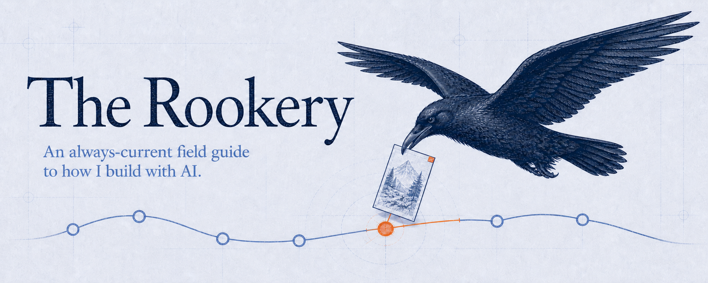

<!-- markdownlint-disable-file MD041 -->



# The Rookery

An always-current field guide to how I build with AI. It connects a practical
workflow for research, planning, design, implementation, shipping, maintenance,
and learning with the portable skills I use to run it.

A skill is a portable set of instructions an agent loads when a task calls for
it.

A rookery is where corvids gather to nest. This one is named for Odin's ravens, Huginn and Muninn. Huginn is thought, Muninn is memory. Each morning they fly out to see the world, and each evening they return with what they've learned.

## Guiding principles

1. **Cross-agent and cross-harness.** Flexible, generalizable approaches that avoid vendor lock-in.
2. **Minimize skill volume.** Too many skills create conflicting guidance, fill up the context window, and lead to unintended behavior as models get smarter.
3. **Continuous improvement.** Every addition should make the whole system better.

## Install

Install skills one at a time or all at once.

```bash
# list available skills
npx skills add jrgilbertson/the-rookery --list

# install one skill
npx skills add jrgilbertson/the-rookery --skill <name>

# or take everything
npx skills add jrgilbertson/the-rookery --all
```

These packages use the [Agent Skills](https://agentskills.io) format supported
by tools including Claude Code, Codex, Cursor, and Gemini CLI. Installation and
runtime behavior remain harness-specific. Add `-g` to install once for your
whole machine instead of per project.

`main` is the rolling catalog and the normal install source. Semantic-version
[Release Snapshots](CONCEPTS.md#release-snapshot) are immutable historical
checkpoints with release notes; they are not install pins. The first public
snapshot will be `v0.2.0`. The project remains in SemVer's initial-development
phase, so its public contract may continue to evolve before `1.0.0`.

## The workflows

Everything here fits into seven jobs. The walkthroughs live in [WORKFLOWS.md](WORKFLOWS.md).

- [**Research**](WORKFLOWS.md#research). Gather current evidence, test it against opposing views, and curate enough context to plan.
- [**Plan**](WORKFLOWS.md#plan). Define what to build, how to build it, and how success will be verified.
- [**Design**](WORKFLOWS.md#design). Set the visual direction and written design system for interface work.
- [**Build**](WORKFLOWS.md#build). Implement the plan in bounded, independently verified slices.
- [**Ship**](WORKFLOWS.md#ship). Review and verify the finished change before merging and documenting it.
- [**Maintain**](WORKFLOWS.md#maintain). Keep repositories healthy by turning recurring problems into durable safeguards.
- [**Learn**](WORKFLOWS.md#learn). Turn experience into linked knowledge and new questions for Research.

## The skills

- [storm-research](skills/storm-research/SKILL.md). Research a hard question through independent perspectives and produce a source-backed briefing that preserves disagreements and blind spots. Reach for it when a decision, investment, or long-form deliverable needs evidence from several perspectives.
- [creating-portable-skills](skills/creating-portable-skills/SKILL.md). Create, revise, migrate, or audit a skill, then verify its structure, triggers, behavior, and installation. Use it when you need a portable skill package with separate evidence for behavior and installation.
- [managing-issues](skills/managing-issues/SKILL.md). Read, draft, create, or update one GitHub or Linear issue and its parent, sub-issue, and blocker relationships in the canonical tracker. Choose it when you need to clarify readiness, change issue state, or verify completion without starting the implementation itself.
- [personal-chief-of-staff](skills/personal-chief-of-staff/SKILL.md). Turn current personal and work evidence into a daily, weekly, or quarterly review with proposed actions that remain under your control. Run it when you need to orient, reflect, and decide what to do next across several sources.
- [managing-personal-crm](skills/managing-personal-crm/SKILL.md). Keep meaningful relationship context in canonical Person notes and tasks while raw interactions stay in their source systems. Use it to prepare for someone, capture an interaction, reconnect an overdue relationship, or find who could help with current work.
- [reviewing-meetings](skills/reviewing-meetings/SKILL.md). Review completed meetings and turn source-grounded outcomes into proposed notes and follow-up actions. Run it after a meeting or during a catch-up when you want to capture outcomes and decide each follow-up before anything is written.
- [repo-gardener](skills/repo-gardener/SKILL.md). Survey a repository across nine maintenance areas and, when current evidence warrants it, carry one bounded improvement through an unmerged pull request. Run it on a schedule or by hand to find and address the repository's strongest current maintenance signals.
- [checking-pr-readiness](skills/checking-pr-readiness/SKILL.md). Check a finished branch's complete working surface, required evidence, plan fit, and unresolved risks before a pull request opens. Use it when you need a ship decision and evidence pack tied to the exact revision.
- [checking-merge-readiness](skills/checking-merge-readiness/SKILL.md). Review the full arc of a pull request after its review cycle, including design health, intent drift, merge rules, and unresolved risks. Run it immediately before merging to decide whether the accumulated change belongs on `main`.

## My other projects

- [Networked Thinking](https://networkedthinking.ai). My system for turning what I learn into durable, linked notes, explained through a book and website. Use it when something I learn should become knowledge I can connect and reuse; the [networked-thinking-skills repository](https://github.com/jrgilbertson/networked-thinking-skills) contains the skills behind the Learn step.

## Standing on

This system builds on work by people who share theirs. Use them directly.

- [Compound Engineering](https://github.com/EveryInc/compound-engineering-plugin) by Trevin Chow ([@trevin](https://x.com/trevin)) and Kieran Klaassen ([@kieranklaassen](https://x.com/kieranklaassen)). The development spine.
- [Matt Pocock's skills](https://github.com/mattpocock/skills) by Matt Pocock. The targeted grilling pattern, plus tracer-bullet issue leaves, blocker-first ordering, and frontier recomputation that informed `managing-issues`.
- [Impeccable](https://github.com/pbakaus/impeccable) by Paul Bakaus ([@pbakaus](https://x.com/pbakaus)). The design language that makes agents better at design.
- [last30days](https://github.com/mvanhorn/last30days-skill) by Matt Van Horn ([@mvanhorn](https://x.com/mvanhorn)). Recent-signal research across Reddit, X, YouTube, HN, and the web.
- [Orca](https://github.com/stablyai/orca) by Jinjing Liang ([@JinjingLiang](https://x.com/JinjingLiang)). The agentic IDE all of this runs in.

## Contributing

Fixes and portability PRs are welcome. New skills start as an issue. See [CONTRIBUTING](CONTRIBUTING.md) for how this repo stays healthy.

This is a solo-maintained project with no support SLA. Please report security
issues privately through the process in [SECURITY.md](SECURITY.md), and use the
[Code of Conduct](CODE_OF_CONDUCT.md) for community participation.

## License

[MIT](LICENSE).
