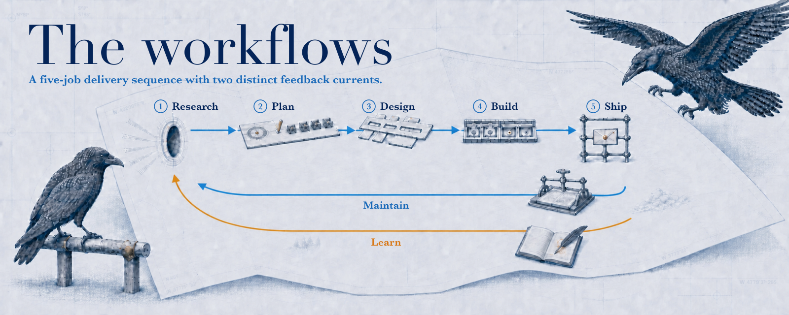

<!-- markdownlint-disable-file MD041 -->



# The workflows

My workflow moves through five core jobs: Research, Plan, Design, Build, and Ship. Two feedback loops keep it current: Maintain turns recurring problems into tests, rules, and documented lessons, while Learn turns experience into linked notes and new research questions. Each section explains how I approach the job and which tools and commands I use. The Rookery skills in those sections install on their own. Compound Engineering, Impeccable, and Orca are the surrounding stack I run them in.

## Foundations

The workflows assume two things are in place:

- **Repository-based work.** These workflows lean heavily on repositories such as GitHub for code development and knowledge management. Repos give you branches for parallel work, version control, and backups, which all help when you're running agents and working with others.
- **A durable personal knowledge source.** Sources such as Obsidian, Notion, plain markdown files, or anything that persists outside an AI provider's memory. Point each agent at that store so every harness reads the same knowledge. Turning off in-tool agent memory is a separate choice that stops knowledge from collecting where only one provider can reach it.

The skills themselves are not tied to one editor. They work in VS Code, Claude Cowork, Cursor, Codex, Gemini CLI, and other compatible tools. I run the loop in [Orca](https://github.com/stablyai/orca) because it is a strong agentic IDE and can drive several of those harnesses side by side in one project.

## Research

**Goal:** Curate enough context to plan from.

Research begins with the problem space. I'm a systems thinker, so I start wide: system design, current best practices, industry trends, and how the pieces fit together. Then I narrow to the actual problem. I also ask the AI where the unknown unknowns are to guard against my blind spots.

Once I better understand the problem, I look at what already exists. Project-specific lessons live in each repository's `docs/solutions/`, while my personal knowledge vault holds notes and research that apply across projects. Each lesson has one home, so agents can find it without searching through duplicate copies.

I give the model project context, specific intent, current official documentation, and opposing views. Without them, the answer can be generic or outdated.

What I reach for depends on the question:

- Deep research. Builds a thorough understanding of a codebase, methodology, or topic by asking a capable model directly. Use it when the question needs broad context without a specialized research process.
- `ce-ideate` from Compound Engineering. Generates evidence-backed hypotheses about what to build. Use it when research has not produced a clear product or improvement to pursue.
- [`last30days`](https://github.com/mvanhorn/last30days-skill). Finds recent discussion and usage signals about one topic or person. Use it when recency matters more than depth, such as when comparing the latest model rankings.
- [`storm-research`](skills/storm-research/SKILL.md). Investigates a hard question through independent practitioner, academic, skeptic, economist, and historian perspectives, then produces a source-backed briefing that preserves evidence, disagreements, and blind spots. Use it when the result should be a durable, multi-perspective research record.
- `ce-pov` from Compound Engineering. Gives a compact, decisive verdict grounded in the project, with targeted external verification where the answer depends on it. Use it when a focused question needs a recommendation rather than a durable research briefing.

What must be true before moving to Plan:

- **The intent is stated.** I know what decision or build the research serves.
- **The findings are current and contested.** They hold up against official docs and against opposing views.
- **The context is curated enough to plan from.** I can plan without going back for another round of research.

## Plan

**Goal:** Write a clear, concise plan covering what to build and the guardrails execution has to honor.

I usually plan in the same session that produced the curated context. When research needs to remain current and useful after the work ships, I save it as a maintained findings document in `docs/research/` and plan from there. Point-in-time audits and exploratory findings stay with the issue, pull request, or research system instead of becoming repository documentation by default.

The what comes first: the exact problem, what good looks like, and how I'll know it's solved. That product shape is what `ce-brainstorm` writes down when the outcome is still open. `ce-plan` then captures the decisions, units, files, tests, and risks execution has to honor. It does not pre-write the code; the agent that implements figures out how.

I read the first pass closely and iterate on the product shape more than on implementation detail. A wrong first pass can sound good at a high level but turns into AI slop by the time it's built. I spend more time in planning than I did before AI because it's harder to adapt mid-execution. That tradeoff is worth it because AI makes spikes, research, and prototypes cheap, so I iterate before and during the plan.

Agents that weren't in the planning session review the plan against the current state of the system, recent research, and official documentation. When the same agent reviews its own artifact, especially inside the same context window, the review approves by structure rather than evidence. The reviewer shares the producer's framing and blind spots.

[Compound Engineering](https://github.com/EveryInc/compound-engineering-plugin) drives the planning step. The entry point depends on what research left open.

- `ce-brainstorm`. Turns open intent into a requirements-only plan and a confirmed product direction. Use it when research leaves important questions about what to build.
- `ce-plan`. Turns a clear intent into one plan of decisions, units, files, tests, and risks. It does not write the implementation. Use it when the outcome is clear enough to plan execution.
- `ce-debug`. Diagnoses a bug before anyone proposes a fix. Use it when the work begins with broken or unexpected behavior.
- `ce-pov`. Gives a decisive, project-grounded answer to a focused planning question. Use it when one decision is blocking the plan and another research pass would add little.
- [`checking-simplicity`](skills/checking-simplicity/SKILL.md). Gives a draft approach an independent, read-only necessity check before implementation. Use it after the first viable plan and before the first implementation edit, then revise the approach when current requirements do not justify its new machinery.

After ordinary clarification, I sometimes have one coherent decision tree left where the answers depend on each other. I consider a targeted grilling session when at least one decision would be costly to reverse or affect a broad surface, one answer constrains the questions below it, or the agent would otherwise guess at an acceptance boundary. For example, authentication ownership may determine session lifetime and data access, so those decisions benefit from being settled parent-first. Several unrelated unknowns stay in `ce-brainstorm`. Clear requirements and routine, reversible choices go directly to `ce-plan`.

Install `grill-me` and `grilling` separately from [Matt Pocock's skills](https://github.com/mattpocock/skills). Each round asks every independent question at once, with a recommended answer for each, then waits. Dependent questions come in later rounds. It looks up facts in the repo or environment instead of asking you for them. The session creates no glossary or ADR and makes no changes to requirements documents.

Once I confirm shared understanding, the clarified intent returns to the Compound Engineering planning session. For work an agent can own end-to-end, I turn that intent into the following template.

```yaml
goal: Complete [objective] until [verifiable end state],
  respecting [constraints],
  using [inputs/tools],
  producing [artifact/handoff].
```

What must be true before moving on:

- **The objective is named.** The work to accomplish is stated precisely.
- **The end state is verifiable.** Clear acceptance criteria.
- **Constraints are explicit.** Scope, approval gates, non-goals, and the quality bar.
- **Inputs and tools are known.** The sources, systems, and repos the work draws on.
- **The artifact is defined.** The work will produce a merged PR, a findings document, or a decision someone can act on.
- **The approach passed a simplicity checkpoint.** A fresh context found no avoidable mechanism, or the plan was reduced and checked again before implementation.

When a plan needs issue structure, [`managing-issues`](skills/managing-issues/SKILL.md) manages parent, sub-issue, and blocker relationships in the repository's GitHub or Linear tracker. It reports which required open issues with no required sub-issues are ready to start now. Build still decides models, worktrees, stacks, and sequencing.

### Do I save plans?

No. Working plans, brainstorms, and ideation can live in the ignored paths
named in `.gitignore` while the worktree exists. Preserve the result in its
durable owner instead of saving the plan. The enforceable lifecycle and
durable-owner rules live in [Working artifacts](AGENTS.md#working-artifacts).

## Design

**Goal:** Set a design brief and a written design system agents can build from.

Design is where visual iteration sharpens both the research and the plan, and it continues through building, polishing, and maintaining. Work with no interface skips this step.

Design is hard with AI. The AI tends toward recognizable slop, the same gradients, feature cards, and triplets. The counter is a durable design system: a named aesthetic, tokens with purposes and prohibitions, and the components that use them. I use the [DESIGN.md standard](https://github.com/google-labs-code/design.md).

[Impeccable](https://github.com/pbakaus/impeccable) drives the design process.

- `impeccable shape`. Turns discovery about the audience, desired feel, and visual constraints into a design brief. Use it before planning or building an interface that lacks a clear visual direction.
- `impeccable audit` and `impeccable critique`. Audit checks the interface's technical quality, while critique reviews its visual design. Use them during design and after implementation to find concrete problems.
- The design system. Records the interface's tokens, components, rationale, and prohibitions in `DESIGN.md`. Use it to keep every agent working from the same visual rules as the interface evolves.

What must be true before moving to Build:

- **A design brief exists for interface-heavy work.** Discovery ran and the visual direction influenced research and plan outputs.
- **Taste is explicit in writing.** The design system names the tokens and prohibitions so agents stay inside them.

## Build

**Goal:** Build the plan in bounded slices and verify each one.

Work can move across several worktrees in parallel. A worktree is a separate working copy of the same repository, so each agent builds on its own branch without overwriting anyone else's work.

A harness is the agent tool itself, like Claude Code, Codex, Hermes, or Grok. In Orca, each worktree can use whichever one suits its work.

I choose models by how success will be judged. For work with objective checks, I compare the expected cost of a passing result rather than the cost of one attempt. For taste-led work, I use the cheapest model whose output stays close enough to the best. Mixed work clears the objective checks first, then preference decides among the models that pass.

`ce-work` from Compound Engineering moves through the plan one unit at a time so I can inspect the work as it lands. `lfg`, also from Compound Engineering, runs from plan to pull request without check-ins. `/goal` in Claude Code and Codex keeps working toward one completion condition across turns. I use autonomous modes only when the goal is clear and verifiable.

Compound Engineering is the default planner, executor, reviewer, and learning capture inside each worktree. Small changes may stay with one agent. Independent pieces may go to workers, and hard decisions may get a stronger advisor or a separate critic. I add those roles only when the default loop does not cover the work, because a second orchestration stack repeats planning, review, and handoffs.

I enforce quality in tiers. Tests, linters, CI gates, and the design system enforce proactively, and prose instructions sit at the bottom. See the Maintain section for the full ladder.

The in-build toolkit:

- [Orca](https://github.com/stablyai/orca). Runs parallel worktrees, delegates to agents across harnesses, and supports element-level browser feedback. Use it when a plan can be split into independent slices or an interface needs direct visual iteration.
- **Impeccable, mid-build.** Critiques and polishes visual work, audits technical quality, hardens edge cases, and offers three variants for a selected element with the option to apply one to source. Use it while building an interface to keep the implementation aligned with the design brief and production constraints.
- `ce-test-browser` and `ce-dogfood`. Verify the browser flows a branch touched, with dogfood able to fix small breakages, add regression tests, and commit the changes. Use `ce-test-browser` for a targeted check and `ce-dogfood` for a hands-off repair pass.
- [`checking-simplicity`](skills/checking-simplicity/SKILL.md). Re-checks the approach before a slice adds another module, interface, dependency, persisted state, configuration surface, adapter, hook, queue, cache, state machine, or background workflow. It returns the smallest safe alternative; the building workflow owns any revision.

What must be true before moving to Ship:

- **CI is green for the slice.** Every suite the change calls for passes, including browser checks when it touches the UI, and each test exercises the shipped code path rather than a stub.
- **The slice stayed bounded.** Each agent built what its slice named, and scope changes went back through Plan.
- **New machinery earned its place.** Material in-build design changes passed the same independent simplicity checkpoint before they landed.
- **Design held.** Interface work stayed inside the design system and the brief.

## Ship

**Goal:** Review and verify the change, then merge it.

Work arrives from Build when the agents believe they've met the plan's objectives. The finishing sequence is where I check that belief and refine the work. Simplifying and reviewing before the PR opens means reviewers spend their time on the substance of the change instead of on cleanup.

The shipping sequence, in order:

1. `ce-simplify-code`. Tightens what was built without changing behavior.
2. `ce-code-review`. An independent review before any PR exists.
3. `ce-test-browser` or `ce-dogfood`. Browser verification when the change touches the UI, either a test run or hands-off dogfooding that fixes and commits as it goes.
4. [`checking-pr-readiness`](skills/checking-pr-readiness/SKILL.md). The final checkpoint.

`checking-pr-readiness` compares the finished branch with the plan, verifies the named evidence, and surfaces unresolved risks before the pull request opens. It waits for me to approve the exact revision shown, then puts the evidence in the pull request description so later reviewers see the same record. Before approving, I can also ask for an explanation of the change or a concept it introduced.

For unattended verification, its assessment-only mode returns `pass` or `action-required` for a named revision and makes no changes.

After approval, `ce-commit-push-pr` writes the description and opens the pull request, and `ce-babysit-pr` works through CI failures and review feedback. Then [`checking-merge-readiness`](skills/checking-merge-readiness/SKILL.md) reviews the full change for intent drift, unnecessary complexity, unresolved feedback, and failed merge rules. It recommends merge, debug, or do not merge; I still decide and merge. I write the changelog and release notes from the merged pull requests afterward.

CI gates the merge on the unit and end-to-end suites, plus passes like performance and link checks in my product repos. GitHub enforces the rest, and each of these is a setting you have to turn on: a PR for every change, review comments resolved before merge, and no direct pushes to main, including for administrators.

What must be true before merge:

- **A human read the finished work.** The specs were met as written, tests and QA ran and passed, and the change held up in a plain-language before-and-after walkthrough. `ce-babysit-pr` handles the mechanics, and the review comments get my eyes.
- **The explanation makes sense.** The agent said plainly what the issue fixed, with before and after examples.

## Maintain

**Goal:** Tend the repo and encode every learning where it holds.

Repos and systems need tending over time. Maintenance runs throughout the loop, not only after merge.

[`repo-gardener`](skills/repo-gardener/SKILL.md) checks a repository across nine maintenance areas and, when warranted, assigns parallel workers that each leave one unmerged pull request. It runs on a schedule or by hand; a human still merges.

Design maintenance runs through Impeccable. `impeccable extract` finds patterns used three or more times with the same intent and standardizes them into tokens and primitives. `impeccable document` regenerates the design docs from what actually shipped, so the tools read the design language instead of guessing at it.

`ce-compound` captures the durable learnings. It runs when I solve a problem, often at the pre-PR checkpoint, and writes the symptoms, root cause, failed attempts, fix, and prevention strategy to `docs/solutions/`. Planning and debugging pull from those docs later, so the next time I hit the same problem it takes minutes instead of hours.

The prevention strategy decides where the learning lives, and where it lands matters as much as what it says. A learning encoded as a test enforces itself. One written as prose only works if it gets read and followed. The ladder below runs from the strongest home to the weakest. Put each learning on the highest rung it qualifies for.


| Rung               | Form                                                                                    | Why it holds                                                                                      |
| ------------------ | --------------------------------------------------------------------------------------- | ------------------------------------------------------------------------------------------------- |
| Deterministic gate | Regression test, lint rule, git hook, CI check, performance budget, monitor             | Runs automatically on every change, so the mistake gets caught without anyone remembering to look |
| Path-scoped rule   | An instruction bound to one part of the codebase                                        | Loads on its own when work touches that path, though the model still has to follow it             |
| Reusable procedure | A skill encoding the right way to do a recurring task                                   | Structured and invokable, but fires only when the task comes up                                   |
| Decision record    | An architecture decision record holding the choice, the alternatives, and the rationale | A durable why that anyone can go read, once they know to look                                     |
| Prose instruction  | A line in a README, a code comment, or an instructions file                             | The floor. Nothing enforces it, so it holds only as long as the model follows it                  |


When the reusable-procedure rung is the right home, [`creating-portable-skills`](skills/creating-portable-skills/SKILL.md) creates, revises, migrates, or audits the package and checks its structure, triggers, behavior, and installation. Use it when a repeated gap needs a portable skill rather than a one-off instruction.

In practice that means a reproducible bug becomes a regression test rather than a paragraph asking the model to be careful, and a convention becomes a lint rule. Only learnings with no mechanical home fall to prose, which is often the honest answer for something that can't be automated yet.

This matters more with agents than with people. Agents generate more code faster and don't reliably remember corrections between sessions, so anything resting on memory decays. Reading the learnings back needs no extra machinery, because a capable model planning in a repo finds the decision records and solutions on its own.

What must be true before moving to Learn:

- **The learning is in the repo.** A durable learning landed on the strongest rung that holds it.

## Learn

**Goal:** Capture what I learned as linked notes and name what I don't know yet.

Learn closes the loop, and it's about my knowledge rather than the system's. Some of that knowledge is a topic worth keeping from a change. Some of it is the rest of life and work: reviews, meetings, and people.

What I reach for depends on the job:

- [`personal-chief-of-staff`](skills/personal-chief-of-staff/SKILL.md). Turns information from configured sources into a daily, weekly, or quarterly review. Run it when you need to orient, reflect, and decide what to do next across several parts of your life and work.
- [`reviewing-meetings`](skills/reviewing-meetings/SKILL.md). Turns completed meetings into draft notes and follow-up actions grounded in the meeting source. Run it after a meeting or during a catch-up; each follow-up waits for approval before anything is written.
- [`managing-personal-crm`](skills/managing-personal-crm/SKILL.md). Keeps relationship context in one note per person, while messages and other raw interactions stay in their original apps. Use it to prepare for someone, capture an interaction, reconnect an overdue relationship, or find who could help with current work.

I usually capture software-adjacent learnings at the pre-PR checkpoint. The approval menu can render an interactive overview of the change with a quiz. When the overview surfaces a topic worth keeping, I turn it into an atomic note with the [`atomic-note`](https://github.com/jrgilbertson/networked-thinking-skills) skill from Networked Thinking and link it to related topics in my knowledge graph. The gaps that note exposes turn into further reading, follow-up issues, or a fresh research question.

[Networked Thinking](https://networkedthinking.ai) is the note system behind that. Atomic notes, each holding one idea, connected into a graph rather than filed into folders. I wrote the book and the site, and the notes in this loop follow that method.

AI accelerates progress, but the fundamentals decide how far you can drive it. A breadth of knowledge is what lets me work a level above the code. I can think in systems, propose an approach the model didn't offer, connect the work back to first principles, pressure test what comes back, tell good work from work that only looks good, and see more of my own unknown unknowns.

What must be true for the loop to close:

- **The learning is in the graph.** New topics became atomic notes, linked to what I already knew.
- **The gaps are named.** What I don't understand yet became follow-up reading, issues, or the question that starts the next Research pass.
