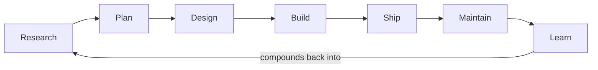

# The workflows

My workflow is seven jobs that create a durable learning loop. Each section covers the reasoning first, then the tools and commands.



## Foundations

The workflows assume two things are in place:

- **Repository-based work.** These workflows lean heavily on repositories such as GitHub for code development and knowledge management. Repos give you branches for parallel work, version control, and backups, which all help when you're running agents and working with others.
- **A durable personal knowledge source.** Sources such as Obsidian, Notion, plain markdown files, or anything that persists outside an AI provider's memory. Point each agent at that store so every harness reads the same knowledge. Turning off in-tool agent memory is a separate choice that stops knowledge from collecting where only one provider can reach it.

A few of the skills named below are my own and not yet published: `repo-maintainer`, `repo-best-practices`, `improve-repo-architecture`, `design-evals`, `validate-data`, and `storm-research`.

## Research

**Goal:** Curate enough context to plan from.

Research begins with the problem space. I'm a systems thinker, so I start wide. System design, current best practices, industry trends, how the pieces fit together, and more. Then I narrow to the actual problem. I also ask the AI where the unknown unknowns are to guard against my blind spots.

Once I better understand the problem, I go looking at what already exists. Durable learnings per project live in `docs/solutions/` inside each repository, and my personal knowledge vault carries everything else, like notes and past research. Both stay DRY (don't repeat yourself) and SSOT (single source of truth), so agents get accurate context without burning tokens hunting for it.

Prompt a model with a basic question and you get an average answer, because the model pulls from the average of everything it trained on. More context, more detail, and more intent narrow what it draws on until it lands closer to your actual problem. Recency matters as well. A model trains on the past up to a cutoff, so without current official docs and opposing perspectives, the recommendation relies on information that might be outdated or wrong.

What I reach for depends on the question:

- Deep research. Understanding a codebase, a methodology, or a topic in depth. Most capable models handle it well when asked directly.
- `ce-ideate` from Compound Engineering. For when I don't yet know what to build and want evidence-backed hypotheses to react to.
- [`last30days`](https://github.com/mvanhorn/last30days-skill). Focused, recent signal on a single topic or person where recency beats depth, like the latest model rankings for development work.
- `storm-research`. The adversarial layer. Five or more expert perspectives on the same question.

What must be true before moving to Plan:

- **The intent is stated.** I know what decision or build the research serves.
- **The findings are current and contested.** They hold up against official docs and against opposing views.
- **The context is curated enough to plan from.** I can plan without going back for another round of research.

## Plan

**Goal:** Write a clear, concise plan covering what to build (product plan) and how to build it (implementation plan).

I usually plan in the same session that produced the curated context. When the research needs to outlive that session, I save it as a findings document in `docs/research/` and plan from there.

The what (product plan) comes first and covers the exact problem, what good looks like, and how I'll know it's solved. The how (implementation plan) follows with the architectural choices and sequencing that shape everything downstream.

I read the first pass closely and iterate on the product plan more than the implementation detail. A wrong first pass can sound good at a high level but turns into AI slop by the time it's built. I spend more time in planning than I did before AI because it's harder to adapt mid-execution. That tradeoff is worth taking, because AI makes spikes, research, and prototypes cheap, so I iterate before and during the plan.

Agents that weren't in the planning session review the plan against the current state of the system, recent research, and official documentation. When the same agent reviews its own artifact, especially inside the same context window, the review approves by structure rather than evidence. The reviewer shares the producer's framing and blind spots.

[Compound Engineering](https://github.com/EveryInc/compound-engineering-plugin) drives the planning step. The entry point depends on what research left open.

- `ce-brainstorm`. Narrows research into requirements when intent still has open questions.
- `ce-plan`. The direct route when intent is clear. Product plan first, implementation plan second.
- `ce-debug`. Bugs get diagnosis rather than brainstorming.
- `ce-pov`. A decisive, project-grounded answer to a focused question mid-plan, without falling back into another research pass.

After ordinary clarification, I sometimes have one coherent decision tree left where the answers depend on each other. I consider a targeted Grilling Session when at least one decision would be costly to reverse or affect a broad surface, one answer constrains the questions below it, or the agent would otherwise guess at an acceptance boundary. For example, authentication ownership may determine session lifetime and data access, so those decisions benefit from being settled parent-first. Several unrelated unknowns stay in `ce-brainstorm`. Clear requirements and routine, reversible choices go directly to `ce-plan`.

Install `grill-me` and `grilling` separately from [Matt Pocock's skills](https://github.com/mattpocock/skills); they are not part of The Rookery's catalog. An agent may recommend this route, but the operator invokes `grill-me`. That wrapper starts the session; the `grilling` skill owns the interview protocol. The agent walks the tree one question at a time, offers a concrete recommendation with each question, and leaves every decision with the user. It looks up facts available in the repository or environment instead of asking for them. A Grilling Session is stateless: it creates no glossary, ADR, or requirements-document updates.

Once the user confirms shared understanding, the clarified intent returns to the Compound Engineering planning session. For work an agent can own end-to-end, I turn that intent into the following template.

```yaml
goal: Complete [objective] until [verifiable end state], 
  respecting [constraints], 
  using [inputs/tools], 
  producing [artifact/handoff].
```

What must be true before moving on:

- **The objective is named.** The work to accomplish is stated precisely.
- **The end state is verifiable.** Clear acceptance criteria.
- **Constraints are explicit.** Scope, approval gates, non-goals, and the quality bar.
- **Inputs and tools are known.** The sources, systems, and repos the work draws on.
- **The artifact is defined.** The work will produce a merged PR, a findings document, or a decision someone can act on.

## Design

**Goal:** Set a design brief and a written design system agents can build from.

Design is where visual iteration sharpens both the research and the plan, and it continues through building, polishing, and maintaining. Work with no interface skips this step.

Design is hard with AI. The AI tends toward recognizable slop, the same gradients, feature cards, and triplets. The counter is a durable design system: a named aesthetic, tokens with purposes and prohibitions, and the components that use them. I use the [DESIGN.md standard](https://github.com/google-labs-code/design.md).

[Impeccable](https://github.com/pbakaus/impeccable) drives the design process.

- `impeccable shape`. The planning-side tool. Discovery first, who the interface is for, what it should feel like, what it should avoid. Then iteration until there's a brief the plan can build on.
- `impeccable audit` and `impeccable critique`. Technical checks with audit and design reviews with critique.
- The design system. Tokens, components, and rationale live in the repo, get refreshed from the running code, and every agent that touches the UI reads them. Impeccable helps you create and update a DESIGN.md source of truth.

What must be true before moving to Build:

- **A design brief exists for interface-heavy work.** Discovery ran and the visual direction influenced research and plan outputs.
- **Taste is explicit in writing.** The design system names the tokens and prohibitions so agents stay inside them.

## Build

**Goal:** Build the plan in bounded slices and verify each one.

This step runs at two levels: across worktrees, where five to ten slices of work move in parallel, and inside each worktree, through the model choice, mode, and quality gates below. A worktree is a separate working copy of the same repository, so each agent builds on its own branch in its own folder without overwriting anyone else's work.

Orca is the agentic IDE where all of this runs. A harness is the agent tool itself, like Claude Code, Codex, Hermes, or Grok. Orca runs several of them side by side in one project, so each worktree can use whichever harness suits its work.

Choosing which model gets which work comes down to two optimizations.

For verifiable work, where a test or check decides success, minimize the expected cost of an acceptable completion.

$$
\text{pick the model minimizing}\ \ \frac{\text{cost per attempt}}{\text{pass rate}}
$$

Some evals publish this number outright. VulcanBench's headline efficiency metric is cost per solved task, total spend divided by tasks passed, which is the same quantity the formula above produces.

Say a strong model costs a dollar an attempt and passes 90% of the time, putting each acceptable completion at \$1.11. A cheaper model costs ten cents and passes 60% of the time, putting each one at \$0.17. The cheap model fails far more often and still finishes the work for 15% of the price.

For taste-led work, where preference decides, take the cheapest route whose quality stays close enough to the best.

$$
\text{pick the cheapest model where}\ \ Q_{\text{best}} - Q(\text{model}) \le \text{quality-regret bound}
$$

Say the best model for a writing task rates 9.5 out of 10 on a preference leaderboard and the next one rates 9.2. If I've decided I'll trade half a point for a cheaper route, the second model qualifies, and at half the price I take it. The gap is a subtraction rather than a ratio because preference scores have no meaningful zero to divide by.

Mixed work clears the verifiable requirements first, then I rank the survivors by preference. Rankings change too fast to print here, so I follow whatever the current evals and benchmarks say. In practice I'm also working inside whatever weekly quota each harness has left.

The work runs in one of two modes. `ce-work` works through the plan unit by unit, so I can watch it land and step in when I want to. The other mode is an autonomous loop. `lfg` from Compound Engineering runs the whole distance, plan to PR, with no check-ins. `/goal` in Claude Code and Codex is narrower. It takes a completion condition and keeps working across turns until that condition is met or the budget runs out, a while loop with a model inside. The condition is the goal template from Plan, which is why that template is worth filling in carefully. A loop earns that autonomy only when the goal is neat and verifiable.

Compound Engineering already is the planner, executor, and multi-agent reviewer. The skills run brainstorm → plan → work → simplify → review → compound, and each cycle pulls prior solutions from `docs/solutions/`. That is the default inside a worktree. I do not stand up a second planner, executor, and reviewer beside those skills. A parallel stack burns tokens twice, loses the handoffs and quality gates the plugin already owns, and skips the durable files that make later cycles easier. The multi-persona reviewers inside `ce-code-review` already cost the most. Another review layer on top only adds spend.

I pick a different orchestration only when the skills do not cover the work. Tiny one-off changes often skip the full loop and stay with a solo owner. When something specialized is missing, I extend Compound Engineering rather than build a second system.


| Orchestration             | What it is                                                                              | Best for                                                                                                              | Cost                                                 |
| ------------------------- | --------------------------------------------------------------------------------------- | --------------------------------------------------------------------------------------------------------------------- | ---------------------------------------------------- |
| Solo owner                | One agent owns the work end to end                                                      | Small bounded work, or work needing taste mid-flight                                                                  | Serial, and my attention is the bottleneck           |
| Executor with advisor     | The executor consults a stronger model only on hard calls, Anthropic's advisor strategy | Cost-sensitive work with occasional deep judgment                                                                     | Consult latency                                      |
| Produce, critique, revise | A producer drafts, a separate critic scores, revision rounds capped                     | Rubric-judged quality work where refinement measurably helps                                                          | Rounds add latency, and it needs the separate critic |
| Orchestrator with workers | A lead agent delegates to separate instances in their own worktrees, then integrates    | Fan-out across many independent pieces, managed by `ultracode` (Claude Code), `ultra` (Codex) or wired myself in Orca | Integration overhead                                 |
| Harness-native subagents  | One session dispatches subagents that report back to it                                 | Side research or verification inside a session's flow. Already how skills like `ce-code-review` run reviewer personas | Parent-only results; do not rebuild outside the skill |


I enforce quality in tiers. Tests, linters, CI gates, and the design system enforce proactively, and prose instructions sit at the bottom. See the Maintain section for the full ladder.

The in-build toolkit:

- [Orca](https://github.com/stablyai/orca). Parallel worktrees, delegated agents across harnesses, and a browser mode where I select elements on the running UI and kick off feedback and refinement.
- **Impeccable, mid-build.** `impeccable critique` scores the design and `impeccable polish` closes the gap between good and great. `impeccable audit` runs a five-dimension technical check and `impeccable harden` makes interfaces production-ready, covering edge cases, internationalization, error states, and overflow. `impeccable live` picks a UI element, takes a comment, and offers three variants, one of which lands in source.
- `ce-test-browser` and `ce-dogfood`. Browser verification of the pages a branch touched, or hands-off dogfooding that fixes small breakages, writes regression tests for them, and commits to the branch.
- `validate-data`. Audits the datasets a build touches for accuracy, completeness, consistency, timeliness, and relevance.

What must be true before moving to Ship:

- **CI is green for the slice.** Every suite the change calls for passes, including browser checks when it touches the UI, and each test exercises the shipped code path rather than a stub.
- **The slice stayed bounded.** Each agent built what its slice named, and scope changes went back through Plan.
- **Design held.** Interface work stayed inside the design system and the brief.

## Ship

**Goal:** Review and verify the change, then merge it.

Work arrives from Build when the agents believe they've met the plan's objectives. The finishing sequence is where I check that belief and refine the work. Simplifying and reviewing before the PR opens means reviewers spend their time on the substance of the change instead of on cleanup.

The shipping sequence, in order:

1. `ce-simplify-code`. Tightens what was built without changing behavior.
2. `ce-code-review`. An independent review before any PR exists.
3. `ce-test-browser` or `ce-dogfood`. Browser verification when the change touches the UI, either a test run or hands-off dogfooding that fixes and commits as it goes.
4. [`checking-pr-readiness`](skills/checking-pr-readiness/SKILL.md). The final checkpoint.

`checking-pr-readiness` presents the branch the way an engineer asks for sign-off. The full working surface including untracked files, every upstream step reported from receipts — verified only when the evidence is named, attested when I say so, never assumed — what was planned against what was delivered, a sweep of the finding classes that drive repeated automated-review rounds, and whether the branch produced a learning worth keeping. It waits for one explicit decision and changes nothing until I make it. If the branch moves while I'm deciding, the readout gets rebuilt, because approval binds to exactly what I was shown. On approval it composes an evidence pack that lands in the PR body, so reviewers and the eventual merge check read the same record. The menu also has a learning option. Before approving, I can have the change or a concept it introduced explained back to me.

After approval, `ce-commit-push-pr` writes the description and opens the PR, and `ce-babysit-pr` watches it through CI failures and review feedback until it reports merge-ready. Then [`checking-merge-readiness`](skills/checking-merge-readiness/SKILL.md) runs before I merge. It digests what the review rounds actually did in plain language, checks whether the accumulated fixes drifted the change from what I set out to build, and grades named risk drivers. The one I most want caught is whether bot feedback talked the code into machinery nothing needed. That rolls into one recommendation: merge, pause, or do not merge. The skill changes nothing, so I still do the merging. I write the changelog and release notes from the merged PRs afterward.

CI gates the merge on the unit and end-to-end suites, plus passes like performance and link checks in my product repos. GitHub enforces the rest, and each of these is a setting you have to turn on: a PR for every change, review comments resolved before merge, and no direct pushes to main, including for administrators.

What must be true before merge:

- **A human read the finished work.** The specs were met as written, tests and QA ran and passed, and the change held up in a plain-language before-and-after walkthrough. `ce-babysit-pr` handles the mechanics, and the review comments get my eyes.
- **The explanation makes sense.** The agent said plainly what the issue fixed, with before and after examples.

## Maintain

**Goal:** Tend the repo and encode every learning where it holds.

Repos and systems need tending over time. Maintenance runs throughout the loop, not only after merge.

`repo-maintainer` is the everyday pass. It inspects the repo briefly, picks one small safe improvement, makes one diff, verifies it narrowly, and stops after a single commit. Pass `repeat N` when you want up to N passes in a row.

Bigger passes run when the repo needs a full review. `repo-best-practices` reviews what a visitor sees first, the README, the license, the contributing guide, and the issue templates. `improve-repo-architecture` reviews structure before it hardens. `design-evals` builds graders and rubrics for behavior that can't be unit tested.

Design maintenance runs through Impeccable. `impeccable extract` finds patterns used three or more times with the same intent and standardizes them into tokens and primitives. `impeccable document` regenerates the design docs from what actually shipped, so the tools read the design language instead of guessing at it.

`ce-compound` captures the durable learnings. It runs when I solve a problem, often at the pre-PR checkpoint, and writes the symptoms, root cause, failed attempts, fix, and prevention strategy to `docs/solutions/`. Planning and debugging pull from those docs later, so the next time I hit the same problem it takes minutes instead of hours.

The prevention strategy decides where the learning lives, and where it lands matters as much as what it says. A learning encoded as a test enforces itself. One written as prose only works if it gets read and followed. The ladder below runs from the strongest home to the weakest. The move is to automate down, taking the highest rung each learning qualifies for.


| Rung               | Form                                                                        | Why it holds                                                          |
| ------------------ | --------------------------------------------------------------------------- | --------------------------------------------------------------------- |
| Deterministic gate | Regression test, lint rule, git hook, CI check, performance budget, monitor | Runs automatically on every change, so the mistake gets caught without anyone remembering to look |
| Path-scoped rule   | An instruction bound to one part of the codebase                            | Loads on its own when work touches that path, though the model still has to follow it |
| Reusable procedure | A skill encoding the right way to do a recurring task                       | Structured and invokable, but fires only when the task comes up       |
| Decision record    | An architecture decision record holding the choice, the alternatives, and the rationale | A durable why that anyone can go read, once they know to look |
| Prose instruction  | A line in a README, a code comment, or an instructions file                 | The floor. Nothing enforces it, so it holds only as long as the model follows it |


In practice that means a reproducible bug becomes a regression test rather than a paragraph asking the model to be careful, and a convention becomes a lint rule. Only learnings with no mechanical home fall to prose, which is often the honest answer for something that can't be automated yet.

This matters more with agents than with people. Agents generate more code faster and don't reliably remember corrections between sessions, so anything resting on memory decays. Reading the learnings back needs no extra machinery, because a capable model planning in a repo finds the decision records and solutions on its own.

What must be true before moving to Learn:

- **The learning is in the repo.** A durable learning landed on the strongest rung that holds it.

## Learn

**Goal:** Capture what I learned as linked notes and name what I don't know yet.

Learn closes the loop, and it's about my knowledge rather than the system's.

I usually capture personal learnings at the pre-PR checkpoint. The approval menu can render an interactive overview of the change with a quiz. When the overview surfaces a topic worth keeping, I turn it into an atomic note with the [`atomic-note`](https://github.com/jrgilbertson/networked-thinking-skills) skill from Networked Thinking and link it to related topics in my knowledge graph. The gaps that note exposes turn into further reading, follow-up issues, or a fresh research question.

[Networked Thinking](https://networkedthinking.ai) is the note system behind that. Atomic notes, each holding one idea, connected into a graph rather than filed into folders. I wrote the book and the site, and the notes in this loop follow that method.

AI accelerates progress, but the fundamentals decide how far you can drive it. A breadth of knowledge is what lets me work a level above the code. I can think in systems, propose an approach the model didn't offer, connect the work back to first principles, pressure test what comes back, tell good work from work that only looks good, and see more of my own unknown unknowns.

What must be true for the loop to close:

- **The learning is in the graph.** New topics became atomic notes, linked to what I already knew.
- **The gaps are named.** What I don't understand yet became follow-up reading, issues, or the question that starts the next Research pass.
