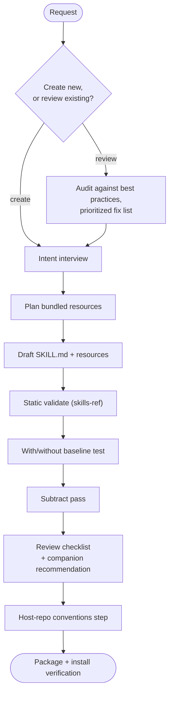

# Creating-Skills Skill - Plan

## Goal Capsule

- **Objective:** Ship `creating-skills`, The Rookery's first skill — a portable Agent Skills creator and maintainer that enforces the discipline a bare "help me write a skill" prompt skips.
- **Authority hierarchy:** Owner decisions recorded in this document > Product Contract > Planning Contract > implementer judgment on details the plan leaves open.
- **Execution profile:** Docs-only repository; no application build. Verification runs through CLI probes (`npx skills-ref`, `npx skills add`), grep gates, and live agent runs across harnesses.
- **Stop conditions:** Surface a blocker instead of guessing when a verification gate cannot run at all, when work would contradict a Product Contract requirement, or when scope would expand beyond the shelf-integration boundary.
- **Open blockers:** None.
- **Product Contract preservation:** Unchanged, except the Outstanding Questions and review-deferred items were resolved into Planning Contract KTDs (KTD4, KTD5, KTD7, KTD8, KTD10) as planning-owned work.

---

## Product Contract

### Summary

`creating-skills` walks an agent and its user through creating a new Agent Skill or reviewing an existing one via a single loop — interview, draft, static validate, baseline test, review pass, package — producing skills that are portable across models and harnesses. It is standalone by construction: deep eval design and deep review vocabulary are recommended companions, never dependencies.

### Problem Frame

Frontier models already know the SKILL.md format, so format knowledge adds nothing. What a bare prompt reliably skips is the discipline: portability gates get ignored, instructions accrete without evidence (skills drift longer and degrade with each manual edit), descriptions go untested as trigger contracts, and every skill lands through a slightly different process.

The existing creator skills from vendors assume their own harness as the source of truth, which is exactly what The Rookery cannot inherit — its promise is that one canonical skill works across Claude Code, Codex, and anything else that reads the Agent Skills format. This skill is also the migration vehicle: every skill ported from the maintainer's private toolkit gets reviewed and fixed through it, so it must exist before the rest of the shelf.

### Key Decisions

- **Recommend, never require companions.** Deep eval design routes to `design-evals`; deep review vocabulary routes to `writing-great-skills` ([mattpocock/skills](https://github.com/mattpocock/skills), MIT, attributed). `creating-skills` carries only a lightweight built-in checklist for each, keeping it individually installable. This settles the scaffolding plan's open declare-vs-vendor question for this case: soft recommendation over hard dependency.
- **The with/without baseline test is native, not optional.** Every authority treats the 2-3 case baseline comparison as a core step of skill creation itself; only durable eval infrastructure (graders, suites, calibration) belongs to the companion.
- **Adaptive to the host repo.** The skill discovers and follows the host repo's own skill conventions when present instead of hardcoding The Rookery's pipeline — the same-door rule applied to process.
- **Core plus disclosed references.** A tight workflow SKILL.md with references and templates one level deep, matching the proven vendor-creator shape and the compact-beats-comprehensive evidence. Static validation reuses the standard `skills-ref` validator via `npx`; no bundled scripts.
- **Portable frontmatter only in canonical output.** Skills it produces use only Agent Skills spec fields; harness-specific extras are documented as optional adapters.
- **Named `creating-skills`.** Gerund, verb-led, matching both the house naming convention and vendor guidance.

### Actors

- A1. The maintainer, curating The Rookery and migrating skills from the private toolkit.
- A2. A visitor skill author who installed `creating-skills` standalone into their own repo and harness.
- A3. The executing agent, on any Agent Skills-compatible harness and model tier.

### Requirements

**Modes and workflow**

- R1. The skill supports two co-primary flows: creating a new skill, and reviewing or updating an existing one (including migrations from another collection).
- R2. Both flows run one loop — intent interview, resource planning, draft, static validation, baseline test (comparing with/without the skill for a new skill, or prior version against revised for a review), review pass, package — with each step ending on a completion criterion.
- R3. A subtract pass is first-class: each instruction must survive the delete test ("would the agent get this wrong without this line?"), and the skill recommends removing rules when test results plateau.
- R4. Near-miss requests route away instead of triggering: plugin creation, standalone eval design, and prose review of non-skill documents are named should-not-trigger cases.

**Portability**

- R5. Skills it produces use only Agent Skills specification frontmatter (`name`, `description`, `license`, `compatibility`, `metadata`); vendor fields stay out of the canonical package.
- R6. Instruction prose it produces is capability-based and tool-neutral; harness-specific quirks (Codex `agents/openai.yaml`, Claude naming rules, listing budgets) live in a disclosed reference marked as optional adapter material.
- R7. Produced skills are self-contained directories with no reach outside the skill folder, no absolute paths, and no personal-environment assumptions.
- R8. Descriptions are authored as trigger contracts — triggering conditions first, front-loaded keywords, within the 1024-character limit — and tested against a should-trigger / near-miss query set.

**Quality gates**

- R9. The static validation step runs the standard validator (`npx skills-ref validate`) and enforces naming rules (lowercase kebab-case, directory matches `name`).
- R10. The baseline test step compares agent behavior against the flow's baseline (with/without the skill for a new skill; prior version for a revision) on 2-3 realistic prompts before any substantive change ships; skipping it requires an explicit user waiver.
- R11. The review/maintain flow checks an existing skill against current authoring best practices and produces a prioritized fix list before making edits.

**Composition and degradation**

- R12. At the eval-design and deep-review decision points, the skill recommends installing the companion (`design-evals`, `writing-great-skills`) and proceeds with its built-in lightweight checklist when the companion is absent, naming what was skipped.
- R13. A host-repo step discovers and follows the host repository's own skill conventions (contributing rules, validators, changelog practice) when present, and uses the generic path otherwise.

**Packaging**

- R14. The skill's own SKILL.md core stays near 200 lines (never above the 500-line / 5k-token spec guidance), with references one level deep and bundled templates: a SKILL.md skeleton, a baseline-test case set, and a trigger-query set.
- R15. The skill passes its own gates: validates cleanly, installs individually through the repo's documented install path, and works in at least Claude Code and Codex.

### Key Flows



- F1. Create a new skill
  - **Trigger:** User asks to create a skill (A2 in their repo, or A1 stocking the shelf).
  - **Steps:** Interview captures intent, triggers, outputs, and edge cases; resources are planned before drafting; draft passes static validation; baseline test compares with/without; subtract pass trims unearned instructions; review checklist runs with companion recommendations; host-repo conventions apply; package verified installable.
  - **Outcome:** A valid, portable, individually installable skill with tested triggers.
  - **Covers:** R1, R2, R3, R5-R10, R12-R13.
- F2. Review or migrate an existing skill
  - **Trigger:** User asks to review, update, or port an existing skill.
  - **Steps:** Audit against current best practices produces a prioritized fix list; user approves scope; the interview captures the intent of the approved changes and resources are re-planned; the create-flow loop then runs from draft onward on the revised skill, with the baseline comparing prior version against revised.
  - **Outcome:** An updated skill with evidence that the changes helped, or a documented decision not to change it.
  - **Covers:** R1, R2, R10, R11.

### Acceptance Examples

- AE1. **Covers R12.** Given `design-evals` is not installed, when the user reaches the eval decision point, the skill recommends installing it, runs its built-in 2-3 case baseline instead, and states which deeper steps were skipped.
- AE2. **Covers R13.** Given a host repo whose contributing docs define skill conventions and a changelog, when packaging, the skill follows those conventions; given a bare repo, it completes with the generic path and says so.
- AE3. **Covers R10.** Given a user asks to ship a substantive skill change without testing, the skill runs the baseline first or records an explicit waiver — never silently skips.
- AE4. **Covers R4, R8.** Given a request to "design evals for my dataset," the skill does not trigger; the near-miss appears in the trigger-query set used to test the description.

### Success Criteria

- Dogfood acceptance: `creating-skills` successfully drives the migration review of the next skill ported from the private toolkit — that migration is the acceptance test.
- The description passes its should-trigger / near-miss query set.
- Install probe passes in both Claude Code and Codex from a clean install.
- Create-flow acceptance: F1 runs end-to-end as a visitor would — in a clean non-Rookery repo with neither companion installed — producing a skill that passes static validation and its trigger-query set.
- Cross-harness acceptance: at least one flow runs end-to-end in Codex and in Grok from a clean install, confirming R15's "works in" claim rather than only installability.

### Scope Boundaries

- Durable eval infrastructure — graders, datasets, calibration, cross-harness eval runners — stays in `design-evals` and the portable-evals follow-up (private toolkit #222).
- No plugin or harness-specific package creation.
- No reimplementation or local fork of the Agent Skills specification.
- The Rookery README rewrite is the maintainer's manual task, not this skill's output.
- Flipping the repository public and the OSS-hygiene fixes are a separate infrastructure track.

#### Deferred to Follow-Up Work

- `docs/compatibility.md` as a repo-wide verified-combinations matrix — starts after more than one skill exists; until then results live in `tests/creating-skills/results.md`.
- Repo-level CI running the validation gates on every PR — deferred until the first skill proves the gates manually.

### Dependencies and Assumptions

- `skills-ref` runs via `npx` without local install (verified, v0.1.5).
- Baseline and trigger testing require a clean agent context without the skill loaded. The skill states this in capability terms — run the test prompts in a fresh agent context with the skill absent — and each agent maps that to its harness-native mechanism (subagent spawn, CLI exec, new session), naming the gap when no mechanism exists.
- `writing-great-skills` and adapted components are MIT (`mattpocock/skills`); attribution accompanies any adapted material.
- `design-evals` is the next skill to migrate onto the shelf, immediately after `creating-skills`; R12's recommendation is written against its shelf home from day one, which is acceptable while the repository is private and the companion is installed locally for testing.
- The less-is-more calibration follows 2026 evidence (compact skills outperform comprehensive documentation; unvalidated detail is the failure mode), while keeping enough detail that weaker models can still execute — portability means not assuming the frontier floor.

### Sources

- [Agent Skills specification](https://agentskills.io/specification), [best practices](https://agentskills.io/skill-creation/best-practices), [evaluating skills](https://agentskills.io/skill-creation/evaluating-skills), [optimizing descriptions](https://agentskills.io/skill-creation/optimizing-descriptions) — the portable contract and eval doctrine.
- [Anthropic skill-creator](https://github.com/anthropics/skills/tree/main/skills/skill-creator) and [OpenAI skill-creator](https://github.com/openai/skills/tree/main/skills/.system/skill-creator) — the shared 9-step procedural skeleton; methodology inputs, not sources of truth.
- [mattpocock/skills writing-great-skills](https://github.com/mattpocock/skills/tree/main/skills/productivity/writing-great-skills) (MIT) — recommended review companion; lightweight components adapted with attribution.
- [obra/superpowers writing-skills](https://github.com/obra/superpowers/blob/main/skills/writing-skills/SKILL.md) (MIT) — RED-GREEN-REFACTOR testing taxonomy.
- [SkillsBench](https://www.skillsbench.ai/blogs/introducing-skillsbench) and [Microsoft SkillOpt](https://www.microsoft.com/en-us/research/blog/skillopt-agent-skills-as-trainable-parameters/) — 2026 evidence: compact beats comprehensive ~4x; ungated edits drift skills longer and degrade them.
- `skills/README.md`, `CONTRIBUTING.md`, `docs/plans/2026-07-10-001-feat-rookery-repo-scaffolding-plan.md` — the shelf contract, same-door rule, and the declare-vs-vendor open question this plan settles for companions.
- The private toolkit's cross-tool authoring guide and issues #223/#222 — originating scope and the capability-based prose rules.

---

## Planning Contract

### Key Technical Decisions

- KTD1. **Package shape: tight core plus disclosed content, no bundled scripts.** `SKILL.md` stays a workflow core near 200 lines; two references and three asset templates sit one level deep; static validation reuses `npx skills-ref` rather than shipping a second validator. (session-settled: user-approved — chosen over a lean single file and over vendor-style bundled scripts: progressive disclosure keeps per-activation cost low, and a bundled validator would duplicate `skills-ref` and add drift surface.)
- KTD2. **Companion pointers target public homes.** The deep-review recommendation names `writing-great-skills` at `mattpocock/skills`; the eval recommendation names `design-evals` at its Rookery shelf home from day one. (session-settled: user-directed — chosen over an interim detect-only wording: `design-evals` is migration #2 and the repository stays private until both land.)
- KTD3. **Baseline test modes are per-flow.** Create compares with/without the skill; review compares prior version against revised; either runs on 2-3 realistic prompts in a clean agent context, and skipping requires a recorded waiver. (session-settled: user-approved via the eval-integration verdict — chosen over folding full eval design in or omitting testing.)
- KTD4. **Validator degradation is defined, not improvised.** When `npx skills-ref validate` cannot run (no Node runtime or no network), the loop performs the equivalent checks manually — required frontmatter fields, 64-char lowercase-kebab-case name matching the directory, description within 1024 chars, body within the 500-line guidance — and names the validator step as skipped. Resolves the review-deferred validator question with the same degrade-loudly shape as R12/R13.
- KTD5. **"Substantive change" has a bright line.** Any change to instruction semantics, the trigger description, or bundled resources is substantive and triggers the baseline gate; typo, formatting, and link-only fixes are exempt. Resolves the review-deferred threshold question; makes the gate mechanically checkable across sessions and models.
- KTD6. **Clean-session floor is capability-phrased.** The skill instructs: run the test prompts in a fresh agent context with the skill absent. Each agent maps that to its harness mechanism (subagent spawn, CLI exec, new session) and names the gap loudly when none exists. (session-settled: user-directed — chosen over instructing the human to run prompts manually.)
- KTD7. **Skill fixtures live outside the installable folder.** The skill's own trigger queries, baseline cases, and recorded results live at `tests/creating-skills/`, so `npx skills add` installs stay lean; this sets the repo-wide pattern for future skills. (session-settled: user-approved via scoping confirmation — chosen over shipping fixtures inside the skill directory.)
- KTD8. **Attribution is in-skill, not a sidecar.** `license: MIT` in frontmatter plus a short Credits note at the end of `SKILL.md` naming adapted sources (`mattpocock/skills`, `obra/superpowers`); no separate notice file while the adapted surface is this small.
- KTD9. **The name is `creating-skills`.** (session-settled: user-directed — chosen over `skill-creator`: both vendors ship a `skill-creator`, so the noun form invites a flat-namespace collision on visitor machines; the gerund matches Anthropic guidance and the house verb-led convention.)
- KTD10. **Dogfood is post-merge acceptance.** The skill merges to the shelf once its own gates pass (Verification Contract); the `design-evals` migration is the acceptance run and may produce follow-up fixes. (session-settled: user-approved via scoping confirmation — chosen over holding the merge until the migration proves it; safe while the repository is private.)

### Risks

- **`skills-ref` is a 0.x package resolved fresh via `npx`** — its CLI surface can change silently under the R9 gate. Mitigation: KTD4's manual checks are the stable floor; record the validator version in `tests/creating-skills/results.md` each run so a behavior change is attributable.
- **The R10 waiver path can ritualize** if per-edit baselines feel expensive, reopening the ungated-drift failure mode through the sanctioned door. Mitigation: KTD5's bright line exempts trivial edits so the gate stays cheap where it matters; waivers are recorded, so frequency is auditable once maintenance flows start.
- **The review companion's upstream (`mattpocock/skills`) can move, rename, or go stale.** Mitigation: R12's degradation keeps the skill fully functional without it, and U3's vendored checklist carries the essentials with attribution.
- **Trigger-rate misses at U6 can force iteration loops on the description.** Mitigation: U6 plans for iteration with U1; description optimization is a bounded loop (~5 iterations against the should-trigger / near-miss set) per the optimizing-descriptions doctrine.

### Sequencing

U1 (core) leads because every other artifact is disclosed from it. U2-U4 fill in the disclosed content and can proceed in any order once U1 fixes names and anchors. U5 integrates the shelf. U6 runs the acceptance evidence last, against the assembled whole.

---

## Output Structure

```text
skills/creating-skills/
  SKILL.md                        # workflow core, ~200 lines
  references/
    portability.md                # portable frontmatter map + harness adapter notes
    review-checklist.md           # distilled review rubric, attributed
  assets/
    skill-template.md             # SKILL.md skeleton the create flow copies
    baseline-test-template.md     # 2-3 case with/without (or prior-vs-revised) test plan
    trigger-queries-template.md   # should-trigger / near-miss query set

tests/creating-skills/
  trigger-queries.md              # this skill's own trigger set
  baseline-cases.md               # this skill's own baseline cases
  results.md                      # recorded evidence: harness, model, date, outcome
```

The tree is a scope declaration; per-unit `Files:` lists stay authoritative.

---

## Implementation Units

### U1. Author the SKILL.md core

- **Goal:** The workflow core: mode fork, the seven-step loop with completion criteria, degradation paths, companion decision points, and the description as a tested trigger contract.
- **Requirements:** R1-R4, R8, R10-R13, R14 (line budget).
- **Dependencies:** None.
- **Files:** `skills/creating-skills/SKILL.md`
- **Approach:** Frontmatter carries `name`, `description`, `license: MIT` only (no `compatibility` — the validator dependency is optional by KTD4, and the spec discourages the field when not strictly required). The body forks create vs review at the top, then runs the loop from the Key Flows diagram with one completion criterion per step. Encode: the subtract pass with the delete test (R3); baseline modes and the waiver rule (KTD3, KTD5); the clean-context instruction (KTD6); validator step with manual fallback (KTD4); companion decision points with built-in fallbacks that name skipped depth (R12, KTD2); host-repo discovery — look for contributing docs, agent instruction files (`AGENTS.md`/`CLAUDE.md`), a changelog, and validator scripts; follow them when present, otherwise the generic path, saying which (R13). The description opens with triggering conditions, front-loads create/review/migrate keywords, and names the should-not-trigger cases (plugin creation, standalone eval design, non-skill prose review). All prose capability-based; no vendor tool names in the core. Credits note per KTD8 closes the file.
- **Execution note:** Content authoring; prove it with the validation gate and live baseline runs rather than unit tests.
- **Patterns to follow:** `design-evals` structure (When to Use with do-nots, numbered workflow with completion criteria, pitfalls, verification checklist); `writing-great-skills` description rules (leading word front-loaded, one trigger per branch); the vendors' shared 9-step skeleton compressed to this loop.
- **Test scenarios:**
  - Trigger contract: 8-10 should-trigger phrasings (create a skill, review this skill, port/migrate a skill, fix my skill's description) and 8-10 near-misses (Covers AE4: "design evals for my dataset"; "create a plugin"; "review my README") — captured in U5's fixture files, executed in U6.
  - Create flow on a toy request produces a directory passing `skills-ref validate`.
  - Review flow on an existing skill produces a prioritized fix list before any edit (R11).
  - Companion absent: eval decision point names the recommendation, runs the built-in baseline, states skipped depth (Covers AE1).
  - Waiver path: shipping without the baseline records an explicit waiver (Covers AE3).
- **Verification:** `npx skills-ref validate skills/creating-skills` exits clean; body ≤ ~200 lines; same-door sweep zero hits.

### U2. Write the portability reference

- **Goal:** The disclosed map of what is portable versus harness-specific, so produced skills stay canonical.
- **Requirements:** R5, R6.
- **Dependencies:** U1.
- **Files:** `skills/creating-skills/references/portability.md`
- **Approach:** Portable core table (`name`/`description` constraints, optional `license`/`compatibility`/`metadata`, `allowed-tools` marked experimental-support-varies); per-harness adapter notes (Anthropic third-person/gerund/reserved-word rules; Codex `agents/openai.yaml`, the ~8k-char listing budget, `$` invocation; discovery paths `.claude/skills`, `.agents/skills` and its Gemini/OpenCode alias status); adapters framed as optional, never the only working implementation. Every claim carries its source link. SKILL.md discloses it with an explicit trigger ("Read when authoring frontmatter or targeting a specific harness").
- **Test scenarios:** Test expectation: none — reference content; correctness is source-link fidelity, checked in U6's link pass.
- **Verification:** All links resolve; one level deep; no personal-environment references.

### U3. Write the review checklist reference

- **Goal:** The distilled review rubric the review pass runs, with attribution and the companion pointer for depth.
- **Requirements:** R11, R12.
- **Dependencies:** U1.
- **Files:** `skills/creating-skills/references/review-checklist.md`
- **Approach:** Checklist form (agents pattern-match against concrete structures): invocation choice deliberate; description is a trigger contract; progressive disclosure with explicit read-triggers; single source of truth per meaning; delete-test pass; failure-mode scan (premature completion, duplication, sediment, sprawl, negation). Each item is a check with a pass criterion. Credit `writing-great-skills` (mattpocock/skills, MIT) and `obra/superpowers` (MIT) as sources; point to the full companion for vocabulary depth.
- **Test scenarios:** Test expectation: none — reference content; exercised through U6's review-flow run.
- **Verification:** The F2 audit step can run from this checklist alone with no companion installed.

### U4. Create the asset templates

- **Goal:** The three skeletons the loop copies so outputs pattern-match instead of being reinvented.
- **Requirements:** R7, R8, R10, R14.
- **Dependencies:** U1.
- **Files:** `skills/creating-skills/assets/skill-template.md`, `skills/creating-skills/assets/baseline-test-template.md`, `skills/creating-skills/assets/trigger-queries-template.md`
- **Approach:** Skill template: portable frontmatter slots plus body sections (when to use / workflow with completion criteria / gotchas / verification) and inline guidance comments the author deletes. Baseline template: a 2-3 case table (prompt, baseline behavior, with-skill behavior, verdict) headed by the clean-context instruction (KTD6) and the per-flow mode rule (KTD3). Trigger template: should-trigger and near-miss tables with the 3-runs-each guidance.
- **Test scenarios:** Instantiating the skill template with minimal values passes `skills-ref validate`; the other two render as valid markdown tables.
- **Verification:** Templates referenced from SKILL.md with explicit copy-instructions; no absolute paths.

### U5. Shelf integration and fixtures

- **Goal:** The Rookery knows the skill exists, and the skill's own test fixtures dogfood its templates.
- **Requirements:** R13 (house side), R15; Success Criteria (catalog/install path).
- **Dependencies:** U1, U2, U3, U4.
- **Files:** `skills/README.md`, `CHANGELOG.md`, `tests/creating-skills/trigger-queries.md`, `tests/creating-skills/baseline-cases.md`
- **Approach:** Replace the zero-skill placeholder in `skills/README.md` with the first catalog entry (name, one-line description, install command). Add the `CHANGELOG.md` Unreleased entry naming the skill. Author the skill's own trigger queries and baseline cases by instantiating its own templates from U4 — the first dogfood of the assets.
- **Test scenarios:** `npx skills add jrgilbertson/the-rookery --list` shows `creating-skills`; changelog entry names the skill and its behavior class.
- **Verification:** Catalog and changelog updated; fixture files follow the template shapes.

### U6. Acceptance evidence runs

- **Goal:** Execute the gates and record the evidence that backs the repo's portability claim.
- **Requirements:** R15; all Success Criteria except the post-merge dogfood (KTD10).
- **Dependencies:** U5.
- **Files:** `tests/creating-skills/results.md`
- **Approach:** Run, in order: static validation; same-door sweep; install probe in both Claude Code and Codex homes; the trigger-query set (3 runs per query, from a clean context per KTD6); F1 end-to-end in a clean non-Rookery repo with neither companion installed (Covers AE1, AE2); one flow end-to-end in Codex and in Grok from clean installs; a link pass over both references. Record each run in `results.md` with harness, model, date, and outcome. Failures loop back to the owning unit before merge.
- **Execution note:** Verification-heavy unit — the recorded evidence is the deliverable; expect iteration with U1 on trigger-rate misses.
- **Test scenarios:**
  - Covers AE1: companion-absent eval point behaves as specified in the clean-repo run.
  - Covers AE2: host-repo step names the generic path in the bare clean repo.
  - Covers AE3: a no-test ship attempt records a waiver.
  - Covers AE4: near-miss queries produce zero activations across runs.
- **Verification:** `results.md` records every gate with outcomes; all pre-merge Success Criteria met, or failures are fixed and re-run before merge.

---

## Verification Contract

| Gate | Procedure | Units | Done signal |
|---|---|---|---|
| Static validation | `npx skills-ref validate skills/creating-skills` | U1-U5 | Exit 0, no warnings |
| Line budget | Line count of `skills/creating-skills/SKILL.md` | U1 | ≤ ~200 lines (hard ceiling 500) |
| Same-door sweep | `grep -rn` for home-directory paths and owner-environment identifiers across `skills/creating-skills/` and `tests/creating-skills/` | U1-U6 | Zero hits |
| Install probe | `npx skills add jrgilbertson/the-rookery --list` then `--skill creating-skills`, checked in both Claude Code and Codex skill homes | U5 | Skill listed and installed in both |
| Trigger evaluation | Run `tests/creating-skills/trigger-queries.md`, 3 runs per query, clean contexts | U6 | Should-trigger rate ≥ 0.5 per query; zero near-miss activations |
| Baseline test | Run `tests/creating-skills/baseline-cases.md` with/without the skill in fresh contexts | U6 | With-skill runs demonstrably enforce the four deltas |
| Visitor create-flow | F1 end-to-end in a clean non-Rookery repo, no companions installed | U6 | Valid skill produced; skipped depth named |
| Cross-harness runs | One flow end-to-end in Codex and in Grok from clean installs | U6 | Both complete; evidence in `results.md` |
| Link pass | Resolve every external link in both references | U2, U3 | All links reachable |

---

## Definition of Done

- Every Verification Contract gate passes, with evidence recorded in `tests/creating-skills/results.md` (harness, model, date, outcome per run).
- `skills/README.md` carries the catalog entry and `CHANGELOG.md` the Unreleased entry.
- All Product Contract requirements trace to a shipped unit; the post-merge dogfood criterion (Success Criteria, KTD10) is explicitly scheduled as the `design-evals` migration rather than blocking this merge.
- No abandoned drafts, experimental files, or dead references remain in the diff.
- The working tree is clean and the change lands as commits on the feature branch following repo convention (squash-merge to `main` per repo settings).
