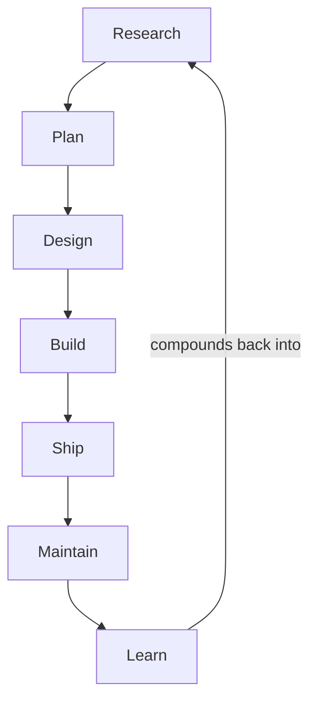

# WORKFLOWS.md Playbook - Plan

## Goal Capsule

- **Objective:** Complete WORKFLOWS.md as a layered playbook — the table as TL;DR index, seven walkthrough sections beneath it in a fixed handoff-connected shape — until the page stands as the canonical answer to "how do you develop?"
- **Product authority:** This Product Contract. The owner approves every section's content; no walkthrough prose ships without approval.
- **Execution profile:** Interactive and owner-in-the-loop by design. Each section begins with an owner interview; drafting proceeds only from interview answers plus repo evidence. Not suitable for hands-off autonomous execution.
- **Stop conditions:** Pause when the owner is unavailable for a section's interview. Surface rather than resolve any conflict between drafted content and the Product Contract.
- **Open blockers:** None.

---

## Product Contract

### Summary

Grow WORKFLOWS.md from index into playbook. The table stays at the top as the TL;DR; beneath it, seven walkthrough sections in a fixed two-layer shape — reasoning first, operational detail second — each opening with what the job receives from the one before and closing with what it hands to the next, so the system reads as a system. The finished page is the link the owner sends when someone asks how he develops.

### Problem Frame

About once a week someone asks the owner "what's your setup, how do you develop?" — and today the answer costs a live call each time. Two kinds of asker keep showing up: a technical, AI-native peer deciding whether to engage or partner, and a non-technical evaluator deciding whether this person credibly fills a fractional CTO or chief-AI-officer shaped role. Both are best served by showing rather than telling, and the current page shows only an index. The owner's stated value is holistic: the seven jobs feeding each other is the content, not seven independent essays.

### Key Decisions

- **Playbook with a handoff spine** over a single-feature tour or an essay-plus-field-pages split. (session-settled: user-approved — chosen over the tour: one curated thread serves five jobs well and two awkwardly, and goes stale as tools change; chosen over the split: eight files is premature while per-section depth is unproven. The handoff beats carry the system view through every section instead of quarantining it in an overview.)
- **Reasoning layer leads, operational layer follows** in every section. (session-settled: user-approved — chosen over separate audience-specific documents: one page serves both readers through layering.)
- **The table is the TL;DR** — an overview before the details, not a placeholder awaiting replacement. (session-settled: user-directed.)
- **All seven sections ship together.** (session-settled: user-directed — chosen over incremental one-at-a-time publishing: the value is the system working holistically, not individual pieces.)
- **Longform voice contract governs the prose.** (session-settled: user-directed — the style developed and refined earlier in this effort, held in the Spiral style guide and its approved examples.)
- **Tool status stays honest.** Tools not yet in the catalog are named as not yet published, carrying forward the page's "real workflow as it runs today, not an idealized version" standard.

### Actors

- A1. The owner. Writes each section from the workflow as he actually runs it; approves all content.
- A2. The technical reader. AI-native peer or executive, often from X, evaluating whether to engage, partner, or think together. Reads to adapt: reasoning and tradeoffs matter more than exact commands.
- A3. The non-technical evaluator. Considering the owner for a forward-deployed engineer, fractional CTO, or chief-AI-officer role. Reads the reasoning layer for credibility; will never run the tools.

### Requirements

**Page structure**

- R1. The table remains at the top as the TL;DR, and each row's workflow name links to its walkthrough section below.
- R2. Each of the seven workflows gets one heading-anchored section below the table, restoring stable anchors.
- R3. The page stays a single file.
- R4. The intro paragraph reflects the completed state — the "still being written" framing retires when the sections land.

**Section shape**

- R5. Every section follows the same internal shape: a handoff opening (what this job receives from the one before), the reasoning layer, the operational layer, and a handoff close (what it passes onward). Research opens the loop and Learn closes it — Learn's close states what compounds back into the system rather than naming a next job.
- R6. The reasoning layer covers when the job fires, why the workflow is shaped this way, and the tradeoffs that shaped it — readable standalone by A3, with shorthand glossed on first use.
- R7. The operational layer names the tools and skills in the order used, with honest gotchas — enough for A2 to adapt the workflow, not a keystroke recipe.
- R8. Tools and skills not yet in the catalog are identified as not yet published; no section claims a capability that doesn't exist today.
- R9. Every section documents the real workflow as it runs today, and the owner approves each before it ships.

**Voice and integration**

- R10. The Longform voice contract governs all prose: warm but restrained first person, even sentences, concrete over abstract, no emoji.
- R11. CONCEPTS.md vocabulary is used where it applies (the catalog, the same-door rule) rather than synonyms.
- R12. The README's seven workflow bullets re-link to the restored section anchors; the README changes in no other way.
- R13. On owner approval, the finished page joins the Longform style's examples per the established page-approval loop.

### Acceptance Examples

- AE1. **Covers R1, R5, R6.** Given a non-technical reader with ten minutes, when they read the table and only the reasoning layers, then they can explain back how the seven jobs feed each other and where a given kind of work enters the system.
- AE2. **Covers R7, R8.** Given a practitioner reading Ship's operational layer, when they finish the section, then they can name the gates that run before a PR opens and which of the referenced skills install today versus which are coming.
- AE3. **Covers R2, R12.** Given a reader on the README, when they click a workflow bullet, then they land on that workflow's section in WORKFLOWS.md.

### Success Criteria

- The page replaces the recurring walkthrough call as the first answer: when the weekly "what's your setup?" question arrives, the owner sends the link, and calls start past the tour. The upcoming walkthrough call is the first live test.
- The scaffolding plan's ten-minute criterion holds for the grown page: a visitor understands the system, what to adopt, and how to start within ten minutes.

### Scope Boundaries

**Deferred for later**

- Splitting sections into `docs/workflows/` field pages — only if a section outgrows the single file, per the scaffolding plan's standing decision.
- Session transcripts, screenshots, and video inside walkthroughs.

**Outside this page's identity**

- README depth regrowth: the README stays thin; this page is where depth lives.
- A marketing or personal-site variant of this content.

### Dependencies / Assumptions

- Assumption: all seven workflows are stable enough today to document without idealizing — the owner runs every one of them currently.
- Dependency: the Longform style guide regenerates from approved examples; this page feeds it on approval (R13), so writing and style compound together.

### Outstanding Questions

- None blocking. The exemplar choice and length balance deferred from the brainstorm are resolved in the Planning Contract (KTD2, KTD3).

### Sources / Research

- `docs/plans/2026-07-10-001-feat-rookery-repo-scaffolding-plan.md` — the standing README-vs-WORKFLOWS depth split (R5, R6), the single-file decision and its split trigger (KTD2), and the no-invented-content rule (U4).
- `skills/creating-portable-skills/SKILL.md` — the repo's one precedent for documented workflow structure: framing prose, a stepped loop with completion criteria, gotchas, credits.
- `CONCEPTS.md` — the vocabulary the sections reuse.
- `WORKFLOWS.md` and `README.md` — current table, teaser bullets, and the unlinked state R12 reverses.

---

## Planning Contract

Product Contract unchanged from the brainstorm; the deferred exemplar and length questions resolve below as KTD2 and KTD3.

### Key Technical Decisions

- KTD1. **Interview-first content capture.** Each section starts with a short focused interview about that workflow as the owner actually runs it; drafting proceeds only from interview answers plus repo evidence. (session-settled: user-directed — chosen over draft-first with gap interviews: reviewing invented drafts costs the owner more than answering questions upfront.)
- KTD2. **Research is the shape-setting exemplar; sections land in reading order.** Research settles the section anatomy once and gets owner approval before the other six are written, each handoff close feeding the next section's open. (session-settled: user-approved — chosen over importance-ordered or parallel drafting: the anatomy should settle once, not seven times.)
- KTD3. **Sections target 200–400 words each.** Keeps the full page inside the ten-minute criterion (~3,500 words with intro and table). Depth that wants more space is a field-page candidate, not license to grow this file. (session-settled: user-approved — chosen over unbounded per-section depth.)
- KTD4. **Per-section production loop.** Interview → draft → Longform polish (`spiral personalize` against the Longform style, reconciled by hand — its output is advisory while the style has few samples) → owner review → approved text lands. Inherits the Product Contract's Longform decision and the established page-approval loop.
- KTD5. **Manual verification, no tooling.** The repo has no doc CI, so gates run as greps and rendered click-throughs rather than automated checks. Adding lint/link tooling is out of scope for this plan.

### High-Level Technical Design

The page's spine is the handoff chain the sections implement — a loop, not a line:

Each section's anatomy, in order: handoff open (one or two sentences), reasoning layer (when the job fires, why this shape, tradeoffs), operational layer (tools in order, honest gotchas), handoff close (one sentence into the next section's open).

### Assumptions

- The owner is available for seven short interviews across the writing effort; the plan pauses, not guesses, when he isn't.
- The Spiral CLI/API stays reachable for polish and the R13 sample sync. Degradation: skip the polish pass and note it; defer the sample sync — neither blocks section content.

### Sequencing

U1 → U2 → U3 → U4 → U5, strictly linear. The handoff chain makes section order a dependency, not a preference.

---

## Implementation Units

### U1. Section anatomy and the Research exemplar

- **Goal:** Settle the reusable section shape and land the approved Research section.
- **Requirements:** R5, R6, R7, R9, R10, R11; KTD1, KTD2; AE1.
- **Dependencies:** None.
- **Files:** `WORKFLOWS.md`
- **Approach:** Interview the owner on the Research workflow: when it fires, how last30days and multi-perspective deep research divide the job, what hands off to Plan, and the gotchas. Draft the four-beat section — Research opens the loop, so its handoff open states what Learn compounds back into it. Run the KTD4 loop to approval. The approved section's beat order, labels, and heading level become the template U2 and U3 copy.
- **Execution note:** Interview precedes drafting; nothing is invented on the owner's behalf.
- **Test scenarios:** Covers AE1 (partial): the reasoning layer reads standalone with shorthand glossed on first use. Catalog status named honestly for each referenced tool (R8).
- **Verification:** Owner approves the section text; all four beats present; section within the KTD3 length band.

### U2. Plan, Design, and Build sections

- **Goal:** The middle chain, one interview each, in reading order.
- **Requirements:** R5–R11; KTD1–KTD4; AE1.
- **Dependencies:** U1.
- **Files:** `WORKFLOWS.md`
- **Approach:** Same loop per section. Plan covers Compound Engineering's ideate/brainstorm/plan progression; Design covers Impeccable as the design driver; Build covers Orca worktrees, delegated agents, and the work loop. Each handoff close is written against the next section's open so the chain reads continuously.
- **Test scenarios:** Handoff continuity: each section's open restates the previous close without contradiction. Covers AE1 (partial) for each section's reasoning layer.
- **Verification:** Owner approves each section; chain reads continuously from Research through Build.

### U3. Ship, Maintain, and Learn sections

- **Goal:** Close the chain and the loop.
- **Requirements:** R5–R11, with R8 doing real work — Ship and Maintain reference skills not yet in the catalog; KTD1–KTD4; AE2.
- **Dependencies:** U2.
- **Files:** `WORKFLOWS.md`
- **Approach:** Ship covers review gates, pre-PR approval, and changelog writing, naming which skills install today and which are coming. Maintain covers hygiene passes, architecture review, eval design, and data validation with the same honesty. Learn covers Networked Thinking and atomic notes, and its handoff close states what compounds back into the system, closing the loop drawn in the Planning Contract's workflow diagram.
- **Test scenarios:** Covers AE2: a reader of Ship's operational layer can name the pre-PR gates and today-vs-coming skill status. Learn's close names a concrete compounding path (for example, learnings landing in `docs/solutions/` feeding future research), not a vague callback.
- **Verification:** Owner approves each section; no section claims an unpublished capability as available.

### U4. Page integration

- **Goal:** The finished-page state: intro rewritten, table linked down, README linked in.
- **Requirements:** R1, R2, R4, R12; AE3.
- **Dependencies:** U1–U3.
- **Files:** `WORKFLOWS.md`, `README.md`
- **Approach:** Rewrite the intro to frame the table as the TL;DR and retire "still being written" while keeping the real-workflow standard sentence. Convert each table row's workflow name to an anchor link. Re-link the README's seven bullets to `WORKFLOWS.md#<anchor>`.
- **Test scenarios:** Covers AE3: every table link and every README bullet resolves to its section heading (GitHub anchor slugs match heading text). Intro contains no placeholder language.
- **Verification:** Rendered click-through of all fourteen links; grep confirms no "Walkthrough coming" or "still being written" text remains.

### U5. Sweeps, style sync, and changelog

- **Goal:** The page verified, the repo record updated, and the style loop closed.
- **Requirements:** R13; both Success Criteria; the same-door rule.
- **Dependencies:** U4.
- **Files:** `WORKFLOWS.md`, `README.md`, `CHANGELOG.md`
- **Approach:** Run the same-door sweep (no absolute paths, private names, or personal-environment assumptions in the new prose — walkthroughs describe a personal setup, making this the highest-risk page for leaks). Check total page length against the ten-minute budget. Add a CHANGELOG Unreleased entry for the walkthrough landing in the narrative-bullet register. Sync the approved page into the Longform style's examples and trigger re-analysis.
- **Test scenarios:** Same-door grep returns clean. `wc -w WORKFLOWS.md` lands near or under 3,500. The Longform style's example list shows the updated page and analysis completes.
- **Verification:** All sweeps pass; changelog entry present; style guide regenerated from the approved page.

---

## Verification Contract

| Gate | Check | Owner | Applies to |
|---|---|---|---|
| Content approval | Owner signs off each section's text before it lands | A1 | U1–U3 |
| Handoff continuity | Each section's open restates the previous section's close | Agent, confirmed in owner review | U2–U3 |
| Anchor integrity | All table links and README bullets resolve on rendered preview | Agent | U4 |
| Placeholder sweep | Grep finds no "Walkthrough coming" / "still being written" | Agent | U4 |
| Same-door sweep | Grep finds no absolute paths, private names, or personal-environment assumptions in changed files | Agent | U5 |
| Length budget | Full page reads in ten minutes (~3,500 words ceiling) | Agent, owner judgment on the margin | U5 |
| Style sync | Longform example updated; Spiral analysis returns ready | Agent | U5 |

---

## Definition of Done

- All seven walkthrough sections live in `WORKFLOWS.md` in the fixed four-beat anatomy, each owner-approved.
- The intro frames the table as the TL;DR with no placeholder language anywhere on the page.
- Every table row and README workflow bullet deep-links to its section, and every anchor resolves.
- The same-door sweep is clean and the page sits inside the length budget.
- `CHANGELOG.md` records the walkthroughs landing under Unreleased.
- The Longform style holds the approved page as an example with analysis rerun.
- No abandoned drafts or commented-out prose remain in the changed files.
