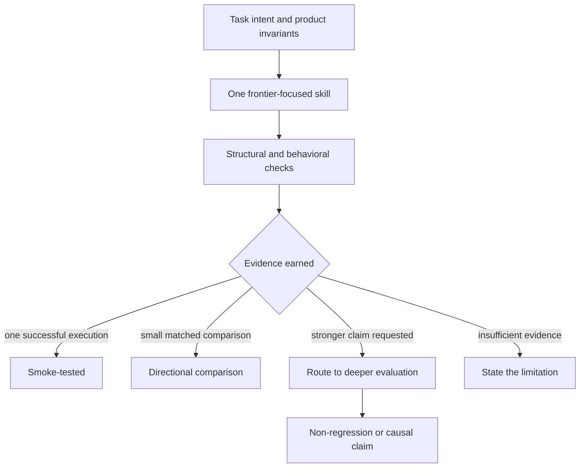
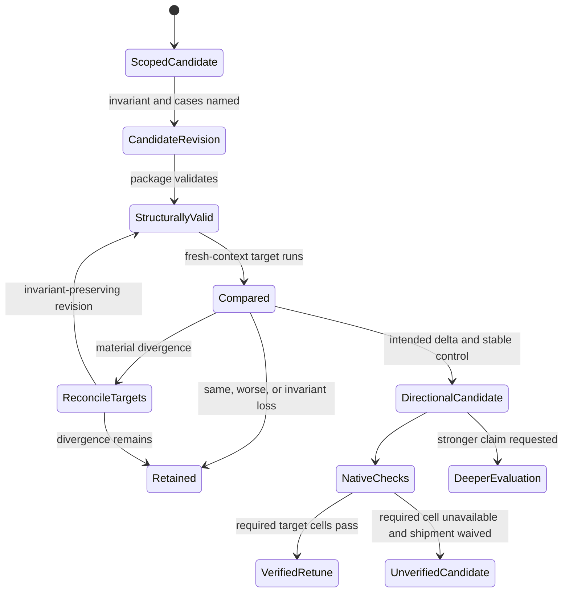
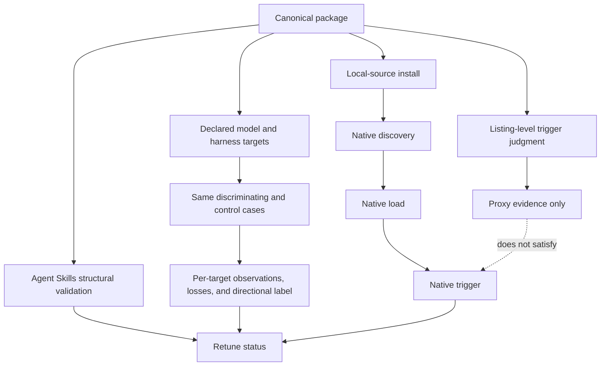

# Creating Portable Skills Frontier Retune - Plan

## Goal Capsule

- **Objective:** Retune `creating-portable-skills` for Claude Opus 5 and GPT-5.6 Sol so it gives frontier models room to work while preserving the product outcomes, boundaries, and checks that make authored skills dependable.
- **Product authority:** The confirmed Product Contract governs this skill only. Issue #13 and the Agent Skills specification provide upstream scope and format constraints. Changes to `design-evals` or the wider skill collection require separate work.
- **Execution profile:** Standard, evidence-first refactor. Freeze the current skill, revise one candidate instruction group at a time, validate structure before target runs, and keep the final result within the Claim Ceiling.
- **Stop conditions:** Do not remove or relax a working instruction without affected-target evidence, do not collapse proxy and native checks, and do not label the retune verified while a required target cell is unavailable.
- **Tail ownership:** The implementer owns the local-source package and target-model evidence. The published-default-branch install probe remains a post-merge operational confirmation.

---

## Product Contract

### Summary

`creating-portable-skills` will remain one portable skill with a lean, intent-led workflow for current frontier models. The implementation extends the existing package, human-readable evidence records, and reusable templates rather than introducing a runner or audit system. This retune uses Opus 5 and GPT-5.6 Sol as its target evidence cells, without hard-coding that pair into the canonical skill.

### Problem Frame

The current skill appears broadly functional, and no inspected evidence shows that Opus 5 or GPT-5.6 Sol broke it. Current vendor guidance nevertheless identifies legacy prompt patterns that can cause frontier models to over-verify, over-delegate, narrate unnecessary work, or follow rigid process instead of the user's intended outcome.

This skill also drives the creation and refinement of future personal skills. Its current baseline records are useful for finding obvious differences, but a few single comparisons and listing-level trigger judgments can be mistaken for proof of reliability. That combination makes surgical instruction economy and an explicit claim ceiling more important than a wholesale rewrite or a built-in evaluation framework.

### Key Decisions

- **One frontier-focused skill.** (session-settled: user-directed — chosen over a weaker-model floor or optional weaker-model scaffolding: one behavioral contract is easier to use and maintain.) Current target models belong to the retune evidence, while the canonical workflow accepts the target set declared for each future task. Governs R1, R2, R11, R12, R14, R15.
- **Surgical retuning with no-change as a valid result.** (session-settled: user-approved — chosen over a full measurement program or evidence-label-only patch: remove stale ceremony without assuming the current workflow is broken.) Governs R3, R4, R11.
- **Standalone claim guardrails.** (session-settled: user-directed — chosen over a light warning or an embedded evaluation suite: prevent false confidence without making routine skill work heavy.) Governs R7-R10.
- **System-owned invariants survive frontier simplification.** Templates, scripts, authority boundaries, deterministic validation, exact formats, and fragile sequences remain when they carry product behavior that model intelligence cannot infer. Governs R4-R6.

<!-- ce-section: work-relationships -->
### How This Work Fits Together

This plan owns the frontier retune of `creating-portable-skills` only. The surrounding work is context, not a committed roadmap.

- **Can proceed independently of:** Any redesign of `design-evals`. This skill must remain honest and useful without that companion.
- **Enables:** Later personal-skill creation and maintenance to inherit the corrected instruction-economy and evidence standards.
- **Can proceed independently of:** A wider corpus retune. Other skills may be assessed separately after this foundation is working.

### Actors

- A1. The personal skill author, who creates, reviews, or revises a portable skill and retains authority over material scope, taste, and waiver decisions.
- A2. The frontier agent, running the workflow on Claude Opus 5 or GPT-5.6 Sol with freedom to choose its reasoning and execution path inside the product boundaries.
- A3. The host harness and its deterministic tools, which provide discovery, clean contexts, validation, installation, loading, triggering, and observable execution evidence where supported.

### Requirements

**Frontier behavior and instruction economy**

- R1. The retune evaluates one canonical skill on Claude Opus 5 and GPT-5.6 Sol without creating model-specific variants or weaker-model scaffolding.
- R2. The skill remains structurally portable through the Agent Skills format. Its outward copy promises portable, installable skills without claiming behavioral support across every model or harness; this retune's behavioral evidence targets the named frontier-model and harness cells.
- R3. The workflow starts from the assumption that the current skill works. Target-model observations or current primary guidance may open a scoped audit. Correcting an overstated evidence label may rely on the repository's existing record, but removing or relaxing a working instruction requires representative evidence from the affected target models and no loss of a named product invariant. Without that evidence, the instruction remains.
- R4. The skill uses the least-prescriptive instruction that preserves the required outcome, replacing fixed cognitive cadence with goals, constraints, authority boundaries, success criteria, and output contracts.
- R5. The existing four disciplines remain outcome gates: capture the skill's intent, produce and validate a portable package, compare behavior before shipping substantive changes, and verify triggering plus installation.
- R6. Progressive disclosure, templates, references, and scripts remain available when they reduce repeated work or make exact behavior more reliable. Deterministic checks and genuinely fragile sequences remain prescribed.

**Evidence and claim integrity**

- R7. Small baselines remain the default for routine creation and revision. They use at least two matched, realistic cases in fresh contexts: one discriminating case where the instruction should affect behavior and one control where it should not. The workflow reuses available context and records concrete observations, losses, model, harness, configuration when available, and date without starting a deeper evaluation program or adding blocking questions unless a stronger claim is requested.
- R8. A small single-run baseline may support only a directional comparison. It must not produce claims such as reliably better, proven, non-regressing, or improved for a model.
- R9. Evidence is labeled by the strongest level it earns: smoke-tested, directional comparison, non-regression evidence, or causal improvement. Each level states its limits beside the result, and the routine standalone workflow may assign only smoke-tested or directional-comparison labels.
- R10. Non-regression and causal-improvement claims route to deeper evaluation. The standalone workflow briefly names the missing rigor, including isolating the changed variable and accounting for ordinary run variation, instead of prescribing randomized trials, blinded grading, statistical machinery, or its own evaluation harness.

**Target-model and portability checks**

- R11. Representative create behavior runs separately in the intended Opus 5 and GPT-5.6 Sol model-harness cells. One target also runs the complete existing-skill audit-and-revision flow; the other runs a focused matched revision that exercises the instruction groups changed by this retune. A second full review flow runs only when the changes affect workflow-wide orchestration or the target results materially diverge. Results remain separate so model, harness, and skill effects are not conflated.
- R12. The finished package passes structural validation. Each claimed harness check passes only with native discovery, installation, loading, and triggering evidence. When native activation is unavailable, listing-level judgment is labeled as a proxy and the native check remains visibly unverified under R13.
- R13. When a required behavioral or harness check cannot run, the record states what was not verified and why. An explicit user waiver may allow shipment of an otherwise authorized change, but it cannot raise the evidence label or turn the result into a verified frontier retune; the shipped result remains an unverified retune candidate.
- R14. The canonical workflow accepts the model and harness targets declared for the current skill task rather than naming a permanent model pair. When more than one target is in scope, it runs the same matched cases separately in each and compares required product invariants and output contracts; differences in wording, reasoning style, or implementation approach are not regressions by themselves.
- R15. When declared targets materially diverge, the workflow first revises the instruction to preserve the invariants across the target set. If that fails, it retains the current instruction or asks the user to narrow the intended target set. It reports each target separately and never averages conflicting results into a pass.

### Key Flows

- F1. Create or revise a portable skill
  - **Trigger:** A1 asks A2 to create, review, update, or migrate a skill.
  - **Actors:** A1, A2, A3.
  - **Steps:** A2 resolves available intent before asking about material gaps, identifies any task-declared model and harness targets, chooses only resources with repeatable value, authors with freedom inside system-owned invariants, then completes structural, behavioral, trigger, and install checks. For multiple targets, the same matched cases run separately and are compared against the named invariants and output contract.
  - **Outcome:** A self-contained skill whose instructions are no more prescriptive than its required behavior demands.
  - **Covers:** R2-R7, R12-R15.
- F2. Retune the authoring workflow for a frontier model
  - **Trigger:** Current guidance or observed target-model behavior suggests an instruction may be stale or counterproductive.
  - **Actors:** A1, A2, A3.
  - **Steps:** Preserve the prior artifact, identify the suspected instruction group and the invariant it may serve, compare representative behavior in each affected model-harness cell, then retain, simplify, or remove the instruction according to the evidence. Untouched instructions remain outside the audit claim.
  - **Outcome:** A surgical change or a no-change conclusion limited to the candidate instruction groups examined, without a general claim that the original skill was broken or a new per-instruction audit ledger.
  - **Covers:** R1, R3-R6, R11, R14, R15.
- F3. Report confidence without overstating it
  - **Trigger:** A behavioral or trigger check produces a result that may be used to justify shipment or a model claim.
  - **Actors:** A1, A2.
  - **Steps:** A2 identifies the evidence level, records all important losses and limitations, and refuses language above that level.
  - **Outcome:** The user can distinguish a useful observation from evidence of reliability or causal improvement.
  - **Covers:** R7-R10, R13.

### Acceptance Examples

- AE1. **Covers R4, R5.** Given the conversation already contains the skill's job, triggers, outputs, and steering decisions, when creation begins, the agent uses that context and asks only about a material gap instead of conducting a fixed one-question-at-a-time interview.
- AE2. **Covers R3, R6.** Given a generic instruction to perform a final recheck and a deterministic validator that protects the same outcome, when the instruction is audited, the generic cognitive reminder may be removed while the validator remains.
- AE3. **Covers R7-R10.** Given one discriminating case improves the affected behavior and one control remains materially stable in a single run each, when results are recorded, the conclusion is directional and includes observed losses. It does not say the revision is reliably better, non-regressing, causal, or proven.
- AE4. **Covers R1, R2.** Given the old skill mentions scaffolding for weaker models, when the frontier-only retune is completed, it does not create an adapter, alternate workflow, or disclaimer section for weaker models. Its outward copy promises portable, installable skills without a universal behavioral claim.
- AE5. **Covers R3, R11.** Given a current instruction still changes target-model behavior in a useful way or protects a fragile operation, when the retune reviews it, the instruction remains even if deleting it would shorten the skill.
- AE6. **Covers R11-R13.** Given target-model or clean-install access is unavailable, when the work is handed off, the missing cell remains visibly unverified. An explicit waiver may permit shipment, but the result remains an unverified retune candidate; structural validation or a listing judgment is not presented as behavioral compatibility.
- AE7. **Covers R14, R15.** Given a future author names three current model-harness targets, when the skill compares them, it runs the same matched cases separately and checks the named invariants and output contract. Stylistic differences may pass; a material invariant loss cannot be averaged away.

### Success Criteria

- One canonical skill serves the frontier workflow without a weaker-model branch or disclaimer layer.
- The four outcome disciplines and every system-owned invariant remain intact after instruction-economy changes.
- Representative create behavior has recorded Opus 5 and GPT-5.6 Sol evidence. One target has a complete existing-skill audit-and-revision run and the other has a focused matched revision; workflow-wide changes or material divergence trigger a second full-flow run.
- Any unavailable target or harness cell remains visibly unverified. A waiver may allow shipment, but does not satisfy the verified-retune criterion.
- Structural validation passes, and claimed harness discovery, install, load, and trigger checks pass only with native evidence. Any listing-level proxy stays labeled and leaves the native check visibly unverified.
- Every instruction removed or relaxed has representative evidence from the affected target models and preserves its named invariant; a waiver cannot substitute for that evidence. Evidence-label corrections may rely on the existing repository record.
- Untouched instructions remain unchanged and outside any exhaustive-audit claim. A no-change conclusion is acceptable only for the candidate instruction groups examined during the retune and needs no new durable audit artifact.
- Small baseline and trigger records use claim language no stronger than their evidence level.
- The canonical workflow accepts a task-declared target set, compares required behavior rather than superficial output similarity, and never averages material divergence into a pass.

### Scope Boundaries

- No redesign of `design-evals` and no dependency on it for routine honesty.
- No full A/A noise-floor program, statistical runner, grader framework, or corpus-scale retune inside this skill.
- No randomized-trial, blinded-grading, or causal-evaluation procedure inside the routine workflow; stronger claims route elsewhere.
- No retuning of other personal skills in the same change.
- No weaker-model behavioral floor, optional adapter, parallel skill version, or disclaimer section.
- No permanent Opus 5 versus GPT-5.6 Sol branch or tie-break rule in the canonical skill.
- No per-instruction audit ledger or new durable record type; existing comparison and result records remain the evidence surface for substantive changes.
- No broad rewrite of the Agent Skills package structure, portable frontmatter contract, templates, references, or scripts without direct evidence that the structure is obsolete.
- No behavioral changes to other shelf skills; repository-level copy changes are limited to replacing cross-harness behavioral language with structural portability and installability wording.
- No claim that Opus 5 universally broke existing skills.

### Dependencies and Assumptions

- The current skill is broadly functional until representative target-model evidence shows otherwise.
- Official model guidance supplies hypotheses and migration risks, not proof of local improvement.
- Behavioral results are specific to their recorded model, harness, configuration, tools, and date.
- The Agent Skills specification remains the structural authority for portable skill packages.

### Sources and Research

- [Issue #13](https://github.com/jrgilbertson/the-rookery/issues/13) defines the requested scope, constraints, and verification targets.
- [Agent Skills specification](https://agentskills.io/specification), [authoring guidance](https://agentskills.io/skill-creation/best-practices), and [evaluation guidance](https://agentskills.io/skill-creation/evaluating-skills) define the portable contract and current baseline guidance.
- [Anthropic's Opus 5 guidance](https://platform.claude.com/docs/en/build-with-claude/prompt-engineering/prompting-claude-opus-5) distinguishes redundant verifier choreography from scope limits, delegation boundaries, output calibration, and deterministic outcome checks.
- [OpenAI's GPT-5.6 guidance](https://developers.openai.com/api/docs/guides/latest-model) supports leaner intent-led prompting while retaining context, hard constraints, authority boundaries, success criteria, and output formats.
- [Compound Engineering's `ce-retune`](https://github.com/EveryInc/compound-engineering-plugin/blob/main/docs/skills/ce-retune.md) provides the measurement-first alternative and reinforces that causal retuning claims require a repeatable harness.
- `skills/creating-portable-skills/` and `tests/creating-portable-skills/` are the current product and evidence record. The checked-in record has no Opus 5 or GPT-5.6 Sol behavioral run, and its full review or migration baseline remains unrun.
- `docs/plans/2026-07-16-001-feat-creating-skills-plan.md` records the original product decisions and historical acceptance contract.

---

## Planning Contract

Product Contract preservation: unchanged.

### Key Technical Decisions

- KTD1. **Freeze the prior skill and compare one candidate instruction group at a time.** (session-settled: user-approved — chosen over a wholesale rewrite or full measurement program: preserve a working skill and change only evidence-supported instruction groups.) Git provides the immutable prior variant; each candidate names its System-Owned Invariant before revision and re-enters the affected comparison after any substantive follow-up edit. Governs implementation of R3-R6.
- KTD2. **Extend the existing evidence workspace instead of creating evaluation infrastructure.** (session-settled: user-approved — chosen over a per-instruction audit ledger or embedded eval suite: keep routine skill work lightweight while retaining reviewable evidence.) The baseline and trigger templates carry reusable record fields, `tests/creating-portable-skills/results.md` appends dated target cells, and a small checked-in fixture supplies a deterministic full-review target. Governs implementation of R7-R10 and R13.
- KTD3. **Resolve model and harness targets at run time.** (session-settled: user-approved — chosen over a permanent Opus-versus-Sol branch: future callers can compare whatever current targets matter.) With no declared set, use the current model and harness as one recorded target; ask for more targets only when the requested portability or comparison claim requires them. Governs implementation of R11, R14, and R15.
- KTD4. **Represent evidence as separate observable states.** (session-settled: user-directed — chosen over treating small baselines or listing judgments as proof: prevent routine evidence from creating false confidence.) Structural validation, listing proxy, native discovery, local install, native load, native trigger, and behavioral comparison each record passed, failed, or unverified independently. Installation and discovery may be shared by a package-harness pair, while load and trigger remain attributable to each model-harness target cell; routine conclusions remain smoke-tested or directional. Governs implementation of R7-R10 and R12-R15.
- KTD5. **Use asymmetric full-flow coverage with conditional escalation.** (session-settled: user-approved — chosen over duplicating the complete existing-skill workflow in both current targets: close the known coverage gap without building a four-cell suite.) A disposable fixture runs end to end on one target, while the other runs the focused revision case; workflow-wide changes or material divergence trigger the second full run. Governs implementation of R11.
- KTD6. **Prove pre-merge installation from the local working tree.** The install check verifies the installed files came from the current source before observing native load and trigger behavior. A remote default-branch probe may confirm the published state after merge, but remote `@ref` output does not substitute because the repository has observed it scan the wrong revision. Governs implementation of R12 and R13.

### High-Level Technical Design

The candidate lifecycle defaults to retention whenever evidence is missing, neutral, worse, or divergent. A waiver changes shipment authority only; it does not change the evidence transition.

Verification keeps evidence layers independent so a proxy cannot silently satisfy a native check.

### Sequencing

1. Retune the canonical workflow and its instruction-economy owner while preserving a Git-addressable prior version.
2. Update reusable evidence templates and add the disposable existing-skill fixture before target-model runs begin.
3. Validate the candidate package, execute the current target cells, and feed only evidence-supported changes back into the candidate.
4. Freeze the final description, run proxy and native activation checks, then synchronize public copy and append the final evidence record.

### System-Wide Impact

- Future skills authored with this workflow inherit the target-set comparison and Claim Ceiling through the reusable templates.
- Existing evidence remains readable as dated historical observations; new records do not retroactively upgrade old model or harness claims.
- No runtime service, persistent evaluator, data migration, or new dependency is introduced.
- Human authority remains at fix-scope approval, waiver authorization, and target-set narrowing after unresolved divergence.

### Risks and Dependencies

| Risk or dependency | Planning response |
| --- | --- |
| Model aliases, defaults, and harness capabilities change | Resolve and record the exact model, harness, configuration, and date at execution time; never silently substitute a nearby target. |
| The skill edits the workflow used to evaluate itself | Preserve the prior version through Git, isolate variants in fresh contexts, and record which variant actually loaded. |
| A small run hides an instruction's value | Predeclare a discriminating case and a control, treat `same` as inconclusive, and retain the instruction without affected-target evidence. |
| Listing judgment or a stale install produces a false pass | Record the listing result as a proxy, install from the local working tree, verify installed content identity, and observe native discovery, load, and trigger separately. |
| Targets disagree after a change | Reconcile wording against shared invariants and rerun every affected target; retain the current instruction or narrow the target set if divergence persists. |
| Evidence records become either opaque or burdensome | Preserve concise raw-enough excerpts or durable transcript references in existing result records; do not create a transcript archive or audit ledger. |

---

## Implementation Units

### U1. Retune the canonical workflow and invariant ownership

- **Goal:** Replace stale cognitive choreography and unsafe evidence shortcuts while preserving the portable package and System-Owned Invariants.
- **Requirements:** R1-R6, R10, R13-R15; A1-A3; F1, F2; AE1, AE2, AE4, AE5, AE7; KTD1, KTD3, KTD4.
- **Dependencies:** None.
- **Files:** `skills/creating-portable-skills/SKILL.md`, `skills/creating-portable-skills/references/review-checklist.md`, `skills/creating-portable-skills/references/portability.md`, `skills/creating-portable-skills/assets/skill-template.md`, `tests/creating-portable-skills/baseline-cases.md`.
- **Approach:**
  1. Audit the fixed interview cadence, baseline gate, subtraction rule, trigger gate, packaging claim, and weaker-model gotcha as separate candidate groups under KTD1.
  2. Put the full System-Owned Invariant and qualifier rules in the review checklist, then let the core workflow cite that owner instead of duplicating the policy.
  3. Replace the single-run deletion shortcut with R3's retain-by-default decision and add KTD3's task-declared target behavior without naming permanent models in the package.
  4. Keep Agent Skills frontmatter, one-level references, templates, authority boundaries, deterministic validation, and fragile ordered operations intact.
- **Execution note:** Characterize each candidate group against the frozen prior version before changing it; do not batch unrelated instruction cuts into one comparison.
- **Patterns to follow:** Compact portable core and one-level disclosure in `skills/creating-portable-skills/SKILL.md`; one meaning per owner in `skills/creating-portable-skills/references/review-checklist.md`; structural and harness-specific information in `skills/creating-portable-skills/references/portability.md`.
- **Test scenarios:**
  1. Covers AE1. Given complete job, trigger, output, and authority context, the workflow proceeds without a rote interview; given one material missing decision, it asks only for that gap.
  2. Covers AE2. Given a generic recheck reminder and a deterministic validator serving the same invariant, the reminder may be removed while the validator remains.
  3. Given a comparison with no observed difference, the workflow retains the instruction and labels the result inconclusive rather than treating absence of evidence as permission to delete.
  4. Covers AE5. Given a fragile operation or authority boundary, the instruction remains even when deletion would shorten the skill.
  5. Given no declared target set, the workflow records the current model and harness as one target without starting a multi-model matrix.
  6. Covers AE7. Given three declared targets, the same cases run separately and stylistic differences pass when the named invariant and output contract remain intact.
  7. Given a request to prove non-regression, the workflow refuses the label and routes to deeper evaluation without requiring or launching another skill.
- **Verification:** The package expresses the Product Contract once per rule, stays within the portable structure and line budget, and the affected cases in `tests/creating-portable-skills/baseline-cases.md` discriminate the revised behavior from the frozen prior version.

### U2. Extend evidence templates and add a disposable review fixture

- **Goal:** Make routine evidence honest and reusable without introducing an evaluation runner or audit ledger.
- **Requirements:** R7-R10, R12-R15; A2, A3; F1-F3; AE3, AE6, AE7; KTD2, KTD4, KTD5.
- **Dependencies:** U1.
- **Files:** `skills/creating-portable-skills/assets/baseline-test-template.md`, `skills/creating-portable-skills/assets/trigger-queries-template.md`, `tests/creating-portable-skills/baseline-cases.md`, `tests/creating-portable-skills/trigger-queries.md`, `tests/creating-portable-skills/fixtures/review-target/SKILL.md`.
- **Approach:**
  1. Extend the baseline template with declared and actual target metadata, case role, named invariant or output contract, prior and revised observations, losses, raw-output reference, limitation, and earned evidence label.
  2. Extend the trigger template so listing proxy and native discovery, install, load, and trigger states cannot share one passing field.
  3. Add one small fixture with known review defects and one fragile instruction that must remain, designed to be copied into a disposable workspace before each full-flow run.
  4. Preserve the existing test files as historical records and add current cases or dated sections rather than rewriting their 2026-07-16 observations.
- **Patterns to follow:** Copy-and-fill assets under `skills/creating-portable-skills/assets/`; append-only evidence under `tests/creating-portable-skills/`; explicit pass criteria in `skills/creating-portable-skills/references/review-checklist.md`.
- **Test scenarios:**
  1. Covers AE3. A discriminating case improves the affected behavior while its control remains materially stable; the filled record earns only a directional label and lists any loss.
  2. A discriminating case returns `same`; the filled record marks the candidate inconclusive and retains the instruction.
  3. Covers AE6. A listing judgment passes while native activation is unavailable; proxy passes, native remains unverified, and overall status does not claim behavioral compatibility.
  4. A user waives an unavailable check; shipment may be labeled an unverified retune candidate, but the waiver cannot authorize an unsupported instruction removal or raise the claim label.
  5. A three-target record keeps observations separate and exposes one material invariant loss instead of averaging the set into a pass.
  6. The disposable fixture's audit identifies both removable ceremony and the fragile instruction that must survive, then waits for fix-scope approval before editing.
- **Verification:** Both templates can be instantiated without hidden fields or external dependencies, the fixture validates as an Agent Skill, and a reviewer can determine every target cell's evidence state from the filled artifacts alone.

### U3. Run target-model comparisons and stabilize the candidate

- **Goal:** Earn current directional evidence on Opus 5 and GPT-5.6 Sol, retaining any instruction whose removal is unsupported or loses an invariant.
- **Requirements:** R3-R15; A1-A3; F1-F3; AE1-AE7; KTD1-KTD5.
- **Dependencies:** U1, U2.
- **Files:** `skills/creating-portable-skills/SKILL.md`, `skills/creating-portable-skills/references/review-checklist.md`, `skills/creating-portable-skills/references/portability.md`, `skills/creating-portable-skills/assets/baseline-test-template.md`, `skills/creating-portable-skills/assets/trigger-queries-template.md`, `skills/creating-portable-skills/assets/skill-template.md`, `tests/creating-portable-skills/baseline-cases.md`, `tests/creating-portable-skills/trigger-queries.md`, `tests/creating-portable-skills/results.md`.
- **Approach:**
  1. Confirm the exact target model IDs, harnesses, configurations, native capabilities, and frozen prior variant before spending behavioral runs.
  2. Run representative create behavior in both target cells with the same discriminating and control cases.
  3. Run the disposable existing-skill flow end to end on one target and the focused matched revision on the other under KTD5.
  4. Compare named invariants and output contracts, not prose similarity; record observations and losses separately for each target.
  5. Treat `same`, worse, invariant loss, or unavailable affected-target evidence as retention. Reconcile material divergence and rerun every affected cell against the same candidate revision.
  6. Append dated evidence and raw-enough excerpts or transcript references without rewriting historical observations. Any substantive edit loops through validation and the affected comparisons again.
- **Execution note:** Behavioral evidence drives the final diff. A valid outcome is a smaller candidate change or no instruction change; do not preserve a planned edit merely to make the retune visible.
- **Patterns to follow:** Fresh-context prior-versus-revised cases in `tests/creating-portable-skills/baseline-cases.md`; dated per-run evidence and limitations in `tests/creating-portable-skills/results.md`; contaminated evaluator runs are discarded rather than rationalized.
- **Test scenarios:**
  1. Both target cells run the same create-flow discriminating and control cases with isolated prior and revised variants.
  2. Covers F2. One target completes audit, user scope approval, revision, validation, comparison, affected trigger testing, and packaging against the disposable fixture.
  3. The other target exercises every instruction group changed by the candidate in a focused matched revision.
  4. A workflow-wide change or material target divergence triggers the second full existing-skill flow.
  5. A divergence-triggered wording edit invalidates both prior target results and reruns the same matched cases across the full declared set.
  6. An unavailable required cell remains unverified; a waiver produces an unverified retune candidate rather than a verified retune.
  7. A request for a causal or non-regression claim preserves the routine record and names the missing deeper-evaluation rigor without upgrading the label.
  8. When an invariant-preserving revision still leaves material divergence, A2 follows R15 and KTD3 by retaining the current instruction or asking A1 to narrow the declared target set.
- **Verification:** Opus 5 and GPT-5.6 Sol have separate dated evidence for the required create and revision coverage, and every removed or relaxed instruction has affected-target support with no invariant loss. U3 ends with a Retained or DirectionalCandidate state; only U4 can assign the final verified or unverified retune status.

### U4. Finalize activation, installation, and outward claims

- **Goal:** Prove the final package's structural and native behavior, then align public wording with the evidence actually earned.
- **Requirements:** R2, R7-R15; A1-A3; F1, F3; AE3, AE4, AE6, AE7; KTD4, KTD6.
- **Dependencies:** U3.
- **Files:** `skills/creating-portable-skills/SKILL.md`, `skills/creating-portable-skills/references/portability.md`, `tests/creating-portable-skills/trigger-queries.md`, `tests/creating-portable-skills/results.md`, `README.md`, `skills/README.md`, `CHANGELOG.md`.
- **Approach:**
  1. Freeze the final description, run the public-collection trigger-query tier in fresh target contexts, and label those judgments as listing proxies.
  2. Discover and install the skill from the local working tree into each target harness, verify installed content identity, then observe native load and trigger behavior separately.
  3. Append final structural, proxy, native, model, harness, configuration, date, limitation, and Claim Ceiling results to the existing record using KTD4's package-harness and target-cell attribution.
  4. Narrow skill-specific, shelf, changelog, and repository-level copy to structural portability and installability without changing any other skill's behavior.
  5. Repeat structural validation and affected behavioral gates after any final substantive edit.
- **Patterns to follow:** Local-source install evidence in `tests/creating-portable-skills/results.md`; published-state follow-up in `docs/solutions/integration-issues/skills-cli-ref-not-checked-out.md`; public catalog wording in `skills/README.md` and `CHANGELOG.md`.
- **Test scenarios:**
  1. Every should-trigger query activates and no near-miss does under the final template's public-collection tier; results remain explicitly proxy evidence.
  2. Each target harness discovers the local-source package, installs the expected files, loads the skill, and natively triggers it from a representative user query.
  3. A stale or wrong-revision installed copy fails content-identity verification and cannot satisfy the native cell.
  4. Listing proxy passes while native load is unavailable; the native cell remains unverified and the final status is not a verified retune.
  5. Covers AE4. Public copy says portable and installable without promising equivalent behavior across all models and harnesses or adding a weaker-model disclaimer.
  6. The finished package contains no owner-machine paths, private identifiers, model-specific branch, new evaluator, or external skill dependency.
  7. Given three target cells where one passes, one fails, and one is unavailable, the final record preserves all three states and does not collapse them into a harness-wide pass.
- **Verification:** The final skill validates, passes its applicable proxy and native checks with distinct evidence, installs from the current working tree in the current target harnesses, and every outward claim stays within the recorded evidence. U4 alone assigns the final VerifiedRetune or UnverifiedCandidate state.

---

## Verification Contract

| Gate | Procedure | Units | Done signal |
| --- | --- | --- | --- |
| Product preservation | Compare the enriched Product Contract against the confirmed requirements and stable R/F/AE IDs | U1-U4 | Product meaning is unchanged and every implementation unit cites its governing IDs |
| Static skill validation | Run `npx skills-ref validate skills/creating-portable-skills` after candidate and final edits | U1-U4 | Validator exits clean; any manual fallback is named and does not masquerade as tool evidence |
| Template instantiation | Instantiate `assets/skill-template.md` and the evidence templates in a disposable workspace, then validate the generated skill | U2 | The generated package validates and the records expose every required target, case, loss, limitation, and claim field |
| Instruction-decision cases | Run the context-complete, material-gap, `same`, fragile-operation, waiver, strong-claim, and multi-target scenarios in fresh contexts | U1-U3 | Each transition matches R3, R7-R10, and R13-R15 without unsupported deletion or claim escalation |
| Current target create comparison | Run matched discriminating and control cases on `claude-opus-5` and `gpt-5.6-sol` with exact harness/configuration metadata | U3 | Both target cells have separate directional observations and no named invariant loss for any shipped instruction change |
| Existing-skill coverage | Run one disposable-fixture flow end to end and the focused affected-group revision in the other target; escalate on KTD5's conditions | U2, U3 | The known full-review gap is closed and the second target corroborates every shipped instruction change |
| Trigger proxy | Run the final should-trigger and near-miss set under the public-collection tier in fresh target contexts | U4 | All should-trigger queries pass, no near-miss activates, and the record labels the result as a listing proxy |
| Native target checks | Install from the local working tree, verify installed content identity, and observe native discovery, load, and trigger in each claimed target harness | U4 | Each native state is separately passed or visibly unverified; no proxy or waiver fills a missing state |
| Same-door and copy sweep | Inspect the package, fixture, evidence, catalog, changelog, and repository copy for owner-environment assumptions and behavioral overclaims | U1-U4 | No private path or identifier ships, and outward language promises portability/installability rather than universal behavior |
| Markdown integrity | Run `git diff --check` and resolve every shipped relative link | U1-U4 | No whitespace errors, broken relative references, or abandoned experimental artifacts remain |

---

## Definition of Done

- The Product Contract remains meaningfully unchanged, with stable R/F/AE IDs and full traceability through KTDs, units, scenarios, and gates.
- U1-U4 satisfy their verification outcomes, and every feature-bearing unit's named scenarios have recorded results.
- The canonical skill, references, and assets stay self-contained, structurally valid, and within the Agent Skills line and frontmatter limits.
- Every removed or relaxed instruction has directional affected-target evidence with a stable control and no System-Owned Invariant loss; unsupported candidates are retained.
- Opus 5 and GPT-5.6 Sol have separate recorded current evidence for create behavior, required existing-skill coverage, and native target checks; any missing required cell prevents the verified-retune label.
- Routine evidence is labeled only smoke-tested or directional, listing judgments remain proxies, and stronger claims route out without embedding an evaluation suite.
- The disposable fixture proves audit approval, simplification, retention of a fragile instruction, validation, comparison, affected trigger testing, and packaging without modifying `design-evals`.
- Public copy consistently describes portable, installable skills without universal behavioral promises, a weaker-model branch, or a disclaimer layer.
- Historical evidence is preserved, new results are dated and raw enough to review, and no per-instruction ledger or transcript archive is added.
- Abandoned candidate edits, stale installed copies, temporary workspaces, and dead references are absent from the final diff.

### Post-Merge Confirmation

- Run the plain remote install probe against the published default branch and append its tool version, installed revision, and native result. This confirms distribution state but does not replace the local-source pre-merge evidence.
