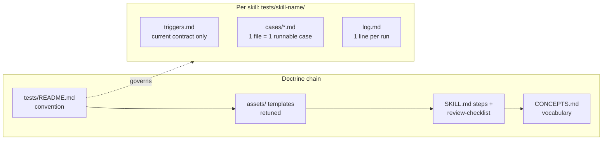

# refactor: Lightweight, rerunnable skill test suites

## Product Contract

### Summary

Restructure the `tests/` suites for all four skills into thin, rerunnable artifacts (trigger contract, individual behavioral cases, run log), prune to the discriminating core, delete the evidence bureaucracy, and retune the two `creating-portable-skills` templates plus their bound references so new skills stop regenerating the old machinery.

### Problem Frame

The current `tests/` suite (~6,000 lines across four skills) was generated by a now-deleted eval-design skill whose doctrine optimized for evidence bookkeeping over rerunnable evals: Claim Ceilings, earned evidence labels, waiver machinery, per-judgment session UUIDs, and hand-recorded SHA-256 tables. The results are write-once prose ledgers — nothing is individually rerunnable, current contracts are interleaved with historical epochs, and the strongest content (discriminating Given/Then regression cases) is buried in 600+ line files. Research into current best practice (Anthropic skill-authoring guidance; Husain/Shankar evals FAQ, 2026) converges on the opposite shape: few real scenarios per skill, binary pass/fail, error-analysis-driven growth, a cost hierarchy that reserves expensive checks for behavior changes, and git as the evidence ledger.

The doctrine is also self-replicating: `skills/creating-portable-skills/assets/baseline-test-template.md` and `assets/trigger-queries-template.md` are the enforcement point, bound into that skill's SKILL.md steps and review checklist, with the vocabulary canonized in `CONCEPTS.md`. Fixing `tests/` without retuning those files would regenerate the bureaucracy on the next skill.

### Requirements

- R1. Each skill's tests live in three thin artifacts: a current-contract-only trigger file, one file per behavioral case, and a one-line-per-run log.
- R2. Every behavioral case is individually runnable: full prompt, any input files, and a binary expected-behavior checklist; a case fails if any item fails.
- R3. The active case set per skill is pruned to the discriminating core (baseline showed the bare model failing it, or an observed failure motivated it), targeting roughly 10–15 cases per skill.
- R4. Case files record one provenance line naming the motivating failure or baseline gap; future cases are admitted by the same observed-failure rule.
- R5. The evidence bureaucracy is removed end to end: Claim Ceilings, evidence labels, waiver sections, target-cell matrices, hand-recorded hashes, and session-UUID citations appear in no active test artifact, template, or skill reference.
- R6. Native install/load/trigger provenance is replaced by one smoke check per harness (install from source, one trigger query, confirm activation), recorded as a log line.
- R7. The two templates in `skills/creating-portable-skills/assets/` are retuned to the new lightweight shape, and every binding reference in that skill package (SKILL.md steps, review checklist, portability note) is synchronized.
- R8. `CONCEPTS.md` vocabulary matches the new doctrine: retired machinery terms removed, surviving concepts redefined to their lightweight meaning.
- R9. The privacy discipline survives: no private meeting content, participant identities, vault names, or local absolute paths in any tracked test artifact.
- R10. The testing convention itself is written down once, in `tests/README.md`, as the single source of truth the future design-evals skill will formalize.

### Scope Boundaries

**In scope:** `tests/` for all four skills; `skills/creating-portable-skills` templates and bound references; `CONCEPTS.md`; a new `tests/README.md`.

**Out of scope:**
- The new design-evals skill (explicitly deferred by the user).
- Re-running trigger judgments or behavioral runs to re-verify existing pass states — this is restructuring, not re-verification. Historical pass states are summarized as log seed lines.
- The `automations/` YAML invocation prompts.

#### Deferred to Follow-Up Work

- A test runner (`tests/run.sh` driving headless agents) — deliberately excluded; candidate work for the future design-evals skill.
- `docs/solutions/` refresh: six learnings cite old test paths, template line numbers, and retired machinery. They are historical records; run `ce-compound-refresh` after this lands to reconcile or annotate them.
- First live use of the new convention (adding a case from a newly observed failure) — happens naturally, not in this change.

---

## Planning Contract

### Key Technical Decisions

- **Delete old test files outright; git history is the archive** *(session-settled: user-directed — chosen over a browsable `archive/` directory: history is fully recoverable at the pre-restructure commit, and an archive directory would preserve the sediment the cleanup exists to remove)*. Each new `log.md` seeds with one line naming the restructure and the last pre-restructure commit hash for recovery.
- **Retune templates and bound references now, minimally** *(session-settled: user-directed — chosen over deferring until the design-evals skill exists: the templates are the enforcement point that regenerates the bureaucracy for every new skill)*. Retune means: same artifact names and placement conventions, new lightweight content. Eval methodology depth (error analysis, judge calibration) stays with the future skill.
- **No runner script in this change** *(session-settled: user-directed — deferred with the design-evals skill)*. Cases are runnable by hand: any fresh agent context can execute one case file.
- **Binary pass/fail everywhere.** Trigger judgments stay yes/no; behavioral checklist items are pass/fail; no scores, no "directional" labels. Grounded in the evals-FAQ finding that binary forces clearer thinking and Anthropic's expected-behavior checklist shape.
- **Cost hierarchy replaces uniform rigor.** Three tiers with different run frequencies: deterministic structural validation (`skills-ref` validator) on every skill change; trigger suite (fresh-context listing judges, one run per query, escalate to three only on a borderline first judgment) on description change; behavioral cases (affected ones only) on behavior change. The old public-tier three-runs-everything rule is retired; a maintainer may still choose extra runs for a high-stakes release, as judgment rather than mandated tiers.
- **Convention lives in `tests/README.md`** — chosen over WORKFLOWS.md or CONTRIBUTING.md: co-located with the artifacts it governs, and a stable anchor for the future skill to reference. Kept to roughly one screen.
- **CONCEPTS.md keeps what survives, drops what doesn't.** Retire: Claim Ceiling, Verification Mode, Loaded Skill Identity (the provenance-hash doctrine). Redefine: Baseline Test (compare with/without skill on a small case set, binary verdicts), Install Probe (the per-harness smoke check). Keep as-is: Trigger Contract, Delete Test, Degradation Path, Same-Door Rule, Published Catalog, Independent Review Context, System-Owned Invariant.
- **Trigger suites keep their query content.** The should-trigger and near-miss tables are the highest-value existing content and survive nearly verbatim; what changes is the surrounding record-keeping (historical epochs, hash tables, per-run UUIDs move to git history).

### Assumptions

- The ~10–15 case target is a working cap, not a hard rule; a skill with fewer genuinely discriminating cases keeps fewer (personal-chief-of-staff and managing-personal-crm will likely land under 10).
- `creating-portable-skills`' SKILL.md description does not change, so no trigger re-verification is required; the package edit is validated structurally plus one smoke check, consistent with the new doctrine it implements.
- The `tests/creating-portable-skills/fixtures/` directory stays, referenced by whichever surviving cases need it.

---

## High-Level Technical Design

The change has two halves: the artifact restructure (per skill) and the doctrine chain that keeps it from regressing.



Cost hierarchy (what runs when):

| Tier | Check | Trigger | Cost |
| --- | --- | --- | --- |
| 1 | `skills-ref` structural validation | every skill change | seconds, deterministic |
| 2 | trigger suite (listing judges) | description change | cheap, fresh contexts |
| 3 | affected behavioral cases | behavior change | expensive, targeted |
| — | per-harness smoke check | packaging change | one query per harness |

## Output Structure

```text
tests/
├── README.md                  # the convention (R10)
└── <skill-name>/              # same shape for all four skills
    ├── triggers.md            # query tables + threshold rule, no history
    ├── cases/
    │   ├── <case-name>.md     # prompt, inputs, binary checklist, provenance line
    │   └── ...
    ├── fixtures/              # only where cases need input files
    └── log.md                 # seed line + one line per subsequent run
```

---

## Implementation Units

### U1. Write the convention: `tests/README.md`

**Goal** — Establish the single source of truth for the new testing shape before any suite is restructured.

**Requirements** — R1, R2, R3, R4, R5, R6, R9, R10.

**Dependencies** — None.

**Files** — `tests/README.md` (new).

**Approach** — One screen (~50–70 lines) covering: the three artifacts and their contracts; the binary rule; the case admission rule (observed failure or baseline-discriminating, with one provenance line) and the ~10–15 working cap; the cost hierarchy table; the smoke-check definition; the privacy rule (carried from the old results.md preamble); log format (`date | git rev | check | pass/fail | note`); and one sentence retaining the honest-claims principle — a listing-proxy pass is not proof of native triggering. No Claim Ceilings, labels, waivers, or target-cell language.

**Patterns to follow** — Prose-economy style of `AGENTS.md` and `CONCEPTS.md`; Anthropic's `expected_behavior` checklist shape for the case contract.

**Test scenarios** — Test expectation: none — convention document; verified by U6 sweep checks and by U2–U4 conforming to it.

**Verification** — A reader can restructure a suite from this file alone; every rule in it is exercised by at least one of U2–U4.

### U2. Restructure `tests/reviewing-meetings/` (exemplar)

**Goal** — Convert the richest suite to the new shape, setting the pattern U3–U4 copy.

**Requirements** — R1, R2, R3, R4, R5, R9.

**Dependencies** — U1.

**Files** — `tests/reviewing-meetings/triggers.md` (new), `tests/reviewing-meetings/cases/*.md` (new, ~12 files), `tests/reviewing-meetings/log.md` (new); delete `trigger-queries.md`, `baseline-cases.md`, `results.md`.

**Approach** — `triggers.md`: carry the existing 14 should-trigger and 9 near-miss queries with their expected judgments and reasons; drop the historical procedure prose, run records, and status narrative; state the threshold rule by reference to `tests/README.md`. Cases: mine the three characterized baseline cases and the 40+ Given/Then regression cases, selecting the discriminating core — favor cases whose baseline showed the bare model failing (exact dispositions, append-only numbering, ambiguous attribution), collision/identity stops, approval-binding rules (vague approval writes nothing; partial decisions), degradation contracts (source unavailable; template unavailable), and the retrieved-instruction isolation case. Fold near-duplicate variants (e.g., the Granola ID canonicalization family) into single cases with multiple checklist items. Each case: prompt (from the existing synthetic prompts or reconstructed from the Given), binary checklist, provenance line. `log.md`: seed line summarizing the historical pass state (final 2026-07-23 acceptance and 2026-07-28 follow-ups) with the pre-restructure commit hash.

**Test scenarios** — Test expectation: none — documentation restructure; the case files themselves are the tests, verified structurally in U6.

**Verification** — Every surviving case names its provenance; no case duplicates another's discriminating behavior; every dropped behavior is either folded into a kept case or genuinely a bare-model default (no-op); file count and line totals match the thin-artifact intent (triggers ≤ ~60 lines, each case ≤ ~40, log ≤ 10).

### U3. Restructure `tests/managing-personal-crm/` and `tests/personal-chief-of-staff/`

**Goal** — Apply the U2 pattern to the two mid-size suites.

**Requirements** — R1, R2, R3, R4, R5, R9.

**Dependencies** — U2.

**Files** — Same three-artifact shape per skill (new); delete each suite's `trigger-queries.md`, `baseline-cases.md`, `results.md`.

**Approach** — Trigger tables carry over (17+9 for CRM, existing set for chief-of-staff) minus embedded historical judgments — recorded pass states compress into the log seed line. Case mining follows the U2 selection rule; expect fewer survivors (~6–10 each). Where the CRM suite's cases overlap reviewing-meetings' CRM-companion cases, the meeting-owned copy stays in `tests/reviewing-meetings/` and the CRM suite keeps only direct-CRM behaviors, so each contract has one home.

**Test scenarios** — Test expectation: none — documentation restructure; verified in U6.

**Verification** — Same per-file checks as U2; no behavioral contract is owned by two suites.

### U4. Restructure `tests/creating-portable-skills/`

**Goal** — Convert the largest suite, including its fixture.

**Requirements** — R1, R2, R3, R4, R5, R6, R9.

**Dependencies** — U2.

**Files** — Same three-artifact shape (new); keep `fixtures/review-target/SKILL.md`; delete `trigger-queries.md` (513 lines), `baseline-cases.md` (1,455), `results.md` (907).

**Approach** — `triggers.md`: the 10+10 query set survives; the four hash-table epochs, per-judgment UUID tables, TR-P transition cases, and evidence-state matrices go to git history. Cases: mine the matched-comparison records for the few genuinely discriminating behaviors (e.g., independent-review requirement, verification-question behavior against the fixture); most of the old volume is machinery-about-machinery and does not survive as cases. The log seed line records the final 2026-07-28 native-check passes as the historical smoke evidence, plus the pre-restructure commit. Surviving cases that exercise the fixture reference it by relative path.

**Test scenarios** — Test expectation: none — documentation restructure; verified in U6.

**Verification** — Same per-file checks as U2; `fixtures/` referenced by at least one case or removed; no SHA-256 or session-UUID strings remain in the new artifacts.

### U5. Retune templates and synchronize the skill package

**Goal** — Make `creating-portable-skills` produce the new shape instead of the old machinery.

**Requirements** — R5, R6, R7.

**Dependencies** — U1 (convention defines the target shape).

**Files** — `skills/creating-portable-skills/assets/baseline-test-template.md` (rewrite, ~185 → ~50 lines), `skills/creating-portable-skills/assets/trigger-queries-template.md` (rewrite, ~181 → ~60 lines), `skills/creating-portable-skills/SKILL.md` (edit the verification-mode sentence and steps binding the templates — the regions at lines 20, 36, 64, 78–96), `skills/creating-portable-skills/references/review-checklist.md` (edit machinery lines 19, 28, 32), `skills/creating-portable-skills/references/portability.md` (soften the target-cell claim sentence).

**Approach** — Baseline template becomes: declaration (skill, mode, case list), per-case block (prompt, inputs, binary expectation, with/without observation, verdict), decision rule (any required case failing returns to correction), one honest-claims sentence. Trigger template becomes: query-table shape, fresh-context judging protocol, threshold rule (one run, escalate on borderline; any near-miss `yes` fails), smoke-check recording, tuning note (front-load trigger words; rerun the set after a description edit). SKILL.md edits replace tier/waiver/Claim-Ceiling language with the cost-hierarchy references and keep step structure otherwise intact — the description does not change. Review-checklist items reference the new template rules. Portability note keeps its true core (portability ≠ behavioral equivalence) minus target-cell vocabulary.

**Execution note** — This package is in the Published Catalog; keep every edit surgical and run the structural validator before considering the unit done.

**Test scenarios** — Test expectation: none — template/instruction rewrite; verified by validator, smoke check, and U6 sweeps.

**Verification** — `skills-ref` validation passes; SKILL.md remains under 500 lines with description unchanged; no template or reference mentions Claim Ceiling, evidence labels, waivers, verification modes, or target cells; a dry read of SKILL.md steps 5–7 produces the U1 convention's artifacts; one per-harness smoke check (install from source into a disposable project, one trigger query, confirm activation) recorded in `tests/creating-portable-skills/log.md`.

### U6. Synchronize `CONCEPTS.md` and run the final sweep

**Goal** — Align canonical vocabulary with the new doctrine and verify the whole change hangs together.

**Requirements** — R5, R8, R9.

**Dependencies** — U2, U3, U4, U5.

**Files** — `CONCEPTS.md` (edit); no other file changes expected — this unit is otherwise verification.

**Approach** — Apply the CONCEPTS.md decision from Key Technical Decisions: remove Claim Ceiling, Verification Mode, Loaded Skill Identity; rewrite Baseline Test and Install Probe to their lightweight definitions; leave the seven surviving entries untouched. Then sweep:

**Test scenarios** — Enumerated as sweep checks (each binary):
- `grep -ri "claim ceiling\|evidence label\|matched-comparison waiver\|verification mode\|target cell" tests/ skills/ CONCEPTS.md` returns no hits (docs/solutions excluded — historical, deferred).
- `grep -rn "trigger-queries.md\|baseline-cases.md\|results.md" tests/ skills/ README.md WORKFLOWS.md CONTRIBUTING.md` returns no references to the deleted filenames outside git history.
- No SHA-256-shaped strings or session UUIDs in `tests/` (`grep -rE "[a-f0-9]{64}|[0-9a-f]{8}-[0-9a-f]{4}-" tests/`).
- Every `tests/<skill>/cases/*.md` contains a prompt section, a checklist with at least one `- [ ]`-style binary item, and a provenance line.
- Every `tests/<skill>/log.md` seed line names the pre-restructure commit.
- No absolute paths or private identifiers in tracked test artifacts (spot-check per R9, honoring `AGENTS.md`'s pre-commit untracked-path inspection).
- `skills-ref` validation passes for `creating-portable-skills`.

**Verification** — All sweep checks pass; `CONCEPTS.md` reads coherently start to finish with no dangling cross-reference to a removed entry (the old Install Probe → Loaded Skill Identity link is rewritten).

---

## Verification Contract

- Structural: `skills-ref` validator passes on `skills/creating-portable-skills`; all U6 sweep greps return clean.
- Behavioral: one smoke check per harness for the edited skill package (U5), recorded in its log; no other behavioral re-verification is claimed or required — restructuring does not invalidate previously recorded pass states, which remain in git history.
- Shape: each restructured suite matches the Output Structure tree and the U2 line budgets.
- Honesty: no new artifact claims evidence it does not carry (log lines state what ran; the README carries the listing-proxy ≠ native-trigger caveat).

## Definition of Done

- All four `tests/<skill>/` directories contain exactly the three thin artifacts (plus `fixtures/` where used); the twelve legacy files are deleted.
- `tests/README.md` exists and is the only place the convention is stated.
- Both templates and all bound references in `skills/creating-portable-skills` reflect the lightweight doctrine; validator passes; description unchanged.
- `CONCEPTS.md` contains no retired machinery terms and its surviving definitions match the new doctrine.
- All U6 sweep checks pass; working tree contains only in-scope changes per `AGENTS.md`'s pre-commit inspection.

## Risks & Dependencies

- **Pruning loses a load-bearing contract.** Mitigation: the U2 selection rule requires an explicit disposition for every existing case (kept, folded, or dropped-as-no-op); git history preserves full recovery; the provenance line makes each keep auditable.
- **Published-catalog exposure.** `creating-portable-skills` installs from the default branch; a broken edit ships on merge. Mitigation: validator + smoke check in U5; description untouched so trigger behavior is unaffected.
- **Vocabulary drift with `docs/solutions/`.** Six learnings still describe the old doctrine. Accepted for this change; `ce-compound-refresh` follow-up owns reconciliation (Scope Boundaries).
- **The future design-evals skill diverges from `tests/README.md`.** Accepted: the README is deliberately the smaller, stable core; the skill formalizes it later and may amend it through its own change.

## Sources & Research

- This session's read-through of all twelve `tests/` files, both templates, `SKILL.md`, `review-checklist.md`, `portability.md`, `CONCEPTS.md`, and reference greps across README/WORKFLOWS/CONTRIBUTING/docs-solutions.
- External (load-bearing): Anthropic skill-authoring best practices (evaluation-driven development, ~3 scenarios, expected-behavior checklists, model-coverage testing); Husain & Shankar LLM Evals FAQ 2026 (binary pass/fail, error analysis first, cost hierarchy, over-engineering warning); Husain, Evals Skills for Coding Agents (failure vocabulary before evaluators).
- Institutional: `docs/solutions/best-practices/independent-fresh-context-review-for-skills.md` (fresh-context review principle — preserved in the new doctrine via Independent Review Context and the judging protocol).
