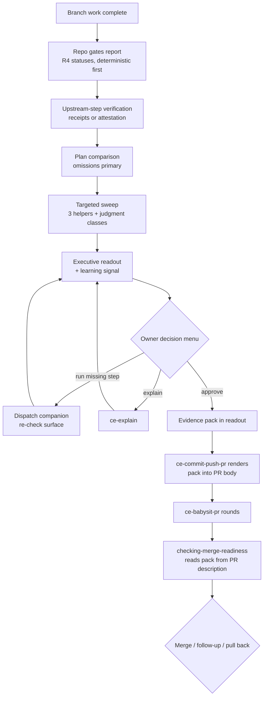

# Readiness Checkpoint Skills - Plan

## Goal Capsule

- **Objective:** Publish two sibling checkpoint skills in this repository — `checking-pr-readiness` (phase 1), an interactive healthy-worktree gate before any PR, and `checking-merge-readiness` (phase 2), a post-review digest before any merge — and deprecate the `pre-pr-approval` skill in the agentic-toolkit repository once phase 1 is published.
- **Product authority:** This plan owns both phases as one designed pair; phase 1 ships first and phase 2's requirements are intentionally coarser, to be enriched at its own planning pass. The agentic-toolkit deprecation is in-scope work executed in that repository.
- **Open blockers:** None.
- **Authority:** This plan governs; repository conventions (AGENTS.md, tests/README.md, skills/creating-portable-skills/) override where they conflict, and the owner overrides both.
- **Stop conditions:** Stop and surface if `skills-ref` validation rejects a scripts-bearing skill (untested first for this repo), or if evidence invalidates a session-settled decision.
- **Tail ownership:** Execution runs interactively with the owner; the shipping tail (commit, PR, CI) follows the repository's normal workflow.

---

## Product Contract

### Summary

Rebuild the private `pre-pr-approval` skill as `checking-pr-readiness`: a portable, published checklist gate that verifies the shipping workflow's upstream steps actually ran, surfaces planned-but-not-delivered work, sweeps the evidence-backed finding classes that drive automated-review rounds, confirms learnings are captured or planned, and ends in an explicit owner decision that persists an evidence pack. Its phase-2 sibling `checking-merge-readiness` digests a fully reviewed PR before merge so heavily babysat PRs are never merged blind.

### Problem Frame

The compound engineering shipping sequence runs simplify → code review → browser test → PR with no checkpoint that looks back at the original plan, confirms the earlier steps ran, or verifies durable learnings were written before the PR exists. The published compound engineering loop has no such step either, and no established open-source pre-PR gate skill fills the niche.

The cost shows up after the PR opens. Forensics on the three repositories' recent painful PRs found the head commits all green in CI — the pain is 7–16 rounds of automated-reviewer re-review (CodeRabbit, Codex, Copilot, Greptile), each push surfacing the next tier of mostly nitpick-grade findings, plus solutions docs written late or forgotten. One PR (corvly #3284) spent most of its 15 rounds on the solutions doc rather than the fix. The current `pre-pr-approval` skill partially addresses this but is unpublished, single-repo, wrapped in heavyweight doctrine, and carries at least one stale claim about a companion skill's behavior.

A second gap sits at the other end of the PR's life: after `ce-babysit-pr` grinds a 30–50-comment PR to merge-ready, nothing digests what the review rounds revealed — whether the volume signals underspecification, or fix-upon-fix drifted or over-complicated the change — before the merge happens.

### Key Decisions

- KD1. **Two sibling skills, one plan, phase 1 first** (session-settled: user-directed — chosen over a single two-checkpoint skill and over deferring the merge gate to a separate brainstorm: shared pattern, but distinct triggers and evidence). Governs R1, R16.
- KD2. **Names `checking-pr-readiness` / `checking-merge-readiness`** (session-settled: user-directed — chosen over the `approving-*` family: matches the checklist framing and the repo's gerund convention). Governs R1, R16.
- KD3. **Verify upstream steps rather than re-run them** (session-settled: user-directed — chosen over a local pre-push bot review pass: `ce-code-review` already provides fresh-context review upstream, and CodeRabbit credits stay reserved for PR-time review). Governs R4, R5.
- KD4. **Targeted sweep of evidence-backed finding classes** (session-settled: user-directed — chosen over verify-only and over compounding the classes upstream: the recurring classes are known from PR forensics and checkable locally). Governs R9.
- KD5. **Deterministic helpers plus a persisted evidence pack** (session-settled: user-approved — chosen over pure prose instructions: mechanical classes get checked every time, and the approved readout pays forward into the PR body). Governs R9, R11, R12.
- KD6. **Interactive only** (session-settled: user-directed — chosen over adding a headless pipeline mode: the gate exists to put the owner in the loop before the expensive irreversible step). Governs R1.
- KD7. **Missing steps are offered from the decision menu** (session-settled: user-directed — chosen over recommend-only and hard-block: the gate flags the gap, can dispatch the missing skill, then re-checks). Governs R10.
- KD8. **Omissions over scope-creep policing** (session-settled: user-directed — plans legitimately adjust during execution; the costly failure is planned work silently not delivered). Governs R7.
- KD9. **Defer to repo-owned deterministic gates** (session-settled: user-directed — repos like corvly already run extensive hook suites; the gate never duplicates them). Governs R3, R9.
- KD10. **Honesty over receipt infrastructure** (session-settled: user-approved — where an upstream step leaves no artifact, the gate reports "not verified" and accepts explicit owner attestation rather than imposing a cross-skill receipt convention). Governs R5, R6.
- KD11. **Deprecate the original by archive rename** — agentic-toolkit's precedent is a `<name>-archive` directory rename with frontmatter untouched; the original's grep-contract test script retires with it. Governs R20.
- KD12. **Reviewer-bot configuration is a complementary lever outside this plan** — tuning the PR bots' severity thresholds or reviewer count could also cut round counts, but it addresses only the bot-noise half of the goal; the gate also owns plan omissions and learning capture, and any round-count movement from bot tuning is accounted for when validating the success criteria.

### Requirements

**Gate scope and trigger (phase 1: `checking-pr-readiness`)**

- R1. The skill runs interactively when branch work appears complete and before any PR is opened; it produces a readout ending in one explicit owner decision, and it never edits, stages, commits, pushes, or opens a PR itself. The readout reports the branch's full working surface — committed, staged, unstaged, and untracked paths — because that is what the finishing path stages.
- R2. The skill generalizes across orchestrations — the same checklist works whether one agent planned and executed or separate planner, executor, and reviewer agents were involved — without naming specific orchestration modes.
- R3. Deterministic checks come first: the readout reports each repository gate (hooks, canonical quality commands) with its R4 status before any model-judgment checks, and the skill never re-runs a check the repository's hooks already own.

**Upstream-step verification**

- R4. The readout reports each expected upstream step — code review, code simplification, browser testing for UI-touching diffs, Impeccable critique/audit for UI-touching diffs, and learnings capture — using one shared status vocabulary for every check in the skill: verified (named evidence), attested, failed, not run, unavailable, bypassed, or not applicable. The vocabulary is a reporting word list, not a state machine. The readout also records how the UI-touching classification was decided, and an uncertain classification is surfaced for owner decision rather than silently resolved.
- R5. A step is "verified" only from a concrete receipt (for example an Impeccable critique snapshot with its score and P0/P1 counts, a solutions doc in the working surface, session context of the run); the skill never writes "verified" without naming the evidence.
- R6. Where no receipt exists, the readout reports the step as not verified and may accept explicit owner attestation, recorded with R4's attested status rather than as evidence.
- R7. The readout compares the branch against its source plan or brief and lists planned-but-not-delivered items as the primary finding class, with work-beyond-plan noted secondarily as intent drift. When no source plan or brief exists, the readout reports the comparison as unavailable, names the absence itself as a finding, and takes the owner's direct attestation of intent.
- R8. Every readout carries a durable-learning signal: a solutions doc exists in the branch's working surface, an explicit capture plan or follow-up exists, or the readout states why no durable learning is present. Approving past an uncaptured, unplanned learning requires an explicit owner override recorded with its reason in the evidence pack; capture remains the recommended path.

**Targeted sweep**

- R9. The skill sweeps the branch for the evidence-backed finding classes that drive automated-review rounds: underspecified rules in prose and instruction files (undefined negative or ambiguous paths); cross-document contradictions and stale cross-references; evidence or test records predating the final edit; duplicated source-of-truth literals; partial-failure cleanup and resource-lifecycle gaps; exit-code truthfulness; tests asserting a copy instead of the production artifact; markdown and lint basics not covered by repo hooks; mechanically checkable invariants that exist only as prose; and diff size against automated-reviewer file caps. Mechanical classes run through small bundled helpers that defer to repo-owned equivalents; judgment classes run by model instruction. The classes are listed in observed-frequency order from the forensics, and the readout surfaces findings in that order. A file-cap warning names the affected reviewer and the cap's source, or says the cap is unverified when it cannot be confirmed.

**Readout and decision**

- R10. The readout is a concise executive summary leading to a single decision menu: approve and proceed to the finishing path, request changes, run a flagged missing step now (one option per gap found), have the change or a concept explained via `ce-explain`, or stop and file follow-up. Non-terminal options return to a readout recomposed if the branch surface changed while they ran. The readout scales to the change surface: on small or low-risk diffs, checks that do not apply are collapsed or skipped and named per R14.
- R11. On approval, the skill persists an evidence pack recording plan-vs-delivered status, checks run with their R4 statuses and results, the explicit not-verified and attested list, sweep findings and dispositions, UI critique scores when present, and the learning signal — consumable by the finishing path for the PR body and by `checking-merge-readiness`.
- R12. The evidence pack's durable home is the pull request description: the finishing path renders it into the PR body, and nothing is written inside the repository's tracked tree or any local state store.

**Portability and publishing**

- R13. The skill installs and activates per this repository's conventions: canonical frontmatter, the Same-Door Rule, and no personal-environment assumptions in shipped files.
- R14. When a companion is absent — the compound engineering plugin, Impeccable, or a repo with no hooks — the skill runs the remaining checklist and names each affected check with its R4 status.
- R15. The skill ships with the repository's test artifacts: a trigger contract, behavioral cases mined from the observed failure classes, and a run log, passing structural validation and the install probe. Shipping also requires the testing convention's matched-pair baseline comparison: affected cases run with and without the skill in fresh contexts, shipping only when discriminating cases show the intended improvement with no regression.

**Merge gate (phase 2: `checking-merge-readiness`, coarse — enrich before building)**

- R16. The skill runs interactively after PR review is resolved (typically post `ce-babysit-pr`) and before merge; it never merges.
- R17. It digests the PR's review history: the classes of findings raised, unresolved or deferred majors, and signals that the volume or shape of findings indicates underspecification or over-complication. The digest also records the finding classes it observed in a form that refreshes the R9 sweep set.
- R18. It compares the final PR state against the original plan and the phase-1 evidence pack read from the PR description, flagging where accumulated fixes moved the change away from its intent.
- R19. It ends in one owner decision — merge, file follow-up work, or redesign and pull back — and may invoke `ce-pov` for a graded verdict when the redesign question is live.

**Deprecation (agentic-toolkit)**

- R20. After `checking-pr-readiness` is published, the agentic-toolkit `pre-pr-approval` skill is archived by directory rename per that repository's precedent, removed from its canonical skill list, and its contract-test script retired.

### Actors

- A1. **Owner** — the human who reads the readout and makes every terminal decision.
- A2. **Gate agent** — the agent running the skill in any supported harness (Claude Code, Codex, and peers).
- A3. **Companion skills** — the compound engineering plugin skills and Impeccable, verified or dispatched but never reimplemented.

### Key Flows

- F1. Clean pre-PR pass
  - **Trigger:** Owner or agent invokes the gate with branch work complete.
  - **Steps:** Confirm repo gates green → verify upstream steps from receipts → compare plan vs delivered → run targeted sweep → compose readout with learning signal → owner approves → persist evidence pack → hand off to the finishing path.
  - **Covers:** R1, R3–R5, R7–R11.
- F2. Gap found
  - **Trigger:** A step is not verified or a sweep class fires.
  - **Steps:** Readout flags the gap → menu offers "run it now" → skill dispatches the missing step (for example `ce-compound` for an uncaptured learning) → surface re-checked → readout recomposed → owner decides.
  - **Covers:** R6, R8–R10.
- F3. Pre-merge digest (phase 2)
  - **Trigger:** Review resolved on a PR, owner about to merge.
  - **Steps:** Digest review history → compare final state against plan and evidence pack → flag drift, underspecification, or over-complication signals → optionally invoke `ce-pov` → owner decides merge, follow-up, or pull back.
  - **Covers:** R16–R19.

### Acceptance Examples

- AE1. **Covers R5, R6.** Given `ce-code-review` ran in a previous session and left no artifact, when the gate composes the readout, then code review is listed as not verified, the owner may attest it ran, and the evidence pack records the attestation as attestation.
- AE2. **Covers R8, R10.** Given the branch solved a novel problem and no solutions doc exists in the branch's working surface, when the readout is composed, then the learning signal names the gap and the menu offers running `ce-compound` before approval is recommended.
- AE3. **Covers R9.** Given a plan names an artifact filename that no longer matches what shipped, when the sweep runs, then the stale cross-reference is flagged for fix before the PR opens.
- AE4. **Covers R9.** Given the diff touches more files than an automated reviewer's cap, when the readout is composed, then it warns the PR will be skipped, names the reviewer and the cap's source (or marks the cap unverified), and suggests splitting.
- AE5. **Covers R14.** Given a repository without the compound engineering plugin installed, when the gate runs, then upstream-step checks that depend on it are named as skipped and the remaining checklist still completes.
- AE6. **Covers R17–R19.** Given a babysat PR whose review produced many rounds concentrated on one underspecified behavior, when `checking-merge-readiness` digests it, then the readout surfaces the underspecification signal and recommends the redesign conversation instead of a blind merge.

### Success Criteria

- Automated-reviewer re-review rounds per PR drop toward one substantive round from the 7–16-round forensics baseline; the claim counts as proven only after back-testing the R9 sweep classes against the forensics PRs' round-two-and-later findings shows the observed catch rate.
- No durable learning goes silently uncaptured: every gated branch that produced one ends with the learning captured, explicitly planned, or approved past with a recorded owner override.
- The owner can make each decision from the executive readout alone, without requesting the appendix — the on-request rendering of the evidence pack's detail per R11 — in the common case.
- No gated PR is silently skipped by reviewer bots for exceeding file caps.

### Scope Boundaries

- No headless or pipeline mode; the gate is not added to `lfg`.
- No re-running of deterministic checks the host repository's hooks own, and no local CodeRabbit or other PR-bot runs before the PR exists.
- No re-implementation of code review, simplification, browser testing, critique, or learnings capture — companions are verified or dispatched.
- No cross-skill receipt convention imposed on companion skills.
- Post-PR feedback resolution stays with `ce-babysit-pr` and `ce-resolve-pr-feedback`; prevention-gate design stays with `ce-compound`.
- The original skill's doctrine prose (Return Sequence, no-mutation essays, escalation matrix) is not ported wholesale; its load-bearing behaviors survive as R1, R5, and R10.

<!-- ce-section: work-relationships -->
### How This Work Fits Together

This plan owns the two checkpoint skills and the deprecation; the surrounding shipping workflow is context, and this breakdown is the current understanding rather than a committed roadmap.

- `checking-pr-readiness` (phase 1, this plan)
  - **Depends on** the compound engineering plugin skills and Impeccable when present; degrades without them per R14.
  - **Enables** the finishing path (`ce-commit-push-pr`) to open evidence-carrying PRs, and slots into WORKFLOWS.md's shipping sequence as its step 4.
- `checking-merge-readiness` (phase 2, this plan, coarse)
  - **Depends on** the phase-1 evidence pack (R18) and typically follows `ce-babysit-pr`.
  - **Enables** refreshing the phase-1 sweep set (R9) from observed review history per R17.
  - **Still to decide:** its detailed readout shape and `ce-pov` invocation contract, at its own planning pass.
- agentic-toolkit deprecation (this plan, executed in that repository)
  - **Depends on** phase 1 being published (R20).
- WORKFLOWS.md and CHANGELOG.md updates in this repository
  - **Shares** the publication moment with phase 1: the playbook's unpublished-skills note and shipping-sequence naming update when the skill lands.

### Dependencies / Assumptions

- Impeccable's critique snapshots (`.impeccable/critique/` frontmatter with score and P0/P1 counts, plus its storage CLI) are a stable receipt source; its audit persists nothing, so audit evidence must come from a run or CI output.
- Receipt inventory per upstream step: Impeccable critique snapshots and solutions docs in the working surface are durable receipts; browser testing leaves evidence only when its output or screenshots were saved; ce-code-review and ce-simplify-code leave no durable artifact today, so outside the session that ran them those steps are attestation-only under R6.
- `ce-commit-push-pr` accepts conversational context when composing the PR body; the evidence pack reaches it as context, not through a formal interface. If a future plugin version adds one, planning may adopt it.
- The compound engineering plugin's current headless `ce-compound` reports discoverability gaps without editing instruction files; the original skill's suppression machinery is not needed.
- PR forensics generalize: the finding classes came from three repositories over three weeks and are treated as the initial sweep set, refreshed by the phase-2 digest per R17.

### Outstanding Questions

- **Deferred to implementation:** none blocking. The evidence pack's home (KTD4), the helper split (KTD3), and phase-2 sequencing (KTD6) resolved during planning; the merge gate's missing-pack behavior is owned by the phase-2 enrichment pass (U6).

### Sources / Research

- WORKFLOWS.md — shipping sequence and the pre-PR checkpoint's role; lists the original skill as unpublished.
- tests/README.md and skills/creating-portable-skills/ — publishing, testing, and portability conventions phase 1 must meet.
- agentic-toolkit repository: skills/pre-pr-approval/SKILL.md (the original, including its `ce-explain` and `ce-compound` integrations) and its `-archive` deprecation precedent.
- corvly repository: lefthook.yml pre-push suite, root quality commands, and docs/decisions/030-ci-workflow-architecture.md (PR-time e2e removed for GitHub Actions cost) — why the gate defers to repo-owned checks.
- PR forensics (corvly #3255/#3277/#3284/#3239, the-rookery #10/#15/#19, agentic-toolkit #225): all-green CI, 7–16 automated-review rounds, finding-class ranking behind R9.
- External: Spotify's background coding agent verification loop (judge sees intent plus diff, vetoes ~25% of sessions, dominant reason out-of-scope work); Anthropic's evidence-not-assertions guidance and fresh-subagent review pattern; compound engineering's published eight-step loop (no pre-PR gate step); impeccable.style docs (`audit`/`clarify`/`harden` pre-ship set); GitHub Actions 2026 pricing changes.

## Planning Contract

**Product Contract preservation:** restructured, no scope change beyond one user-directed resolution — R12 rewritten (evidence-pack home resolved to the PR description; the prior "outside the tracked tree" constraint is satisfied by it), R18 clarified to read the pack from the PR description, Outstanding Questions resolved into KTD3/KTD4/KTD6, and the prior review's deferred pack-location question retired by KTD4. No R-IDs renumbered.

### Key Technical Decisions

- KTD1. **Author with `creating-portable-skills` and its package anatomy** (session-settled: user-directed — the repo's own authoring skill is the workflow: SKILL.md with numbered workflow steps each ending a `Completion:` line plus Gotchas; sweep-class definitions in `references/` behind an explicit read trigger; the evidence-pack template and readout shape in `assets/`; deterministic helpers in `scripts/`). Frontmatter is exactly `name`, `description`, `license: MIT`, `compatibility`; body stays under the 500-line ceiling. Governs R13.
- KTD2. **Helpers ship under the authoring skill's scripts rule with a falsifiability contract** (session-settled: user-approved — chosen over prose-only instruction for mechanical checks: "deterministic helpers belong in `scripts/` when prose cannot reliably protect the result"). Each helper is POSIX-compatible bash (`#!/usr/bin/env bash`), depends only on git, makes no network calls, resolves every path inside the skill directory or the host repo, and prints distinct output for absent-input, no-match, hit, and defer-to-repo-gate cases — a helper that cannot fail is rejected. When a helper cannot run, the readout reports that class with R4's not-run status and the model-instruction fallback covers it. Governs R9.
- KTD3. **Three helpers, no more:** surface-and-size report (worktree inventory for R1; diff size against reviewer caps for R9), evidence-freshness and stale-reference check (records predating the final edit; plan-named artifacts that do not match what shipped), and changelog-union check (the branch's own work appears in CHANGELOG — the durable home its source learning nominated). All other sweep classes run by model instruction reading `references/`. Governs R9.
- KTD4. **Evidence-pack home is the PR description** (session-settled: user-directed — chosen over a user-level state directory: no state machinery; the PR is addressable from any session or machine, so the pack travels with the work). The pack is composed at approval as a markdown section, handed to the finishing path in the approval readout, rendered into the PR body, and read back from the PR description by `checking-merge-readiness`. Before a PR exists the pack lives only in the readout. Governs R11, R12, R18.
- KTD5. **Status words harmonize with existing precedent** — R4 owns the vocabulary; where its words overlap the repo's existing review-bundle result set (failed, deferred, skipped), reuse those words rather than minting synonyms. A word list only; no transitions, no lifecycle (user constraint: no state machines). Governs R4.
- KTD6. **Phase 2 is held at an enrichment gate** (session-settled: user-directed — both gates in one plan, phase 1 first). No merge-gate implementation unit exists in this plan; U6 runs `checking-merge-readiness` through its own planning pass once real evidence packs exist in PR bodies, and that pass owns the missing-pack degraded behavior and the R17 sweep-refresh mechanism. Governs R16–R19.
- KTD7. **Test cases are mined, not enumerated** — a case enters the suite only when a baseline run showed the bare model failing it (provenance line required); near-duplicate variants fold into battery cases; the ten sweep classes are candidates, not a quota. Before any trigger run, installed copies of `pre-pr-approval` are inventoried and moved out of discovery scope — a same-purpose competitor contaminates trigger judgments. A qualifier pass runs over the finished checklist prose: every load-bearing adjective ("ready", "material", "small diff") gets a checkable criterion or an enumerated verdict set. Governs R15.
- KTD8. **Deprecation is a verified disposition list** — every "moved into checking-pr-readiness" claim points at the surviving line that carries it; every retirement survives a live-reference grep in both repositories (WORKFLOWS.md, READMEs, automations, sibling docs). The archive rename follows agentic-toolkit's `-archive` precedent. Governs R20.

### High-Level Technical Design

---

## Implementation Units

### U1. Author the checking-pr-readiness SKILL.md

- **Goal:** The gate's complete instruction core, portable per repo conventions.
- **Requirements:** R1–R10, R13, R14.
- **Dependencies:** none.
- **Files:** skills/checking-pr-readiness/SKILL.md.
- **Approach:**
  1. Frontmatter per KTD1; trigger description written for the Trigger Contract (fires on "ready for a PR?" shapes; must not fire on post-PR feedback or plain code review, which near-misses will pin).
  2. Workflow steps in checklist order per the design diagram, each ending a `Completion:` line: repo-gate report (R3), upstream verification with the receipt inventory (R4–R6), plan comparison with the absent-plan path (R7), learning signal with recorded override (R8), targeted sweep (R9), readout and menu (R10), change-surface scaling (R10).
  3. Degradation paths per R14 named per companion; no-mutation and worktree-surface reporting per R1.
  4. Qualifier pass per KTD7 before declaring the unit done.
- **Execution note:** Run `/creating-portable-skills` as the authoring workflow; it owns format verification.
- **Test scenarios:** behavioral coverage lands in U4's suite; this unit's exit is structural — `npx skills-ref validate skills/checking-pr-readiness` passes and the Same-Door grep sweep finds no personal-environment references.
- **Verification:** validator green; body ≤500 lines; every workflow step carries a `Completion:` line.

### U2. Write the sweep reference and assets

- **Goal:** The ten finding classes as read-on-demand reference, and the evidence-pack template as a copyable asset.
- **Requirements:** R9, R11.
- **Dependencies:** U1.
- **Files:** skills/checking-pr-readiness/references/sweep-classes.md, skills/checking-pr-readiness/assets/evidence-pack-template.md.
- **Approach:** Classes listed in the forensics frequency order R9 fixes, each with: what it looks like, how to check it (helper vs judgment), and an enumerated verdict set (per KTD7's qualifier rule). The pack template mirrors R11's fields with R4 statuses, sized to render cleanly inside a PR description.
- **Test scenarios:** Test expectation: none — reference prose; exercised through U4's cases.
- **Verification:** every class names its checker and verdict set; template fields match R11 exactly.

### U3. Build the three bundled helpers

- **Goal:** Falsifiable deterministic checks per KTD2/KTD3.
- **Requirements:** R3, R9.
- **Dependencies:** U1.
- **Files:** skills/checking-pr-readiness/scripts/surface-report.sh, skills/checking-pr-readiness/scripts/evidence-freshness.sh, skills/checking-pr-readiness/scripts/changelog-union.sh.
- **Approach:** Bash+git only per KTD2. First step: validate a scripts-bearing skill with `npx skills-ref validate` before writing helper logic — the validator has never seen a non-markdown skill file in this repo (stop condition if rejected). Each helper documents its four output states in a header comment.
- **Execution note:** Write each helper's absent-input/no-match/defer outputs down before implementing — the falsifiability contract is the point, not an afterthought.
- **Test scenarios:**
  - surface-report on a clean tree → reports clean surface, zero untracked; on a tree with an untracked file → names it; on a diff exceeding a cap fixture value → warns with the cap source; with git absent (PATH stripped) → prints its defer line, exit status distinguishes.
  - evidence-freshness with a log entry older than the final edit of its case file → flags it; with fresh records → distinct pass output; with no records present → absent-input output, not a pass.
  - changelog-union on a branch whose CHANGELOG lacks the branch's entry → flags; present → pass; no CHANGELOG in repo → defer-to-absent output.
- **Verification:** all fixture states produce distinct, documented outputs; no network or non-git dependency; executable bits set and survive `--copy` install.

### U4. Mine and write the test suite

- **Goal:** Trigger contract, behavioral cases, and run log per the repo convention.
- **Requirements:** R15.
- **Dependencies:** U1, U2, U3.
- **Files:** tests/checking-pr-readiness/triggers.md, tests/checking-pr-readiness/cases/, tests/checking-pr-readiness/log.md, tests/checking-pr-readiness/fixtures/.
- **Approach:**
  1. Isolate installed `pre-pr-approval` copies from every skill location before any run (KTD7).
  2. triggers.md: 5–10 should-trigger, 5–10 near-misses (post-PR feedback → ce-resolve-pr-feedback; doc critique → ce-doc-review; plain review → code-review skills).
  3. Baseline-mine candidate cases from the sweep classes and gate behaviors (untracked-surface reporting, absent-plan honesty, learning-override recording); only observed bare-model failures enter, as battery cases with independent-branch isolation clauses; synthetic fixture worktrees, no absolute paths.
  4. Matched-pair comparison with an independent fresh-context grader; log lines per convention.
- **Test scenarios:** the suite is the test artifact; its own checks are the convention's tier gates.
- **Verification:** discriminating cases show bare-model fail → skilled pass with no control regression; log names the fresh-context mechanism; install probe from local source passes with identity proof.

### U5. Publish integration

- **Goal:** The skill lands in the catalog with every cross-reference true in the same change.
- **Requirements:** R13, R20 (workflow-doc half).
- **Dependencies:** U1–U4.
- **Files:** README.md, CHANGELOG.md, WORKFLOWS.md, CONCEPTS.md.
- **Approach:**
  1. README skill bullet (two sentences, publication order) in the same change as the skill.
  2. CHANGELOG entry under Unreleased → Added, matching existing entry shape.
  3. WORKFLOWS.md four edits: drop `pre-pr-approval` from the unpublished list; rename shipping-sequence step 4; rewrite the checkpoint paragraph to the new gate's behavior (escalation-reviewer promise out, explain-with-quiz survives via the ce-explain menu option); leave the generic "pre-PR checkpoint" mentions standing.
  4. Ship the uncommitted CONCEPTS.md readiness-checkpoints section in this change; align the Evidence Pack entry with KTD4's PR-body home.
  5. Post-merge install probe against the published state; record the skills CLI version; `--copy` so script permission bits are exercised.
- **Test scenarios:** Test expectation: none — documentation edits; the probe is the check.
- **Verification:** post-merge probe green with identity proof; `rg pre-pr-approval` in this repo returns only intentional survivors (generic checkpoint prose, this plan).

### U6. Run the phase-2 enrichment gate

- **Goal:** `checking-merge-readiness` gets its own planning pass grounded in real evidence packs.
- **Requirements:** R16–R19.
- **Dependencies:** U5 (published phase 1; at least one PR carrying an evidence pack).
- **Files:** a new plan artifact under docs/plans/ (produced by that pass, not this one).
- **Approach:** Invoke the brainstorm/plan cycle scoped by this plan's phase-2 requirements; that pass owns the digest's readout shape, the ce-pov invocation contract, the missing-pack degraded path, and the R17 sweep-refresh mechanism.
- **Test scenarios:** Test expectation: none — the produced plan carries its own.
- **Verification:** an implementation-ready plan for the merge gate exists citing R16–R19.

### U7. Deprecate the original in agentic-toolkit

- **Goal:** The old skill is archived with every disposition claim verified. **Target repo: agentic-toolkit.**
- **Requirements:** R20.
- **Dependencies:** U5.
- **Files (in agentic-toolkit):** skills/pre-pr-approval/ → skills/pre-pr-approval-archive/, README.md (canonical skill list), scripts/test-pre-pr-approval-contract.sh (retire).
- **Approach:** Archive rename with frontmatter untouched per that repo's precedent; remove from the canonical list; retire the grep-contract test. Author the disposition list per KTD8 and verify each claim: folds point at the surviving line in `checking-pr-readiness`, retirements survive `rg pre-pr-approval` in both repos (intentional survivors: the archive directory itself, historical plans).
- **Test scenarios:** Test expectation: none — mechanical rename and doc edits; the disposition greps are the check.
- **Verification:** agentic-toolkit's skill list omits the original; the contract test no longer runs; disposition list lands in the commit message with verified claims.

---

## Verification Contract

| Check | Command / mechanism | Applies to | Done signal |
|---|---|---|---|
| Structural validation | `npx skills-ref validate skills/checking-pr-readiness` | U1–U3, every skill change | Exit 0 (manual fallback rules if CLI drifts; record CLI version) |
| Same-Door sweep | `rg` for absolute paths, personal names, private hosts in shipped files | U1–U4 | Zero hits in skills/ and tests/ artifacts |
| Helper fixture runs | Execute each helper against U3's fixture states | U3 | All documented output states observed distinct |
| Trigger suite | Fresh-context runs of triggers.md queries | U4 | Should-triggers fire; near-misses route to their expected owners |
| Matched-pair baseline | Cases run bare vs skilled, fresh contexts, independent grader | U4 | Discriminating cases fail-prior/pass-revised; controls unregressed |
| Install probe (pre-merge) | `npx skills add . --skill checking-pr-readiness --agent claude-code --agent codex -g -y --copy` | U4 | Installs and activates with identity proof; never `@ref` |
| Install probe (post-merge) | Same form against the published default branch | U5, U7 | Green per publish event (two: phase 1, and phase 2 when it lands) |
| Deprecation greps | `rg pre-pr-approval` in both repos | U7 | Only intentional survivors remain |

---

## Definition of Done

- `checking-pr-readiness` is published: listed in README, entered in CHANGELOG, WORKFLOWS.md updated, structural validation and both install probes green, test suite logged with matched-pair evidence.
- The CONCEPTS.md readiness-checkpoints section ships in the same change, aligned with KTD4.
- The agentic-toolkit original is archived with its disposition list verified (U7).
- The phase-2 enrichment artifact exists (U6); no merge-gate implementation was attempted from this plan.
- No abandoned experiments or dead-end helper drafts remain in the diff.
