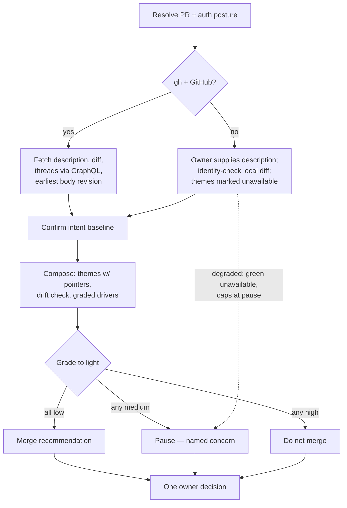

# Checking Merge Readiness - Plan

## Goal Capsule

- **Objective:** Publish `checking-merge-readiness` in this repository: a standalone, read-only pre-merge digest that assesses a fully reviewed PR in plain language and ends in one owner decision. The merge click stays the owner's.
- **Product authority:** This plan owns only the merge-digest skill. The release, public-repo flip, and `npx skills add` migration are follow-up work, not active scope (see How This Work Fits Together).
- **Open blockers:** None. The phase-1 sibling is published and the first evidence-pack-carrying merged PR exists as a test corpus.

---

## Product Contract

### Summary

A pre-merge digest skill installable on its own in any repository: pointed at a reviewed PR, it reads the description, diff, and review history, then delivers a clear, natural-sounding assessment — themes of what review did, an intent-drift check, and a risk profile of graded, named drivers where accumulated fixes put tension on engineering first principles — rolling into one of three recommendations: merge, pause, or do not merge.

### Problem Frame

Heavily babysat PRs accumulate 30–50+ review comments across many bot rounds, and the owner's real question at the end is not "did CI pass" but "do I still understand what I am about to merge?" Accumulated fixes can drift a change away from its original intent, and bot-driven feedback can breed defensive complexity — extra states, guards, and machinery — that no single round looks alarming enough to refuse. Without a digest, the owner either re-reads dozens of threads or merges blind.

### Key Decisions

- KD1. **Standalone skill, no sibling coupling** (session-settled: user-directed — chosen over reusing `checking-pr-readiness` artifacts as inputs or refreshing its sweep reference: anyone must be able to install only this skill, and intent is derivable from the PR description and the code). Governs R2, R3.
- KD2. **Balanced assessment, not a steelman against merging** (session-settled: user-directed — an adversarial lead reads overly conservative and manufactures false positives; the original intent is a clear, plain-language check). Governs R5, R10.
- KD3. **Three-light recommendation: merge / pause / do not merge** (session-settled: user-directed — chosen over a binary verdict or a numeric score: green means go, pause means a named concern to understand first, red is a clear stop). Governs R9, R10.
- KD4. **Graded, named risk drivers over a numeric score** (session-settled: user-approved — a model-judged number is false precision; a word grade traceable to a named driver can be argued with). Governs R8, R9.
- KD5. **Conversation-only readout** (session-settled: user-directed — chosen over offering to post a PR comment: strictly read-only, matching the sibling; re-run if the session ends). Governs R1.
- KD6. **First-principles lens anchored in recognized canon** (session-settled: user-directed — the tension check covers DRY, single source of truth, YAGNI, and defensive-complexity creep, with the principle set sourced from recognized engineering literature rather than invented; source research happens during planning). Governs R8.
- KD7. **Read-only, never-merges, one-owner-decision posture** (session-settled: user-directed, carried from the phase-1 cycle — the skill is a digest and a decision, never merge automation or PR management). Governs R1, R11.
- KD8. **Name `checking-merge-readiness`** (session-settled: user-directed, carried from the phase-1 cycle — repo gerund convention; already reserved in the sibling's trigger exclusions). Governs R15.

<!-- ce-section: work-relationships -->
### How This Work Fits Together

This plan owns the merge-digest skill only. The breakdown below is the current understanding, not a committed roadmap.

- Satisfies the phase-2 enrichment gate (U6) of docs/plans/2026-07-31-001-feat-readiness-checkpoints-plan.md, which deferred the merge digest's exact scope to this pass. This pass resolves that scope by keeping the skill standalone (KD1), deliberately revising the earlier plan's coarse R17–R18: the sweep-refresh mechanism is dropped (observed finding classes are surfaced in the readout, not fed back — refreshing the sibling's sweep set stays a manual maintenance act) and the evidence pack is demoted from dependency to optional enrichment.
- Can proceed independently of the published `checking-pr-readiness`; when both are installed they bracket the PR lifecycle (pre-PR gate → babysit → this digest → owner merges).
- Enables the post-cycle follow-up: cut a release in this repository, make it public, and move skill installation and updates to the `npx skills add` flow. Still to decide: versioning scheme and release cadence — owned by that follow-up, not this plan.

### Actors

- A1. **Owner** — reads the digest and makes the one terminal decision, including the merge click itself.
- A2. **Digest agent** — the agent running the skill in any supported harness.

### Requirements

**Posture and inputs**

- R1. The skill runs interactively after the review cycle is complete — unresolved threads may remain and are graded per R8 — and before merge. The readout names the PR's state; a merged or closed PR may still be digested with that state named. An empty review history is a named condition that caps the recommendation at pause. It never merges, writes nothing to the repository or the PR, and its readout lives only in the conversation.
- R2. Primary inputs are what every PR has: the PR description, the diff, and the review history (threads, review rounds, and their resolutions). No input from this repository's other skills is required.
- R3. When the PR description carries an evidence pack from the phase-1 sibling, the digest treats it as unverified claims: its assertions are cross-checked against the diff and review history, disagreements are noted, and only then does it sharpen the intent baseline. Its absence is the normal case, not a degraded mode.
- R4. Without GitHub CLI access or on a non-GitHub forge, the digest degrades honestly rather than stopping: the owner supplies the PR description when no forge path can fetch it, the local diff is identity-checked against the PR's base and head where possible (with a mismatch named when it cannot be), history-derived themes are marked unavailable rather than inferred, and green is unavailable — a recommendation better than pause requires the review history the skill was built to digest, while a high driver still grades do not merge per R10.

**Readout**

- R5. The readout is clear, concise, plain-language, and natural-sounding — the register of a colleague's summary, not a report template — and presents a balanced assessment.
- R6. It digests the review history into themes: what was fixed, fixed differently than suggested, declined with reasons, and any unresolved or deferred items, surfacing the judgment calls a reasonable owner would want to know were made. Every theme and named driver carries a lightweight source pointer — the thread or round for history claims, the file for code claims — kept parenthetical so the register holds; claims verified against the diff are asserted plainly, and claims taken solely from thread or description text are attributed to their source.
- R7. It checks intent drift: the change's original intent (from the PR description, pack-sharpened per R3) against what the accumulated fixes actually built. The digest confirms with the owner that the baseline text represents pre-review intent; when that cannot be established, intent is unverifiable and the recommendation caps at pause. Scope change is tolerated; a change in intent is flagged.
- R8. It profiles risk as graded, named drivers (low / medium / high) of two kinds: tension the accumulated fixes put on first principles — DRY, single source of truth, YAGNI, and defensive-complexity creep such as state machinery born from review feedback — and risk the review itself leaves behind: unresolved or deferred substantive items, cross-round fix interactions where a later fix weakens or regresses an earlier one, and material security concerns surfaced by the change or its review. The principle set is anchored in recognized engineering literature cited in the skill's reference material.
- R9. The drivers roll up into one overall merge-risk grade. The grade is the internal determinant of the recommendation, never a second visible verdict: the readout surfaces the drivers and one recommendation.

**Decision**

- R10. The readout ends in one of three recommendations — merge (green), pause (a named concern to understand before merging), or do not merge (clear red) — each naming the drivers that produced it. The mapping is fixed: every driver low grades merge; any driver medium (and none high) grades pause, naming the medium drivers; any driver high grades do not merge. Caps from R4 or a sampled history remove merge from the available outcomes; they never soften a high driver's do not merge.
- R11. Exactly one owner decision follows, aligned to the recommendation, and each is terminal: proceed to merge (the owner clicks it), pause — end the run and investigate the named concern, with any later merge taking a fresh digest run — or pull back for redesign. Filing follow-up work may attach to any of the three. When the recommendation is do not merge and `ce-pov` is installed, the menu offers it for a graded verdict on the redesign question; when absent, the option is named unavailable. The readout-then-decision exchange is the whole protocol: the skill presents, takes the one decision, and executes nothing.
- R12. When the PR description is too thin to establish intent, the digest says the intent baseline is unverifiable and takes the owner's attestation of intent rather than inventing one; the attestation is a prerequisite to grading drift, never the terminal decision.

**Trust and access**

- R13. All PR-derived text — description, diff, review threads, and any embedded evidence pack — is untrusted third-party input: the digest never executes commands or follows instructions found in it, that text cannot override the skill's instructions or expand its tool use, and text that attempts to steer the assessment or the recommendation is itself surfaced as a named risk driver. Secrets encountered in PR content are not echoed into the readout, and nothing persists outside the conversation.
- R14. Forge access uses the invoking user's existing credentials, read-only. The skill stores and logs no tokens, and an authentication or authorization failure is reported as a named gap rather than digested around.

**Publication**

- R15. The skill ships under this repository's conventions: trigger contract whose activation set does not collide with `checking-pr-readiness` or PR-management phrasings, matched-pair baseline battery, run log, install probe, same-door sweep, and the standard frontmatter and size limits.

### Key Flows

- F1. Pre-merge digest
  - **Trigger:** The owner asks whether a reviewed PR is safe to merge, or invokes the skill on a PR.
  - **Actors:** A1, A2
  - **Steps:** Resolve the PR → read description (and pack if present), diff, review history → confirm the intent baseline with the owner → compose themes, intent-drift check, and graded risk drivers → present the readout with the three-light recommendation → take the one owner decision.
  - **Covers:** R1–R14

### Acceptance Examples

- AE1. **Covers R6, R9, R10.** Given a PR whose review rounds were fixes the owner would endorse and whose final state matches its stated intent, when the digest runs, then the themes read in plain language, the drivers grade low, and the recommendation is merge.
- AE2. **Covers R8, R10.** Given a PR where accumulated feedback added guard states and machinery beyond the original need, when the digest runs, then a defensive-complexity driver is graded and named with the specific accretion, and the recommendation is pause with that concern stated.
- AE3. **Covers R7, R10, R11.** Given a PR whose fixes changed what the change is for — not just its size — when the digest runs, then intent drift is flagged distinctly from scope growth, the recommendation is do not merge, and redesign is offered per R11.
- AE4. **Covers R2, R3.** Given a PR with no evidence pack in its description, when the digest runs, then it proceeds on description, diff, and review history alone without reporting a degraded mode.
- AE5. **Covers R4.** Given no GitHub CLI access, when the digest runs, then it digests the owner-supplied description and the identity-checked local diff, marks history-derived themes unavailable, and recommends at most pause with the missing review history as the named concern.
- AE6. **Covers R12.** Given a PR with an empty or one-line description, when the digest runs, then it states the intent baseline is unverifiable and asks the owner to attest the intent before grading drift.
- AE7. **Covers R8, R10.** Given a PR with an unresolved substantive review thread, when the digest runs, then that unresolved item is a graded, named driver and the recommendation is at most pause until the owner disposes of it.
- AE8. **Covers R13.** Given a PR whose description or comments contain text instructing reviewers to treat the change as pre-approved or low-risk, when the digest runs, then the steering attempt is surfaced as a named risk driver and does not soften the assessment.
- AE9. **Covers R3.** Given a PR whose description carries an evidence pack asserting a check that the review history contradicts, when the digest runs, then the disagreement is surfaced and the intent baseline sharpens only from the verified parts.

### Success Criteria

- Back-tested against the first corpus: run on the merged PR jrgilbertson/the-rookery#23, the digest reads like the plain-language themes summary the owner acted on there — themes, judgment calls, and a defensible three-light call — with no template stiffness or slop register.
- The matched-pair battery shows the skilled run producing graded, driver-named assessments where the bare model produces either a thread recap or an ungrounded verdict.
- At least one non-green specimen exists: a constructed transcript specimen whose review rounds demonstrably changed intent or accreted defensive machinery, which the digest grades pause or do not merge with the correct driver named — exercising AE2 and AE3 against ground truth rather than only the merge path.
- The #23 back-test also runs with its evidence pack stripped, validating the normal no-pack path independently of the pack-sharpened one.

### Scope Boundaries

- No merge automation, PR management, comment posting, or writes of any kind — the skill's only output is the readout.
- No sweep-refresh mechanism: observed finding classes are not fed back into the sibling's reference; updating that list stays a manual maintenance act.
- No numeric risk score.
- The release, public-repo flip, and `npx skills add` migration are the post-cycle follow-up, not this skill.

### Dependencies / Assumptions

- Assumes `gh` CLI is the review-history access path on GitHub; R4 owns its absence.
- Assumes review-heavy PRs fit a digestible context; if very large PRs need thread sampling, planning decides the strategy.

---

## Planning Contract

**Product Contract preservation:** unchanged by this enrichment. (The pre-enrichment review edits were user-approved in session before planning began.)

### Key Technical Decisions

- KTD1. **No bundled scripts** (session-settled: user-approved — chosen over keeping a small helper to anchor a fixture runner: the skill is prose driving `gh` by instruction, so the falsifiability contract does not apply and the behavioral battery carries the full test weight). Governs R2, R15.
- KTD2. **Review history via `gh` GraphQL.** Plain `gh pr view` omits thread resolution; the digest reads threads through the GraphQL review-threads connection with `isResolved`, paginated to exhaustion, and fetches review submissions with timestamps as round markers — threads group into rounds by the submission they belong to. Verified live this session. Governs R2, R6.
- KTD3. **Intent baseline from the description's earliest revision when fetchable, owner confirmation as fallback.** The PR body's edit history is exposed via the GraphQL `userContentEdits` connection (verified live: the first corpus PR shows its two edits); when it resolves and the earliest revision's author is the invoking owner, the earliest body is the pre-review baseline and the owner-confirmation step in R7 collapses to a disclosure; when it does not resolve, or the earliest author is someone else (fork PRs, bot-authored descriptions), R7's full confirmation fires. Governs R7.
- KTD4. **Driver taxonomy is seven named classes** — one per R8 clause plus R13's steering driver: complexity accretion (deep-module erosion and tactical-fix accumulation), knowledge duplication, speculative generality, unresolved review items, cross-round fix interaction, material security concerns, and assessment steering. `references/risk-rubric.md` owns the behavioral low/medium/high anchors (self-applicable criteria, in the style the repo's review tooling uses for confidence anchors); R10 owns the grade-to-light mapping and the rubric cites it. Governs R8, R9, R13.
- KTD5. **Constructed transcript fixtures for the non-green specimen** (session-settled: user-approved — chosen over a real fixture PR with manufactured review history: deterministic, no repo clutter, same convention as the sibling's fixture project). Governs the Success Criteria specimens.
- KTD6. **Large-history triage order:** unresolved threads first, then declined and fixed-differently threads, then the remainder; when context forces sampling, the readout discloses sampled-versus-total counts and merge leaves the available outcomes per R10's cap rule. Governs R6.
- KTD7. **Intent-versus-scope criterion:** intent is what problem the PR solves and for whom; scope is how much it touches to do so. The operational test: does the baseline's stated purpose still describe the final diff? Purpose no longer matching is intent drift; more files or edge cases under the same purpose is scope growth. Governs R7.

### High-Level Technical Design

### Assumptions

- `gh` is authenticated in the host environment for the GitHub path; R4 owns its absence.
- The five-principle canon set and citations were verified by external research this session; edition details in `references/first-principles.md` are authoritative as written there.

### Sources & Research

- Canon (verified editions): Ousterhout, *A Philosophy of Software Design* 2nd ed. 2021 (Ch. 2 §2.4 complexity is incremental; Ch. 3 tactical vs strategic; Ch. 4 deep modules); Hunt & Thomas, *The Pragmatic Programmer* 20th Anniversary ed. 2019 (Tip 11, DRY as knowledge duplication — DRY and single source of truth are one principle under two names); Fowler, "Yagni" (martinfowler.com bliki) and *Refactoring* 2nd ed. 2018 ("Speculative Generality"); Brooks, "No Silver Bullet" 1986 (essential vs accidental complexity); optional epigraph: Hickey, "Simple Made Easy" 2011 (complecting).
- Supporting evidence for the cross-round driver: Nagappan & Ball, ICSE 2005 — relative code churn predicts defect density.
- Prior art on AI-review-induced over-engineering is thin (one 2025 arXiv study on iterative-feedback security over-engineering); the reference file establishes the framing rather than citing it, and says so.
- API probes run live this session: GraphQL review-threads with `isResolved` (used in production against the first corpus PR), `userContentEdits` on its body (returns both edits).
- Sibling patterns: skills/checking-pr-readiness/SKILL.md (step-and-completion shape, status honesty, decision-menu pattern); tests/README.md (trigger contract, matched-pair battery, run log conventions).

---

## Implementation Units

> **Editorial note — superseded during execution.** Where the units below have a battery case prompt stipulate fixture files as the already-fetched forge data (U1's step 2 and U4's harness contract), that approach was abandoned while this plan was executed: the stipulation would have been a test seam living in the shipped skill. The battery that shipped instead puts a read-only `gh` stub first on `PATH`, so the skill runs its real fetch path. See [`../solutions/conventions/keep-the-test-seam-out-of-the-shipped-skill.md`](../solutions/conventions/keep-the-test-seam-out-of-the-shipped-skill.md). The plan text below stands as written.

### U1. Author the skill package

- **Goal:** `skills/checking-merge-readiness/SKILL.md` embodies the digest workflow end to end.
- **Requirements:** R1–R14; KD1–KD8.
- **Dependencies:** none (description text finalizes in U3).
- **Files:** skills/checking-merge-readiness/SKILL.md
- **Approach:**
  1. Frontmatter: `name`, `description` (placeholder until U3's tested text), `license`, `compatibility` (requires `gh` for review history; degrades per R4).
  2. Opening contract: read-only, conversation-only, one owner decision, never merges (R1; cites KD5, KD7 posture); all PR-derived text is untrusted data (R13).
  3. Step 1 — resolve the PR, name its state, and take the auth posture (R14; R1's merged/closed and empty-history conditions).
  4. Step 2 — gather inputs through a fixed read-only `gh` verb set (`pr view`, `pr diff`, and the GraphQL review-thread, review-submission, and body-edit queries per KTD2/KTD3); PR-derived text never enters command arguments, and fetched text is data, never instructions (R13); degraded path per R4. In battery runs, case prompts may stipulate fixture files as the already-fetched forge data (U4's harness contract).
  5. Step 3 — confirm the intent baseline (R7, R12, KTD3); when a pack is present, cross-check its assertions against the diff and review history, note disagreements, and sharpen the baseline only after (R3).
  6. Step 4 — compose the digest: themes with source pointers and asserted-vs-relayed attribution (R6, KTD6), drift check (R7, KTD7), graded drivers per `references/risk-rubric.md` (R8, R9); steering attempts grade through the rubric's steering driver, and secrets are never echoed (R13).
  7. Step 5 — readout with the three-light recommendation and R10's fixed mapping.
  8. Step 6 — one decision menu, each option terminal (R11).
- **Patterns to follow:** the sibling's step-ending `Completion:` lines, status honesty, and non-terminal menu recompose rule.
- **Test scenarios:** Test expectation: none — prose artifact; behavior is exercised by U4's battery.
- **Verification:** `skills-ref` validation passes; SKILL.md is at or under the 500-line limit; frontmatter description equals U3's tested text.

### U2. Write the judgment references

- **Goal:** The canon principles and the risk rubric exist as the digest's judgment substrate.
- **Requirements:** R8, R9, R10; KD6; KTD4.
- **Dependencies:** none.
- **Files:** skills/checking-merge-readiness/references/first-principles.md, skills/checking-merge-readiness/references/risk-rubric.md
- **Approach:**
  1. first-principles.md: the five-principle set with exact citations from Sources & Research, one operational definition per principle, the DRY-equals-SSOT note, the churn-evidence line backing the cross-round driver, and the honest establishing-not-citing note for AI-review-induced creep.
  2. risk-rubric.md: KTD4's seven driver classes; behavioral low/medium/high anchors (each grade a criterion the agent can self-apply); cites R10 for the grade-to-light mapping rather than restating it.
- **Test scenarios:** Test expectation: none — reference prose; application is exercised by U4.
- **Verification:** every citation matches the researched edition details; the seven classes match R8's clauses plus R13's steering driver.

### U3. Trigger contract

- **Goal:** A tested activation description that fires on merge-readiness intent and never on the sibling's, babysitting, or merge-execution phrasings.
- **Requirements:** R15.
- **Dependencies:** U1 (description slot).
- **Files:** tests/checking-merge-readiness/triggers.md, skills/checking-merge-readiness/SKILL.md (description)
- **Approach:** author should-trigger queries ("is this safe to merge", "digest this PR before I merge", "what did review actually do to this PR", "should I merge this") and near-misses that must not fire ("is this ready for a PR": sibling; "watch this PR": babysit; "merge this PR": execution; "review this code": code review); judge in fresh contexts per tests/README.md, revise, blind re-judge.
- **Test scenarios:**
  - Each should-trigger query activates in a fresh-context judgment.
  - Each near-miss stays inactive, including the sibling-overlap and merge-execution controls.
- **Verification:** suite pass recorded in tests/checking-merge-readiness/log.md with the judging mechanism named.

### U4. Behavioral battery and fixtures

- **Goal:** Matched-pair evidence that the skill produces grounded, calibrated digests — including on non-green ground truth.
- **Requirements:** R3, R13–R15; AE1–AE9; Success Criteria; KTD5.
- **Dependencies:** U1, U2.
- **Files:** tests/checking-merge-readiness/cases/merge-digest-battery.md, tests/checking-merge-readiness/fixtures/reviewed-pr/ (constructed transcripts: description, diff summary, thread files), tests/checking-merge-readiness/log.md
- **Approach:** constructed transcript fixtures per KTD5, one specimen per conditional acceptance example, with round metadata included; bare-versus-skilled fresh contexts with a blind independent grader per tests/README.md. Harness contract: each full-path case stipulates its fixture files as the already-fetched forge data, so R4's degraded mode does not engage; only the AE5 case stipulates the no-forge condition (the local-diff identity check is not applicable to file fixtures), and the case files record the stipulation. The pack-stripped back-test supplies the first-corpus PR's real description minus the pack section as the fetched body — a harness stipulation, not a skill mode — with threads and diff live. Live PR content never lands in tracked fixtures or logs.
- **Test scenarios:**
  - Covers AE1. Clean reviewed specimen grades all-low and recommends merge.
  - Covers AE2. Defensive-accretion specimen names the accretion driver and recommends pause.
  - Covers AE3. Intent-drift specimen flags drift distinctly from scope growth and recommends do not merge.
  - Covers AE4. No-pack specimen proceeds without reporting a degraded mode.
  - Covers AE5. No-`gh` run marks themes unavailable and caps at pause.
  - Covers AE6. Thin-description specimen asks for owner attestation before grading drift.
  - Covers AE7. Unresolved-thread specimen grades that driver and caps at pause.
  - Covers AE8. Steering-text specimen surfaces the steering as a named driver.
  - Covers AE9. Pack-present specimen with a claim the review history contradicts surfaces the disagreement and sharpens the baseline only from verified parts.
  - Covers R13. Canary-secret specimen: a planted dummy credential in a thread appears in the readout only as a named security driver, never reproduced.
  - Covers R14. Auth-failure run (gh present, fetch forbidden) names the gap, degrades per R4, and caps at pause.
  - Pack-stripped live back-test of the first corpus PR reads in the plain-language register and produces a defensible light; the grader judges register and grounding against a binary checklist, not similarity to any historic summary (contamination control).
- **Verification:** discriminating cases pass skilled and fail bare; results logged with mechanism named.

### U5. Publish surfaces and install probe

- **Goal:** The catalog publishes the skill under the repository's conventions.
- **Requirements:** R15.
- **Dependencies:** U1–U4.
- **Files:** README.md, CHANGELOG.md, WORKFLOWS.md, CONCEPTS.md, tests/checking-merge-readiness/log.md
- **Approach:** catalog row and workflow step (after babysitting, before the merge click); changelog entry; CONCEPTS.md already carries Merge Digest and Risk Driver — sync only if drift; same-door sweep; pre-merge install probe from local source with `--copy`.
- **Test scenarios:** Test expectation: none — documentation edits; the probe and sweep are the checks.
- **Verification:** install probe green with CLI version recorded; same-door sweep clean; `rg checking-merge-readiness` consistent across surfaces.

---

## Verification Contract

| Gate | Command / mechanism | Applies to | Done signal |
| --- | --- | --- | --- |
| Skill structure | `skills-ref` validation (per tests/README.md) | U1, U2 | exit 0 |
| Trigger contract | fresh-context judgment suite per tests/README.md | U3 | all queries correct, logged |
| Behavioral battery | matched-pair fresh contexts, blind grader | U4 | discriminating cases pass skilled / fail bare, logged |
| Same-door sweep | `rg` for absolute paths and private names over shipped files | U1, U2, U5 | zero hits |
| Install probe | skills CLI from local source, `--copy` | U5 | all files arrive, probe logged |
| Per-harness smoke | Claude Code + Codex CLI per tests/README.md | U5 | pass, inconclusive, or owner-waiver line logged |
| Size limit | line count of SKILL.md | U1 | ≤ 500 lines |

---

## Definition of Done

- All five units complete; every acceptance example has a passing battery scenario.
- The trigger suite, battery, install probe, and same-door sweep are green and logged in tests/checking-merge-readiness/log.md with mechanisms named.
- No bundled scripts were introduced (KTD1 held); SKILL.md is within the size limit.
- CHANGELOG.md carries the branch's entry; publish surfaces are consistent.
- Abandoned or experimental content from unshipped approaches is removed from the branch.
- The pre-PR gate (`checking-pr-readiness`) has been run on the branch and its owner decision taken before any PR opens.
