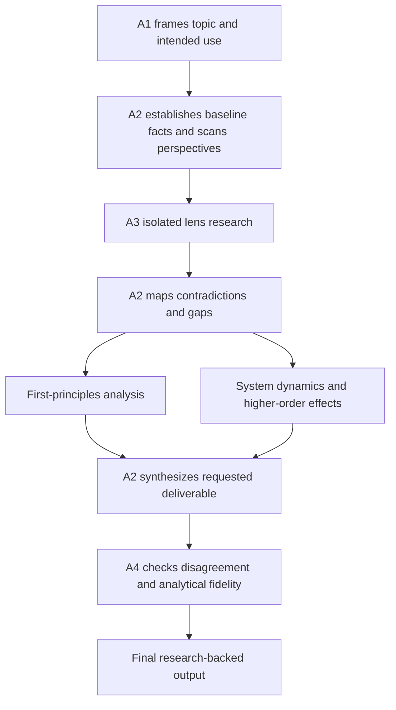
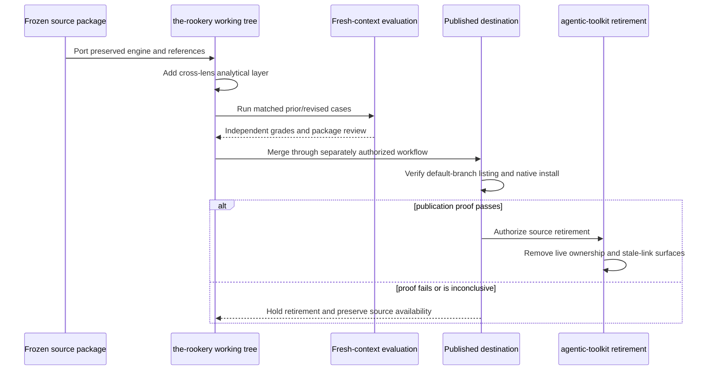

# Storm Research Migration and Analytical Depth - Plan

## Goal Capsule

- **Objective:** Publish `storm-research` from the-rookery with explicit first-principles and systems-thinking analysis while preserving the research workflow users already value, then retire its live source from agentic-toolkit.
- **Product authority:** This Product Contract owns the skill's user-facing research behavior, its boundary with `ce-pov`, and the coordinated migration scope across the-rookery and agentic-toolkit. Planning owns package structure, test design, and cross-repository delivery sequence.
- **Execution profile:** Code and instruction work across two public repositories, delivered destination-first with behavioral evaluation, local install proof, a published-state gate, and source retirement last.
- **Stop conditions:** Do not retire agentic-toolkit while the destination is unpublished, its remote catalog or native install probe fails, loaded-copy provenance is inconclusive, or a same-name copy remains in the test harness. Hold rather than create a no-installable-copy window.
- **Tail ownership:** The agentic-toolkit retirement unit owns the final canonical-owner and stale-link checks after the-rookery publication is independently verified.
- **Open blockers:** None for implementation. Merging or changing user-level skill installations remains a separately authorized operation; without that authority, stop at the corresponding publication or installed-state gate.

---

## Product Contract

> **Product supersession (post-plan):** Mandatory standalone `First-principles analysis` and `System dynamics and higher-order effects` **headings** are superseded (R5, R9, and R14’s render-both-sections visibility). **Keep** R6–R8 and R10–R13 as integrated research-depth and traceability obligations (facts vs assumptions, mechanisms, boundaries, causal chains, honest nulls when a null changes the answer)—owned by analysis-methods and fidelity, not report section titles. Full briefings are Overview-led and reader-facing: action and material limits live in the Overview; later sections support that lead; no execution telemetry in normal output. Destination-first publication and source retirement (R18–R21, U5–U6) still govern delivery. Live behavior is owned by `skills/storm-research/` and `references/briefing-template.md`. Body text below that still requires named analytical sections is historical archive, not current product authority.

### Summary

Port the existing package and its five-lens engine into the-rookery, add the two analyses as an explicit cross-lens synthesis layer, and replace phrase-pinned source tests with matched behavioral evidence. Publish and verify the destination before retiring agentic-toolkit's live package and routing surfaces.

### Problem Frame

The existing skill already produces useful research through baseline grounding, five independent perspectives, contradiction mapping, reliability auditing, and a fidelity check over raw lens returns. The user has no recent failure case that justifies replacing this architecture and specifically values the different angles it produces.

Its outcome focus is a specialization rather than a demonstrated defect. Official public descriptions of Anthropic and OpenAI deep research emphasize adaptive investigation, user-defined outcomes, source control, and cited reports, while Stanford STORM centers perspective-guided question asking, knowledge curation, and pre-writing. The current skill combines those research mechanics with more explicit decision support. That remains valid as long as the requested deliverable controls the final shape rather than every topic being forced into a verdict.

The missing contract is analytical visibility. Existing practitioner, academic, skeptic, economist, and historian perspectives may imply assumptions, causal mechanisms, feedback loops, or downstream effects, but no stage owns making those relationships explicit. A polished synthesis can therefore omit the first-principles and systems-level reasoning the user wants to inspect.

The source also needs one canonical public home. Moving the package to the-rookery must include its behavior-preserving evidence and must retire agentic-toolkit's live package, tests, installation ownership, and current discovery documentation without rewriting historical records.

### Actors

- A1. **Research user:** Supplies the topic, intended use, desired deliverable, and material constraints.
- A2. **Research orchestrator:** Frames the target, performs bounded orientation, dispatches isolated lens research, and curates the final briefing.
- A3. **Lens executor:** Investigates one canonical or source-discovered perspective without seeing sibling lens work.
- A4. **Fidelity reviewer:** Compares raw lens returns with the briefing, checks derived analytical claims for evidence traceability or explicit inference labeling, and reports lost or invented disagreements without judging the conclusion.

### Key Decisions

- **Surgical analytical extension.** Preserve the existing engine instead of adding modes or adopting an adaptive deep-research architecture. (session-settled: user-directed — chosen over dual research modes and an adaptive engine rewrite: the current skill already works well.) Governs R1-R4, R16.
- **Visible analysis in every full briefing.** Make both analytical passes inspectable rather than conditional or opt-in. (session-settled: user-directed — chosen over material-only and request-only visibility: the user wants the reasoning included in results.) Governs R5, R9, R13-R15.
- **Cross-lens synthesis, not new personas.** First-principles and systems thinking analyze the combined evidence after independent research; they do not become additional perspective executors. Governs R5-R12.
- **Requested purpose controls the ending.** Preserve decision support and long-form research under one workflow instead of introducing an explicit mode selector. (session-settled: user-directed — chosen over separate exploration and decision modes: no observed failure justifies the extra branch.) Governs R3, R4, R16, R17.
- **Retire live ownership, preserve history.** Remove agentic-toolkit's active package and routing surfaces while leaving point-in-time plans and audits intact. (session-settled: user-approved — chosen over rewriting historical records: history remains evidence of the earlier canonical state.) Governs R18-R21.

### Requirements

**Research identity and preserved behavior**

- R1. The migrated skill must preserve baseline fact grounding, the five canonical lenses, source-discovered additional lenses, and one isolated executor per lens unless the user narrows the task.
- R2. The migrated skill must preserve contradiction mapping, source and bias auditing, honest confidence, frontier questions, and the binding fidelity check over raw lens returns and derived analytical claims under R8 and R12.
- R3. The skill must continue supporting business decisions, investments, negotiations, learning, and long-form writing as well as broad topic research.
- R4. The user's intended use and requested deliverable must determine whether the ending is a recommendation, briefing, outline, preparation notes, or another research-backed form. A run is a full briefing by default whenever the user does not constrain its length or form; requesting a recommendation or verdict does not by itself make the run short or custom.

**First-principles analysis**

- R5. Every full briefing must contain a distinct `First-principles analysis` section derived from the grounded research record.
- R6. The analysis must separate verified facts, assumptions, and irreducible constraints before drawing conclusions.
- R7. The analysis must identify the causal mechanism and the conditions that would have to be true for its main claim to hold.
- R8. Each assumption or mechanism that materially shapes the synthesis must be traceable to evidence or labeled as inference with calibrated confidence.

**Systems thinking and higher-order effects**

- R9. Every full briefing must contain a distinct `System dynamics and higher-order effects` section derived from the grounded research record.
- R10. The analysis must define a useful system boundary and identify the material actors, relationships, incentives, resources, and constraints inside it.
- R11. The analysis must identify reinforcing or balancing feedback, delays, nonlinearities, path dependence, and emergent behavior when the evidence makes them material.
- R12. Direct, second-order, and higher-order effects must be presented as causal chains whose evidence and confidence remain visible at each uncertain link.
- R13. When the research supports no material feedback loop or higher-order effect, the section must say so and name the boundary or evidence that limits the claim.

**Output adaptation and product boundary**

- R14. A full briefing must render both analytical sections even when one reports that no material effect was found. A degraded full briefing must retain both sections, name any lost isolation or source coverage that limits their claims, and lower confidence accordingly.
- R15. A short or custom deliverable may compress the sections but must preserve any conclusion or uncertainty that changes the answer, confidence, or next action.
- R16. Decision-support outputs may retain a bottom line and actionable implication when the user's requested purpose calls for them.
- R17. `storm-research` must own deep, source-backed, multi-perspective investigation, while `ce-pov` remains the compact project-grounded verdict workflow for a bounded adoption, document, or supplied-approach question.

**Canonical ownership and retirement**

- R18. The complete, self-contained skill package and its behavior-preserving evidence must become part of the-rookery's published catalog.
- R19. Agentic-toolkit must no longer publish, install, test, or actively route users to its former `storm-research` package after the migration lands.
- R20. Historical plans, brainstorms, audits, and other point-in-time records in agentic-toolkit must remain unchanged unless they incorrectly act as current routing documentation.
- R21. The final installed state must not expose competing canonical copies or stale links from agentic-toolkit.

### High-Level Research Flow



### Key Flows

- F1. **Full research briefing**
  - **Trigger:** A1 asks for deep, STORM-style, or multi-perspective research without constraining the deliverable's length or form.
  - **Actors:** A1, A2, A3, A4.
  - **Steps:** A2 frames the topic and performs orientation; A3 executors research independently; A2 maps contradictions, runs both analytical passes, and synthesizes the requested output; A4 checks the briefing against raw returns and verifies derived analytical claims under R8 and R12; A2 resolves every fidelity finding before delivery.
  - **Outcome:** A1 receives the existing full briefing plus the two visible analytical sections.
  - **Covered by:** R1-R14, R16.

- F2. **Short or custom research deliverable**
  - **Trigger:** A1 requests a concise answer, outline, preparation notes, or another constrained output.
  - **Actors:** A1, A2, A3, A4.
  - **Steps:** The full research workflow runs at the depth warranted by the request, including both analytical passes; A2 compresses the final form while retaining material analytical findings and uncertainty; A4 applies the fidelity contract.
  - **Outcome:** A1 receives the requested form without process transcript or loss of decision-relevant analysis.
  - **Covered by:** R1-R4, R8, R12, R15-R17.

- F3. **Degraded research run**
  - **Trigger:** The harness cannot provide isolated executor contexts or required source access, a required lens fails, or an independent fidelity review cannot run.
  - **Actors:** A1, A2, A3, A4.
  - **Steps:** A2 uses the best available substitute, names the lost verification or source coverage, labels the result according to the existing degradation contract, and lowers confidence. When the result is a full briefing, A2 retains both analytical sections and identifies how the degraded evidence limits each one. A4 checks the returns that remain available when an independent reviewer can run; otherwise A2 states that the fidelity check did not run.
  - **Outcome:** A1 can distinguish a fully grounded, independently generated briefing from a degraded simulation.
  - **Covered by:** R1, R2, R5, R8, R9, R12-R14.

### Acceptance Examples

- AE1. **Covers F1 / R5-R14.** Given a full briefing about a business decision, when the lenses return grounded but conflicting findings, then the report exposes the base assumptions and causal mechanisms, maps material feedback and higher-order effects, preserves the disagreement, and may still end with an actionable implication.
- AE2. **Covers F1 / R3-R5, R9, R16.** Given a broad historical or scientific research question with no requested decision, when the full workflow completes, then the report answers the topic comprehensively and includes both analytical sections without forcing an adoption verdict.
- AE3. **Covers F1 / R13, R14.** Given a topic whose evidence supports no material feedback loop beyond the stated boundary, when the systems analysis is written, then it says no material loop was found and identifies the limiting evidence instead of inventing one.
- AE4. **Covers F1 / R8, R12.** Given a claimed third-order consequence with one unsupported intermediate step, when the briefing is synthesized, then the chain labels that step as inference and lowers confidence rather than presenting the final consequence as established fact.
- AE5. **Covers F2 / R15.** Given a user asks for a one-page preparation brief, when either analytical pass changes the main answer or uncertainty, then the compressed output retains that finding even if it omits the full section headings.
- AE6. **Covers R17.** Given an unforced request for a decisive project-grounded verdict on a named adoption candidate without a deep-research intent, when skill routing is judged, then `ce-pov` remains the expected owner rather than `storm-research`.
- AE7. **Covers F3 / R1, R2.** Given a harness without isolated executor contexts, when the skill returns a briefing, then it identifies the single-context substitute and downgrades confidence under the existing contract.
- AE8. **Covers R18-R21.** Given the migration has landed in both repositories, when a user installs from the published catalogs, then the-rookery is the only canonical source and no agentic-toolkit link or live documentation advertises the retired copy.
- AE9. **Covers F1 / R5-R12.** Given a prior briefing where a material assumption, causal mechanism, feedback loop, or downstream effect was only implicit in the lens returns, when the revised workflow handles the same evidence, then the matched comparison records the relationship as newly explicit; merely restating content already explicit in the prior briefing does not satisfy the example.
- AE10. **Covers F1 / R8, R12.** Given analytical sections that use fluent first-principles or systems-thinking language without tying material claims to specific evidence or labeling them as inference, when the briefing is graded, then it fails traceability rather than passing because the required headings are present.

### Success Criteria

- Matched prior-versus-revised behavioral cases show the two new analyses on full briefings without regression in lens isolation, grounding, contradiction fidelity, requested-output adaptation, or decision support.
- Behavioral cases distinguish evidence-backed causal analysis from first-principles or systems-thinking boilerplate, including the honest no-material-effect path.
- Trigger evidence continues to activate storm-research for deep and multi-perspective investigation while leaving bounded project-verdict near misses to `ce-pov`.
- The destination package passes canonical Agent Skills validation and local-source install probes on the declared Claude Code and Codex roster, with published-state probes recorded after merge.
- A live-reference sweep in agentic-toolkit finds no active package, contract test, catalog entry, installer ownership, or current routing documentation outside an explicit historical allowlist.
- The public catalog, changelog, workflow documentation, and shared vocabulary describe the migrated behavior consistently.

### Scope Boundaries

#### Deferred for later

- Explicit exploratory-research and decision-support modes, unless future behavioral evidence demonstrates that requested-output adaptation is insufficient.
- Replacing the canonical lens set with query-derived research branches or iterative lead-agent replanning.
- Mandatory diagrams, quantitative simulations, or formal stock-and-flow models in the final report.

#### Outside this product's identity

- Turning `storm-research` into a routine lookup tool or a generic wrapper around a vendor's deep-research product.
- Removing its ability to support decisions or forbidding research-backed recommendations when the user asks for them.
- Replacing `ce-pov` or changing `ce-pov`'s project-grounded verdict contract.
- Weakening lens isolation, source grounding, contradiction fidelity, or explicit degradation to reduce cost or complexity.
- Rewriting historical agentic-toolkit plans and audits solely to erase the former skill name.

### Dependencies and Assumptions

- The current skill is a strong baseline. This is grounded in the user's experience and the absence of a recent counterexample, not a claim that every current output is optimal.
- The external comparison is limited to public product documentation, engineering guidance, and open-source research artifacts; proprietary production prompts were not available.
- The implementation will span the-rookery and agentic-toolkit, which have separate version-control and publication lifecycles.
- Independent grading and final package review require fresh contexts that did not author the revised skill or its evidence.

### Sources and Research

**Current repository evidence**

- **agentic-toolkit:** `skills/storm-research/SKILL.md`, `skills/storm-research/references/lens-charter.md`, `skills/storm-research/references/fidelity-check.md`, `scripts/test-storm-research-contract.sh`, `AGENTS.md`, `README.md`, `skills/README.md`, and `docs/claude-code-setup.md` define the current package and live retirement surface.
- **the-rookery:** `skills/creating-portable-skills/SKILL.md`, `tests/README.md`, `README.md`, `CHANGELOG.md`, `WORKFLOWS.md`, and the skill-testing solutions under `docs/solutions/` define the destination's package, evidence, publication, and install conventions.
- **Compound Engineering:** The supplied `ce-pov` 3.21.0 contract establishes the adjacent compact, project-grounded verdict workflow used for R17's boundary.

**External comparison**

- [Anthropic: How we built our multi-agent research system](https://www.anthropic.com/engineering/multi-agent-research-system) — adaptive breadth-first research, orchestrator-worker decomposition, source quality, citation handling, effort scaling, and end-state evaluation.
- [OpenAI: Deep research in ChatGPT](https://help.openai.com/en/articles/10500283-deep-research-faq) — user-defined outcomes, editable research plans, source controls, progress visibility, and cited reusable reports.
- [OpenAI API: Deep research](https://developers.openai.com/api/docs/guides/deep-research) — clarification, prompt expansion, multi-source analysis, tool budgets, and comprehensive cited output.
- [Stanford OVAL: STORM](https://github.com/stanford-oval/storm) — perspective-guided question asking, knowledge curation, outline generation, and citation-backed long-form reports.
- [Google: Deep Research Max](https://blog.google/innovation-and-ai/models-and-research/gemini-models/next-generation-gemini-deep-research/) — iterative reasoning, search, refinement, custom-source access, and visual analytical output.

---

## Planning Contract

### Product Contract Preservation

The reviewed Product Contract remains canonical and unchanged in scope during planning. Planning clarified the already-required short-output, degraded-run, and fidelity mechanics without renumbering or weakening any R-, A-, F-, or AE-ID.

### Key Technical Decisions

- KTD1. **Port from a frozen source baseline.** Use `agentic-toolkit@02594f4` as the prior package and evaluation baseline. Preserve the five canonical lenses, optional source-discovered lenses, the orchestrator boundary, raw returns, per-executor budget, loud degradation, and the four-part lens seed before adding analytical behavior. This makes preservation claims falsifiable against a fixed source rather than against memory. Governs R1-R4 and R14-R18.
- KTD2. **Keep the mandatory workflow in the core skill and disclose analytical detail progressively.** The core workflow owns ordering, required output visibility, compression, and degradation. A directly linked `analysis-methods.md` reference owns the operational first-principles and system-dynamics procedures, while the existing lens charter remains focused on isolated research. Both analytical passes run internally for every routed research task; only their rendering may compress. (session-settled: user-approved — chosen over running the analyses only for full briefings: compression cannot preserve a material finding that was never derived.) Governs R5-R15.
- KTD3. **Treat clean context as part of lens correctness.** Each lens receives the same self-contained research target, permitted resources, and sourced baseline, but no sibling work or inherited conversation that can contain it. Queued dispatches must prove later executors did not inherit earlier returns. A leak, an unexpectedly missing required lens after user narrowing, unavailable required source access, or unavailable clean-context mechanism makes the run degraded and must appear in an execution manifest supplied to fidelity review. Governs R1, R2, and R14.
- KTD4. **Expand one independent fidelity pass without making it a conclusion judge.** Supply the final briefing, sourced baseline, source audit, raw lens returns, and execution/degradation manifest while withholding synthesis reasoning. The reviewer answers two narrow questions: whether curation lost or invented disagreement, and whether material analytical claims are traceable or explicitly labeled inference with calibrated confidence. Every accepted finding changes the briefing, and the revised briefing is checked again until clean or explicitly delivered with reduced verification. (session-settled: user-approved — chosen over adding a second reviewer: one independent pass can audit both forms of curation fidelity without expanding into conclusion review.) Governs R2, R8, and R12.
- KTD5. **Replace the source phrase-pin script with destination-native evidence.** Canonical Agent Skills validation owns structure. Fresh-context trigger judgments and matched prior-versus-revised cases own activation and behavior. Independent graders inspect artifacts and traces, and a different independent context performs the final package review. Literal wording assertions and a destination copy of the source shell script are deliberately retired. (session-settled: user-approved — chosen over preserving a phrase-pinned shell test: behavioral outcomes are the portable contract.) Governs R1-R17.
- KTD6. **Use a positive trigger description and executable near misses.** The description states deep, source-backed, multi-perspective intent without negative routing prose. The trigger suite carries the `ce-pov`, `ce-doc-review`, dataset-audit, recommendation-compression, and routine-lookup boundaries, including the rule that an adoption question explicitly asking for deep multi-perspective evidence still belongs to `storm-research`. Governs R17.
- KTD7. **Publish destination-first and accept bounded catalog overlap.** Local-source proof precedes destination merge; remote default-branch discovery and native published-source smokes must pass before source retirement begins. Do not use remote branch or SHA suffixes as pre-merge evidence. (session-settled: user-approved — chosen over an atomic-looking cutover or source-first deletion: separate repositories cannot merge atomically, and a brief overlap is safer than no installable copy.) Governs R18-R21.
- KTD8. **Retire canonical live surfaces and preserve point-in-time records.** Delete the source package and its dedicated contract test, repair current catalogs, install guidance, delegation guidance, and count-anchored tests, and leave plans, brainstorms, audits, and solutions unchanged. Do not manually edit `claude-code-settings-backup/CLAUDE.md`; it is a passive generated mirror and remains an explicit exclusion from the live-reference claim unless its canonical generator is separately refreshed. (session-settled: user-approved — chosen over manually rewriting the generated backup: canonical sources, not generated mirrors, own the retirement.) Governs R19-R21.

### High-Level Technical Design



Within a research run, the preserved orientation and isolated lens stages produce a grounded record. Contradiction mapping feeds both analytical passes; the requested deliverable is synthesized from all three. The independent fidelity pass consumes artifacts, not the orchestrator's private reasoning, and gates the final revision.

### Output Structure

```text
the-rookery
├── skills/storm-research/
│   ├── SKILL.md
│   └── references/
│       ├── analysis-methods.md
│       ├── fidelity-check.md
│       └── lens-charter.md
└── tests/storm-research/
    ├── triggers.md
    ├── cases/
    │   ├── analytical-depth-and-traceability.md
    │   ├── honest-no-material-effect.md
    │   ├── lens-isolation-and-fidelity.md
    │   ├── output-purpose-and-compression.md
    │   └── degraded-research.md
    └── log.md

agentic-toolkit
├── skills/storm-research/                  # removed
├── scripts/test-storm-research-contract.sh # removed
└── current catalogs, guidance, and count-anchored contracts # repaired
```

### Implementation Constraints

- Keep `skills/storm-research/SKILL.md` below the repository's 500-line hard cap and link every reference directly from it; references do not link to deeper references.
- Preserve the lens charter's exact isolation boundary. First-principles and system-dynamics analysis are orchestrator synthesis, never new lenses and never inputs to lens executors.
- Define a material analytical finding as one capable of changing the answer, confidence, or next action. Tie every material assumption, mechanism, or causal-chain link to evidence or mark it as inference.
- Store user research outputs, test artifacts, transcripts, and inspection material outside both public repositories. Tracked test files contain cases, checks, compact evidence summaries, and log entries only.
- Record provenance, outcome evidence, and coverage separately. A clean install or skill listing does not count as behavioral evidence, and a behavioral result from an unproven copy is discarded.
- Do not alter installer logic in agentic-toolkit unless the existing deletion and dry-run tests reveal a migration-specific defect. The current installer already owns stale same-repository link pruning.
- Do not merge, open a pull request, publish externally, or mutate user-level skill installations without the authority required for that operation.

### Sequencing and Gates

1. Freeze source behavior and define the behavioral cases before revising the skill.
2. Port the preserved package, then add the analytical layer and expanded fidelity contract.
3. Complete structural, trigger, matched behavioral, and local native-install evidence in the-rookery.
4. Merge and publish the destination only through a separately authorized workflow.
5. Verify the published default branch and native loaded-copy identity. A failure or inconclusive result stops the plan before source retirement.
6. Retire agentic-toolkit's live package and routing surfaces, then verify its cleanup behavior and the final canonical-owner state.

---

## Implementation Units

### U1. Freeze the source baseline and define behavioral evidence

- **Target repo:** the-rookery, with read-only evidence from agentic-toolkit.
- **Goal:** Turn the current source behavior and accepted analytical changes into discriminating, repository-native cases before implementation changes the subject under test.
- **Requirements:** R1-R17; AE1-AE7, AE9, AE10; KTD1, KTD5, KTD6.
- **Dependencies:** None.
- **Files:** Create `tests/storm-research/triggers.md`, the five planned files under `tests/storm-research/cases/`, and `tests/storm-research/log.md`.
- **Approach:**
  - Pin the prior cell to `agentic-toolkit@02594f4` and record its package identity before every run.
  - Translate the source script's 49 passing assertions by disposition: package structure moves to Agent Skills validation; isolation, ordering, per-executor budget, degradation, and binding fidelity move to behavioral cases and trace inspection; literal phrases and obsolete negative-word assertions are dropped with rationale.
  - Write matched prompts and binary checks before revised runs. Include one stable preservation control and cases that can fail on generic analytical boilerplate.
  - Put `storm-research` positives and adjacent-workflow near misses in the trigger suite. The trigger record must distinguish explicit deep-research intent from a bounded project-grounded verdict.
  - Keep prior and revised artifacts in a per-run temporary directory outside the repository; record only bounded evidence and result lines in `log.md`.
- **Test Scenarios:**
  - A conflicting business-decision briefing that exposes assumptions, mechanisms, feedback, and downstream effects without losing dissent.
  - A broad historical or scientific question that receives a research briefing rather than a forced verdict.
  - A no-material-feedback topic, an unsupported intermediate causal link, and fluent but ungrounded analytical boilerplate.
  - A concise preparation brief where a material analytical finding must survive compression.
  - A later queued lens that must not see an earlier return, plus no-source, no-clean-context, partial-lens, and no-fidelity-review degradation variants.
- **Verification:** Independent review confirms each case has a discriminating prompt, observable binary checks, a stable control where applicable, and a claim ceiling no broader than the tested scenarios.

### U2. Port the preserved research engine into the-rookery

- **Target repo:** the-rookery.
- **Goal:** Establish a self-contained destination package that preserves the source skill before analytical extension.
- **Requirements:** R1-R4, R14, R16-R18; AE2, AE7; KTD1, KTD3, KTD6.
- **Dependencies:** U1.
- **Files:** Create `skills/storm-research/SKILL.md`, `skills/storm-research/references/lens-charter.md`, and `skills/storm-research/references/fidelity-check.md` from the frozen source.
- **Approach:**
  - Preserve baseline grounding, perspective discovery, five canonical lenses, optional additional lenses, raw-return retention, contradiction mapping, source audit, frontier question, confidence, and requested-output adaptation.
  - Preserve the four-part lens seed: charter, framed topic, that executor's lens, and sourced baseline. Enrich the framed topic before dispatch with intended use, scope, constraints, and permitted resource identifiers, then give the same framing to every lens.
  - Require genuinely clean executor contexts. A custom seed does not prove isolation if the harness inherits prior turns; queued dispatches must start without sibling work.
  - Replace frontmatter routing exclusions with a positive activation description. Leave near misses to the trigger suite.
  - Retain loud single-context and no-source degradation, and add partial-lens state to the execution manifest without adding durable checkpoint/resume machinery.
- **Test Scenarios:** The preservation control produces the canonical lenses, isolated raw returns, contradiction map, requested ending, and explicit degradation. A seeded sibling finding or inherited sibling return causes a clean restart or degraded result rather than a normal briefing.
- **Verification:** `npx skills-ref validate skills/storm-research` passes, direct references resolve, the core file stays below 500 lines, and U1 preservation checks pass against the destination package.

### U3. Add explicit analytical synthesis and extended fidelity

- **Target repo:** the-rookery.
- **Goal:** Make first-principles and system-dynamics reasoning explicit, evidence-tethered, and inspectable without changing the independent lens engine.
- **Requirements:** R2, R5-R16; AE1-AE5, AE9, AE10; KTD2-KTD4.
- **Dependencies:** U2.
- **Files:** Modify `skills/storm-research/SKILL.md` and `skills/storm-research/references/fidelity-check.md`; create `skills/storm-research/references/analysis-methods.md`.
- **Approach:**
  - Insert both analytical passes after contradiction mapping and before requested-form synthesis. They consume the sourced baseline, raw returns, contradiction map, and source audit; they never feed lens executors.
  - First-principles analysis separates verified facts, assumptions, and irreducible constraints, then names the mechanism and conditions required for the main claim.
  - System dynamics defines the boundary and time horizon, maps material actors, relationships, incentives, resources, and constraints, and follows direct and higher-order causal links. It names material feedback, delays, nonlinearities, path dependence, and emergence only when supported, otherwise it reports the limiting evidence.
  - Full briefings render both named sections. Short or custom outputs run both passes but compress their presentation while retaining anything that changes the answer, confidence, or next action.
  - Expand the fidelity reference to the two narrow checks in KTD4. Preserve its lost/invented-disagreement contract and prohibition on judging conclusion quality.
  - After a binding correction, rerun fidelity on the revised briefing. If an independent reviewer cannot run, disclose that fact and reduce confidence.
- **Test Scenarios:** U1 analytical cases distinguish newly explicit relationships from restatement, reject unsupported causal-chain links, accept an honest no-material-effect section, preserve a research-only ending, and preserve decision support when requested.
- **Verification:** All affected matched cases pass in independent fresh contexts, with every material derived claim traceable or labeled inference and no regression in the preservation control.

### U4. Complete trigger, behavioral, and native harness evidence

- **Target repo:** the-rookery.
- **Goal:** Prove the revised package activates for the intended research jobs and behaves correctly in Claude Code and Codex without same-name contamination.
- **Requirements:** R1-R18; AE1-AE7, AE9, AE10; KTD3-KTD6.
- **Dependencies:** U3.
- **Files:** Finalize `tests/storm-research/triggers.md`, `tests/storm-research/cases/*.md`, and `tests/storm-research/log.md`.
- **Approach:**
  - Run every trigger query in fresh contexts. Include explicit invocation, deep research, STORM, multi-perspective, contradiction, and blind-spot positives; include `ce-pov`, `ce-doc-review`, dataset audit, routine lookup, and recommendation-compression near misses.
  - Run matched source and revised cases in comparable fresh contexts and prove the intended variant loaded. Discard any run that quotes absent instructions or resolves to another same-named copy.
  - Give matched artifacts and relevant traces to an independent grader. Give the complete package and evidence record to a different independent context for holistic review.
  - Run local-source end-to-end smokes in disposable Claude Code and Codex environments. Record harness and CLI versions, installed-content identity, native discovery, loaded path or base, trigger result, clean child-context behavior, source access, lens lifecycle, fidelity lifecycle, and degradation separately.
  - If a native load trace is unavailable, mark native load unverified rather than inferring it from polished output.
- **Test Scenarios:** Exercise successful parallel dispatch, concurrency-limited queued dispatch, partial lens failure, unavailable source access, unavailable clean-context dispatch, unavailable fidelity reviewer, binding correction followed by a clean recheck, and same-name collision detection.
- **Verification:** Trigger and case records carry independent pass/fail judgments and bounded evidence; both harness smokes use the exact local package; final package review reports no unresolved correctness, portability, or evidence-integrity finding.

### U5. Publish the destination catalog and prove published state

- **Target repo:** the-rookery.
- **Goal:** Make the migrated skill discoverable, documented, installable, and proven from the published default branch before source retirement is eligible.
- **Requirements:** R17, R18, R21; AE6, AE8; KTD6, KTD7.
- **Dependencies:** U4 and separately authorized merge/publication.
- **Files:** Modify `README.md`, `WORKFLOWS.md`, `CHANGELOG.md`, and `CONCEPTS.md`; retain the new package and test suite from U2-U4.
- **Approach:**
  - Add the skill to the root catalog and describe the research workflow as deep, source-backed, multi-perspective investigation with explicit analytical synthesis. Keep the `ce-pov` boundary concise and consistent.
  - Record the new shared vocabulary and changelog entry without duplicating the root catalog in `skills/README.md`.
  - Run local discovery and install proof before merge. After an authorized merge, run the plain remote default-branch listing and native published-source smokes; do not substitute branch- or SHA-suffixed remote probes.
  - Treat publication listing, installation identity, native loading, activation, and behavior as separate evidence states.
- **Test Scenarios:** A visitor discovers only the destination skill from the documented catalog, installs it in both declared harnesses, proves the loaded copy matches the published package, and activates it on a research trigger. A `ce-pov` near miss remains routed away.
- **Verification:** Destination structural, trigger, behavioral, documentation, local-install, and published-state gates all pass. If remote discovery or either native published-source smoke fails or remains inconclusive, U6 is blocked and agentic-toolkit stays live.

### U6. Retire agentic-toolkit ownership and verify cutover

- **Target repo:** agentic-toolkit.
- **Goal:** Remove every canonical live source surface, preserve historical evidence, and prove cleanup leaves the-rookery as the sole installable owner.
- **Requirements:** R18-R21; AE8; KTD7, KTD8.
- **Dependencies:** U5 published-state gate.
- **Files:** Delete `skills/storm-research/` and `scripts/test-storm-research-contract.sh`; modify `AGENTS.md`, `README.md`, `skills/README.md`, `docs/claude-code-setup.md`, `scripts/test-repo-maintainer-contract.sh`, `scripts/test-test-maintainer-contract.sh`, and `scripts/test-repo-best-practices-contract.sh`. Do not modify historical records or `claude-code-settings-backup/CLAUDE.md` directly.
- **Approach:**
  - Remove current catalog, invocation, workflow, delegation, installer-roster, and canonical-owner language. Update the active skill count to six and the repository-content count to the post-retirement package count.
  - Repair the three count-anchored contract suites that currently assert stale `Nine skills` and `15` values; do not fold unrelated test cleanup into the retirement.
  - Preserve plans, brainstorms, skill audits, and solution records as point-in-time evidence. Maintain an explicit disposition list for every removed or preserved surface.
  - Exercise the generic installer's existing deleted-link cleanup and dry-run path. Change installer code only if those tests expose a migration-specific defect.
  - Run a case-insensitive live-reference sweep over canonical instructions, catalogs, skills, scripts, authoring docs, and current setup docs. Exclude historical directories and the passive generated backup with recorded rationale.
  - In a disposable cutover environment, start with source-owned links, install the published destination, run source cleanup, and prove both harnesses resolve only to the destination. Any equivalent operation against the user's actual installation requires explicit approval.
- **Test Scenarios:** Deleted same-repository links are pruned; foreign destination links survive source cleanup; current docs contain no source-owned route; historical records remain unchanged; the final Claude Code and Codex installations load the-rookery's published package.
- **Verification:** All source documentation, installer, quality-sweep, repaired contract, live-reference, disposable cutover, and diff checks pass. No untracked personal or business artifact is present before either repository is staged or committed.

---

## Verification Contract

### Destination repository gates

1. **Structure and references:** Run `npx skills-ref validate skills/storm-research`; verify every direct reference resolves and `SKILL.md` is under 500 lines.
2. **Diff hygiene:** Run `git diff --check` and inspect every untracked path before staging.
3. **Trigger contract:** Execute all queries in `tests/storm-research/triggers.md` in fresh contexts because the description changes. Record should-trigger and near-miss judgments with run-specific provenance.
4. **Behavioral contract:** Execute the affected files under `tests/storm-research/cases/` as matched `agentic-toolkit@02594f4` versus revised runs. Use an independent grader for each comparison and a separate independent final package reviewer.
5. **Local discovery and install:** Run `npx skills add . --list`, then complete local-source Claude Code and Codex installs in disposable environments. Confirm installed content and native loaded-copy provenance before accepting trigger or behavior evidence.
6. **Published state:** After an authorized merge, run `npx skills add jrgilbertson/the-rookery --list` without a ref suffix and repeat the published-source native smokes. Record the resolved CLI version.

### Source repository gates

Run these from agentic-toolkit after U6 changes:

```bash
bash scripts/test-install-skills.sh
bash scripts/validate-docs.sh
bash scripts/test-skill-markdown-style.sh
bash scripts/test-skill-markdown-style.sh --all-docs
bash scripts/test-skill-markdown-style.sh --changed-prose-wrap
bash scripts/test-skill-quality-sweep-contract.sh
bash scripts/test-repo-maintainer-contract.sh
bash scripts/test-test-maintainer-contract.sh
bash scripts/test-repo-best-practices-contract.sh
bash scripts/install-skills.sh --dry-run
git diff --check
```

The three named contract suites are known to be red at the frozen source baseline because they assert stale skill counts. Their post-retirement pass is evidence only when the expected values match the actual six-package catalog; it is not a claim that U6 introduced the pre-existing drift.

The canonical live-reference sweep is:

```bash
rg -n -i 'storm-research|storm research' \
  AGENTS.md README.md skills scripts docs/authoring docs/claude-code-setup.md
```

Expected result: no match. Historical directories and `claude-code-settings-backup/CLAUDE.md` are outside this zero-match claim for the reasons in KTD8. Separately confirm the deleted package and source contract test are absent, historical records are unchanged, and disposable Claude Code and Codex cutover roots resolve only to the published destination package.

### Evidence rules

- A passing structural check proves structure only. A listing proves discovery only. Installed-content identity and native loaded-copy provenance are separate.
- Fresh context and loaded-copy identity are both required. Evidence from a contaminated same-name run is discarded rather than averaged into a result.
- A smoke run supports only the observed harness and case. Reliability or broad non-regression claims require the matched suite and its declared coverage.
- If an independent grader or final reviewer is unavailable, preserve a self-contained handoff and leave that result unverified.
- Append each completed check to `tests/storm-research/log.md` as `date | git rev | check | result | note`, without storing private transcripts or context identifiers.

---

## Definition of Done

### Global completion

- The destination package satisfies R1-R18 and the published-state gate; agentic-toolkit satisfies R19-R21 only after that proof.
- The five-lens engine, clean isolation, grounding, contradiction fidelity, requested-output adaptation, decision support, and loud degradation show no regression in the bounded matched suite.
- Both analyses are explicit and traceable in full briefings, materially preserved in compressed outputs, and honest when no supported higher-order effect exists.
- `storm-research` and `ce-pov` have distinct, executable trigger evidence rather than overlapping prose claims.
- the-rookery is the only published and disposable-install canonical owner; source-owned links and current routes are absent after cleanup.
- Every external operation that required separate authority was either completed with that authority or remains an explicit unmet gate; the plan is not declared complete while such a gate remains.

### Unit completion

- U1 is done when the frozen source identity, assertion dispositions, trigger suite, behavioral cases, stable control, and bounded evidence protocol are independently reviewable.
- U2 is done when the preserved destination package validates and passes the research-engine and isolation control without analytical changes masking regressions.
- U3 is done when the analytical and fidelity cases pass and every binding correction is rechecked on the final revision.
- U4 is done when both harnesses supply uncontaminated local-source evidence and the independent final package review has no unresolved material finding.
- U5 is done when local and published destination discovery, installation, loading, activation, and documentation evidence pass as separate gates.
- U6 is done when source deletion, live-surface repair, count-contract repair, installer cleanup, historical preservation, live-reference sweep, and disposable cutover all pass.

### Cleanup and handoff

- Remove abandoned test drafts, temporary install roots, contaminated run artifacts, and experimental skill copies; none remain in either public repository.
- Inspect all untracked paths before each commit and confirm that only repository source, tests, documentation, and configuration are present.
- Commit coherent verified units within each repository, without mixing unrelated user changes or cross-repository files in one commit.
- Record any intentionally unverified native load, deferred publication gate, or user-level installation action in the evidence handoff rather than weakening the completion claim.
