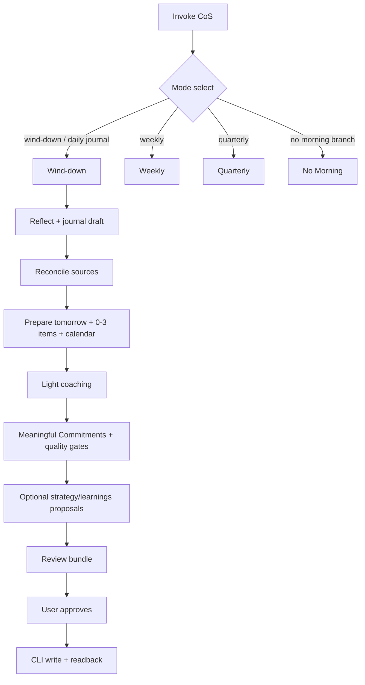

# Deprecate Morning into Wind-down - Plan

## Goal Capsule

- **Objective:** Retire personal-chief-of-staff Morning as a first-class daily mode and rebalance Wind-down into a single tomorrow-first daily close with light proactive coaching and durable vault capture, so the user completes wind-down most evenings without a second daily friction point.
- **Product authority:** Product Contract below is authoritative for behavior. This Planning Contract owns how the skill package, automation spec, tests, and docs change. Weekly and quarterly modes stay out of active scope except where copy must stop claiming morning.
- **Open blockers:** None. Live Codex desktop morning automation is already removed by the user; implementation still removes the repo morning automation entry so recovery does not recreate it.
- **Execution profile:** Code change to a published skill and its tests. Prefer behavior-case updates that prove the single daily path; use install/activation smoke only if description changes warrant it.
- **Stop conditions:** Do not invent a residual morning mode, operating-pulse daily duty, overnight re-check, or auto-write to strategy/learnings. Do not expand weekly/quarterly product shape.
- **Product Contract preservation:** restructured, no scope change: none — R/A/F/AE IDs and meaning preserved from requirements-only; HOW details added only in Planning Contract and Implementation Units.

---

## Product Contract

### Summary

Remove Morning mode, its schedule entry, and activation phrases. Retire, retarget, or replace morning-only tests so the suite proves the single daily path. Make Wind-down the only daily Chief of Staff path: close today, prepare tomorrow, deliver light coaching every run, apply commitment quality gates, and optionally propose durable updates to personal strategy and learnings in Obsidian under the existing approval rules.

### Problem Frame

Two daily CoS touchpoints create more friction than the habit can sustain. Morning is the least-used path; wind-down is the one that should stick. Meaningful Commitments currently assume a morning reaffirm leg that will not exist after deprecation. Coaching that stays only in conversation does not compound; strategy and learnings in the vault are where continuous improvement sticks.

### Key Decisions

- **One daily mode only.** Wind-down is the sole daily path; Morning is fully retired. (session-settled: user-directed — chosen over keep thin morning or ad-hoc today-mode: reduce daily friction so wind-down completes.) Governs R1, R2, R14, R15.
- **Tomorrow-first daily close, not append-only modules.** Absorbed morning value is rebalanced into wind-down’s purpose (leave tomorrow ready), not stacked as a mini-morning at the end. (session-settled: user-approved — chosen over append-and-delete or deprecate-only: one coherent evening ceremony.) Governs R3–R8.
- **Drop “what needs attention today.”** No product surface and no skill activation for that phrasing. Tomorrow-oriented attention and coaching replace it. (session-settled: user-directed — chosen over route-to-wind-down or keep activation: rarely asked; drop dead morning entry points.) Governs R2, R4, R14.
- **Light coaching every wind-down.** Each close includes a short focus / stop / more / less beat grounded in evidence, strategy, and learnings. (session-settled: user-approved — chosen over pattern-only or user-invited-only: make coaching habitual without a lecture.) Governs R9–R11.
- **Coaching sticks through vault actions.** Lasting coaching signal is proposed into configured strategy and learnings notes as separately approvable actions; nothing auto-writes. (session-settled: user-directed — chosen over conversation-only coaching: continuous improvement must land in the Obsidian vault.) Governs R10, R11.
- **Attention budget over completeness theater.** Absorbed judgment and relationship exception work stays inside a hard zero-to-three tomorrow-attention cap so evening completion remains possible. Governs R4, R7.
- **Out of daily scope: operating pulse and overnight re-check.** Not relocated into wind-down. (session-settled: user-directed — chosen over absorb-all morning jobs: protect completion.) Governs R16.

### Requirements

**Mode set and deprecation**

- R1. `personal-chief-of-staff` has no Morning mode, morning reference as a live path, or scheduled-morning invocation contract.
- R2. Mode selection recognizes Wind-down, Weekly, and Quarterly only for review modes. Morning activation phrases (including “what needs attention today” and morning-specific daily review wording) are removed from the skill description so they are not published triggers. Generic “daily chief-of-staff” / wind-down / journal wording still selects Wind-down when the skill is invoked. Another workflow’s request for current cross-source chief-of-staff context uses a non-mode path (shared source rules + priority judgment; caller keeps ownership) and does not select Morning or force Wind-down.
- R3. Wind-down is the single daily close: establish the day, reflect, complete the journal, reconcile sources, prepare tomorrow, coach lightly, record Meaningful Commitments when configured, and review/write under shared source rules.

**Tomorrow readiness (absorbed from morning)**

- R4. During prepare-tomorrow, surface zero to three **tomorrow** judgment items—decisions, prep, or presence that need the user next day. Zero is valid. Do not invent filler. Do not frame these as “what needs attention today.”
- R5. Validate tomorrow’s time-blocked day against critical path, capacity, fixed vs flexible commitments, and reviewed intent. Surface only consequential mismatches as reviewable actions.
- R6. When writing Meaningful Commitments, apply conflict, invalid-premise, and capacity quality gates against next-day evidence so the list is battle-tested at write time. Do not create a morning reaffirm step. Do not invent outcome, finish line, or rationale.
- R7. When the companion CRM is available, run a bounded relationship-exception check (overdue cadence or specific “useful now” context). Count any relationship item that becomes a foreground attention item inside R4’s zero-to-three cap. Keep interaction-effect capture for today’s contacts as the existing wind-down path.
- R8. Missing or incomplete prior close gets at most one light catch-up offer. Never build a backlog of journals. Continue today’s close by default.

**Coaching and durable improvement**

- R9. Every wind-down includes a light coaching beat after evidence and user reflection are available and before Meaningful Commitments are finalized: whether focus matched intent, what to stop, what to do more of, and what to do less of. Keep it short and evidence-grounded (day’s sources, strategy, learnings). Prefer insight over lecture.
- R10. Coaching that is only conversational may stay in the journal path when it is subjective day-meaning. Coaching that should compound proposes separately approvable updates to the configured personal strategy note and/or personal learnings notes—never silent mutation.
- R11. Strategy and learnings proposals only when the day adds durable, behavior-changing signal. One-day noise stays in the journal. Preserve existing “promote only durable signal” selectivity; expand it to cover coaching-driven continuous improvement and strategy updates, not a quota of vault edits.

**Shared contracts preserved**

- R12. Journal subjective content and every source mutation remain independently approvable. Wind-down still ends in the reviewed journal plus approved actions, not a generated brief archive.
- R13. Meaningful Commitments remain three to five reviewed bullets with outcome, finish line, and rationale when the template section exists; they do not replace tasks or calendar capacity.

**Cleanup and documentation**

- R14. Repo automation spec, skill description/triggers, README/CHANGELOG/catalog claims, and CONCEPTS vocabulary no longer describe a live Morning daily mode or “commitments into morning.” The repo morning automation entry is removed so recovery cannot recreate a live morning job the user already deleted.
- R15. Tests that required Morning mode are retired, retargeted to Wind-down, or replaced so the suite proves the single daily path and coaching/deprecation rules. Generic-daily → morning triggers and morning activation queries are gone or retargeted.
- R16. Selective operating pulse and overnight/start-of-day reconstruction are not required in Wind-down.

### Actors

- A1. **User** — sole primary actor; owns subjective meaning, coaching acceptance, and every durable write approval.
- A2. **personal-chief-of-staff agent** — runs Wind-down, drafts objective synthesis and coaching, proposes vault and source actions.
- A3. **Obsidian vault (configured)** — canonical daily journal, strategy, learnings; CLI-only access.
- A4. **Companion personal CRM (optional)** — relationship exception and interaction-effect paths when available.
- A5. **Automation host (Codex desktop)** — live morning job already removed by the user; repo spec must match.

### Key Flows

- F1. **Evening wind-down (happy path)**
  - **Trigger:** Scheduled wind-down or user asks to close the day / complete the journal / prepare tomorrow.
  - **Actors:** A1, A2, A3; A4 when available.
  - **Steps:** Resolve closing date and sources; broad reflection; selective relationship effects from today; draft journal; reconcile sources; prepare tomorrow (calendar validation, 0–3 tomorrow items, relationship exceptions inside cap); light coaching beat (focus / stop / more / less); draft Meaningful Commitments with quality gates informed by coaching; propose durable strategy/learnings only if warranted; one review bundle; apply approved actions with revalidation and readback.
  - **Outcome:** Journal closed, tomorrow intent clear, coaching delivered, optional vault improvements applied only if approved.
  - **Covered by:** R3–R13.

- F2. **Former morning invoke and cross-source context**
  - **Trigger:** (a) User wording that used to select Morning, including “what needs attention today” or “morning chief-of-staff.” (b) Another workflow requests current cross-source chief-of-staff context.
  - **Actors:** A1, A2.
  - **Steps:** (a) Skill description no longer lists morning phrases as activation. If the skill is still opened by other means, mode select never chooses Morning. Mid-day full Wind-down is acceptable without a special time-of-day branch when Wind-down is explicitly requested. (b) Cross-source requests use the non-mode path (KTD8): shared source rules, priority judgment, caller keeps ownership—no Wind-down/Weekly/Quarterly select.
  - **Outcome:** No Morning path executes; morning phrases are not published entry points; cross-source does not force a daily close.
  - **Covered by:** R1, R2, R14.

- F3. **Missed prior close**
  - **Trigger:** Wind-down finds missing or incomplete prior journal context that would help.
  - **Actors:** A1, A2, A3.
  - **Steps:** Offer at most one light catch-up; continue today’s close by default; never queue multi-day reconstruction.
  - **Outcome:** Today’s close proceeds without backlog guilt.
  - **Covered by:** R8.

### Acceptance Examples

- AE1. **Covers R1, R2, R14.** Given skill description and triggers after the change, when a user searches for morning or “what needs attention today” as published activation, then those phrases are absent; mode select has no Morning branch.
- AE2. **Covers R4, R5, R6.** Given tomorrow has a fixed meeting that conflicts with a drafted commitment, when wind-down prepares tomorrow and commitments, then the conflict is shown against evidence, unaffected commitments stay intact, and no morning reaffirm step is required for the list to be usable next day.
- AE3. **Covers R4, R7.** Given one overdue relationship with a specific reason contact helps tomorrow and two other judgment items, when wind-down surfaces tomorrow attention, then at most three foreground items appear and the relationship item is inside that cap—or omitted if not defensible.
- AE4. **Covers R9, R10, R11.** Given the day shows repeated over-commitment against strategy, when wind-down coaches, then a short focus/stop/more/less beat appears every run before commitments finalize, and any strategy or learnings edit is a separate numbered action requiring approval—not auto-applied.
- AE5. **Covers R8.** Given three prior journals are missing, when wind-down runs, then it offers at most one catch-up and does not create a three-day reconstruction plan.
- AE6. **Covers R15, R16.** Given the published test suite and skill docs after the change, when a reviewer searches for live Morning mode requirements, then morning-only cases and operating-pulse/overnight morning duties are absent or clearly historical—not required behavior.

### Success Criteria

- Wind-down is completed most evenings after the change (primary success signal named by the user).
- User leaves wind-down with usable tomorrow intent without needing a morning reaffirm ritual.
- Coaching is present lightly every wind-down and lasting improvements land only as approved vault actions.
- Published skill, automation spec, CONCEPTS, and tests no longer present Morning as a live daily mode.

### Scope Boundaries

**In scope**

- Deprecate Morning across skill, automations YAML, tests, CONCEPTS, README/CHANGELOG as needed.
- Rebalance Wind-down: tomorrow judgment items, tomorrow calendar validation, commitment quality gates, relationship exceptions inside attention budget, missing-journal light catch-up, light coaching every run (before commitments lock), durable strategy/learnings proposals.
- Retarget commitment recovery so after-midnight and next-day usability do not depend on a morning leg.

**Deferred for later**

- Deeper continuous-improvement frameworks beyond strategy/learnings proposal patterns.
- Weekly/quarterly absorbing operating-pulse duties morning used to hold.

**Out of scope**

- Residual thin Morning mode or mid-day special branch.
- Selective operating pulse and overnight reconstruction as wind-down duties.
- Auto-writing strategy, learnings, or journal subjective content without approval.
- Redesigning the full daily-journal template field set beyond commitment quality and coaching integration.
- Changing weekly or quarterly review product shape beyond removing morning claims.

### Dependencies / Assumptions

- User already deleted the live Codex desktop **CoS Morning** automation; implementers must still remove the repo `morning` automation entry.
- Companion CRM remains optional; relationship exception degrades cleanly when unavailable.
- Configured strategy and learnings notes exist or are discoverable by existing Obsidian conventions; if absent, coaching stays conversational/journal-only without inventing vault structure without approval.
- Meaningful Commitments template section remains optional.

### Outstanding Questions

**Deferred to Planning** — resolved in Planning Contract KTDs below (section order, file deletion, durable promote extension, test retarget map).

### Sources / Research

- `skills/personal-chief-of-staff/SKILL.md` — mode selection; morning as default for generic daily / “what needs attention today.”
- `skills/personal-chief-of-staff/references/morning.md` — unique morning jobs to retire or absorb.
- `skills/personal-chief-of-staff/references/wind-down.md` — journal, reconcile, prepare tomorrow, Meaningful Commitments, durable signal promotion.
- `skills/personal-chief-of-staff/references/source-behavior.md` — relationship judgment (Morning/weekly exceptions vs wind-down interaction effects); durable learning promotion rules.
- `automations/personal-chief-of-staff.yaml` — morning `07:00` still in repo (live job already deleted).
- `CONCEPTS.md` — Meaningful Commitment vocabulary (updated for no morning reaffirm).
- `docs/plans/2026-07-30-001-feat-daily-meaningful-commitments-plan.md` — prior morning reaffirm leg; superseded for that leg by this plan.
- `tests/personal-chief-of-staff/` — triggers and morning-related cases.

---

## Planning Contract

### Key Technical Decisions

- KTD1. **Delete `references/morning.md` rather than stub it.** Mode list and description carry the deprecation; a redirect file adds install noise without behavior. (session-settled: user-approved — chosen over stub redirect: simpler install surface.) Governs R1, R14.
- KTD2. **Remove morning automation entry from the repo YAML.** Do not leave a disabled key that recovery could re-bind. Live host job is already gone. Governs R14.
- KTD3. **Coaching section sits after prepare-tomorrow inputs are known and before Meaningful Commitments finalize.** Coaching can reshape tomorrow’s list; it is not only afterthought prose. (session-settled: user-approved — chosen over post-commitment coaching: coaching should influence intent.) Governs R9, R6.
- KTD4. **Extend “Promote only durable signal” for strategy + coaching-driven learnings.** Reuse existing selective proposal + separate approval; no new coaching ledger, score, or vault schema in the public skill. (session-settled: user-approved — chosen over new continuous-improvement product surface.) Governs R10, R11.
- KTD5. **Drop morning phrases from skill description activation; keep generic daily/journal/wind-down triggers.** Trigger contract rows for morning and “what needs attention today” move to near-miss or are removed so activation tests match the published description. (session-settled: user-directed — chosen over keep activation and route to wind-down.) Governs R2, R15.
- KTD6. **U1 owns the full source-behavior relationship-ownership flip.** Exception checks belong to wind-down (and weekly as today), not morning. U2 does not re-edit that paragraph except residual grep. Governs R7.
- KTD7. **Retarget tests by disposition, not silent delete.** U1 authors the wind-down behavior cases that absorb morning-review-shape scenarios; U4 deletes the morning case file once absorbed, retargets residual cases, and owns triggers only. Governs R15.
- KTD8. **Cross-source context is a non-mode path.** When another workflow requests current cross-source chief-of-staff context, load shared source-behavior (and review-bundle if needed), supply priority judgment without selecting Wind-down/Weekly/Quarterly, and leave ownership with the caller—parallel to action-response handling. Governs R2, F2.
- KTD9. **Companion CRM cadence copy moves with CoS.** Update `managing-personal-crm` relationship-contract language from “morning or weekly” to “wind-down or weekly” in the same change set. Governs R7, R14.

### High-Level Technical Design

Wind-down remains one mode reference plus shared `source-behavior` and `review-bundle`. Morning content is absorbed into named wind-down sections, then the morning file is deleted.

### Implementation Constraints

- Public skill only: no private vault paths, no user-specific journal template structure invented without approval.
- Obsidian mutations stay CLI-only with revalidation and readback.
- Tests stay lightweight case files under `tests/personal-chief-of-staff/` per `tests/README.md`.
- `Agents.md` private-artifact rules: personal coaching content never lands in the repo; only skill instructions change.

### Sequencing

1. U1 — Wind-down behavior + source-behavior relationship ownership.
2. U2 — Mode select, description, delete morning, cross-source non-mode path.
3. U3 — Automation YAML + catalog/docs/CHANGELOG/CONCEPTS + companion CRM cadence copy.
4. U4 — Triggers and residual case retarget (not re-authoring U1 behavior cases).

U1 before U2 so mode select points at complete wind-down behavior. U3 and U4 follow U2; U4 may start once U1–U2 text is stable.

### Assumptions

- No other live harness still schedules morning beyond the already-deleted Codex job.
- Installers read skill description from the package; removing activation phrases is the durable deactivation for published triggers.

---

## Implementation Units

### U1. Rebalance wind-down for tomorrow readiness and coaching

- **Goal:** Wind-down is a complete single daily close: tomorrow judgment items, calendar validation, commitment quality gates, relationship exceptions inside the attention cap, missing-journal catch-up, light coaching every run before commitments lock, and selective strategy/learnings proposals.
- **Requirements:** R3–R13, R16; F1, F3; AE2–AE5
- **Dependencies:** None
- **Files:**
  - modify: `skills/personal-chief-of-staff/references/wind-down.md`
  - modify: `skills/personal-chief-of-staff/references/source-behavior.md` (relationship exception ownership language; durable promote if strategy is only named there)
  - test: `tests/personal-chief-of-staff/cases/wind-down-tomorrow-close.md` (new)
  - test: `tests/personal-chief-of-staff/cases/wind-down-coaching-and-durable-signal.md` (new)
  - test: `tests/personal-chief-of-staff/cases/after-midnight-commitment-date.md` (retarget — no morning leg)
  - test: `tests/personal-chief-of-staff/cases/meaningful-commitment-capture.md` (quality-gate conflict scenario if not already covered)
- **Approach:**
  1. Expand **Prepare tomorrow** with zero-to-three tomorrow judgment items, tomorrow calendar validation (port rules from morning without overnight/operating pulse), and relationship exceptions counted inside the cap.
  2. Add **Coach lightly** after prepare-tomorrow evidence is in hand and before **Record tomorrow's meaningful commitments**; require focus/stop/more/less; keep non-scoring.
  3. Fold morning commitment quality gates into the Meaningful Commitments section (conflict / invalid premise / capacity vs next-day evidence).
  4. Extend **Promote only durable signal** to allow strategy note proposals and coaching-driven learnings under the same selectivity and separate approval.
  5. Keep missing-journal catch-up at most one offer during establish/reflect.
  6. Update `source-behavior.md` so relationship-exception ownership is wind-down (and weekly as today), not Morning; extend durable-promote language there if strategy proposals are only named in that file.
- **Patterns to follow:** Existing wind-down section shape (heading + completion criteria); morning’s quality-gate and foreground-cap language as source material before deletion; durable signal selectivity already in wind-down and source-behavior.
- **Test scenarios:**
  - Happy path: full wind-down produces journal + 0–3 tomorrow items + commitments with three elements + light coaching; zero tomorrow items valid when nothing needs judgment.
  - Covers AE2: fixed calendar conflict invalidates one commitment; list explains conflict; no morning step.
  - Covers AE3: relationship exception + other items never exceed three foreground items.
  - Covers AE4: coaching every run; strategy/learnings edits only as separate numbered actions; no auto-write.
  - Covers AE5: multi-day missing journals → at most one catch-up.
  - After-midnight: Tuesday close at 00:20 Wednesday still writes Wednesday commitments to Tuesday journal; no Wednesday morning recovery required for completeness.
  - Malformed commitment: identify missing element; do not invent rationale.
- **Verification:** Fresh-context case runs for the new/retargeted cases pass their checklists; wind-down.md has no remaining “morning” dependency for next-day intent.

### U2. Retire Morning mode and activation surface

- **Goal:** No Morning mode, no morning reference file, no morning activation phrases; mode select is wind-down / weekly / quarterly only; cross-source requests use a non-mode path.
- **Requirements:** R1, R2, R14; F2; AE1
- **Dependencies:** U1 (wind-down must own absorbed behavior before morning text disappears)
- **Files:**
  - modify: `skills/personal-chief-of-staff/SKILL.md`
  - delete: `skills/personal-chief-of-staff/references/morning.md`
- **Approach:**
  1. Rewrite description frontmatter: drop morning / “what needs attention today”; keep wind-down, journal, weekly, quarterly, action responses, and cross-source context for other workflows.
  2. Remove Morning bullet and morning reference link from mode select. Generic daily chief-of-staff / daily review / journal wording selects Wind-down (R2, KTD5).
  3. Define the cross-source path explicitly (KTD8): when another workflow requests current cross-source chief-of-staff context, do not select Wind-down/Weekly/Quarterly; load shared source-behavior (and review-bundle if needed), supply priority judgment, leave ownership with the caller—same family as action-response handling before mode select.
  4. Delete `references/morning.md`.
  5. Grep the CoS skill package for residual morning mode instructions; fix live Morning claims outside U1’s source-behavior ownership edit.
- **Patterns to follow:** Existing mode-select structure; action-response-first block in SKILL.md; Same-Door / install-clean description discipline.
- **Test scenarios:**
  - Covers AE1: trigger contract no longer expects morning activation rows as should-trigger.
  - Mode select prose never loads a morning reference path.
  - Cross-source invoke does not open Wind-down or invent a fourth review mode.
- **Verification:** `skills/personal-chief-of-staff` has no live morning path; description, mode select, and cross-source path agree.

### U3. Automation and public docs cleanup

- **Goal:** Repo automation and human-facing docs match one daily path; recovery cannot reintroduce morning; companion CRM no longer names morning for cadence scans.
- **Requirements:** R14, R7
- **Dependencies:** U2
- **Files:**
  - modify: `automations/personal-chief-of-staff.yaml` (remove `morning` key entirely)
  - modify: `README.md` (skill blurb)
  - modify: `CHANGELOG.md` (Unreleased — deprecation + wind-down coaching)
  - modify: `CONCEPTS.md` (confirm Meaningful Commitment entry matches no-morning-reaffirm — may already be updated)
  - modify: `skills/managing-personal-crm/references/relationship-contract.md` (cadence scans: wind-down or weekly, not morning)
- **Approach:**
  1. Delete the `automations` morning entry; leave wind_down, weekly, quarterly.
  2. Update README skill one-liner.
  3. CHANGELOG: rewrite existing Unreleased personal-chief-of-staff Added/Changed bullets so they no longer claim morning reviews, morning reaffirm, or four Codex daily schedules; leave one coherent Unreleased story that wind-down is the sole daily path (light coaching + durable vault proposals) with three remaining schedules (wind_down, weekly, quarterly).
  4. Confirm CONCEPTS Meaningful Commitment no longer says “into morning.”
  5. In the companion CRM relationship contract, replace “configured morning or weekly reviews” with wind-down or weekly (KTD9).
- **Patterns to follow:** Existing CHANGELOG tone; automation YAML structure for remaining jobs; companion contract wording style.
- **Test expectation:** none — docs and automation spec; verified by review and optional recovery dry-read of YAML.
- **Verification:** No morning key in automations YAML; README/CHANGELOG/CONCEPTS and companion CRM contract have no live morning daily-mode claim for cadence.

### U4. Retarget tests and trigger contract

- **Goal:** Trigger contract and residual cases match the single daily path; do not re-author U1’s wind-down behavior cases.
- **Requirements:** R15; AE1, AE6
- **Dependencies:** U1, U2
- **Files:**
  - modify: `tests/personal-chief-of-staff/triggers.md`
  - delete: `tests/personal-chief-of-staff/cases/morning-review-shape.md` (only after U1 cases absorb its discriminating scenarios)
  - modify: `tests/personal-chief-of-staff/cases/calendar-commitment-flexibility.md` (wind-down tomorrow validation)
  - modify: `tests/personal-chief-of-staff/cases/approval-binding-and-revisit.md` (wind-down bundle)
  - modify: `tests/personal-chief-of-staff/cases/after-midnight-commitment-date.md` (only if U1 left it unfinished)
  - modify: `tests/personal-chief-of-staff/cases/relationship-discovery-boundaries.md` (morning scenario → wind-down exception if present)
  - modify: `tests/personal-chief-of-staff/log.md` (new run lines when residual cases re-run)
- **Approach:**
  1. Triggers: remove or near-miss morning / “what needs attention today” / scheduled morning rows; keep wind-down, weekly, quarterly, action; keep cross-source as should-trigger for the non-mode path (KTD8).
  2. Delete morning-review-shape once U1’s wind-down-tomorrow-close / coaching cases cover nothing-material tomorrow, catch-up, foreground cap, commitment conflict, and malformed commitment (drop health operating-pulse scenarios per R16). Do not re-list creating those scenarios under U4.
  3. Retarget calendar, approval, and relationship residual cases to wind-down wording.
  4. Grep tests for residual morning-required behavior; disposition each hit.
- **Execution note:** Prefer fresh-context binary cases for residual retargets; record outcomes in `log.md` per suite convention.
- **Test scenarios:**
  - Trigger table matches published description (should-trigger / near-miss).
  - Residual retargeted cases pass without requiring morning mode.
  - Covers AE6: suite search finds no live morning mode requirement.
- **Verification:** Trigger contract and residual case set pass; behavior cases remain U1-primary; grep for morning mode as required behavior is clean.

---

## Verification Contract

| Gate | Applies to | Done signal |
| --- | --- | --- |
| Skill package still validates if the repo uses `npx skills-ref validate skills/personal-chief-of-staff` | U1–U3 | Validate succeeds after public skill edits |
| Trigger contract judgment per `tests/README.md` | U4 | Morning activation rows no longer should-trigger; wind-down/weekly/quarterly still do |
| Fresh-context wind-down behavior cases (tomorrow close, coaching/durable, after-midnight, commitments) | U1 | Checklists pass; log.md updated for runs performed |
| Residual retarget cases (calendar flexibility, approval-binding, relationship boundaries) + triggers | U4 | Checklists pass; morning-review-shape deleted after absorption |
| Grep skill + tests for live morning mode / morning.md load | U2, U4 | No required morning path remains |
| Automations YAML has no `key: morning` | U3 | Only wind_down, weekly, quarterly daily/periodic jobs remain |
| README + CHANGELOG + CONCEPTS + companion CRM cadence copy | U3 | No “commitments into morning” or morning cadence claim |

---

## Definition of Done

**Global**

- Product Contract R1–R16 satisfied in skill behavior and docs.
- Morning mode file deleted; mode select and description have no morning activation.
- Repo automation cannot reintroduce morning.
- Tests prove single daily path and coaching without morning reaffirm.
- No private vault content or personal coaching artifacts committed to the public repo.
- Abandoned draft morning stubs or half-retargeted tests are not left in the tree.

**Per unit**

- U1 done when wind-down.md encodes tomorrow readiness, coaching-before-commitments, quality gates, durable strategy/learnings proposals, source-behavior relationship ownership is wind-down/weekly, and matching behavior cases pass.
- U2 done when morning.md is gone, SKILL.md never selects Morning, and cross-source is a non-mode path.
- U3 done when automations YAML, public docs, and companion CRM cadence copy match.
- U4 done when triggers and residual cases no longer require Morning; U1 behavior cases are not re-authored here.

---

## Risks and Mitigations

| Risk | Mitigation |
| --- | --- |
| Wind-down becomes too long and completion drops | Hard 0–3 tomorrow cap; light coaching; no operating pulse/overnight; zero items valid |
| Users still say “morning review” and get no skill | Accepted by activation drop; README/CHANGELOG document wind-down as the daily path |
| Recovery re-creates morning job from YAML | Delete morning key entirely (KTD2) |
| Commitment quality regresses without morning reaffirm | Quality gates at write time (R6); after-midnight case without morning leg |
| Coaching becomes noise or auto-writes vault | Every-run light beat + durable promote only for repeated/behavior-changing signal + separate approval |

---

## System-Wide Impact

- **Published catalog:** installers see a three-review-mode skill (daily close = wind-down) plus weekly/quarterly.
- **Companion CRM:** exception checks shift fully to wind-down + weekly language in CoS source-behavior and in `managing-personal-crm` relationship-contract cadence copy.
- **Prior plan:** `docs/plans/2026-07-30-001-feat-daily-meaningful-commitments-plan.md` morning reaffirm units are historically true but superseded for live behavior by this plan.

---

## Documentation / Operational Notes

- Document that the live Codex morning automation was already removed manually; implementers only clean the repo spec.
- No new runbook beyond CHANGELOG + README blurb.
- Personal strategy/learnings updates remain in the user’s vault under approval — never in this repository.
