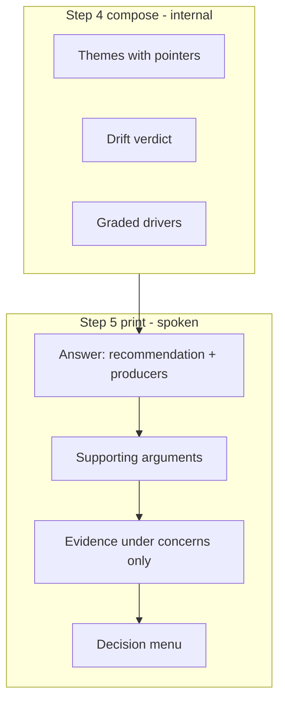

# Merge Readiness Conciseness - Plan

## Goal Capsule

- **Objective:** Make owner-facing digests short and answer-first (Minto pyramid), prove that with the battery and live back-test, and slim `SKILL.md` so agents load less bulk without losing judgment floors.
- **Product authority:** This plan owns presentation contract, skill-body economy, and test updates for `checking-merge-readiness`. Judgment classes, grade mapping, and merge caps stay owned by `docs/plans/2026-08-01-001-feat-checking-merge-readiness-plan.md`.
- **Open blockers:** None.
- **Execution profile:** Instruction and battery refactor in this repo; no runtime service code.
- **Stop conditions:** Presentation and slim land with battery + live back-test green; SKILL.md stays ≤500 lines and floor rules still present.

---

## Product Contract

### Summary

Add a presentation contract so digests lead with the recommendation (Minto pyramid), stay about half a screen on clean green, and grow only around real concerns. Slim the skill body so agent load shrinks without dropping fetch floors or grading rules. Battery and live back-test prove both length/order and judgment.

### Problem Frame

The skill already promises a clear, concise colleague summary, but real digests still run long: full theme walkthroughs, low drivers listed by class, and thorough clean-case prose before the verdict. At the merge decision, that length hides the answer. Separately, the skill body is ~379 lines (largest in this catalog), so agents pay load cost on protocol detail that does not need to be restated for every run.

### Key Decisions

- KD1. **Human readout first, skill body second** (session-settled: user-directed — earlier choice was readout-only over skill-bulk rewrite; later confirmed expanded scope to also slim `SKILL.md` under the same judgment floors). Governs R1–R4, R11.
- KD2. **Half-screen clean green** (session-settled: user-directed — upper bound about 12 short lines for pyramid body plus decision menu; no five-line compression floor). Governs R2, R5.
- KD3. **Grow around the concern** (session-settled: user-directed — medium/high drivers, caps, and intent-drift findings get evidence; clean parts stay one line). Governs R3, R6.
- KD4. **One-line risk when nothing material** (session-settled: user-directed). Governs R4.
- KD5. **One-sentence themes on clean green** (session-settled: user-directed — collapse when empty or purely fixed-as-suggested). Governs R5.
- KD6. **Presentation contract, not a rigid report template** (session-settled: user-approved). Governs R1, R7.
- KD7. **Trust via battery + live back-test** (session-settled: user-directed). Governs R8, R9.
- KD8. **Pre-readout dialogue outside the half-screen budget** (session-settled: user-approved). Governs R2.
- KD9. **Minto pyramid readout** (session-settled: user-directed — answer first, then grouped supports and evidence). Governs R7, R10.
- KD10. **Disciplined skill-body slim** (session-settled: user-directed — chosen over presentation-only: cut redundancy and move durable detail into references only when it is not needed every run; never drop step-2 floors or grade mapping). Governs R11.

<!-- ce-section: work-relationships -->
### How This Work Fits Together

This plan revises presentation and instruction economy for the merge digest only.

- Judgment authority remains `docs/plans/2026-08-01-001-feat-checking-merge-readiness-plan.md` (drivers, caps, recommendation mapping, one owner decision).
- Can proceed independently of `checking-pr-readiness`.
- Presentation-supersedes original product R9 wording that “the readout surfaces the drivers” on green: this plan’s R4 collapses green print to one residual line while internal grading stays complete (R8).

### Actors

- A1. **Owner** — reads the digest and takes the one terminal decision.
- A2. **Digest agent** — grades fully internally; prints only the presentation contract.

### Requirements

**Presentation contract**

- R1. The skill states a presentation contract for the final readout and decision menu. The contract is binding on what is printed; it does not change how drivers are graded, which history surfaces are fetched, or how recommendations are mapped.
- R2. On a clean green outcome (recommend merge, no material drivers, no caps, no intent drift) where themes stay collapsed per R5, the final readout plus decision menu is at most about 12 non-blank short lines. That upper bound is the checkable half-screen criterion; there is no five-line floor. Pre-readout dialogue is outside this budget. When R5 expands theme detail on an otherwise clean green outcome, growth is limited to supporting points under the recommendation; the recommendation line and decision menu stay compact, and the 12-line cap is not a hard fail for that specimen class.
- R3. On debug or do not merge, supporting points under the recommendation grow only around medium or high drivers, caps, and intent-drift findings. Evidence and pointers appear for those concerns. Clean residual is at most one line or omitted. Do not enumerate low drivers; at most one residual risk clause such as “remaining drivers low.”
- R4. When every risk driver is low or none fire, the risk support is a single statement that nothing material was found (all drivers low or none fired) — not a list of the seven classes, and not wording that implies grading was skipped.
- R5. On a clean green outcome, review themes collapse to one supporting sentence when themes are empty or purely fixed-as-suggested. Expand theme detail whenever any declined, fixed-differently, deferred, or unresolved item exists, or when a medium/high driver needs theme context.
- R6. Source pointers stay required on every theme claim and named driver that appears, kept parenthetical. Collapsed one-sentence themes may use aggregate pointers.
- R7. The readout keeps the colleague’s plain-language register in **natural prose**: continuous sentences and short paragraphs, not form labels. No report-template scaffolding (no section headers such as Themes / Intent / Risk / Drivers), no em dashes in the spoken readout, no second visible verdict, no steelman against merging.
- R10. The final readout follows Barbara Minto’s pyramid principle as the **logic of the prose**, not as labeled blocks. Order: (1) **answer first** — the single recommendation naming what produced it, with PR identity/state folded into that opening; (2) **why** — supporting arguments woven as natural sentences (themes, drift, residual risk, caps), most decision-relevant first; (3) **evidence** only under concerns that drove the recommendation, with pointers per R6 inside those sentences; (4) **decision menu** after the prose body. Do not build bottom-up (themes → drift → risk → recommendation).

**Judgment preserved**

- R8. Internal grading remains complete against the existing seven driver classes, intent-drift check, and recommendation mapping. A shorter print is never a reason to skip a grade or soften a high driver or cap.

**Verification**

- R9. The matched-pair battery fails clean-green runs when the final readout plus decision menu exceeds about 12 non-blank short lines or the first substance is not the recommendation (R10). Concern-grown runs still require correct drivers, recommendation, and pointers under answer-first shape. Green checklist items that demand multi-bucket theme walkthroughs are rewritten to the one-sentence form (or R5 expanded-theme form). Live back-test remains the non-fixture check; length discipline is battery-primary.

**Skill-body economy**

- R11. `SKILL.md` is slimmed under the catalog’s ≤500-line budget (today ~379). Economy means: delete redundant restatement, tighten step prose, and move only rarely needed durable detail into `references/` when step 5 still states the normative print rules. Floor tables, grade mapping, caps, trust rules, and completion lines stay. Judgment behavior is unchanged.

### Key Flows

- F1. Clean green digest
  - **Trigger:** All drivers low or none fire; no caps; no intent drift.
  - **Actors:** A1, A2
  - **Steps:** Full fetch and grade → open with recommend merge → one-line supports per R4–R5 → decision menu → within R2.
  - **Covers:** R1–R2, R4–R8, R10

- F2. Concern-grown digest
  - **Trigger:** Medium/high driver, cap, or intent drift.
  - **Actors:** A1, A2
  - **Steps:** Full fetch and grade → open with debug or do not merge naming concerns → support and evidence only for those → residual at most one line → decision menu.
  - **Covers:** R1, R3, R6–R8, R10

### Acceptance Examples

- AE1. **Covers R2, R4, R5, R7, R10.** Clean merge path with only fixed-as-suggested themes → first substance is recommend merge; supports short; total ≤ ~12 lines; no bottom-up build-up.
- AE2. **Covers R3, R6, R8, R10.** One high-security driver → first substance is do not merge naming that driver; evidence and pointer under it; no seven-class table.
- AE3. **Covers R4, R8.** All low or none fire → risk support does not enumerate seven classes; mapping still merge.
- AE4. **Covers R9.** Battery + live back-test: clean-green fails on length or non-answer-first; concern-grown fails if drivers/recommendation/pointers missing; live still completes.
- AE5. **Covers R2, R5.** Merge with declined or fixed-differently items → theme support expands; 12-line cap not a hard fail for that expansion alone.
- AE6. **Covers R11.** After the slim, SKILL.md ≤500 lines; step-2 floor surfaces and step-5 grade mapping still present; a cold read of step 5 alone can produce an answer-first readout.

### Success Criteria

- Clean green digests are answer-first and ≤ ~12 short lines for readout plus menu.
- Debug / do-not-merge digests state the recommendation first, then only supporting concerns; both may lead to investigation, and do not merge is a hard stop on shipping.
- Battery + live back-test pass length/order and judgment checks.
- SKILL.md is shorter and still portable under the review checklist budget.
- Judgment model behavior unchanged.

### Scope Boundaries

**In scope**

- Step 5 presentation contract (Minto, length, progressive expansion).
- Light opening-cue alignment so the intro does not imply bottom-up readout order.
- Battery checklist updates and live back-test obligation as today.
- Disciplined SKILL.md economy pass under R11.
- Unreleased CHANGELOG entry.

**Out of scope**

- Changing driver classes, grade anchors, recommendation mapping, or merge caps.
- Two-pass full-internal-then-spoken digests as a required mechanism.
- Optional expand-on-request sections or posting digests to the PR.
- Reworking baseline confirmation beyond KD8.
- Rewriting `risk-rubric.md` / `first-principles.md` content (except a one-line cross-link if step 5 needs it).

### Dependencies / Assumptions

- Judgment authority: `docs/plans/2026-08-01-001-feat-checking-merge-readiness-plan.md`.
- Battery harness: `tests/checking-merge-readiness/`.
- Catalog size limit: ≤500 lines for `SKILL.md` (`skills/creating-portable-skills/references/review-checklist.md`).

### Outstanding Questions

**Deferred to implementation**

- Exact line-by-line economy cuts in steps 1–4 and 6 (preserve meaning; no floor deletion).
- Whether any rarely used long table belongs only in a reference after the slim (prefer keep floors in SKILL.md unless proven redundant).

---

## Planning Contract

**Product Contract preservation:** restructured and expanded for confirmed skill-body slim — KD1 revised, KD10 and R11/AE6 added; out-of-scope bullet that forbade slim removed. No change to judgment classes or mapping.

### Key Technical Decisions

- KTD1. **Presentation lives in step 5 of `SKILL.md`** (session-settled: user-approved default after plan scoping — chosen over a separate presentation reference as primary home: agents must hit print rules at compose time; a short Minto/length block in step 5 is the binding surface). Governs R1, R10.
- KTD2. **Operationalize length as “≤ about 12 non-blank short lines”** for the final readout plus decision menu only (session-settled product R2). Battery graders count non-blank lines after the decision menu starts; pre-readout dialogue is excluded. Governs R2, R9.
- KTD3. **Answer-first check is structural:** first non-blank substantive line of the final readout must state the recommendation (merge / debug / do not merge), not themes or drift. Identity may share that line; omit bare open state. Governs R10, R9.
- KTD4. **Green theme checklist rewrite:** Scenario 1 (and any other pure clean-green cases) require one-sentence themes with aggregate pointers when only fixed-as-suggested; multi-bucket walkthrough items move to concern or AE5-style specimens. Governs R5, R9.
- KTD5. **Slim without floor loss:** Prefer tightening prose and removing restatement over moving critical floor tables out of SKILL.md. If anything moves to `references/`, step 5 or the step that needs it must still name the rule and link. Governs R11.
- KTD6. **Presentation supersedes green “list every driver” print:** Original plan’s “readout surfaces the drivers” is satisfied by naming drivers that produce the recommendation and by R4’s residual on green; low drivers are not printed as a class list. Document this in step 5, not by editing the old plan file. Governs R3, R4, R8.
- KTD7. **Live back-test stays judgment-primary:** Scenario 11 keeps real-scale completeness and recommendation quality; length is enforced on fixture clean-green scenarios, not as a hard live line-count fail (terminal menus and real scale vary). Governs R9.

### High-Level Technical Design

Print order is independent of compose order. Full grade always happens before print.

### Assumptions

- Battery runners and `gh` fixture stub stay as shipped; no new helper scripts (same posture as original skill plan KTD1).
- “Short lines” means ordinary chat lines, not hard-wrapped 80-column wraps inside a single long paragraph.

### Sources & Research

- Product: this file’s Product Contract; judgment origin `docs/plans/2026-08-01-001-feat-checking-merge-readiness-plan.md`.
- Minto: answer-first / assertion → arguments → evidence (Barbara Minto, *The Pyramid Principle*).
- Learnings: `docs/solutions/best-practices/operationalize-abstract-qualifiers-in-instruction-review.md` (define length and “material” operationally); `docs/solutions/workflow-issues/falsifiability-contracts-need-executable-tests.md` (battery items must fail when the contract is violated).
- Patterns: sibling step-5/6 shape in `skills/checking-pr-readiness/SKILL.md`; review checklist size budget in `skills/creating-portable-skills/references/review-checklist.md`.
- Current surfaces: `skills/checking-merge-readiness/SKILL.md` step 5 (~284–319); `tests/checking-merge-readiness/cases/merge-digest-battery.md` scenarios 1, 9–11.

---

## Implementation Units

### U1. Rewrite step 5 presentation contract

- **Goal:** Step 5 binds Minto order, clean-green length, progressive expansion, residual risk print, and low-driver silence; completion criteria match R2–R7 and R10.
- **Requirements:** R1–R7, R10; KD2–KD6, KD8–KD9; KTD1–KTD3, KTD6.
- **Dependencies:** none
- **Files:**
  - Modify: `skills/checking-merge-readiness/SKILL.md`
- **Approach:**
  1. Replace step 5 “carries themes, drift, drivers, then recommendation” with answer-first pyramid order per R10.
  2. State clean-green ≤ ~12 non-blank short lines for readout + menu; exclude pre-readout dialogue; no five-line floor.
  3. State progressive expansion and R5 theme expand/collapse rules with closed triggers (not soft “material”).
  4. State R4 residual risk line and R3 “do not enumerate lows.”
  5. Keep grade-to-light mapping, caps, and intent-drift high finding; only change what is printed.
  6. Align the opening paragraph so it does not describe a themes-first spoken shape (one short cue is enough).
- **Patterns to follow:** Existing step completion lines; colleague register language already in the skill intro.
- **Test scenarios:** Test expectation: none — behavior proven in U3 battery. Local check: cold read of step 5 alone yields answer-first instructions.
- **Verification:** Step 5 text cites answer first, length cap, progressive expansion; mapping and caps still present.

### U2. Slim SKILL.md without losing floors

- **Goal:** Reduce agent-load bulk while keeping all skill-required floors, mapping, and trust rules; stay ≤500 lines.
- **Requirements:** R11; KD1, KD10; KTD5.
- **Dependencies:** U1 (presentation text lands first so slim does not fight a half-rewritten step 5).
- **Files:**
  - Modify: `skills/checking-merge-readiness/SKILL.md`
  - Modify only if a move is justified: `skills/checking-merge-readiness/references/*` (link from skill; do not orphan floors)
- **Approach:**
  1. After U1, pass delete-test economy: cut restated sentences, merge duplicate trust paragraphs, tighten step 2 table prose without dropping columns.
  2. Prefer in-file tighten over new reference files. Only move content that is not needed on the critical path of every run.
  3. Record before/after line count; fail if any floor surface, completion criterion, or grade mapping disappeared.
- **Patterns to follow:** `skills/creating-portable-skills/references/review-checklist.md` instruction economy; sibling `checking-pr-readiness` density.
- **Test scenarios:**
  - Happy: `wc -l` ≤ 500 and lower than pre-change baseline on this branch.
  - Edge: Floor table rows and step 5 mapping still present after slim (checklist or grep-backed review note in log).
- **Verification:** Line count down; AE6 cold-read criteria hold; no floor field removed from step 2.

### U3. Update battery for length, pyramid, and themes

- **Goal:** Checklist items enforce R9: answer-first, clean-green length, rewritten green themes, concern-grown completeness under pyramid shape.
- **Requirements:** R9; KD7; KTD2–KTD4, KTD7; AE1–AE5.
- **Dependencies:** U1
- **Files:**
  - Modify: `tests/checking-merge-readiness/cases/merge-digest-battery.md`
  - Modify: `tests/checking-merge-readiness/log.md` (after runs)
- **Approach:**
  1. Scenario 1 (clean control): add first-substance = recommend merge; ≤ ~12 non-blank lines for readout + menu; one-sentence themes with aggregate pointers when only fixed-as-suggested; residual risk one line; remove multi-bucket theme walkthrough requirement.
  2. Scenario 9 (register): require answer-first and no report-template scaffolding; keep colleague register checks.
  3. Concern scenarios (e.g. 2, 10): require recommendation first with named producers; evidence under those points; no seven-class low table.
  4. Scenario 11 (live): keep completeness and recommendation quality; do not hard-fail live on 12-line cap (KTD7).
  5. Scenario 1 (`specimen-a`) includes a fixed-differently filename choice; extend its checklist with AE5-style expanded-theme assertions while keeping collapsed-theme rules for pure fixed-as-suggested clean greens.
  6. Run skilled battery scenarios affected and record results in the log.
- **Execution note:** Prefer characterization of existing skilled runs against new checklist items; fix skill text if green runs fail only on old multi-bucket theme demands that the contract removed.
- **Patterns to follow:** Existing battery item style (checkboxes, specimen refs, ground truth in cases file only).
- **Test scenarios:**
  - Happy: Scenario 1 skilled run passes new length and answer-first items.
  - Discriminating: Scenario 10 still requires do not merge + non-thread objections under answer-first shape.
  - Live: Scenario 11 still passes judgment/completeness items.
- **Verification:** Updated checklist items land; log entries for re-run scenarios; no silent drop of red-path discriminators.

### U4. Ship hygiene

- **Goal:** Unreleased CHANGELOG entry and final size/same-door sanity for the skill package.
- **Requirements:** R11; catalog conventions.
- **Dependencies:** U1–U3
- **Files:**
  - Modify: `CHANGELOG.md`
  - Optionally: `skills/checking-merge-readiness/SKILL.md` description only if trigger text must mention concise digest (prefer leave triggers stable)
- **Approach:**
  1. Unreleased Changed entry: concise digests (Minto answer-first, clean-green length) and skill-body economy.
  2. Confirm package still install-probes under existing harness conventions if the repo’s usual pre-merge check for this skill applies; otherwise note battery log as the behavioral proof.
- **Test scenarios:** Test expectation: none — changelog prose; behavior in U3.
- **Verification:** CHANGELOG entry present; SKILL.md ≤500 lines.

---

## Verification Contract

| Gate | Command / proof | Applies |
| --- | --- | --- |
| Skill size | `wc -l skills/checking-merge-readiness/SKILL.md` ≤ 500 and reduced vs pre-change | After U2 |
| Step 5 contract | Cold read: answer-first, length, expansion, residual risk, mapping present | After U1 |
| Floor retention | Step 2 floor table and surface list still complete | After U2 |
| Battery clean green | Scenario 1 skilled checklist including length + answer-first | After U3 |
| Battery concern | Scenario 10 (and other red discriminators) still pass judgment items | After U3 |
| Live back-test | Scenario 11 per existing harness when `gh` available | After U3 |
| Log | `tests/checking-merge-readiness/log.md` updated for re-runs | After U3 |

Repo has no single unit-test binary for this skill; the matched-pair battery and log are the verification system of record (same as the original skill plan).

---

## Definition of Done

- [ ] Step 5 implements R2–R7, R10; intro does not contradict answer-first.
- [ ] SKILL.md slimmed under R11; floors and mapping retained; ≤500 lines.
- [ ] Battery scenarios updated per U3; skilled runs logged for affected scenarios.
- [ ] Live scenario 11 not regressed on judgment/completeness.
- [ ] CHANGELOG Unreleased entry present.
- [ ] No abandoned draft fragments left in the skill or battery.
- [ ] Product judgment model unchanged: same seven classes, mapping, caps, one owner decision.

---

## Risks & Dependencies

| Risk | Mitigation |
| --- | --- |
| Slim accidentally drops a GraphQL floor | U2 verification + floor table checklist; prefer tighten over delete |
| Battery green items still demand multi-bucket themes | KTD4 rewrite in U3 before grading new runs |
| Agents ignore length without operational definition | KTD2 line-count in step 5 and scenario 1 |
| Live digests longer than 12 lines | KTD7: length battery-primary |
| Old “surfaces the drivers” dual authority | KTD6 note in step 5 |
