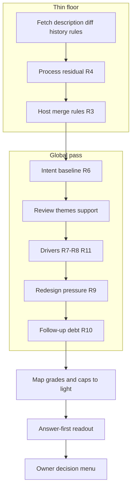

# Merge Readiness Global Pass - Plan

## Goal Capsule

- **Objective:** Reframe `checking-merge-readiness` as the pre-merge **global optimization pass**: judge the full arc from PR open to merge tip for design health, intent, redesign pressure, and follow-up debt — with process evidence and host merge rules kept deliberately thin — and align `checking-pr-readiness` only where sibling awareness removes wasted overlap.
- **Product authority:** This plan owns product behavior for that reframe. Durable `ce-code-review` receipt machinery, host CI/CODEOWNERS changes, and forced human co-reviewers are not active scope.
- **Open blockers:** None.
- **Execution profile:** Code change to published skills and their battery; no runtime services.
- **Stop conditions:** Battery discriminators for AE1–AE6 shapes pass under skilled digests; unreviewed-tip alone no longer forces debug when the loop is settled; host conversation-resolution failure caps merge; skill stays install-portable.

---

## Product Contract

### Summary

Ship a full refactor of the merge-readiness skill so its load-bearing work is systems judgment on the birth-to-tip change (overengineering, YAGNI, intent drift, redesign, future-work capture), while process evidence (quiet review loop) and repository merge rules (for example resolved-conversation requirements) stay as thin floors that never replace that judgment. Soften the unreviewed-head hard stop that stalls solo and AI-primary workflows. Lightly tune `checking-pr-readiness` so the pre-PR gate and the pre-merge digest name complementary jobs.

### Problem Frame

Babysitting a PR optimizes **locally**: each comment, each bot round, each re-push. After many rounds the owner still needs a **global** answer: is the accumulated change still the right design, or did review pressure complect the system?

Issue #36 surfaced a second failure: the skill hard-caps at **debug** for unreviewed-since-last-review whenever the tip moves after the last non-author forge review. For solo founders that becomes a dead end ("tag a human") even when comments were addressed, CI is green, and residual risk is low. Counting AI bots as non-author only partially helps, because bots often never leave a forge review on tip (usage limits, local `/ce-code-review` only). The wrong product bet is more receipt and identity state management. The right bet is demoting process theater and strengthening the global pass.

A third gap: hosts already encode merge policy (resolved conversations, required checks, review counts). The digest should surface violations of those **repository rules** so the owner is not surprised at the merge button, without inventing a parallel policy engine.

### Key Decisions

- KD1. **Global pass is the product; process is the floor** (session-settled: user-directed — chosen over centering durable receipts, tip-OID non-author identity, or solo attestation ceremonies: the skill earns its keep on birth→tip systems judgment). Governs R1, R6–R12.
- KD2. **Thin process residual, not unreviewed-head hard stop** (session-settled: user-directed — chosen over forge-only tip review and over attestation-first unlock paths: settled review loop = substantive items resolved or deferred, no new open fire since the last address cycle; tip after last forge review is residual language at most, not automatic removal of merge). Governs R4, R5, R14.
- KD3. **Full target state in one cut** (session-settled: user-directed — chosen over demote-only or expand-global-only slices: demote the process hard-stop *and* strengthen redesign / future-work / systems lenses *and* check host merge rules). Governs R1–R16.
- KD4. **Repository merge rules are first-class process floor** (session-settled: user-directed — chosen over ignoring host settings: discover and check rules such as required conversation resolution; a blocking rule violation removes merge until cleared or honestly named unavailable). Governs R3, R14.
- KD5. **Sibling awareness without tight coupling** (session-settled: user-approved — optional pr-readiness alignment for complementary roles and pack-as-claims; neither skill requires the other to install or run). Governs R15, R16.
- KD6. **Preserve hard safety** (session-settled: user-directed — high drivers, intent drift, and redesign stops stay hard; thin process never softens them). Governs R9–R12, R14.

### Actors

- A1. **Owner** — reads the digest and makes the one terminal decision, including the merge click.
- A2. **Digest agent** — runs the skill; read-only on the forge and the tree.
- A3. **Upstream local optimizers** (context) — `ce-babysit-pr`, automated reviewers, and point-fix cycles that clear comments; not reimplemented here.

### Requirements

**Division of labor and posture**

- R1. The skill's primary job is a **global optimization pass** over the change from PR creation (pre-review intent) through the current tip (final aggregated diff and the path review took to get there). Local comment clearance is assumed upstream (A3) or treated as thin process residual (R4), never as the main analysis.
- R2. The skill remains strictly read-only and conversation-only: it never merges, never writes to the repository or the PR, stores nothing outside the conversation, and a later merge takes a fresh digest. All PR-derived text stays untrusted third-party data.
- R3. On GitHub with `gh` available, the skill **discovers repository merge rules** that apply to merging this PR into its base (at minimum: whether conversation resolution is required; and when fetchable without new authority, required status checks, review/approval requirements, and the PR's current mergeability / merge-state signals). It compares the live PR against those rules. A **blocking** rule failure (for example open conversations when resolution is required, failing required checks, missing required reviews when the host enforces them) removes **merge** from the available outcomes and names the violated rule in plain language. When rules cannot be read, name the gap; do not invent host policy.

**Process residual (thin floor)**

- R4. **Process residual** is a thin floor, not the product. The review loop is **settled enough to grade** when substantive review items on history surfaces (threads, submission bodies, top-level conversation comments) are resolved or explicitly deferred with a visible reason, and there is no active burst of new unresolved substantive comments since the last address cycle. Cosmetic remainders stay low-grade residual.
- R5. **Unreviewed tip after last forge review** is **not** a skill-invented hard cap. When the loop is otherwise settled (R4) and no blocking host rule fails (R3), tip movement may be named as brief residual risk; it does not by itself force **debug**. Empty or incomplete review history still caps merge when themes cannot be graded honestly — that is separate from tip residual. Host policies that re-require review after the last push (when fetchable) are blocking host rules under R3, not skill identity theater. Do not require durable local review receipts or owner tip-attestation ceremonies as merge unlocks.

**Global analysis (load-bearing)**

- R6. Recover **pre-review intent** from the description (earliest surviving revision when available; owner confirmation or open attestation when thin), then judge whether the **final tip** still implements that purpose. Scope growth under the same purpose is tolerated and noted; **intent drift** (purpose changed) is high and forces **do not merge**.
- R7. Grade **principle-tension** drivers against the accumulated fix path and final diff: complexity accretion, knowledge duplication (DRY / SSOT), speculative generality (YAGNI), and cross-round fix interaction, using the skill's first-principles reference. These remain primary merge-risk drivers.
- R8. Grade **correctness and trust** drivers: unresolved substantive review items, material security, and assessment steering (steering graded, never obeyed). Unresolved substantive items still fire as drivers and map through the existing grade lights; they also interact with R3 when the host requires conversation resolution.
- R9. Explicitly evaluate **redesign pressure**: whether incremental debug of named concerns is still rational, or the change as scoped should stop for redesign (wrong shape, design no longer explained by the interface, fix-on-fix with no safe next step). Redesign pressure at high maps to **do not merge** with **pull back for redesign** as a first-class menu path.
- R10. Explicitly surface **future-work / follow-up debt** discovered in the global pass: issues, capture plans, or deferred design work the owner should file before or at merge so insight is not lost. Follow-ups are menu- and readout-facing residual; they do not by themselves force **do not merge** unless they are actually unresolved substantive correctness (R8) or redesign (R9).
- R11. Strengthen **systems health** judgment beyond single-module nits: whether the PR degrades overall code health (blast radius, module boundaries, traps for the next change). Material systems-health findings grade through the existing driver model (especially complexity accretion and redesign pressure), not a separate light system.

**Recommendation and menu**

- R12. Recommendations remain **merge**, **debug**, and **do not merge**, answer-first natural prose (pyramid principle). Mapping stays: all drivers low (or none fire) → merge; any medium and none high → debug naming the concern; any high or intent drift → do not merge. Caps from degraded inputs, incomplete history, unverifiable intent, sampled history, or **blocking host merge-rule failures (R3)** remove merge and cap at debug (or keep do not merge when a high driver also fires). Caps never soften a high driver.
- R13. Decision menu is owner-actionable and solo-safe: proceed to merge (only when recommendation is merge); debug the named **system or process** concern; pull back for redesign; capture follow-up work when R10 fired or the owner chooses. Do not present "tag a human non-author re-review" as the sole path when tip process residual is the only gap.
- R14. Medium **process** outcomes (unsettled loop R4, blocking host rules R3 without a high driver) produce **debug** with named fixes (resolve required conversations, wait for required checks, satisfy last-push approval when the host requires it). Process caps never soften a high R8/R9 driver or intent drift — those stay **do not merge** per R12. They do not invent a second quality product around reviewer identity.

**Sibling and packaging**

- R15. `checking-pr-readiness` remains the **pre-PR** gate (working surface, upstream steps, plan-vs-delivered, targeted sweep, evidence pack). When both are installed, docs and skill text state complementary roles: pr-readiness optimizes entry to review; babysit optimizes the local comment loop; merge-readiness optimizes the global pre-merge judgment. Neither skill requires the other at runtime.
- R16. Evidence packs in the PR body remain optional enrichment: merge-readiness treats pack claims as unverified and cross-checks them; absence is normal and silent. Adjust pr-readiness only where a small text or pack-field change reduces duplicated global analysis or improves the intent baseline merge-readiness will re-read — no shared runtime coupling, no mandatory pack fields for merge-readiness to run.
- R17. Portable install, trigger contract, fixture battery, run log, and same-door rules stay coherent with the published catalog. Specimens and battery scenarios cover: clean global green → merge; process/host-rule block → debug with named rule; high accretion / redesign → do not merge; intent drift → do not merge; demoted unreviewed-tip residual does not alone force debug when the loop is settled and drivers are low.

### Key Flows

- F1. Pre-merge global digest
  - **Trigger:** Owner asks whether a PR is safe to merge, or invokes the skill on a PR.
  - **Actors:** A1, A2
  - **Steps:** Resolve PR and access → fetch description, final diff, review history, and repository merge rules / merge-state signals → establish process residual (R4) and host-rule status (R3) → establish intent baseline → run global analysis (themes as support; drivers R7–R11 primary) → answer-first recommendation → one owner decision from the menu (R13).
  - **Covers:** R1–R14

- F2. Shipping lane (context, not reimplemented)
  - **Trigger:** Branch work is finishing toward main.
  - **Actors:** A1, A3, A2
  - **Steps:** pr-readiness (pre-PR) → open PR → babysit / local review loop → merge-readiness global digest → owner merges.
  - **Covers:** R15, R16

### Acceptance Examples

- AE1. **Covers R1, R4, R5, R12.** Given a PR whose review loop is quiet, host merge rules pass, drivers are all low, and the tip moved after the last forge review, when the digest runs, then residual tip language may appear briefly, recommendation is **merge**, and the menu offers proceed to merge (not only human re-review).
- AE2. **Covers R3, R12, R14.** Given a base branch that requires conversation resolution and at least one unresolved review thread, when the digest runs, then the readout names the host rule and recommendation is at most **debug** (merge unavailable) even if principle drivers are low.
- AE3. **Covers R7, R9, R12.** Given review rounds that stacked speculative machinery and the module no longer has a clean next fix, when the digest runs, then accretion and/or redesign pressure fire high enough that recommendation is **do not merge** and the menu offers pull back for redesign.
- AE4. **Covers R6, R12.** Given intent baseline "retry failed deliveries once" and a final tip that built a general framework with that case as its only consumer, when the digest runs, then intent drift is named and recommendation is **do not merge**.
- AE5. **Covers R10, R13.** Given a globally acceptable change that still surfaces capture-worthy follow-ups, when the digest runs, then follow-ups appear in the readout and the menu can capture them without forcing do not merge solely for that reason.
- AE6. **Covers R8, R12.** Given a reproduced correctness race left open, when the digest runs, then unresolved items grade high and recommendation is **do not merge**, not offset by other resolved threads or approvals.
- AE7. **Covers R15, R16.** Given both skills installed and a PR body with or without an evidence pack, when merge-readiness runs, then it does not require the pack; pack claims are cross-checked only when present; pr-readiness text does not claim to own birth→tip redesign judgment.

### Success Criteria

- An owner can merge a solo / AI-primary PR that is design-healthy and process-quiet without a forced "tag a human for tip re-review" dead end.
- Global failures (accretion, YAGNI, intent drift, redesign, open correctness) still hard-stop or debug with named system concerns.
- Host merge-rule violations (e.g. unresolved conversations when required) are named and block merge until cleared or reported unavailable.
- Battery / specimens prove AE1–AE6 shapes; sibling install remains independent.

### Scope Boundaries

**In**

- Full product reframe and skill-body refactor of `checking-merge-readiness` (including references and tests).
- Thin process residual; demotion of unreviewed-head hard stop.
- Host repository merge-rule discovery and check (GitHub-first; honest degrade elsewhere).
- Strengthened redesign, future-work capture, and systems-health emphasis in the global pass.
- Light `checking-pr-readiness` and workflow/docs vocabulary alignment for complementary roles.

**Deferred for later**

- Durable forge or file receipts from `/ce-code-review` that merge-readiness can **verify** without conversation.
- Non-GitHub forge parity for full merge-rule graphs beyond honest degrade.
- Auto-filing follow-up issues without owner decision.

**Outside this product's identity**

- Changing host product repos' CI, CODEOWNERS, or branch-protection configuration.
- Requiring a second human reviewer for solo founders.
- Replacing babysit or performing code review / merge execution inside this skill.
- Weakening high-driver or intent-drift hard stops.

### Dependencies / Assumptions

- GitHub remains the ship-proof forge path via `gh` (existing posture).
- Branch protection / rulesets that require conversation resolution are expressible to the invoking user's read credentials on typical personal and org repos; when not, the skill names unavailability rather than inventing policy.
- Upstream local optimization (babysit, bot rounds, owner eyes on comments) continues outside this skill.
- Existing answer-first presentation, three-light mapping, and risk-rubric canon remain the substrate unless a requirement above explicitly changes them.

### Outstanding Questions

**Resolve Before Planning**

- None. Product forks above are session-settled.

**Deferred to Implementation**

- Exact pagination variables and query packing when merge-rule GraphQL shares a document with history queries.
- Live scenario 11 recommendation text re-baselined against re-fetched #23 after demotion (not a frozen grade).

### Sources / Research

- Session brainstorm on issue #36 reframed: global pass vs process theater; confirmed full target state including host merge rules.
- Live probe (2026-08-05): `jrgilbertson/the-rookery` main has branch protection `requiresConversationResolution: true` and ruleset `pull_request.required_review_thread_resolution: true`.
- Prior plans: `docs/plans/2026-08-01-001-feat-checking-merge-readiness-plan.md`, `docs/plans/2026-08-04-002-refactor-merge-readiness-conciseness-plan.md`.
- Current skill: `skills/checking-merge-readiness/SKILL.md`, `references/risk-rubric.md`, `references/first-principles.md`.
- Sibling: `skills/checking-pr-readiness/SKILL.md` (pre-PR gate; pack optional enrichment).
- Battery: `tests/checking-merge-readiness/cases/merge-digest-battery.md`, fixture stub `tests/checking-merge-readiness/fixtures/bin/gh`.
- Pre-merge practice anchors (orientation only): Google eng-practices design/complexity/system-health review; AI-era shift of human judgment to intent and architecture after automated local passes.

---

## Planning Contract

**Product Contract preservation:** restructured, no scope change: R5/R14 wording tightened (empty-history vs tip residual; process caps never soften high drivers). IDs R1–R17, KD1–KD6, AE1–AE7, F1–F2 preserved. Deferred-to-planning items resolved into KTDs.

### Key Technical Decisions

- KTD1. **Two-layer host merge-rule check** (session-settled: user-approved — chosen over inventing policy or relying on `mergeStateStatus` alone: discover *policy*, then score *compliance*). **Fetch order for Layer A (policy):** (1) `gh api repos/{owner}/{repo}/rules/branches/{baseRef}` first — prefer ruleset `pull_request` fields including `required_review_thread_resolution`, `required_approving_review_count`, `require_last_push_approval`, `dismiss_stale_reviews_on_push`; (2) GraphQL `repository.branchProtectionRules` matched to `baseRefName` (fnmatch-style pattern; if any matching rule requires a check, treat as required); (3) classic REST branch protection last (often admin-gated). **Layer B (live):** `gh pr view --json` for `mergeable`, `mergeStateStatus`, `reviewDecision`, `statusCheckRollup`, plus unresolved `reviewThreads` already in the history floor. Blocking = policy-required AND violated. `UNKNOWN` mergeStateStatus alone never blocks. Policy 403/404 ⇒ named gap, not invent or silent pass. Tip-after-review is a **blocking host rule only when** last-push / dismiss-stale policy requires re-approval; otherwise residual prose per R5. Governs R3.
- KTD2. **No eighth risk-driver class** (session-settled: user-approved — chosen over a separate systems-health grade light). Redesign pressure and systems health use existing complexity/speculative/cross-round high anchors plus explicit redesign evaluation text (R9, R11). Follow-up debt is readout/menu residual (R10), not a new grade. Governs R9–R11.
- KTD3. **Demote unreviewed-head by editing the normative floor, not a mode flag** (session-settled: user-directed — chosen over solo-only config). Remove `unreviewed-since-last-review` from the hard-cap list. Tip-after-last-substantive-review becomes optional residual prose when R4 is settled. Empty/incomplete history caps remain. Governs R5, R12.
- KTD4. **Workflow step shape** — keep one linear skill workflow; insert thin process + host-rule judgment before or alongside intent baseline; retitle compose step as global pass with themes secondary. Preserve answer-first step and stability re-check before decision. Avoid a second skill package. Governs R1, F1.
- KTD5. **Fixture model for rules** — extend `forge.json` with optional `mergeRules` (policy) and PR merge-state fields. Stub must serve: new `pr view --json` merge fields; `gh api` (non-graphql) for `repos/.../rules/branches/{base}` when the skill uses it; and/or GraphQL `branchProtectionRules` (not only PR history connections). Specimens without `mergeRules` default to "no host rules discovered" (not blocking). **AE1:** tip-lag specimen (head OID after last non-author review commit; threads resolved; drivers low) — edit specimen-a or add specimen-k. **AE2:** separate specimen with open **non-high** thread + resolution required — **do not reuse specimen-e** (that stays AE6 / high race → do not merge). Battery checklists cite **plan AE ids** to avoid collision with legacy battery AE labels. Governs R17, AE1, AE2.
- KTD6. **Sibling delta stays prose-thin** — update pr-readiness description/gotcha and WORKFLOWS/README/CHANGELOG to state complementary roles; optional one-line evidence-pack note that merge-readiness owns birth→tip redesign. No shared module, no required pack fields. Governs R15, R16.

### High-Level Technical Design

**Cap interaction (authoritative prose):** High driver or intent drift → do not merge. Blocking host rule or unsettled substantive process (when not already high via R8) → remove merge, recommend debug naming the process/host concern. Tip-after-review residual alone → does not remove merge.

### Assumptions

- Invoking `gh` credentials can read branch protection / rulesets on personal repos the owner uses; org restrictions that hide rules are degraded as named gaps.
- Existing specimen battery remains the primary proof surface; live #23 remains fetch-contract proof, not the unreviewed-head regression oracle.

### Sequencing

1. Skill body + references (product behavior) so tests have a contract to grade.
2. Fixture stub + specimens + battery checklists.
3. Sibling/docs packaging.
4. Stub self-check and skilled battery re-runs; live #23 fetch smoke.

---

## Implementation Units

### U1. Skill body: global pass framing and unreviewed-head demotion

- **Goal:** Rewrite `checking-merge-readiness` so global birth→tip analysis is primary, process residual is thin, and unreviewed-tip is not a hard merge cap.
- **Requirements:** R1, R2, R4, R5, R6, R12, R14
- **Dependencies:** None
- **Files:**
  - Modify: `skills/checking-merge-readiness/SKILL.md`
- **Approach:**
  1. Update frontmatter description: global pass, process residual, host rules, not babysit/merge execution.
  2. Opening: local optimizers vs this skill's global job (cite R1).
  3. Remove semantic trap, caps list entry, **and step-2 floor rows** that hard-require non-author tip review or treat missing review OID as tip-cap; replace with R4 settled-loop language and R5 residual tip language. Missing OID degrades review-coverage for themes, not automatic tip cap.
  4. Reorder/retitle steps: resolve → gather (history floors retained) → process residual + host rules (host filled in U2) → intent baseline → global compose (themes support; drivers primary) → readout → decision.
  5. Keep pyramid budgets, trust rules, fingerprint stability re-check, degraded forge path.
  6. Stay within catalog size economy (prefer ≤ ~500 lines; move long rubric detail to references, not duplicate).
- **Patterns to follow:** Current step completeness/gotcha style; conciseness plan's answer-first contract (`docs/plans/2026-08-04-002-refactor-merge-readiness-conciseness-plan.md`).
- **Test scenarios:**
  - Skilled clean specimen (settled loop, tip may lag last review): recommendation merge; no "tag a human" sole path. Covers plan AE1.
  - Empty history still caps merge at debug with history named.
- **Verification:** Skill text no longer lists unreviewed-since-last-review as a hard cap in floor, traps, or caps; R4/R5 language is greppable; description excludes bare-merge activation.

### U2. Host merge-rule discovery and compliance floor

- **Goal:** Fetch and apply repository merge rules so blocking host policy (especially conversation resolution) removes merge when violated.
- **Requirements:** R3, R8, R12, R14
- **Dependencies:** U1
- **Files:**
  - Modify: `skills/checking-merge-readiness/SKILL.md` (step 2 floor + process/host step)
- **Approach:**
  1. Extend fixed read set per KTD1 ordered fetch (rulesets branch API → GraphQL protection → classic last; `pr view` merge-state fields). Pin exact verbs/paths in the skill so the stub can mirror them (not open-ended "and/or").
  2. Floor table: policy fields + live merge state; missing policy ⇒ named unavailable, not invent.
  3. Blocking evaluation: unresolved review threads when resolution required (any open thread, not only substantive grade); required checks failing; required approvals missing when count > 0; last-push / dismiss-stale policy when present; mergeStateStatus DIRTY/BLOCKED only with supporting evidence — never UNKNOWN alone.
  4. Cap merge on blocking violation; name the rule in prose (R14). High R8/R9 still wins do not merge.
  5. R8 interaction: host resolution cares about `isResolved`; skill still grades substantive open items as drivers in U3.
- **Patterns to follow:** Existing pagination/exhaustion discipline; degraded path honesty.
- **Test scenarios:**
  - Policy requires conversation resolution + open non-high thread → debug, merge unavailable, rule named. Covers plan AE2.
  - Policy requires resolution + all threads resolved + drivers low → does not process-cap solely for rules.
  - Policy fetch fails → named gap; does not invent "rules pass."
- **Verification:** Skill names concrete `gh` surfaces in fetch order; plan AE2 binds to non-e specimen.

### U3. Global pass depth: redesign, follow-ups, systems health

- **Goal:** Make redesign pressure, follow-up debt, and systems-health language first-class in compose + references without an eighth grade light.
- **Requirements:** R6, R7, R8, R9, R10, R11, R12, R13
- **Dependencies:** U1
- **Files:**
  - Modify: `skills/checking-merge-readiness/SKILL.md`
  - Modify: `skills/checking-merge-readiness/references/risk-rubric.md`
  - Modify: `skills/checking-merge-readiness/references/first-principles.md`
- **Approach:**
  1. Compose step: grade R7–R8 drivers (correctness/trust stay owned here); then explicit redesign evaluation (R9) and follow-up inventory (R10); systems health folded into complexity/redesign language (KTD2, R11). Intent drift remains R6 (owned with baseline in U1; U3 preserves AE4 regression).
  2. Rubric: operational anchors for redesign-worthy high (interface no longer explains module; no safe next incremental fix); note follow-ups are residual not a grade class.
  3. First principles: short system-health operational test citing existing Ousterhout complexity framing (no new invented canon).
  4. Menu attachment for redesign/follow-up finalized in U4 after this content lands.
- **Patterns to follow:** Existing low/medium/high self-test anchors in `risk-rubric.md`.
- **Test scenarios:**
  - Specimen-b style accretion: do not merge + redesign offered. Covers plan AE3.
  - Specimen-c intent drift: do not merge. Covers plan AE4.
  - Clean change with named follow-up residual: merge still available; follow-up appears. Covers plan AE5 (empty follow-ups OK when none exist).
  - Specimen-e unresolved race: do not merge. Covers plan AE6.
- **Verification:** Rubric/skill mention redesign and follow-up; no eighth driver class.

### U4. Decision menu and readout for process vs global

- **Goal:** Solo-safe menu and process-vs-global prose priorities. **Sole freeze** of menu/pyramid order after U2/U3 content lands.
- **Requirements:** R12, R13, R14
- **Dependencies:** U1, U2, U3
- **Files:**
  - Modify: `skills/checking-merge-readiness/SKILL.md` (step 5–6)
- **Approach:**
  1. Menu options: proceed to merge; debug named system or process concern; pull back for redesign; capture follow-up when applicable.
  2. Forbid "tag a human non-author" as the only action for tip residual.
  3. Pyramid why-order: high drivers and redesign first; host/process caps next; brief tip residual last when merge still green.
  4. Keep clean-green ~12-line budget.
- **Test scenarios:**
  - Plan AE1 menu offers proceed to merge.
  - Plan AE2 menu offers debug of host/process concern, not redesign-only.
- **Verification:** Menu text in skill matches R13.

### U5. Fixtures, battery, and run log

- **Goal:** Make the battery prove demoted tip residual, host rules, and preserved global discriminators.
- **Requirements:** R17, AE1–AE6
- **Dependencies:** U1–U4
- **Files:**
  - Modify: `tests/checking-merge-readiness/fixtures/bin/gh`
  - Modify: `tests/checking-merge-readiness/fixtures/prs/specimen-*/forge.json` (as needed)
  - Create: `tests/checking-merge-readiness/fixtures/prs/specimen-k/` (or reuse) for tip-after-review green path if specimen-a cannot express tip lag
  - Modify: `tests/checking-merge-readiness/cases/merge-digest-battery.md`
  - Modify: `tests/checking-merge-readiness/log.md` (after runs)
  - Modify: `tests/checking-merge-readiness/fixtures/run-stub-checks.sh` if present and token lists change
- **Approach:**
  1. Stub: serve merge-state `pr view` fields; serve **pinned** rulesets `gh api` path and/or `branchProtectionRules` GraphQL per U2 skill text; under-fetch guards updated. Specimens without mergeRules = no host rules discovered.
  2. Plan AE1: tip-lag on specimen-a or specimen-k (head after last non-author review); threads resolved; drivers low; expect merge (optional brief tip residual).
  3. Plan AE2: **new** specimen (not e) with open non-high thread + resolution required; expect debug naming rule. Keep specimen-e for plan AE6 only.
  4. Update scenario checklists using **plan AE ids**; remove unreviewed-tip-alone → debug; keep s2/s3/s5 global discriminators for plan AE3/AE4/AE6.
  5. Scenario 11: live fetch exhaust; re-judge #23 without freezing unreviewed-head narrative.
- **Execution note:** Sequence: stub self-check → skilled plan AE1 + AE2 only → re-run s2/s3/s5 only if compose/menu shifts answers → scenario 11 smoke. No full bare re-baseline required for demotion-only scenarios.
- **Test scenarios:**
  - Stub self-check remains green after new fields.
  - Skilled digests pass updated checklists for plan AE1, AE2, and existing s2/s3/s5.
- **Verification:** Battery case file maps specimens to plan AE1–AE6; log records re-runs.

### U6. Sibling pr-readiness and catalog docs

- **Goal:** State complementary shipping-lane roles without runtime coupling.
- **Requirements:** R15, R16, AE7
- **Dependencies:** U1
- **Files:**
  - Modify: `skills/checking-pr-readiness/SKILL.md` (description and/or short sibling note in gotchas or opening)
  - Optionally modify: `skills/checking-pr-readiness/assets/evidence-pack-template.md` (one non-mandatory note)
  - Modify: `WORKFLOWS.md`, `README.md`, `CHANGELOG.md` as needed
  - CONCEPTS already updated for Global Pass / Process Residual — verify consistency
- **Approach:**
  1. pr-readiness: pre-PR gate; does not own birth→tip redesign; merge-readiness is the post-review global pass.
  2. WORKFLOWS: babysit = local; merge-readiness = global; mention host rules briefly if natural.
  3. CHANGELOG Unreleased: global-pass reframe + host rules + unreviewed-head demotion.
- **Test scenarios:**
  - Test expectation: none for behavioral code — packaging/docs. Trigger contract for merge-readiness still green if description changed (re-run triggers.md suite).
- **Verification:** Neither skill's frontmatter requires the other; AE7 satisfied by independent install prose.

---

## Verification Contract

| Gate | Command / action | Applies |
| --- | --- | --- |
| Stub perimeter | `tests/checking-merge-readiness/fixtures/run-stub-checks.sh` (or documented stub self-check) | After U5 |
| Battery discriminators | Skilled digests per `tests/checking-merge-readiness/cases/merge-digest-battery.md` for scenarios covering AE1–AE6 | After U5 |
| Live fetch | Scenario 11 against `jrgilbertson/the-rookery#23` | After U2 fetch contract |
| Trigger contract | `tests/checking-merge-readiness/triggers.md` suite if description changed | After U1/U6 |
| Install economy | `wc -l skills/checking-merge-readiness/SKILL.md` — prefer ≤ 500; investigate bloat if much higher | After U1–U4 |
| Same-door | No absolute paths or private names in shipped skill files | Continuous |

---

## Definition of Done

- Product Contract R1–R17 behavior is reflected in skill + references text.
- Unreviewed-tip alone no longer hard-caps merge when process residual is settled and host rules pass.
- Host conversation-resolution (and other fetchable blocking rules) can remove merge with a named reason.
- Redesign and follow-up capture are first-class in compose/menu; high drivers and intent drift still hard-stop.
- Battery/log updated for plan AE1–AE6 shapes (tip residual merge, host-rule debug, accretion/redesign, intent drift, follow-ups, unresolved race).
- pr-readiness/WORKFLOWS/CHANGELOG state complementary roles; skills remain independently installable.
- Abandoned experimental skill drafts are not left in the tree; only the coherent skill rewrite remains.

---

## System-Wide Impact

- **Shipping lane:** pr-readiness → open PR → babysit → **merge-readiness (global)** → owner merge. Vocabulary in CONCEPTS/WORKFLOWS must stay aligned.
- **Published catalog:** description change may affect trigger activation; re-verify triggers suite.
- **Host repos:** no settings changes; skill only *reads* protection/rulesets.

## Risks & Dependencies

| Risk | Mitigation |
| --- | --- |
| `mergeStateStatus` UNKNOWN flaky on some PRs | Never block on UNKNOWN alone; require policy+evidence (KTD1) |
| Rulesets vs classic protection both present | Check both; either requiring resolution is enough to enforce |
| Battery greening cost | Reuse specimens; surgical checklist edits; one new specimen only if tip-lag cannot be expressed on specimen-a |
| Skill length bloat | Prefer references over repeating anchors; conciseness discipline |

## Alternative Approaches Considered

- **Forge-AI-counts-only (issue #36 literal):** rejected in product — bots often absent; wrong hero.
- **Attestation unlock path:** rejected for v1 — process theater; not required once tip residual is demoted.
- **Eighth driver class for systems health:** rejected (KTD2) — maps through existing grades + redesign.
- **Separate `checking-host-merge-rules` skill:** rejected — thin floor belongs inside the same pre-merge digest.
