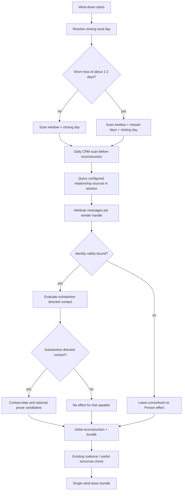

# Full CRM Scan During Wind-down - Plan

## Goal Capsule

- **Objective:** Make every wind-down run one proactive, bounded CRM scan across configured daily relationship surfaces so substantive interactions are not missed when no other source first names a candidate person.
- **Product authority:** Product Contract below is authoritative for behavior. Planning Contract and Implementation Units own how the skill packages change.
- **Open blockers:** None.
- **Execution profile:** Code change to published skills and lightweight behavioral cases. Prefer matched-pair cases that prove the discriminator (Messages-only group contact) and zero-effect safety.
- **Stop conditions:** Do not invent catch-up mode, exhaustive history, skill-owned deep scans, nested CRM bundles, or identity guessing for unknown handles.
- **Product Contract preservation:** restructured, no scope change: R11/R14 and Summary/Key Decisions clarified for per-speaker group attribution (session-settled); R21 added as split-out of the same group-identity intent already implied by R11+R14+AE1+AE4; AE1/AE9 citations re-pointed.

---

## Product Contract

### Summary

Every wind-down source-discovery pass includes a required daily CRM scan before the initial reconstruction. The default window is the closing local day. After a short miss of about a day or two, the same scan expands over those missed local days as a catch-up breath. In direct and group threads, evaluate each speaker whose identity can be bound safely; substantive directed exchanges may earn contact-date outcomes and selective durable prose. Unknown handles stay unresolved. Zero effects remains valid. Deeper historical scans stay user-requested outside this skill change.

### Problem Frame

Wind-down already captures relationship effects when the day's evidence or the user's reflection describes a substantive direct interaction, and it already runs a separate bounded cadence / "useful tomorrow" exception check. Shared source rules also prefer the smallest slice that confirms a candidate. Together that means relationship sources such as Apple Messages can be skipped when no calendar event, mailbox hit, or reflection first identifies a person. A same-day group Messages exchange that carries real per-person contact can therefore never enter the review. That undercuts the proactive relationship-management purpose of the daily close without anyone expanding into catch-up import.

### Key Decisions

- **Required daily CRM coverage inside wind-down source discovery.** The scan always runs before the initial reconstruction, not only when another source or reflection names a candidate. (session-settled: user-directed — chosen over candidate-triggered-only reads: miss proactive relationship management.) Governs R1, R2.
- **Default window is the closing local day; short misses expand the window.** Ordinary closes stay light. A miss of about a day or two widens the same scan over those local days as a catch-up breath, not open-ended history. (session-settled: user-directed — chosen over always-day-only or always-wide history: recover a short gap without bloating every close.) Governs R3, R4.
- **Deeper scans stay ad hoc.** If a longer historical pass is needed, the user asks for it. That path is not written into this skill change. (session-settled: user-directed — chosen over skill-owned deep scan: keep the daily path light.) Governs R17.
- **Per-speaker attribution in group threads.** Group chats are not opaque blobs. Attribute messages to each sender handle; evaluate substantive directed contact per bindable person; leave unbound handles unresolved. (session-settled: user-directed — chosen over group-as-single-entity or skip-all-groups: real contact lives in named group speakers.) Governs R11, R14, R21.
- **Bounded coverage, not catch-up mode.** Full CRM scan means configured daily relationship surfaces plus the existing cadence/context exception check for the scan window. It does not mean exhaustive history, catch-up inventory/triage, or indiscriminate Person creation. Governs R5–R8, R15.
- **Preserve approval and safety contracts.** No Person, Task, communication, or other durable write while preparing the wind-down bundle. Ambient, automated, and broadcast activity produce no contact effect. Governs R9–R16.

### Requirements

**Scan placement and window**

- R1. Wind-down source discovery runs the configured daily CRM scan before presenting the initial reconstruction.
- R2. The scan runs even when no candidate person has surfaced from calendar, mailbox, reflection, or other non-CRM evidence.
- R3. The default scan window is the closing day's local-time bounds.
- R4. When the close follows a short miss of about one or two local days, the same scan expands backward over those missed local days as a catch-up breath, still using finite per-source limits and conservative identity binding.
- R5. The expanded short-miss window remains ordinary wind-down CRM coverage. It is not CRM catch-up mode, inventory, triage, Person reconstruction, or exhaustive history.

**Source coverage**

- R6. Query each configured relationship interaction source independently within the scan window, including Apple Messages through `imsg` when configured, each authorized mailbox within its own identity boundary, and authenticated X evidence when available under its current source contract.
- R7. Apple Messages reads follow `skills/managing-personal-crm/references/apple-messages-cli.md`: read-access preflight, explicit local-day bounds for the scan window, stable chat IDs, and finite limits.
- R8. Continue the existing bounded review of overdue active relationships and defensible connections to current work useful tomorrow, still counted inside wind-down's zero-to-three tomorrow judgment limit when an item becomes a foreground attention item.
- R9. Configured email identity boundaries remain explicit. Calendar visibility never implies email coverage. One available mailbox never implies another.
- R10. Treat unavailable or failed relationship sources as scoped relationship-coverage gaps (Partial for dependent conclusions), not as proof that no interaction occurred.

**Outcomes and safety**

- R11. For each speaker in a direct or group thread, attribute messages by sender handle and inspect substantive directed exchanges (including targeted group participation) for identity-safe contact-date outcomes and relationship-load-bearing meaning. Do not treat a group chat as a single anonymous contact.
- R12. Every safely identified substantive direct interaction has a visible contact-date outcome: novel proposal, Already satisfied, or identity/time unresolved.
- R13. Propose Person prose only for durable meaning likely to improve a future interaction. Raw history remains in the source.
- R14. Ambient group activity, reactions, broadcasts, and unknown handles produce no unsafe CRM effect. Keep unknown handles unresolved instead of guessing identities. A group may yield CRM effects for some speakers and none for others in the same thread.
- R15. Return zero CRM effects when nothing warrants attention. Do not manufacture contact, memory, outreach, or a write to make the run productive.
- R16. Preserve the existing approval boundary: no Person, Task, communication, or other durable write while preparing the wind-down bundle. Contact-date, Person prose, Task, and communication effects remain independently approvable in the existing wind-down bundle. Do not emit a nested CRM bundle.
- R17. Deeper historical relationship scans remain user-requested outside this skill change and are not required of every wind-down.
- R21. When a group thread contains both a safely bindable speaker and an unbound handle, propose CRM effects only for the bindable speaker's supported contact; leave the unbound handle unresolved with no Person attachment.

**Evidence of the behavior change**

- R18. Add a discriminating synthetic wind-down test where the only evidence of a material relationship interaction is a same-day Apple Messages group exchange with a bindable speaker; prior behavior should miss it and revised behavior should surface the supported CRM outcome for that speaker.
- R19. Add a zero-effect test proving that a daily scan with only passive or automated activity creates no CRM proposal.
- R20. Add a short-miss synthetic case where a substantive interaction falls only on a missed local day inside the catch-up breath window and the revised behavior surfaces the supported CRM outcome without entering catch-up mode.

### Actors

- A1. **User** — sole primary actor; owns reflection, short-miss context, and every durable write approval.
- A2. **Wind-down (personal-chief-of-staff)** — owns source discovery order, scan window, review bundle, and run completion.
- A3. **managing-personal-crm companion (embedded)** — evaluates per-speaker identity-safe contact outcomes and durable meaning; returns candidate effects into the caller's bundle without taking ownership of wind-down.

### Key Flows

- F1. Ordinary same-day close
  - **Trigger:** User starts or a schedule starts wind-down for a day with no short miss.
  - **Actors:** A1, A2, A3
  - **Steps:** Resolve the closing local day; run the daily CRM scan for that day across configured relationship sources before the initial reconstruction; attribute group and direct messages per sender; evaluate substantive directed contact through embedded CRM; continue cadence / useful-tomorrow exceptions under existing caps; present reconstruction and the single wind-down bundle with any independently approvable CRM effects.
  - **Outcome:** Supported contacts from the closing day are visible per person; zero effects is allowed; no durable write yet.
  - **Covered by:** R1–R3, R6–R16, R21

- F2. Short-miss catch-up breath
  - **Trigger:** Wind-down closes a day after about one or two missed local days.
  - **Actors:** A1, A2, A3
  - **Steps:** Expand the CRM scan window over the missed local days plus the closing day; apply the same per-speaker identity, substantive-contact, and approval rules; do not enter CRM catch-up inventory or triage.
  - **Outcome:** Interactions that only occurred on a missed day inside the short window can produce the same class of CRM outcomes as same-day interactions.
  - **Covered by:** R4, R5, R11–R16, R20

- F3. Passive-only day
  - **Trigger:** Configured sources are readable, but the window holds only passive, automated, reaction, or broadcast activity.
  - **Actors:** A2, A3
  - **Steps:** Complete the required scan; evaluate and find no substantive direct contact warranting an effect.
  - **Outcome:** No CRM proposal; wind-down continues.
  - **Covered by:** R14, R15, R19

- F4. Mixed group thread
  - **Trigger:** A group chat in the scan window has a bindable speaker with substantive directed messages and at least one unbound handle.
  - **Actors:** A2, A3
  - **Steps:** Attribute by sender; bind and evaluate the known speaker; leave the unknown handle unresolved.
  - **Outcome:** CRM effects only for the bindable speaker when warranted; no invented identity for the unknown handle.
  - **Covered by:** R11, R14, R21

### Acceptance Examples

- AE1. **Covers R1, R2, R6, R7, R11, R12, R18.** Given the only material same-day relationship evidence is a substantive Apple Messages group exchange from a safely bindable speaker, when wind-down prepares the initial reconstruction, then the daily CRM scan has already run and the supported contact-date outcome for that speaker (and optional durable prose if warranted) appears as independently approvable actions in the wind-down bundle.
- AE2. **Covers R14, R15, R19.** Given the scan window contains only passive or automated activity, when the daily CRM scan completes, then the review reports no CRM proposal and invents no contact date, Person prose, or Task.
- AE3. **Covers R4, R5, R12, R20.** Given one local day was missed and a substantive direct interaction occurred only on that missed day, when wind-down closes the next day, then the short-miss window covers that day and surfaces the supported contact-date outcome without starting catch-up inventory or exhaustive history.
- AE4. **Covers R12, R14.** Given a group chat includes an unknown handle that cannot be safely bound, when the scan evaluates the exchange, then the handle stays unresolved and no Person attachment or contact-date proposal is made for that identity.
- AE5. **Covers R9, R10.** Given calendar visibility exists for a work calendar but the corresponding work mailbox is unavailable, when the scan runs, then calendar evidence is still usable, mailbox-dependent conclusions are Partial or omitted, and no mailbox coverage is inferred from the calendar.
- AE6. **Covers R8, R16.** Given an overdue active relationship has a defensible reason useful tomorrow, when prepare-tomorrow runs, then any relationship attention item counts inside the existing zero-to-three tomorrow limit, effects stay in the existing bundle numbering, and no nested CRM bundle is emitted.
- AE7. **Covers R13, R15.** Given a substantive direct interaction that is small talk with no durable future-facing meaning, when evaluation completes, then a contact-date outcome may still be novel or already satisfied, and no Person prose is proposed.
- AE8. **Covers R17.** Given the user wants history beyond the short-miss window, when they ask for a deeper scan, then that request is handled as ordinary user-directed CRM or source work outside the automatic wind-down daily scan contract.
- AE9. **Covers R11, R14, R21.** Given one group thread where speaker A binds to a known Person with substantive directed messages and speaker B is an unbound handle, when the daily CRM scan evaluates the thread, then only A may receive a contact-date outcome and B stays unresolved with no Person effect.

### Success Criteria

- A wind-down that previously missed a Messages-only substantive group-speaker contact now surfaces the supported CRM outcome for that speaker before the initial reconstruction.
- Group threads attribute contact per person; unknown handles never invent identity.
- Ordinary closes do not balloon into catch-up import; short misses recover only the recent gap.
- Passive-only windows produce no CRM noise.
- Approval, identity, and non-write preparation rules remain unchanged from the existing wind-down and CRM contracts.

### Scope Boundaries

**In scope**

- Wind-down required daily CRM scan and short-miss window expansion.
- Per-speaker evaluation of configured relationship interaction sources for that window, plus the existing cadence / useful-tomorrow exception path.
- Discriminating and zero-effect synthetic tests, including short-miss and mixed-group identity cases.

**Out of scope / non-goals**

- CRM catch-up mode (inventory, triage, stage-two reconstruction).
- Exhaustive message history or open-ended “scan since last contact.”
- Skill-owned deep historical scans beyond the short-miss breath.
- Weekly or quarterly product-shape changes beyond shared CRM safety rules.
- Changing the read-only preparation boundary or inventing nested CRM bundles.
- Indiscriminate Person-note creation from ambient activity.

### Dependencies / Assumptions

- `managing-personal-crm` remains the embedded companion for identity, contact-date, and durable-meaning judgment.
- Apple Messages evidence depends on configured `imsg` and OS read access; absence is a scoped gap. History rows expose per-message `sender` handles suitable for attribution.
- Contact-name resolution may use OS Contacts or Person-note links; missing names narrow identity evidence but do not erase raw handles.
- X remains optional and under its current authenticated, read-only, pointer-or-short-slice contract.
- Short-miss detection can use existing wind-down signals such as missing prior daily journals; planning defaults to that detector without a new durable ledger.

### Outstanding Questions

**Resolve Before Planning**

- None.

**Deferred to Planning** (implementation detail; non-blocking)

- Exact wording of the “smallest source slice” exception so required wind-down daily coverage and narrow per-conversation history coexist.
- Exact packaging of synthetic fixtures across personal-chief-of-staff and managing-personal-crm test homes.

### Sources / Research

- Issue: [jrgilbertson/the-rookery#34](https://github.com/jrgilbertson/the-rookery/issues/34)
- Shipped behavior: `skills/personal-chief-of-staff/references/wind-down.md`, `skills/personal-chief-of-staff/references/source-behavior.md`
- CRM contracts: `skills/managing-personal-crm/SKILL.md`, `skills/managing-personal-crm/references/source-behavior.md`, `skills/managing-personal-crm/references/apple-messages-cli.md`, `skills/managing-personal-crm/references/relationship-contract.md`
- Adjacent plan: `docs/plans/2026-08-04-001-refactor-deprecate-morning-into-wind-down-plan.md`
- Related tests: `tests/personal-chief-of-staff/cases/relationship-discovery-boundaries.md`, `tests/managing-personal-crm/cases/messages-adapter-bounds.md`
- Live adapter check (planning only): `imsg` history on group chats exposes per-message `sender`; Contacts can map a named person to a handle for bindable speakers

---

## Planning Contract

### Key Technical Decisions

- KTD1. **Daily CRM scan is a named wind-down source-discovery step, not a new CRM mode.** Implement as explicit instructions in wind-down establish/source path plus companion-compatible evaluation, reusing embedded CRM. (session-settled product shape carried into HOW.) Governs R1, R2, R16.
- KTD2. **Required day-window coverage is an exception to pure candidate-triggered reads.** Reconcile CoS and CRM “smallest slice” language so wind-down must cover configured relationship sources for the scan window, then keep per-conversation history and identity binding narrow. Governs R2, R6, R7.
- KTD3. **Short-miss window uses missing prior journals as the primary detector, capped at about two local days.** Align with existing wind-down “at most one light catch-up / no journal backlog”; do not invent a close-ledger. Governs R4, R5.
- KTD4. **Group evaluation is per `sender` handle, then identity bind.** Follow existing Messages adapter: stable chat IDs, history with window bounds, preserve direct vs group context and actual sender. Governs R11, R14, R21.
- KTD5. **Tests live primarily under personal-chief-of-staff with CRM companion assumptions; add CRM case only if per-speaker identity rules need a direct-mode discriminator.** Match existing case-file style and matched-pair baseline rules in `tests/README.md`. Governs R18–R20.

### High-Level Technical Design

### Implementation Constraints

- Public skills only: no private vault paths, phone numbers, or personal contact dumps in the repo.
- Obsidian Person operations stay CLI-only under existing CRM rules.
- Messages stays read-only via `imsg`; CRM approval never authorizes send.
- Tests are lightweight case files per `tests/README.md`; no personal Messages fixtures committed.
- Keep weekly/quarterly product shape unchanged except shared wording consistency if required.

### Sequencing

1. U1 — Wind-down and CoS source-behavior daily scan contract (window, order, short-miss, companion handoff).
2. U2 — CRM companion source rules and Messages attribution language (smallest-slice exception; per-sender group evaluation).
3. U3 — Discriminating behavioral cases and log/provenance updates.

U1 before U2 so the caller names the required scan before the companion rewrites slice rules. U3 can draft against U1/U2 text once both are stable.

### Assumptions

- Embedded CRM remains available for ordinary wind-down; when unavailable, existing reduced-coverage behavior still applies.
- Finite chat enumeration for the day window is enough for daily scan; catch-up breadth probes stay catch-up-only.

---

## Implementation Units

### U1. Require daily CRM scan in wind-down source discovery

- **Goal:** Wind-down always runs a bounded Daily CRM Scan before the initial reconstruction, with closing-day default and short-miss expansion, while preserving approval and cadence-exception separation.
- **Requirements:** R1–R5, R8–R10, R16, R17; F1–F3; AE3, AE5, AE6, AE8
- **Dependencies:** None
- **Files:**
  - modify: `skills/personal-chief-of-staff/references/wind-down.md`
  - modify: `skills/personal-chief-of-staff/references/source-behavior.md`
  - modify: `CONCEPTS.md` (Daily CRM Scan entry already present; keep aligned)
- **Approach:**
  1. In **Establish the day** (or an immediately following source-discovery subsection), require the Daily CRM Scan before the broad reflection / initial reconstruction. Cite the scan window rules per R3–R5.
  2. Replace or extend **Capture relationship effects selectively** so evaluation is driven by scan results plus reflection, not only by evidence that already named a person.
  3. Keep **Relationship exceptions for tomorrow** as a separate bounded check inside the 0–3 cap; do not merge it into interaction capture.
  4. In CoS `source-behavior.md`, state that wind-down’s required relationship-source coverage for the scan window is intentional and does not authorize catch-up breadth or pre-approval writes.
  5. Short-miss: detect via missing prior daily journals (existing wind-down posture), expand only about one or two local days, never open-ended history.
- **Patterns to follow:** Existing wind-down section + Completion blocks; morning-deprecation plan’s wind-down ownership style; companion embedded-mode ownership in source-behavior.
- **Test scenarios:** Covered primarily by U3 cases; unit verification is instruction completeness and consistency with R1–R5 wording.
- **Verification:** Wind-down text orders scan before reconstruction; day vs short-miss windows are explicit; no catch-up mode or deep-scan duty; cadence exceptions remain separate; approval boundary intact.

### U2. Align CRM companion for day-window scan and per-speaker groups

- **Goal:** Embedded CRM can satisfy wind-down’s required day-window coverage while keeping per-conversation history narrow, and group threads evaluate per sender handle with conservative identity binding.
- **Requirements:** R6, R7, R11–R15, R21; F1, F4; AE1, AE2, AE4, AE7, AE9
- **Dependencies:** U1
- **Files:**
  - modify: `skills/managing-personal-crm/SKILL.md` (smallest-slice / evidence boundary)
  - modify: `skills/managing-personal-crm/references/source-behavior.md`
  - modify: `skills/managing-personal-crm/references/apple-messages-cli.md` (day-window scan vs catch-up breadth; per-sender attribution)
  - modify: `skills/managing-personal-crm/references/relationship-contract.md` only if targeted-group / ambient wording needs a one-line consistency touch
- **Approach:**
  1. State that when a caller requires a bounded day-window relationship scan (wind-down), querying each configured source for that window is required coverage, not a violation of “smallest slice.”
  2. Keep ordinary direct/embedded non-scan requests on the existing smallest-slice rule.
  3. For Messages: day-window scan enumerates chats with activity in the window (finite limits), then reads history per chat with explicit start/end and limits; do not use catch-up breadth probes for daily scan.
  4. Attribute history by `sender`; bind identity before Person effects; preserve direct vs group context; ambient reactions/broadcasts never count as contact.
  5. Mixed group: bindable speakers may produce effects; unbound handles stay unresolved in the same thread.
- **Patterns to follow:** `apple-messages-cli.md` read-only surfaces and identity rules; relationship-contract substantive vs ambient contact; embedded mode returns effects to caller bundle.
- **Test scenarios:** Covered by U3; optional CRM-only case if CoS case cannot express per-speaker binding alone.
- **Verification:** CRM docs distinguish required day-window coverage from catch-up; Messages instructions require per-sender evaluation; no send path; no inventing identities.

### U3. Discriminating wind-down CRM scan tests

- **Goal:** Prove the behavior change with binary case files: Messages group-speaker contact surfaces; passive-only yields zero effects; short-miss breath recovers a missed day without catch-up mode.
- **Requirements:** R18–R20; AE1–AE4, AE9
- **Dependencies:** U1, U2
- **Files:**
  - create: `tests/personal-chief-of-staff/cases/wind-down-daily-crm-scan.md` (or split into focused cases if checklists grow unwieldy)
  - modify: `tests/personal-chief-of-staff/cases/relationship-discovery-boundaries.md` only if scenario 3 still implies reflection-first capture and needs a scan-order note
  - modify: `tests/personal-chief-of-staff/log.md` when runs land
  - optional create: `tests/managing-personal-crm/cases/group-sender-attribution.md` if a CRM-direct discriminator is needed
- **Approach:**
  1. Author synthetic prompts (no real phone numbers or personal dumps). Include a same-day group exchange with one bindable speaker and enough handle metadata that identity binding is possible under the contract.
  2. Case A discriminator: only evidence is the group exchange; prior reflection/calendar do not name the person; expected: scan runs, contact-date outcome for that speaker.
  3. Case B: passive/automated/reaction-only window → no CRM proposal.
  4. Case C: interaction only on a missed local day inside short-miss window → supported outcome, no catch-up inventory.
  5. Include mixed-group unbound-handle assertion (AE9) either as a checklist item or separate scenario.
  6. Provenance lines name the prior miss (candidate-triggered skip) and the intended improvement.
- **Execution note:** Run matched pairs (frozen prior vs revised) for discriminating cases per `tests/README.md` before shipping the skill change.
- **Patterns to follow:** Existing CoS case files (`relationship-discovery-boundaries.md`, `x-relationship-evidence.md`); binary checklists; one log line per graded variant.
- **Test scenarios:**
  - Covers AE1/R18: group-only same-day bindable speaker → contact-date proposal in wind-down bundle before/with reconstruction path; no nested CRM bundle.
  - Covers AE2/R19: passive-only → zero CRM effects.
  - Covers AE3/R20: short-miss window recovers missed-day contact without catch-up mode.
  - Covers AE4/AE9: unbound handle unresolved; bindable speaker may still get an effect.
  - Approval boundary: no write during preparation.
- **Verification:** Matched pairs show intended improvement on discriminators with no safety regression; log lines recorded.

---

## Verification Contract

| Gate | Command / method | Applies to |
| --- | --- | --- |
| Instruction consistency | Grep skill packages for residual “query only when candidate already named” wind-down CRM posture; confirm scan-before-reconstruction and per-sender group language | U1, U2 |
| Structural skill validation | Project’s usual `skills-ref` / packaging checks if used for skill PRs | U1, U2 |
| Behavioral matched pairs | Fresh-context runs of U3 cases without skill/prior vs with revised skills; binary checklists | U3 |
| Safety invariants | Passive-only, unknown-handle, no nested bundle, no pre-approval write items must pass on both variants | U1–U3 |
| No personal data in repo | Diff contains no real phone numbers, vault paths, or message dumps | all |

`release:validate` / install smoke only if packaging or skill description triggers change in a way the suite requires; default is behavioral cases for this behavior change.

---

## Definition of Done

- [ ] Product Contract R1–R21 are satisfied by skill text (and tests for R18–R20).
- [ ] U1–U3 complete with verification above.
- [ ] Daily CRM Scan appears in wind-down before initial reconstruction for both day-window and short-miss paths.
- [ ] Group threads evaluate per speaker; unknown handles never invent Persons.
- [ ] Discriminating matched-pair cases pass; zero-effect and short-miss cases pass.
- [ ] No catch-up mode, nested CRM bundle, or skill-owned deep-scan duty introduced.
- [ ] Abandoned experimental wording removed; CHANGELOG updated if the skill ships publicly in this PR.
- [ ] CONCEPTS Daily CRM Scan entry remains consistent with shipped language.
