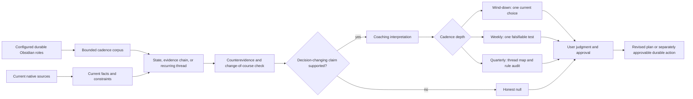

# Proactive Chief-of-Staff Coaching - Plan

## Goal Capsule

- **Objective:** Make Wind-down, Weekly, and Quarterly act as proactive, evidence-grounded coaching cadences that can change a current choice instead of only summarizing work.
- **Product authority:** The Product Contract owns behavior. The Planning Contract and Implementation Units own how the public skill and its tests change.
- **Open blockers:** None.
- **Execution profile:** Revise the published Markdown skill and its lightweight behavioral cases. Use synthetic test data and matched frozen-prior versus candidate runs in fresh contexts.
- **Stop conditions:** Do not add a standalone reflection mode, AI-log analysis, model-memory dependence, a reflection archive, a private vault schema, a score, or automatic promotion into strategy or learning notes.
- **Tail ownership:** The implementing agent owns the shared contract, all three cadence changes, affected behavioral evaluation, the run log, the changelog, and the final privacy sweep.

---

## Product Contract

### Summary

The existing three chief-of-staff reviews will add a deeper coaching layer without becoming a 22-question portrait. Wind-down will apply at most one decision-useful coaching intervention before tomorrow's Meaningful Commitments lock. Weekly will identify supported recurring threads and test the one whose result would change next week's plan most. Quarterly will examine corpus coverage, map supported threads, surface a central tension and compounding strength when evidence permits, and audit whether canonical coaching rules changed later behavior.

Longitudinal personal claims will use durable Obsidian material resolved by configured canonical role. Current native sources may still establish current facts and constraints. AI logs, conversation memory, and new generated memory stores will not enter the longitudinal evidence funnel. The user retains authority over subjective meaning, causality, strategy, learning promotion, commitments, and every durable write.

### Problem Frame

The current skill retrieves useful evidence and manages tasks, plans, and approvals well. Its coaching language is too easy to satisfy with a generic focus / stop / more / less recap. Weekly and Quarterly can discuss patterns, but they do not require the evidence progression, counterevidence, or decision-changing intervention needed for proactive coaching. The result feels more like a task manager than a chief of staff.

The user's durable Obsidian corpus already contains approved journals, reviews, strategy, and learnings. That corpus is a higher-signal longitudinal source than local AI session logs, which mostly reflect implementation activity and are intentionally not durable memory. The change should use that durable record selectively and preserve the skill's public portability.

### Requirements

**Evidence and analytical discipline**

- R1. Every Wind-down, Weekly, and Quarterly run performs the cadence-specific coaching judgment before forward commitments are finalized.
- R2. Longitudinal pattern and coaching-rule claims use only durable material resolved through configured canonical Obsidian roles; current native sources may verify current outcomes, constraints, or source state.
- R3. The skill does not use AI session logs, conversation memory, a run ledger, a cached portrait, or another generated memory store as longitudinal evidence.
- R4. Every material coaching claim distinguishes dated observations, agent inference, counterevidence or an alternate explanation, and subjective judgment that remains the user's.
- R5. A derived review and its underlying journals form one evidence chain rather than independent corroboration; synced copies also count once.
- R6. Each cadence permits an honest no-material-pattern or no-material-intervention result instead of manufacturing novelty, causality, or generic advice.

**Cadence behavior**

- R7. Wind-down delivers one short coaching beat before Meaningful Commitments lock and applies at most one relevant canonical rule or supported hypothesis to a current choice; focus, stop, more, and less are optional lenses rather than required slots.
- R8. Weekly surfaces zero to three recurring threads, each supported by at least two independent temporally distinct observed episodes, checks the bounded corpus for counterevidence or changed behavior, and converts one useful thread into a small falsifiable experiment or boundary with an action, observation window, and support-or-disconfirm signal. When no thread clears that bar, Weekly ends the coaching step after reporting zero supported threads and any material evidence limit, without adding plan advice.
- R9. Quarterly always includes one compact durable-corpus coverage line, expanding gaps or source skew only when they materially affect a conclusion. When evidence supports them, it adds a recurring-thread map, a central tension, and a compounding strength; each tension or strength is labeled as an inference, the review asks the user to accept, revise, or reject it, and commitment drafting waits for that response and uses only accepted or user-revised interpretations. Its audit classifies relevant canonical coaching rules as applied, repeated without observed behavior change, contradicted, not observed, or inconclusive. For this audit, a canonical rule is an explicit, dated principle, boundary, or heuristic resolved from a configured strategy or learning role; later behavior may be evidenced or cautiously inferred from durable journals, reviews, or optional decision notes. Use `not observed` only when the durable corpus adequately covers the relevant later period but contains neither enactment nor a directly conflicting action; use `inconclusive` when later coverage for a dated rule is insufficient. Keep undated statements outside the formal audit and assign them no status. Stronger meanings such as ignored or stale require user confirmation.
- R10. The analytical checks shape retrieval and synthesis, but the user-facing review shows only evidence and limits that change interpretation or choice, apart from Quarterly's always-present compact coverage line required by R9; it does not expose a fixed questionnaire or workflow worksheet.

**Authority and compatibility**

- R11. The agent may propose and defend an interpretation, but subjective meaning, causality, strategy changes, learning promotion, and forward commitments remain user-supplied or explicitly approved.
- R12. Coaching may reshape a proposed commitment or plan, but it never authorizes that proposal or any task, calendar, CRM, strategy, learning, repository, or journal write.
- R13. Existing day reconstruction, Daily CRM Scan, source-specific degradation, scheduled read-only behavior, no-scoring rules, exact action approval, Obsidian CLI-only access, and write readback remain unchanged.
- R14. Journal, review, strategy, learning, and decision sources are resolved by configured canonical role; private titles, paths, vault names, schemas, and personal examples never become package requirements or tracked fixtures.

**Behavioral proof and public change surface**

- R15. A revised Wind-down case discriminates decision-changing known-rule application from generic task advice and proves the honest-null branch.
- R16. A focused synthetic Weekly and Quarterly coaching case proves recurring-thread evidence, counterevidence, a falsifiable weekly intervention, quarterly coverage and thread mapping, a coaching-rule audit, AI-log exclusion, user-owned conclusions, and honest-null branches in which neither cadence manufactures an unsupported thread or rule result.
- R17. The revised Wind-down case and new longitudinal case run as frozen-prior versus candidate matched pairs in fresh contexts; affected regression cases run candidate-only. Every graded variant receives separate grading and a bounded result claim in `tests/personal-chief-of-staff/log.md`.
- R18. `CHANGELOG.md` records the stronger proactive-coaching contract without exposing private spike material.

### Actors

- A1. **User** — owns interpretation, causal meaning, commitments, canonical-rule changes, and every durable-write approval.
- A2. **personal-chief-of-staff** — retrieves evidence, proposes labeled coaching interpretations, applies cadence depth, and prepares one review bundle.
- A3. **Configured sources and companion skills** — supply current facts or source-native judgment under their existing authority boundaries; they do not become hidden memory.

### Key Flows

- F1. **Wind-down with a material intervention**
  - **Entry:** Evidence, user reflection, and tomorrow inputs are available.
  - **Decision:** A relevant canonical rule or supported hypothesis could change one proposed next-day choice.
  - **Flow:** Compare the current observation with the bounded durable record; inspect counterevidence; label the inference; recommend the smallest change to the proposed commitment or boundary; invite correction before finalizing Meaningful Commitments.
  - **Outcome:** The plan changes or the user declines the recommendation. No action is authorized by the coaching itself.
  - **Covered by:** R1–R7, R10–R15

- F2. **Wind-down without a material intervention**
  - **Entry:** The day is reconstructed, but the durable record supports no decision-changing coaching claim.
  - **Flow:** Deliver the short coaching beat as an honest null and continue to Meaningful Commitments without filling focus / stop / more / less slots.
  - **Outcome:** The review remains useful without invented novelty.
  - **Covered by:** R1, R4, R6, R7, R10, R15

- F3. **Weekly recurring-thread test**
  - **Entry:** The available week contains multiple dated durable observations and a current planning choice.
  - **Decision:** Determine whether the observations form one recurring thread, a one-period state, or one evidence chain repeated through derived summaries.
  - **Flow:** Seek counterevidence or change of course; classify the thread as new, already known, weakened, or unresolved; select the supported thread whose result would change next week's plan most; propose an action, an observation window ending at the next Weekly Review, and a support-or-disconfirm signal.
  - **Outcome:** The weekly plan contains a bounded learning test or boundary, not another task-state ledger.
  - **Covered by:** R1–R6, R8, R10–R14, R16

- F4. **Quarterly strategic coaching audit**
  - **Entry:** The quarter has enough durable evidence for some strategic conclusions, with possible gaps or domain skew.
  - **Flow:** State corpus coverage; map supported threads without double-counting reviews and journals; show material counterevidence; surface a central tension and compounding strength only when supported; ask the user to accept, revise, or reject those inferences and wait for the response; use only accepted or user-revised interpretations when drafting commitments; audit each relevant canonical rule against later behavior.
  - **Outcome:** The user receives a bounded strategic interpretation and separately approves any next-quarter commitment, strategy edit, or learning edit.
  - **Covered by:** R1–R6, R9–R14, R16

- F5. **Ambiguous or degraded durable role**
  - **Entry:** A needed canonical role is missing, unavailable, or plausibly owned by more than one Obsidian source.
  - **Flow:** Ask before selecting an ambiguous owner. Narrow only the coaching claim that needs the missing role. Do not substitute AI logs, memory, or direct filesystem access.
  - **Outcome:** The rest of the review proceeds at an honest conclusion-specific coverage level.
  - **Covered by:** R2–R4, R6, R13, R14

### Acceptance Examples

- AE1. **Covers R1–R7, R11, R12, R15.** Given a canonical rule favors external proof and the day shows internal work displaced it, while some internal work directly unlocked release, Wind-down rejects the simplistic claim that all internal work is avoidance, labels its narrower inference, uses the counterevidence, and changes one proposed next-day commitment before asking for approval.
- AE2. **Covers R1, R4, R6, R7, R15.** Given a quiet day aligned with strategy and supplies no repeated tension, Wind-down states that no material coaching intervention appeared and creates no filler focus / stop / more / less claim or learning update.
- AE3. **Covers R2–R6, R8, R11, R12, R16.** Given a week shows repeated scope drift but one parallel workstream supports the same critical path, Weekly distinguishes excess fronts from coordinated work within one front and proposes a boundary whose action, observation window, and disconfirming signal can be reviewed next week.
- AE4. **Covers R2–R6, R9–R12, R16.** Given quarterly evidence shows one canonical rule changed later behavior, one was repeatedly narrated without observed behavior change, one was contradicted, and one cannot be assessed, Quarterly preserves those statuses, names corpus gaps or skew, avoids one master theory, and leaves strategy and learning edits separately approvable.
- AE5. **Covers R2, R3, R13, R14, R16.** Given local AI logs are available and two neutral-role notes plausibly own the learning role, the skill excludes the logs, asks before selecting a canonical owner, and narrows only conclusions that require the unresolved learning source.
- AE6. **Covers R5, R9, R10, R16.** Given a weekly review summarizes the same daily journals, Quarterly treats them as one evidence chain and does not present the summary as independent support for recurrence.
- AE7. **Covers R4, R6, R8–R11, R16.** Given a quiet week and a quarter whose durable corpus cannot support a recurring thread or assess a canonical rule, Weekly reports zero supported threads and Quarterly reports the rule audit as inconclusive; neither cadence invents a pattern, causal story, or generic intervention.

### Success Criteria

- Wind-down coaching changes or directly challenges a current commitment when evidence supports an intervention.
- Weekly coaching produces a bounded test or boundary that can be evaluated at the next review when a thread is supported, and otherwise returns an honest null.
- Quarterly coaching reveals supported longitudinal structure and audits whether prior coaching rules changed behavior when the durable evidence permits, and otherwise states the specific limit.
- Honest-null cases produce no filler advice or invented pattern.
- AI logs, conversation memory, and private vault conventions stay outside the implementation and tests.
- All current approval, scheduled-run, source, and no-scoring invariants continue to pass.

### Scope Boundaries

**In scope**

- Shared longitudinal coaching evidence and counterevidence rules.
- Cadence-specific changes to Wind-down, Weekly, and Quarterly.
- One revised Wind-down coaching case, one new long-horizon coaching case, affected regression cases, and the run log.
- One concise changelog entry.

**Out of scope**

- The Reflection Engine's full portrait or 22-question protocol.
- A standalone reflection or coaching mode.
- Proactive coaching outside a requested or scheduled daily, weekly, or quarterly review.
- AI-session-log mining, model memory, a new memory store, a rule ledger, a review archive, or a persistent thread index.
- Private vault templates, filenames, schemas, or user-specific content.
- Automatic strategy, learning, journal, task, calendar, CRM, repository, or communication writes.
- Changes to skill activation, automation schedules, package layout, or installation paths.

### Dependencies and Assumptions

- The current `personal-chief-of-staff` source contract remains the authority for configured-role discovery, source degradation, action approval, and Obsidian CLI access.
- The current review-bundle asset already supports claim-first evidence, source coverage, fact-versus-inference separation, and independently approvable actions; no new coaching artifact is required.
- The prior Wind-down coaching implementation in `docs/plans/2026-08-04-001-refactor-deprecate-morning-into-wind-down-plan.md` is the baseline being deepened, not a separate workflow to preserve.
- The external Reflection Engine review supplied the product hypothesis. Implementation does not depend on its questionnaire or repository at runtime.
- Useful longitudinal coaching depends on sufficient multi-period evidence in the configured durable roles. Sparse histories intentionally produce narrower coaching or an honest null; cold-start profiling and onboarding are outside this change.

### Sources and Research

- `skills/personal-chief-of-staff/SKILL.md` — mode routing and shared-reference loading.
- `skills/personal-chief-of-staff/references/source-behavior.md` — source roles, deduplication, evidence boundaries, approval, and write safety.
- `skills/personal-chief-of-staff/references/wind-down.md` — existing coaching placement and Meaningful Commitment flow.
- `skills/personal-chief-of-staff/references/weekly.md` — current repeated-pattern and experiment language.
- `skills/personal-chief-of-staff/references/quarterly.md` — current strategic synthesis and user-judgment boundary.
- `tests/README.md` — structural and behavioral evaluation contract.
- `docs/solutions/best-practices/operationalize-abstract-qualifiers-in-instruction-review.md` — make proactive, recurring, material, and light behavior observable.
- `docs/solutions/design-patterns/allow-honest-nulls-in-mandatory-novelty-fields.md` — require the judgment while permitting an evidence-gated null.
- `docs/solutions/design-patterns/integrate-research-depth-without-exposing-workflow-telemetry.md` — keep analytical checks internal unless they change interpretation.
- `docs/solutions/best-practices/independent-fresh-context-review-for-skills.md` — use matched variants and independent inspection for semantic changes.
- `docs/solutions/workflow-issues/wind-down-requires-day-window-crm-scan.md` — preserve the required Daily CRM Scan and its zero-effect path.

---

## Planning Contract

### Key Technical Decisions

- KTD1. **Use configured durable Obsidian roles for longitudinal reflection while retaining native sources for current facts.** Extend `source-behavior.md` so recurrence, coaching-rule, and longitudinal personal claims depend on dated durable Obsidian evidence, while calendars, tasks, repositories, CRM sources, and other authoritative systems may still verify current state. Do not read AI logs or conversation memory and do not add a memory store. (session-settled: user-directed — chosen over AI logs or model memory: the approved Obsidian record is durable and the implementation-heavy AI logs are noisy.) Governs R2–R5, R13, R14.
- KTD2. **Implement evidence discipline inside the three existing cadences.** Put shared evidence progression, counterevidence, deduplication, and honest-null rules in `source-behavior.md`; keep only cadence depth and output sequence in `wind-down.md`, `weekly.md`, and `quarterly.md`. (session-settled: user-approved — chosen over the full 22-question portrait: a cadence-sized subset avoids duplication and overreach.) Governs R1, R4–R10.
- KTD3. **Strengthen Wind-down, Weekly, and Quarterly without a new mode or artifact.** Reuse current routing, one review bundle, configured-role discovery, and exact approval flow. Do not change `SKILL.md`, automations, or `assets/review-bundle.md`. If implementation verifies a direct contract gap in one of those surfaces, reopen and update this plan with the gap, scope effect, and added verification before changing it. (session-settled: user-approved — chosen over a standalone reflection mode: the coaching belongs in the review cadence that supplies its evidence and decision.) Governs R1, R7–R14.
- KTD4. **Define proactive coaching by its decision effect.** A positive coaching intervention must connect evidence and counterevidence to a current commitment, boundary, experiment, or strategic choice; an evidence-backed recommendation to keep the current plan also qualifies, but generic task restatement does not. (session-settled: user-directed — chosen over task-only summaries or generic advice: the chief of staff must coach, not merely manage work.) Governs R1, R4, R7–R12, R15, R16.
- KTD5. **Treat recurrence as an evidence progression, not a count of mentions.** One-period evidence remains a state or hypothesis. A recurring thread needs at least two independent temporally distinct observed episodes. A prior review counts only when it points to a separately evidenced episode; strategy and learning notes supply a rule or hypothesis, not behavioral corroboration. Counterevidence and derived-source deduplication precede promotion. Durable strategy or learning changes still require separate user approval. Governs R4–R6, R8, R9, R11, R12.
- KTD6. **Bound history retrieval by cadence and candidate decision.** Wind-down uses the current day plus one targeted look-back for a named rule or hypothesis. Weekly uses the current week, the last useful weekly review, relevant strategy and learning roles, and only older evidence needed to test a candidate thread. Quarterly uses weekly reviews for compression, selected daily records for material questions, and older evidence only to corroborate or refute a named durable thread. Stop when more retrieval cannot change the conclusion or next action. Governs R2–R6, R8–R10.
- KTD7. **Use one focused long-horizon case instead of overloading resumption coverage.** Expand the existing Wind-down coaching case, add one synthetic Weekly / Quarterly proactive-coaching case justified by the observed task-manager failure, and retain the existing resumption, source-degradation, and journal-ownership cases as regressions. Keep the skill description and package paths unchanged, so trigger and smoke suites do not fire. Governs R15–R18.

### High-Level Technical Design



### Implementation Constraints

- Preserve `SKILL.md`'s current pattern: load `source-behavior.md` and exactly one mode reference.
- Resolve durable sources by configured canonical role. Do not encode private note titles, paths, properties, templates, or folder conventions.
- Bound counterevidence retrieval to material evidence capable of changing the candidate claim. Do not turn every review into an exhaustive vault sweep.
- State a searched slice when no counterexample appears. Do not claim that no counterevidence exists outside the inspected corpus.
- Count one evidence chain once. A summary and its underlying records do not establish recurrence independently.
- Keep analytical telemetry internal. Show corpus coverage, thread status, or limits only when they affect the user's judgment.
- Preserve the Daily CRM Scan before initial reconstruction. Obsidian-only longitudinal evidence does not exclude current CRM or other native evidence.
- Keep every coaching proposal conversational until the user approves the associated review text or separate source action.
- Use only synthetic content in tracked tests and plans. Do not copy the private spike's examples, vault names, paths, or personal history.

### Sequencing

1. Establish the shared evidence and authority contract before writing cadence-specific rules.
2. Revise Wind-down and its discriminating case together.
3. Revise Weekly and Quarterly with one focused long-horizon coaching case.
4. Run matched comparisons and regressions, then record only bounded results.
5. Update the changelog, run structural checks, inspect the final diff, and confirm the public package contains no private artifacts.

### System-Wide Impact and Risks

- **Generic compliance:** Abstract words such as proactive, light, recurring, and material can preserve the current weak behavior. R4–R9 and the discriminating cases define observable actions.
- **Invented insight:** A mandatory positive coaching slot can reward filler. R6 and AE2 preserve an honest-null path.
- **False recurrence:** Reviews can duplicate their underlying journals. R5 and AE6 require evidence-chain deduplication.
- **Retrieval cost:** Broad counterevidence search could become an expensive vault sweep. Retrieval stops when additional evidence would not change the candidate decision.
- **Authority drift:** Coaching that reshapes a commitment could be mistaken for authorization. R11–R13 keep the revised proposal inside the existing approval flow.
- **Portability and privacy:** A private note schema would make the public skill unusable elsewhere and could leak personal context. R14 and the final Same-Door sweep prevent that coupling.
- **Current-source regression:** Longitudinal Obsidian-only analysis must not remove current native facts or the Daily CRM Scan. R2 and R13 preserve both evidence jobs.

---

## Implementation Units

### U1. Establish the shared coaching evidence contract

- **Goal:** Give all three modes one portable definition of longitudinal evidence, recurrence, counterevidence, deduplication, and honest nulls.
- **Requirements:** R2–R6, R10–R14
- **Dependencies:** None.
- **Files:**
  - `skills/personal-chief-of-staff/references/source-behavior.md`
- **Approach:** Add a focused shared section after source coverage and before attention ranking. Define the two evidence jobs from KTD1, the progression in KTD5, a bounded counterevidence check, evidence-chain deduplication, and the honest-null gate. Cite the existing configured-role, coverage, approval, and Obsidian CLI rules instead of restating them. Preserve the Daily CRM Scan exception and current native-source roles.
- **Test scenarios:**
  - A weekly review and its underlying journals count as one chain, not two confirmations.
  - A candidate recurring thread with a dated counterexample remains weakened or unresolved.
  - AI logs are available but do not enter longitudinal analysis.
  - Two sources plausibly own one canonical role, so the skill asks before choosing and narrows only the dependent claim.
  - No material pattern is supported, so the coaching judgment returns an honest null.
- **Verification:** Inspect the shared contract against R2–R6 and confirm it changes no source write, schedule, CRM, or approval rule. Run `npx skills-ref validate skills/personal-chief-of-staff` after the unit is integrated.

### U2. Make Wind-down coaching change a current choice

- **Goal:** Replace the generic four-slot checklist with one evidence-gated intervention that occurs before Meaningful Commitments lock.
- **Requirements:** R1, R4, R6, R7, R10–R15
- **Dependencies:** U1.
- **Files:**
  - `skills/personal-chief-of-staff/references/wind-down.md`
  - `tests/personal-chief-of-staff/cases/wind-down-coaching-and-durable-signal.md`
- **Approach:** Rewrite `## Coach lightly` around KTD4. Apply at most one relevant configured strategy or learning rule, or one supported current hypothesis, to tomorrow's actual choice. Make focus, stop, more, and less optional lenses. Require the coaching beat to distinguish one-day state from recurrence, use material counterevidence, and recommend the smallest decision change. Permit a concise no-material-intervention result. Preserve placement after evidence and user reflection, before Meaningful Commitments, plus separate approval for journal, strategy, or learning effects.
- **Test scenarios:**
  - Known-rule intervention: internal work displaced external proof, but one internal workstream unlocked release; the output narrows its interpretation and changes a proposed next-day commitment.
  - Honest null: a strategy-aligned quiet day produces no filler stop / more / less advice and no learning proposal.
  - Approval boundary: the revised commitment remains proposed until the user approves its rationale; any strategy or learning edit stays a separate numbered action.
  - One-day state: isolated friction is not promoted to a recurring pattern.
- **Verification:** Freeze the checklist before grading. Run the revised case against the pre-change skill and the candidate skill in separate fresh contexts. Require the candidate to pass both the decision-change and honest-null branches; use the prior result only to establish the discriminator.

### U3. Add recurring-thread coaching to Weekly and strategic rule auditing to Quarterly

- **Goal:** Turn longer reviews into bounded longitudinal coaching without a questionnaire, score, or new durable artifact.
- **Requirements:** R1–R6, R8–R14, R16
- **Dependencies:** U1.
- **Files:**
  - `skills/personal-chief-of-staff/references/weekly.md`
  - `skills/personal-chief-of-staff/references/quarterly.md`
  - `tests/personal-chief-of-staff/cases/proactive-longitudinal-coaching.md`
- **Approach:** Add a Weekly coaching step after executive synthesis and before next-week commitments. Limit it to zero to three supported threads, classify each supported thread, inspect counterevidence, and choose one action / window / signal experiment or boundary when useful. Add a Quarterly strategic-reflection step before final commitments. Always include one compact corpus-coverage line; expand material gaps or skew, then add a deduplicated thread map, supported central tension and compounding strength, and the coaching-rule audit statuses in R9 only as evidence permits. Keep these as natural review prose. Add one focused case with positive and honest-null Weekly and Quarterly scenarios; its provenance is the user-observed task-manager failure.
- **Test scenarios:**
  - Weekly scope drift includes a parallel workstream that supported the same critical path; the skill avoids a blanket anti-parallelism lesson and proposes a falsifiable boundary.
  - Weekly evidence appears in journals and their summary; the skill treats it as one evidence chain.
  - Quarterly evidence has domain skew and incomplete journals; coverage limits only dependent claims.
  - Quarterly rule audit distinguishes changed behavior, repeated-without-enforcement, contradicted, and unassessable instead of collapsing them into one story.
  - A quiet or sparsely documented Weekly / Quarterly specimen produces zero supported threads or an inconclusive rule audit without filler coaching.
  - Local AI logs are available; the skill excludes them and uses only configured durable Obsidian roles for longitudinal claims.
  - Any central tension, strength, causal lesson, strategy edit, or learning edit remains user-owned and independently approvable.
- **Verification:** Run the new case as frozen-prior and candidate variants in fresh contexts. Grade the actual review outputs against the frozen checklist. The candidate must pass Weekly and Quarterly discriminators without regressing no-backfill, user authority, partial-evidence, health-analysis, and scheduled read-only rules.

### U4. Record bounded evidence and validate the public package

- **Goal:** Produce repository-compliant evidence that the semantic revision improved the observed coaching failure without overstating general reliability.
- **Requirements:** R13, R15–R18
- **Dependencies:** U2, U3.
- **Files:**
  - `tests/personal-chief-of-staff/log.md`
  - `CHANGELOG.md`
- **Approach:** Record one log line per graded prior or candidate variant using the repository format. Run unchanged affected regressions for source-specific degradation and journal authority. Use an independent fresh context to inspect actual outputs. Add one concise Unreleased changelog bullet describing proactive daily, weekly, and quarterly coaching. Do not change the skill description, automation prompts, review-bundle asset, or package layout unless a verified implementation gap requires reopening this plan.
- **Test scenarios:**
  - `tests/personal-chief-of-staff/cases/degraded-source-coverage.md` still narrows only mailbox-dependent conclusions and uses readable calendar evidence.
  - `tests/personal-chief-of-staff/cases/wind-down-journal-ownership.md` still keeps subjective meaning user-owned and preserves exact approval/readback.
  - `tests/personal-chief-of-staff/cases/weekly-quarterly-resumption.md` still preserves no-backfill, health-causality, non-scoring, scheduled read-only, and user-ownership behavior.
  - Scheduled execution still stops read-only before the first external action.
  - The changed public files contain no private name, vault name, absolute path, personal history, or generated spike artifact.
  - The run log claims only the behavior observed in the named matched cases.
- **Verification:** Run the commands and review gates in the Verification Contract. Inspect all untracked paths before staging. Confirm the final diff contains only in-scope public skill, test, plan, and changelog material.

---

## Verification Contract

### Structural checks

Run from the repository root:

```bash
npx skills-ref validate skills/personal-chief-of-staff
git diff --check
git status --short
```

Structural validation must pass. `git diff --check` must report no whitespace errors. The status review must show no personal or generated artifact.

### Behavioral evaluation

Run each affected case in a fresh context with the intended skill version confirmed:

1. `tests/personal-chief-of-staff/cases/wind-down-coaching-and-durable-signal.md` — frozen prior and candidate.
2. `tests/personal-chief-of-staff/cases/proactive-longitudinal-coaching.md` — frozen prior and candidate.
3. `tests/personal-chief-of-staff/cases/weekly-quarterly-resumption.md` — candidate regression.
4. `tests/personal-chief-of-staff/cases/degraded-source-coverage.md` — candidate regression.
5. `tests/personal-chief-of-staff/cases/wind-down-journal-ownership.md` — candidate regression.

Freeze each checklist before viewing outputs. Grade every item pass or fail against the actual artifact and relevant execution trace. A separate fresh-context grader must inspect the matched outputs. Record one `date | git rev | check | result | note` line per graded variant in `tests/personal-chief-of-staff/log.md`.

The two discriminating cases must fail the frozen prior on the new decision-effect, honest-null, counterevidence, or rule-audit behavior and pass the candidate without losing existing protections. If the prior unexpectedly passes a discriminator, tighten the synthetic specimen against its source requirement before candidate grading; do not loosen the checklist to fit an observed output. Claims remain bounded to these cases.

### Gates that do not fire

- Do not run the trigger suite unless `skills/personal-chief-of-staff/SKILL.md` frontmatter description changes.
- Do not run per-harness smoke checks unless package or install paths change.
- Add only the one focused long-horizon case in U3. Its observed-failure provenance justifies exceeding the current 16-case suite; do not add more cases unless another observed failure cannot be expressed without making an existing case ambiguous.

### Privacy and Same-Door review

Inspect every changed and untracked path before staging. Confirm that tracked skill, test, plan, and changelog text contains no private meeting content, participant identity, account identifier, source URL, vault name, local absolute path, private note title, personal history, or user-generated spike artifact. Tests must remain synthetic and portable.

---

## Definition of Done

- R1–R18 are implemented and traceable through U1–U4.
- `source-behavior.md` owns one shared longitudinal evidence, counterevidence, deduplication, and honest-null contract.
- Wind-down applies at most one decision-useful intervention or returns an honest null before Meaningful Commitments lock.
- Weekly produces supported recurring threads and one falsifiable next-review intervention when evidence permits, or an honest null when it does not.
- Quarterly always reports compact corpus coverage, expands material limits, and maps threads or audits canonical coaching rules only when evidence permits, without forcing a master theory.
- AI logs, conversation memory, new memory stores, private vault conventions, and the full Reflection Engine portrait remain absent.
- User judgment, approval, Daily CRM Scan, source degradation, schedule safety, CLI-only Obsidian access, and write readback remain intact.
- The revised Wind-down case and new longitudinal case improve from frozen prior to candidate in fresh contexts, and all three named regression cases pass.
- Independent grading inspects actual outputs and the run log states only bounded case results.
- `npx skills-ref validate skills/personal-chief-of-staff` and `git diff --check` pass.
- `CHANGELOG.md` describes the behavior change without private spike content.
- The final diff contains no abandoned approach, duplicate rule, test-only seam in the shipped skill, private artifact, or unrelated edit.
