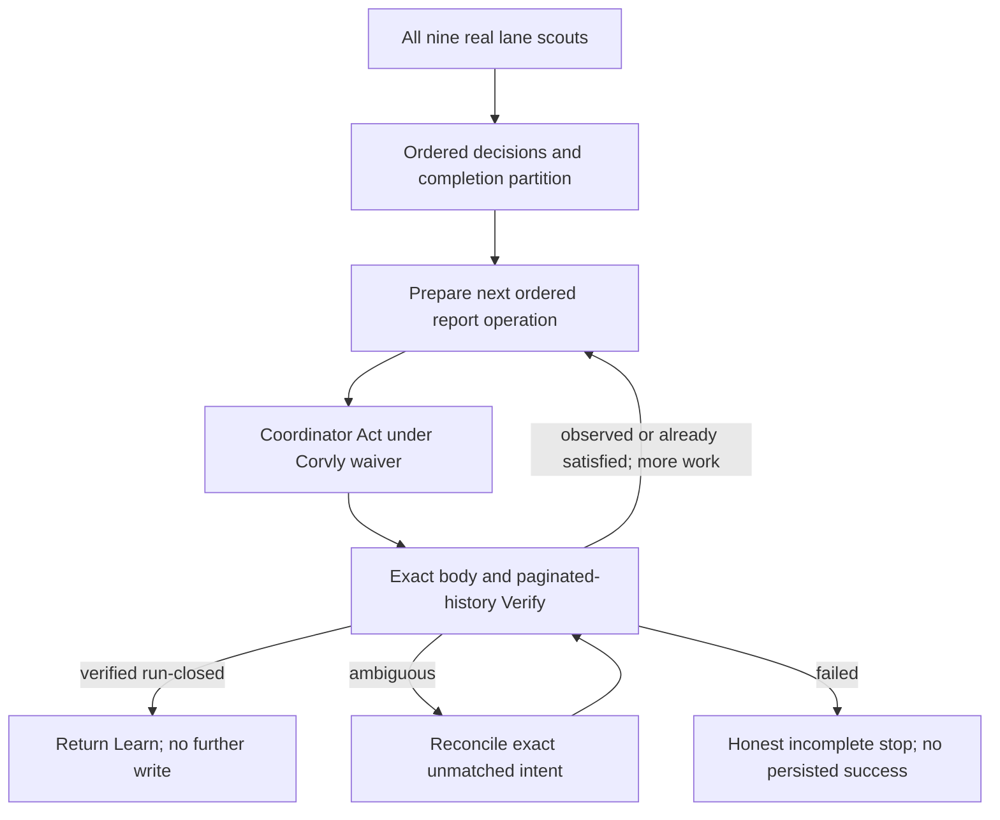

# Repo Gardener Report Effect Boundary - Plan

## Goal Capsule

- **Objective:** Replace PR #51's caller-authored authority booleans with exact report-operation preparation and verification while preserving the Corvly nine-lane dogfood's real report-register `Act -> Verify` loop.
- **Product authority:** The original Corvly dogfood plan requires all nine lanes to complete a receipted live walk. GitHub issue #52 defines the receipt-bound correctness gaps. This plan resolves both without generalizing Corvly's pilot waiver into portable authority.
- **Execution profile:** Refactor the existing PR #51 executable and fixtures in its current worktree. Use the existing Corvly parent coordinator for the live GitHub operation after deterministic gates pass.
- **Stop conditions:** Stop if the existing coordinator cannot perform exact issue-body replacement, receipt-comment append, complete paginated readback, stable-writer verification, and stale-claim handling under the current run-budget rule. If a lane is honestly `incomplete` for work outside this plan, persist the incomplete dogfood record, file a follow-up issue, and hold PR #51 in draft for an explicit owner decision on rerun versus landing the deterministic units. Do not substitute a read-only dogfood or build a wrapper, credential system, provider client, or cryptographic protocol without owner approval.
- **Tail ownership:** PR #51 remains draft through implementation, tracked documentation, simplification, code review, deterministic readiness corrections, candidate freeze, Corvly pin, and live dogfood. After the freeze, readiness is read-only and evidence is recorded only in GitHub issue/PR surfaces. Any tracked change creates a new candidate and requires a new pin and dogfood run. Merging remains an explicit owner decision.

---

## Product Contract

### Summary

PR #51 will ship a source-read-only portable default with one built-in effect: a caller-authorized update to the configured report-backed register. The portable executable prepares and verifies exact report material. Corvly's repository-specific pilot policy separately enables its nine lane mutations, so the parent coordinator may create source-changing child worktrees and PRs when a lane has authorized actionable work.

The final dogfood run must cover all nine installed lanes and complete `Sense -> Decide -> Act -> Verify -> Learn`. The serialized run contains the ordered report operations required by the existing coordinator protocol; each operation is one exact body-replacement/comment-append pair with its own complete readback. None grants lane, source, PR, merge, PostHog, or other provider mutation authority.

### Problem Frame

PR #51's effect and reconciliation branches currently accept caller-written booleans for executor ownership, wrapper scope, credential absence, continuity, retention, runtime scope, and readback. Those booleans can describe a write-ready state without proving that an operation happened.

The rejected read-only redesign removed that defect by removing `Act`, but it also removed the central dogfood target. Corvly already has the required external execution path: its parent coordinator serializes through register issue #3336, invokes scoped `gh` operations, and reads the body and complete comment history back. The portable skill should validate exact transitions around that path rather than replacing it or pretending to authenticate it.

### Requirements

**Nine-lane control loop**

- R1. One Corvly dogfood run must produce a terminal Scout Receipt for every installed lane from real configured sources; `complete` and affirmative `not applicable` count, while `incomplete` remains an honest safe stop and does not pass that lane.
- R2. The run must record the exact Repo Gardener revision, Corvly coordinator contract revision, policy revision, repository identity, report identity, writer identity, run identity, manifest identity, and all nine lane dispositions.
- R3. The run must complete `Sense -> Decide -> Act -> Verify -> Learn`; each lane must have an explicit disposition in the persisted report and final completion partition.

**Portable report-effect contract**

- R4. The executable must reject legacy authority objects and must not accept a caller-supplied verdict, trusted context, authenticated status, or proof-completeness boolean as write authority.
- R5. Given a validated pre-read snapshot, the executable must prepare immutable body and receipt-comment material bound to the repository-qualified operation identity, expected register revision, expected history head, run, report, writer, rows, projection, and canonical payload.
- R6. The executable must derive an internal structural result from the exact prepared material and complete raw pre-read/post-read provider snapshots as `observed`, `already satisfied`, `failed`, or `ambiguous`; it must reject a serialized caller-supplied result or verdict.
- R7. `observed` requires exact managed-body readback, the expected dedicated-writer receipt comment, complete pagination, the expected next revision and head, one-to-one provider comment identity, and canonical operation-material equality.
- R8. `already satisfied` requires the exact prepared body and receipt to preexist with zero new writes; identity equality or caller labels alone are insufficient.
- R9. A body-only write, unavailable or incomplete post-read, or unmatched intended receipt remains `ambiguous`; only the existing exact one-tail repair may append the already-prepared missing receipt.
- R10. Reconciliation may claim report-fact persistence, `Act`, or `Verify` only when it invokes the report-effect verifier over the prepared operation and complete raw snapshots inside the same validation path. The structural result is not portable runtime authority; Corvly may reach `Learn` only when its coordinator-owned waiver and invocation context also apply.

**Runtime and authority separation**

- R11. Corvly's parent coordinator owns policy and waiver checks, run serialization, live `gh` reads and writes, and provider-response collection. The portable executable owns structural validation, preparation, and exact post-read comparison.
- R12. Report-register authority grants only the configured GitHub repository, issue, writer, verbs, body, and receipt operation. Targets and verbs come from reviewed Corvly configuration, while prepared payloads travel as opaque file/stdin data with no shell interpolation. It grants no source edit, child worktree, issue creation, PR, CI, merge, PostHog, production, or other provider effect. Corvly source work requires a separate enabled lane grant and still follows its child-worktree, verification, PR, and owner-merge gates.
- R13. The portable Release A policy template keeps all nine lane source-mutation flags false. Corvly's already-reviewed pilot policy and prior lane-walk evidence remain repository-specific and are not copied into the portable default.
- R14. Missing report-effect proof stops that effect and its dependency closure while all independent lane sensing and decisions continue to an explicit disposition.
- R15. The implementation must add no custom provider wrapper, provider client, new credential, signing system, cryptographic protocol, dogfood-only authority mode, or second register.
- R16. Live provider and lane snapshots remain transient. Durable public evidence contains only allowlisted identities, revisions, hashes, fingerprints, redacted references, terminal outcomes, and bounded summaries; it contains no credentials, secret values, customer content, full source bodies, or raw report/comment payloads.
- R17. The final user handoff must include a nine-row lane report that makes conservative behavior debuggable. Every row records the checked source and coverage, what happened, terminal event and receipt, decision or created artifact, the gate or threshold that stopped further action, uncertainty or missed-work risk, and either an evidence-backed improvement/follow-up or `none — current behavior supported by evidence`. An `incomplete` lane still receives a full row.
- R18. The owner manually starts the disabled Orca automation named `repo-gardener-corvly` only after the frozen-candidate ready signal. Orca creates one fresh coordinator worktree from `origin/main` for that run. The dogfood supervisor binds to that new run, worktree, and session, verifies the pinned revisions before accepting activity, and monitors terminal state, orchestration state, register receipts, and coordinator-created child worktrees/PRs without launching or steering a second coordinator.
- R19. The automation uses Orca's configured Grok default, expected to resolve to Grok 4.5 at High reasoning. The run records the actual served model when observable. Coordinator questions are addressed to the owner; the dogfood supervisor monitors them and may assess or draft a response when asked, but never answers policy, scope, mutation, or cleanup questions on the owner's behalf.
- R20. A process exit or agent statement is not a cleanup-authorizing terminal event. Non-PR scouting, review, and simplification use subagent contexts in the coordinator checkout and create no worktree; their settled terminals may be released after their purpose-specific receipt is persisted and exactly read back. Worktree cleanup applies only to the automation-created coordinator checkout and PR-intended child checkouts. Eligibility requires the mapped terminal receipt in canonical GitHub register issue #3336, exact readback, clean local status, and no unique unpushed commit or file. An abandoned PR-intended child with no PR or saved artifact may then be removed; a PR worktree remains until merge and verified merge evidence. Incomplete, ambiguous, questioned, or recoverable work remains available. The automation coordinator owns cleanup; the dogfood supervisor audits it and does not delete worktrees.

### Acceptance Examples

- AE1. **Covers R1-R3.** Given all nine Corvly scouts run against current configured sources, when the run closes, then every lane has a terminal receipt and persisted disposition, and the trace reaches `Learn` only after exact report readback.
- AE2. **Covers R4-R7.** Given a caller sets every former authority boolean to true or supplies a self-consistent verdict bundle, when the public CLI runs, then the input is rejected or cannot produce `observed`, persistence, or a write-ready decision.
- AE3. **Covers R5-R7.** Given the coordinator applies the exact prepared body and comment, when a complete post-read snapshot is supplied, then structural verification returns `observed` with the expected next revision, head, provider comment identity, and operation fingerprint.
- AE4. **Covers R8.** Given the exact prepared effect already exists before invoke, when verification runs, then it returns `already satisfied` and requests zero writes.
- AE5. **Covers R9, R14.** Given the body is present but the prepared comment is absent, when verification runs, then it returns `ambiguous`, permits only exact one-tail repair, and leaves unrelated lane results unblocked.
- AE6. **Covers R10-R12.** Given prepared material and complete raw snapshots, when reconciliation internally derives `observed` under the Corvly coordinator's invocation context, then it may persist report facts and advance through `Verify`; after the verified `run-closed` operation the coordinator returns `Learn`. A serialized typed result cannot authorize either path.
- AE7. **Covers R2, R15.** Given the final live dogfood record, when an independent reviewer reconstructs the run, then it identifies the exact skill and coordinator revisions, all nine lane outcomes, operation identities and fingerprints, redacted provider write/readback trace, and completion partition without relying on prior chat.
- AE8. **Covers R13.** Given the shipped portable policy template, when its mutation grants are inspected, then all nine lane source-mutation flags are false and no Corvly waiver, grant, or lane-walk evidence appears in the portable default.
- AE9. **Covers R6, R10.** Given a fabricated but internally exact snapshot, when structural verification runs, then it may classify the bytes as an exact match but cannot by itself authorize persistence or prove that GitHub performed a write; that runtime premise remains Corvly-specific until issue #54.
- AE10. **Covers R16.** Given the durable public dogfood evidence, when it is inspected, then the run is reconstructable from identities, revisions, hashes, fingerprints, redacted references, and bounded outcomes without raw Corvly or provider content.
- AE11. **Covers R17.** Given the completed or honestly stopped dogfood run, when the owner reads the handoff, then all nine installed lanes appear exactly once and each outcome can be questioned or debugged without first reconstructing the receipt chain.
- AE12. **Covers R18.** Given the supervisor has announced readiness and captured the latest automation-run/worktree baseline, when the owner manually starts `repo-gardener-corvly`, then the supervisor binds monitoring to exactly one newer run and its newly created coordinator worktree, confirms its run-opened skill/contract/policy revisions, and never creates a competing coordinator or scheduled fire.
- AE13. **Covers R19.** Given the new automation session, when its runtime metadata becomes available, then the final report records the actual Grok model and reasoning level or explicitly marks either as unverified; every coordinator question remains pending for the owner until the owner responds.
- AE14. **Covers R20.** Given the coordinator or a PR-intended child reaches an apparent terminal state, when cleanup is considered, then no worktree is removed until its class-specific event exists in issue #3336, exact readback succeeds, and clean/upstream checks pass; an existing PR additionally requires verified merge. A scout-only subagent releases its settled terminal without creating a worktree.

### Final Dogfood Report Contract

The final handoff starts with the run identity, exact Repo Gardener, coordinator, and policy revisions, register revision before and after, run duration, and overall outcome. It then fills this table from the live run. The placeholders define the required shape; they are not presumed results.

| Lane | Input and coverage | What happened | Terminal event | Decision, artifact, and cleanup | Why it stopped here | Uncertainty / conservative risk | Room for improvement / follow-up |
|---|---|---|---|---|---|---|---|
| Dependency and vulnerability | _Source, time window, item count_ | _Observed result_ | _Outcome, receipt ID/link_ | _No action, issue, or PR/worktree_ | _Evidence threshold or gate_ | _Possible missed work_ | _Concrete adjustment or issue_ |
| Issue implementation | _Source, query/scope, item count_ | _Observed result_ | _Outcome, receipt ID/link_ | _No action, issue, or PR/worktree_ | _Selection or authorization gate_ | _Possible missed work_ | _Concrete adjustment or issue_ |
| CI and failing test | _Checks/runs and time window_ | _Observed result_ | _Outcome, receipt ID/link_ | _No action, issue, or PR/worktree_ | _Reproduction or ownership gate_ | _Possible missed work_ | _Concrete adjustment or issue_ |
| Repository test and code health | _Files/signals inspected and count_ | _Observed result_ | _Outcome, receipt ID/link_ | _No action, issue, or PR/worktree_ | _Severity or confidence threshold_ | _Possible missed work_ | _Concrete adjustment or issue_ |
| Documentation, changelog, and release note | _Changed/released scope inspected_ | _Observed result_ | _Outcome, receipt ID/link_ | _No action, issue, or PR/worktree_ | _Relevance or evidence gate_ | _Possible missed work_ | _Concrete adjustment or issue_ |
| Runtime error and alert | _Configured runtime source, window, count_ | _Observed result_ | _Outcome, receipt ID/link_ | _No action, issue, or PR/worktree_ | _Linkage, recurrence, or mutation gate_ | _Possible missed work_ | _Concrete adjustment or issue_ |
| Risk-scoped QA and regression | _Risk inputs, flows, and checks run_ | _Observed result_ | _Outcome, receipt ID/link_ | _No action, issue, or PR/worktree_ | _Risk or reproducibility gate_ | _Possible missed work_ | _Concrete adjustment or issue_ |
| Security, secret, and static analysis | _Tools/signals and scope inspected_ | _Observed result_ | _Outcome, receipt ID/link_ | _No action, issue, or PR/worktree_ | _Severity, confidence, or disclosure gate_ | _Possible missed work_ | _Concrete adjustment or issue_ |
| Issue backlog and customer-feedback triage | _Sources, query/window, item count_ | _Observed result_ | _Outcome, receipt ID/link_ | _No action, proposal issue, or PR/worktree_ | _Deduplication, evidence, or authorization gate_ | _Possible missed work_ | _Concrete adjustment or issue_ |

The improvement column does not manufacture work. When the evidence supports the current behavior and no useful adjustment exists, it says `none — current behavior supported by evidence` and briefly names that evidence.

After the table, the handoff summarizes totals for `complete`, affirmative `not applicable`, and `incomplete`; findings accepted versus rejected; PRs/worktrees and follow-up issues created; worktrees removed versus retained and why; lanes that appear overly conservative; and the recommended order for lane-specific debugging. Evidence remains redacted under R16.

### Cleanup Evidence Matrix

| Runtime class | Durable terminal evidence before cleanup | Additional checks | Result |
|---|---|---|---|
| Scout, review, or simplification subagent | Purpose-specific terminal receipt and captured structured return | Settled session; no worktree exists | Release terminal/session only |
| PR-intended child that produced no PR or saved artifact | Terminal child disposition naming task, worktree, branch, and explicit no-artifact result | Clean status; no unpushed commit; no upstream divergence | Remove child worktree |
| Child with an open or unmerged PR | Current PR/head disposition | None can authorize removal while unmerged | Retain worktree |
| Child with a merged PR | Merge/terminal receipt naming PR, exact head, and merge result; verified remote merged state | Clean status; no unique saved file or commit | Remove child worktree |
| Automation-created coordinator | Verified `run-closed`, final report captured, and every child classified above | Clean status; no unpushed commit; no pending question or recovery | Remove coordinator worktree |
| Any incomplete, ambiguous, questioned, or recoverable state | No cleanup-authorizing receipt | Preserve inspectable state | Retain worktree/session |

### Scope Boundaries

**In scope**

- PR #51's Release A executable, effect and reconciliation fixtures, GitHub reference-adapter contract, and public documentation.
- A synthetic fixture compatible with Corvly's live register marker and history shapes, without copying private or business content into this public repository.
- One serialized live Corvly nine-lane run whose ordered report operations are each exactly prepared and verified after deterministic gates pass.
- Lane-authorized Corvly source work discovered by that run, with one coordinator-owned child worktree per resulting PR and no merge.

### Deferred to Follow-Up Work

- [GitHub issue #54](https://github.com/jrgilbertson/the-rookery/issues/54) owns production-grade provenance, freshness, continuity, retention, executor ownership, capability confinement, and least-privilege enforcement after the pilot waiver.
- [GitHub issue #50](https://github.com/jrgilbertson/the-rookery/issues/50) retains partial Scout Receipt manifest-scope work.
- [GitHub issue #53](https://github.com/jrgilbertson/the-rookery/issues/53) retains future-dated readiness receipt handling.

**Outside this plan**

- Re-running the already-completed policy-enablement ladder, changing Corvly lane grants, manually implementing findings outside the automation coordinator, or bypassing a lane's normal child-worktree and PR gates.
- Unattended merge, production mutation, PostHog mutation, scheduling changes, another repository pilot, and another PR worktree for PR #51.

### Sources and Research

- `CONCEPTS.md` defines Release A `Act` as the report-register write and `Verify` as the authoritative readback.
- `skills/repo-gardener/references/register-and-report.md` and `skills/repo-gardener/references/applying-effects.md` own the body/comment pair, intended receipt, stable logical operation, ambiguity, and one-tail repair rules.
- `skills/repo-gardener/references/github-reference-adapter.md` owns the GitHub markers, dedicated-writer filtering, pagination, and provider response shape.
- `docs/solutions/workflow-issues/falsifiability-contracts-need-executable-tests.md` requires exact artifact binding and adversarial rejection rather than caller-authored trust claims.
- `docs/solutions/conventions/keep-the-test-seam-out-of-the-shipped-skill.md` requires the live dogfood seam to stay in the external coordinator rather than adding a production bypass.
- `docs/solutions/best-practices/cross-harness-dogfood-testing.md` requires exact package and harness identity separate from behavioral results.
- Corvly `.repository-automation/orchestrator-invocation.md`, `.repository-automation/policy.yaml`, and register issue #3336 define and evidence the repository-specific coordinator path and waiver.

---

## Planning Contract

### Key Technical Decisions

- KTD1. **Preserve the real report effect.** (session-settled: user-directed — chosen over an unconditionally read-only PR: the dogfood exists to test all nine lanes through the full control loop.) PR #51 remains source-read-only but supports exact preparation and verification of its single report-register effect. Governs R1-R3, R10-R14.
- KTD2. **Use the existing Corvly coordinator boundary.** (session-settled: user-approved — chosen over a new wrapper or credential system: Corvly already performs the scoped GitHub update and complete readback.) The coordinator invokes `gh`; the portable executable performs no network call. Governs R5-R7, R11-R12, R15.
- KTD3. **Replace authority verdicts with artifact transitions.** A `prepare` phase produces immutable expected body/comment material, and a `verify` phase compares that material with complete post-read snapshots. No renamed authority envelope is introduced. Governs R4-R10.
- KTD4. **Use the proven live register shape as the single Release A contract.** PR #51 is unmerged, so replace its synthetic parallel schema with Corvly's existing `orchestrator-*` markers, domain-separated hashes, and exact field grammar. Preserve the 100-plus live receipts without a migration, compatibility layer, or second report. Governs R2, R5-R9, R15.
- KTD5. **One serialized run, multiple exact report operations.** Each operation contains one body replacement and one receipt-comment append under a stable `(repository_id, operation_id)`. The operation ID is deterministic across coordinator restart from report/writer identity, expected revision/head, operation kind, and canonical payload; run identity is bound metadata, not entropy. `run-opened`, manifest, supplied lane receipts, decisions/completion partition, and `run-closed` are ordered operations, each verified before the next dependency proceeds. Governs R1-R10.
- KTD6. **Keep dogfood evidence honest.** The live run proves coordinator behavior, provider mutation, readback, and recovery under Corvly's waiver. It does not prove universal provenance, exclusive ownership, credential absence, or least privilege. Governs R2, R7, R11, R15.
- KTD7. **Use one worktree per PR.** (session-settled: user-directed — chosen over gate-specific worktrees: simplify, review, and readiness are independent subagent contexts in the existing PR worktree.) Source findings that become separate PRs receive their own worktrees later. Governs execution and review.
- KTD8. **Make conservatism visible per lane.** (session-settled: user-directed — chosen over a pass/fail-only dogfood summary: the owner expects early lanes may be too conservative and wants to debug them individually.) The final handoff uses the fixed nine-row report contract and names the exact stopping gate, uncertainty, and evidence-backed next improvement for every lane, or explicitly states that no change is supported. Governs R17.
- KTD9. **Owner launches; Orca isolates; supervisor monitors.** (session-settled: user-directed — chosen over the dogfood supervisor starting the automation or reusing a coordinator checkout: the owner wants to trigger a clean live run manually.) Orca automation `repo-gardener-corvly` remains schedule-disabled and uses `new_per_run` from `origin/main` with a fresh Grok session. Its prompt is only a fail-closed bootstrap to the versioned Corvly invocation contract; behavior changes belong in the contract or Repo Gardener skill, not the automation prompt. Only the resulting coordinator may create child worktrees, and only when a lane produces one PR-equivalent unit of work. Governs R18 and KTD7.
- KTD10. **Questions remain owner-controlled.** (session-settled: user-directed — chosen over the dogfood supervisor answering coordinator questions: the same automation must operate safely when no dogfood supervisor exists.) The coordinator surfaces questions to the owner. The supervisor watches all activity and offers analysis or draft responses only when the owner asks. Governs R19.
- KTD11. **Mapped durable events drive coordinator-owned cleanup.** (session-settled: user-directed — chosen over process-exit or time-based cleanup: worktrees must not be the only remaining history.) Canonical issue #3336 receives and exactly reads back the class-specific terminal event before the coordinator cleans up. Non-PR subagents release sessions without worktrees; abandoned PR-intended children can close when proven artifact-free; PR worktrees remain until merge; unresolved work remains. The supervisor verifies this lifecycle without becoming a second cleanup authority. Governs R20.

### High-Level Technical Design

```mermaid
sequenceDiagram
  participant C as Corvly parent coordinator
  participant S as Repo Gardener executable
  participant G as GitHub register issue
  C->>G: Read body and all comment pages; confirm no younger open claim
  C->>S: Prepare run-opened from complete pre-read
  S-->>C: Exact body, comment, identity, revision, head, fingerprint
  C->>G: Replace body and append receipt with opaque payload channels
  C->>G: Re-read body and all comment pages
  C->>S: Verify from prepared material and raw snapshots
  S-->>C: structural outcome
  loop Manifest, supplied lane receipts, decisions, run-closed
    C->>S: Prepare next operation from last verified snapshot
    C->>G: Replace body and append receipt
    C->>G: Complete readback
    C->>S: Verify exact transition
  end
  C->>C: Enter Learn after verified run-closed; no extra receipt
```



### Sequencing

0. Read the complete live Corvly register without mutation into a per-run temporary directory outside the public repository, confirm the exact marker/hash/pagination grammar and coordinator read capability, and derive only redacted synthetic fixture shapes.
1. Adopt that live grammar as the single Release A register contract and validate it with synthetic fixtures.
2. Replace authority booleans with exact `prepare` and `verify` report-effect phases.
3. Make reconciliation derive the private typed effect internally from prepared material and complete raw snapshots, then preserve local safe stops.
4. Land a separate Corvly invocation-contract PR that pins the clean, exact PR #51 candidate, then freeze the checklist and perform one serialized live run whose ordered report operations are independently verified.

### System-Wide Impact and Risks

- **Portable callers:** They gain deterministic report-operation material and outcome verification without receiving a false runtime-authority claim.
- **Corvly coordinator:** It keeps its existing `gh` surface, register claim protocol, child-worktree separation, policy, and owner merge gates.
- **Public repository:** Synthetic fixtures must preserve the live schema shape without storing Corvly business artifacts or provider credentials.
- **Race risk:** GitHub issue writes have no provider compare-and-swap. The coordinator must re-read the expected revision and head immediately before invoke; disagreement stops the effect.
- **Partial-write risk:** Body success followed by comment failure remains ambiguous and permits only the exact prepared one-tail append.
- **Scope risk:** A broad `gh` capability exists in the dogfood. The run proves behavior under a waiver, not least-privilege confinement; issue #54 owns hardening.
- **Evidence drift risk:** The live register may advance before execution. The run binds to the revision and head observed at preflight rather than assuming a fixed sequence number.
- **Evidence exposure risk:** Raw provider snapshots remain transient. Durable register, PR, log, and issue evidence is limited to allowlisted identities, revisions, hashes, redacted references, outcomes, and bounded summaries; credentials, secret values, customer content, and full source bodies are forbidden.
- **Human-comment risk:** Complete pagination includes all comments, but revision/head continuity and dedicated-writer history ignore unrelated authors. A comment claiming the dedicated-writer identity without matching the configured stable writer fails closed.

---

## Implementation Units

### U1. Normalize live GitHub register snapshots

- **Goal:** Convert already-fetched GitHub issue and paginated-comment responses into the exact internal register view needed for preparation and verification.
- **Requirements:** R2, R4-R7, R15; KTD2-KTD4.
- **Dependencies:** None.
- **Files:** `skills/repo-gardener/scripts/release_a_contract.py`, `tests/repo-gardener/fixtures/github-register/scenarios.json`, `tests/repo-gardener/fixtures/github-register/expectations.json`, `tests/repo-gardener/fixtures/github-register/check_snapshots.py`.
- **Approach:**
  1. Make the live `orchestrator:current-portfolio:v1`, `orchestrator-register/v1`, and `orchestrator-history/v1` shapes the single Release A register contract, replacing PR #51's unmerged parallel fixture schema.
  2. Accept raw issue and comment-page JSON only as supplied snapshots; make no provenance or freshness claim.
  3. Validate managed markers, repository/report/writer identities, complete pagination, dedicated-writer comments, domain-separated receipt hashes, sequence continuity, and body anchor. Ignore unrelated-author comments for revision/head computation while preserving the requirement to read every page.
  4. Keep raw live receipt bytes through chain validation, then derive the smaller internal preparation view without rewriting historical comments. Specify every body, row, receipt, provider field, history kind, and hash domain as preserved, derived, renamed, or rejected.
- **Patterns to follow:** `validate_register()`, `canonical_bytes()`, `receipt_hash()`, and the exact marker and pagination rules in `skills/repo-gardener/references/github-reference-adapter.md`.
- **Test scenarios:**
  - A synthetic live-shaped issue plus complete dedicated-writer comment pages normalizes to the expected revision, head, rows, and latest operation.
  - Empty genesis history and a history exceeding one provider page both validate.
  - Unrelated-author comments are ignored for history continuity; a forged/mismatched configured writer, missing page, duplicate provider comment ID, sequence gap, altered payload, bad previous hash, bad body anchor, wrong repository, and wrong report fail closed.
  - A fully self-consistent fabricated snapshot can satisfy structural checks but receives no authenticated, current, or provenance-verified status.
- **Verification:** The production parser and public synthetic fixtures exercise the single live-compatible Release A shape with no network, credential, or provider dependency.

### U2. Prepare and verify exact report operations

- **Goal:** Replace self-attested effect authority with immutable prepared material and exact post-read classification.
- **Requirements:** R4-R9, R11-R12, R15; KTD2-KTD5.
- **Dependencies:** U1.
- **Files:** `skills/repo-gardener/scripts/release_a_contract.py`, `tests/repo-gardener/fixtures/effects/scenarios.json`, `tests/repo-gardener/fixtures/effects/expectations.json`, `tests/repo-gardener/fixtures/effects/check_effects.py`.
- **Approach:**
  1. Delete effect authority fields and their boolean completeness helper.
  2. Add versioned prepare and verify phases to the existing effect CLI surface rather than a new executable.
  3. Bind prepared body, comment, receipt hash, operation fingerprint, expected revision, expected head, and stable operation identity as one immutable result.
  4. Classify only from the prepared operation plus complete raw snapshots; keep the result private to that invocation and retain the exact one-tail repair rule.
  5. Reject reserved managed-marker and body-anchor sequences inside lane-derived rows, projections, or payloads before serialization so exact preparation cannot poison the next parse.
- **Execution note:** Change fixture expectations first so caller-authored authority and label-driven success fail before production behavior changes.
- **Patterns to follow:** `validate_effect_material()`, `effect_compatibility()`, `composite_identity()`, and the existing terminal vocabulary.
- **Test scenarios:**
  - Covers AE3. Exact prepared body and comment read back under the expected next revision and head return `observed`.
  - Covers AE4. Exact preexisting material returns `already satisfied` with zero writes.
  - Covers AE5. Body present and comment absent returns `ambiguous` and permits only the exact missing-tail append.
  - Comment ahead of body, multiple gaps, changed projection, changed rows, stale revision/head, changed identity, foreign author, replayed comment ID, incomplete pagination, and altered operation material fail closed or remain ambiguous as their evidence permits.
  - Covers AE2. Legacy authority objects, terminal readback booleans, serialized structural results, and caller outcome labels are rejected or cannot create success.
  - Reserved markers, body anchors, shell metacharacters, URLs, and instruction-like text in lane-derived content are rejected or remain inert data; re-parsing cannot change the prepared revision, head, or rows.
  - Recovery is deterministic: unchanged pre-read plus definitive pre-write denial is `failed`; an exact preexisting body/comment is `already satisfied`; an exact body-only one-tail state is repairable `ambiguous`; exact complete post-read is `observed`; comment-ahead, multiple-gap, incompatible, foreign-edit, changed-anchor, or unavailable-readback states are non-repairable `ambiguous`.
  - The CLI exposes prepared material only; it performs no GitHub or PostHog operation.
- **Verification:** No input-only verdict can mint a positive effect, while exact prepared/post-read material supports the full terminal and recovery contract.

### U3. Bind reconciliation to verified report effects

- **Goal:** Let reconciliation complete `Act -> Verify -> Learn` only from a report-effect result it derives internally from prepared material and complete raw snapshots while preserving all independent lane work.
- **Requirements:** R1-R3, R10, R14; KTD1, KTD3, KTD5.
- **Dependencies:** U2.
- **Files:** `skills/repo-gardener/scripts/release_a_contract.py`, `tests/repo-gardener/fixtures/reconciliation/scenarios.json`, `tests/repo-gardener/fixtures/reconciliation/expectations.json`, `tests/repo-gardener/fixtures/reconciliation/wrapper-readbacks.json`, `tests/repo-gardener/fixtures/reconciliation/check_decisions.py`.
- **Approach:**
  1. Delete the reconciliation authority envelope and persistence booleans.
  2. Accept prepared material plus complete raw pre-read/post-read snapshots and invoke effect verification internally; reject any serialized effect-verification result or terminal verdict.
  3. Require every installed lane to receive a terminal disposition and keep incomplete dependencies local in the completion partition.
  4. Preserve usable Scout Receipt outcome rules, repository-qualified operation identities, ambiguity recovery, and honest last-safe-stage reporting.
- **Test scenarios:**
  - Covers AE1. Nine terminal Scout Receipts plus `observed` report verification advance through `Learn` and persist all nine dispositions.
  - One affirmative `not applicable` lane can pass; one `incomplete` lane prevents overall dogfood success but does not remove or block independent lane dispositions.
  - Covers AE6. An internally derived `observed` structural result under the coordinator invocation context enables report-fact persistence but grants no source or provider capability.
  - `already satisfied` settles the same logical operation without another write.
  - `ambiguous` preserves the unmatched intent and blocks blind retry; `failed` closes only the affected dependency closure.
  - Raw `effect_reconciled`, persistence, authority, or readback labels cannot advance the stage or create a terminal receipt.
  - Completion partitions carry full repository-qualified identities and remain disjoint and exhaustive.
- **Verification:** Every lane is represented exactly once, and only exact verified report material can advance persistence-bearing stages.

### U4. Synchronize contracts and run the live nine-lane dogfood

- **Goal:** Prove the exact PR #51 candidate through the existing Corvly coordinator and leave reviewable evidence of all nine lanes plus the report write/readback.
- **Requirements:** R1-R3, R7, R11-R20; KTD1, KTD2, KTD6-KTD11.
- **Dependencies:** U1-U3.
- **Files:** `skills/repo-gardener/SKILL.md`, `skills/repo-gardener/assets/policy-template.yaml`, `skills/repo-gardener/references/register-and-report.md`, `skills/repo-gardener/references/applying-effects.md`, `skills/repo-gardener/references/github-reference-adapter.md`, `skills/repo-gardener/references/reconciliation.md`, `tests/repo-gardener/fixtures/effects/README.md`, `tests/repo-gardener/fixtures/reconciliation/README.md`, `tests/repo-gardener/log.md`, `CHANGELOG.md`; separate prerequisite Corvly PR/worktree: `.repository-automation/orchestrator-invocation.md`; live evidence: `.repository-automation/policy.yaml` and GitHub register issue #3336.
- **Approach:**
  1. State the split plainly: the portable skill prepares and verifies; the Corvly coordinator authorizes and invokes under its scoped waiver.
  2. Complete implementation, deterministic verification, simplification, and code review in the PR #51 worktree; apply their in-scope fixes; then freeze a clean candidate (`git status --porcelain` empty) and record its exact commit. After that freeze, land a separately reviewed Corvly contract-version bump that pins that exact candidate path/revision. Record the same skill, contract, and policy commits in `run-opened`, `run-closed`, PR evidence, and independent review. Any later PR #51 code change invalidates the live evidence and requires a new pin and run.
  3. Freeze the live checklist before execution, assert the installed lane set is still the expected nine, and include exact package identity, all nine current terminal receipts, at least one reconstructable real exercised observation per lane at an exact source/skill revision, operation order, and completion partition. Any lane-set drift stops for owner re-scoping.
  4. Covers AE12. Record the current latest run and Corvly worktree baseline for `repo-gardener-corvly`; confirm the automation targets the Corvly repository with `new_per_run`, base `origin/main`, fresh Grok session, disabled schedule, and a minimal fail-closed prompt that delegates all behavior to the checked-in invocation contract; then announce that the frozen candidate is ready. Wait for the owner to start it manually; do not call the automation run command on the owner's behalf.
  5. Discover exactly one newer manual automation run and the new coordinator worktree Orca created for it. Bind to that run ID, full worktree identity, and fresh terminal session; confirm clean base lineage plus the `run-opened` frozen skill, Corvly contract, and policy revisions. Refuse duplicate, reused-workspace, dirty-base, or mismatched runs.
  6. Covers AE13. Confirm the session is using Orca's Grok provider and record the observable model/reasoning receipt, expecting Grok 4.5 High. Monitor passively by default: follow the automation-run status, bounded coordinator terminal output, Orca orchestration tasks/messages, canonical register receipts, and child worktrees/PRs. The supervisor never launches a second coordinator, creates child worktrees, or answers a coordinator question for the owner. When asked, it may assess the question and propose a response for owner approval.
  7. Preflight the claim chain under the existing run-budget rule: an unclosed younger claim blocks writes; an older claim does not block a new `run-opened` but remains in immutable history and is never deleted or rewritten. Make `run-opened` the first tested operation; then persist and verify manifest, supplied lane receipts, decisions/completion partition, and `run-closed` in order. Enter `Learn` only after exact readback of `run-closed`, with no self-referential follow-up receipt.
  8. For every operation, derive repository, issue, writer, and allowed verbs from reviewed Corvly configuration; send exact body/comment through file or stdin payloads; re-read the body and every comment page; and accept only the internally derived structural result under the coordinator's scoped waiver.
  9. Covers AE10. Before the freeze, scan tracked logs and release notes; after the run, scan the PR description/comments and follow-up issues. Forbid credentials, secrets, customer content, full source bodies, and raw body/comment payloads. Do not edit tracked evidence files after the live run.
  10. Record dogfood findings as follow-up issues rather than widening acceptance criteria or adding infrastructure to this PR.
  11. Covers AE11. Retain each lane's structured return and provider timestamps until the synthesis is complete, then deliver the Final Dogfood Report Contract to the owner before discarding transient raw snapshots. Include honest rows for blocked lanes and enough gate/threshold detail to support lane-by-lane follow-up debugging; create follow-up issues only for evidence-backed actionable findings.
  12. Covers AE14. Require the coordinator to apply the Cleanup Evidence Matrix. Release settled scout/review/simplification sessions without creating worktrees. For PR-intended children and the coordinator checkout, first persist and exactly verify the mapped receipt in issue #3336, then inspect clean status, unpushed commits, upstream divergence, saved artifacts, and unresolved questions. Remove only an eligible artifact-free or merged-PR worktree; retain all unresolved and unmerged-PR worktrees. The supervisor records whether each decision was correct but performs no deletion.
- **Test scenarios:**
  - Covers AE7. A fresh reviewer reconstructs the exact Repo Gardener commit, Corvly contract and policy commits, repository/report/writer/run identities, all nine lane outcomes, and final effect from durable evidence.
  - The supervisor identifies the single automation-created coordinator worktree from the pre-launch baseline and distinguishes its coordinator-owned child worktrees from unrelated pre-existing Corvly worktrees.
  - A second manual fire, scheduled fire, revision mismatch, missing run-opened, or competing coordinator stops acceptance and is surfaced to the owner without automatic retry.
  - Missing or mismatched model metadata is reported rather than inferred; it does not silently claim Grok 4.5 High.
  - A terminal process with no verified canonical receipt, a dirty/unpushed worktree, an open PR, or an unresolved question remains retained.
  - The coordinator refuses when another unclosed run owns the register, the live revision/head differs from preparation, or required GitHub operations/readbacks are unavailable.
  - A crash before invoke, after body write, and after comment append each resumes to the correct failed, ambiguous, one-tail, or already-satisfied path.
  - Shell metacharacters, reserved markers, URLs, and instruction-like source text remain opaque payload data and cannot change the configured repository, issue, writer, verb, or command shape.
  - Structural search confirms no provider wrapper/client, credential, crypto, PostHog mutation, dogfood bypass, or second PR worktree was added.
  - Covers AE8. The portable policy template keeps all nine lane source-mutation flags false and contains no Corvly waiver, grant, or lane-walk evidence.
  - Any Corvly source mutation has its own enabled lane grant, coordinator claim, one child worktree for one resulting PR, lane-specific verification, and no merge; report-register authority is never used as its authorization.
- **Verification:** The live run reaches `Learn` only after all nine lane dispositions and the exact report body/comment pair are observed through complete readback. Any blocker produces an honest incomplete dogfood report instead of a read-only pass.

---

## Verification Contract

| Gate | Scope | Done signal |
|---|---|---|
| GitHub snapshot contract runner | U1 | Synthetic live-compatible snapshots pass; every pagination, writer, identity, hash, anchor, and provenance-limit mutation produces the expected fail-closed result |
| Effect contract runner | U2 | Prepare, observed, already-satisfied, failed, ambiguity, one-tail repair, and adversarial identity/material cases pass with no authority-booleans or caller-verdict path |
| Reconciliation contract runner | U3 | Nine-lane completion, internal effect derivation, local safe stops, dedupe, capacity, and completion partitions pass |
| Python and fixture integrity | U1-U3 | Production and fixture Python compile, all tracked JSON parses, and public versioned inputs reject legacy authority/verdict fields |
| Repo Gardener package validation | U4 | Skill structure and references agree with the executable prepare/verify contract |
| Portable policy containment | U4 | Portable Release A policy template has nine false lane source-mutation flags and contains no Corvly waiver, grant, or evidence content |
| Regression gates | U4 | Applicable PR-readiness and merge-readiness deterministic suites remain green on the exact candidate |
| Candidate/contract pin | U4 | PR #51 candidate is clean and frozen; a separate reviewed Corvly contract PR pins that exact candidate; skill, contract, and policy commits agree across durable evidence |
| Live Corvly preflight | U4 | Current issue body, complete comment pages, stable writer identity, expected revision/head, no younger unclosed claim, and scoped GitHub operations are available before `run-opened` |
| Manual Orca launch binding | U4 | Owner starts disabled automation `repo-gardener-corvly`; Orca creates one clean coordinator worktree from `origin/main`; supervisor binds exactly that newer run/worktree/session and verifies its pinned revisions without creating another coordinator |
| Orca monitoring | U4 | Automation, terminal, orchestration, register, and child-worktree state are observed through the terminal event; duplicate runs and interventions require explicit owner handling |
| Model and question routing | U4 | Runtime records Grok 4.5 High when observable or marks identity unverified; all coordinator questions remain owner-addressed while supervisor advice is opt-in |
| Receipt-driven cleanup | U4 | Non-PR subagents create no worktrees; every coordinator or PR-intended child follows its class-specific receipt, exact-readback, clean-status, and upstream checks; unmerged or unresolved worktrees are retained |
| Live nine-lane dogfood | U4 | One fresh serialized run records nine terminal lane dispositions and linked exercised evidence; every ordered report operation has complete exact readback; verified `run-closed` is followed by `Learn` with no extra write |
| Public evidence minimization | U4 | Durable plan, log, changelog, PR, and issue artifacts contain only the allowlisted reconstruction fields and no raw Corvly/provider content |
| Nine-lane owner report | U4 | The final handoff contains run metadata, nine unique lane rows, terminal receipts, coverage, stopping reasons, uncertainty, improvements, totals, created artifacts, and a recommended debugging order |
| Independent simplification and review | U1-U4 | Before candidate freeze, fresh subagent contexts in the existing worktree leave no unresolved correctness or scope defect; all tracked fixes are applied and deterministic gates rerun |
| Post-dogfood PR readiness | U1-U4 | Without changing the frozen commit, PR #51's GitHub description/comments reflect the live candidate and evidence, CI converges, review threads are resolved or linked, and merge readiness is reassessed without merging; any required tracked fix invalidates the candidate and restarts pin plus dogfood |

---

## Definition of Done

- All caller-authored effect and reconciliation authority booleans are removed from the public decision surface.
- The executable prepares immutable report body/comment material and verifies exact complete post-read snapshots without performing provider calls.
- `observed` means exact structural equality over coordinator-supplied bytes, not provider provenance or independent runtime authority; issue #54 owns that production boundary.
- Corvly's existing parent coordinator performs one serialized live run of independently prepared and verified report operations under its repository-specific waiver; no new wrapper, credential, client, or crypto is added.
- One fresh dogfood run records terminal dispositions for all nine lanes and reaches `Learn` only after exact body and complete history readback.
- Report-register authority cannot authorize source, PR, merge, PostHog, production, or unrelated provider mutation; Corvly source work proceeds only through its separate enabled lane grants and child-worktree/PR gates.
- Ambiguous partial effects remain recoverable without blind retry, and already-satisfied effects produce zero writes.
- The portable default remains source-read-only, while Corvly's reviewed pilot policy and prior lane-walk evidence remain repository-specific.
- Synthetic public fixtures contain no private, personal, credential, or Corvly business artifacts.
- The owner receives the completed nine-lane report table even when the run stops incomplete; no lane is summarized only as pass/fail or omitted because it produced no PR.
- The owner manually launches `repo-gardener-corvly` after the ready signal; Orca creates a fresh coordinator worktree and Grok session; the supervisor discovers and monitors that exact run through a terminal event without enabling the schedule or starting a duplicate run.
- Grok 4.5 High is recorded as the expected runtime and the actual served identity is reported when observable; questions remain for the owner, with supervisor analysis only on request.
- Non-PR scouts use subagent contexts without worktrees. Every removed coordinator or PR-intended child worktree has its mapped verified receipt in canonical issue #3336, clean/upstream checks, and no unique saved files; PR worktrees wait for merge and unresolved work remains.
- Focused deterministic, structural, syntax, fixture, regression, live preflight, and live dogfood gates pass on the exact PR head.
- Fresh-context simplification and code review run before candidate freeze. Post-dogfood PR and merge-readiness checks are read-only unless they invalidate the candidate and trigger a new pin plus dogfood run.
- PR #51 remains unmerged until the owner explicitly chooses to merge.
- No abandoned compatibility path, dogfood bypass, unused authority schema, test-only production seam, or experimental implementation remains in the diff.
