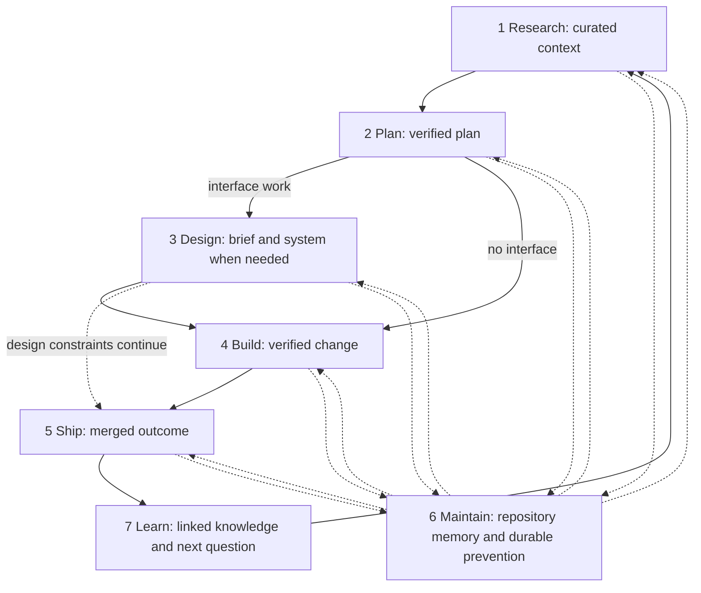
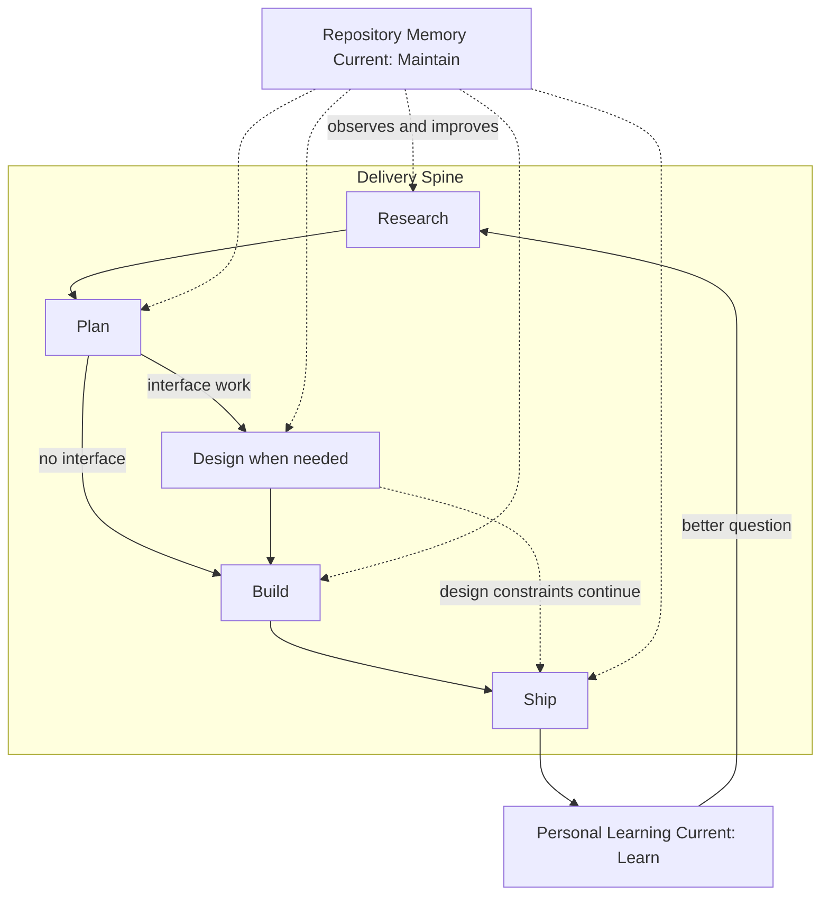
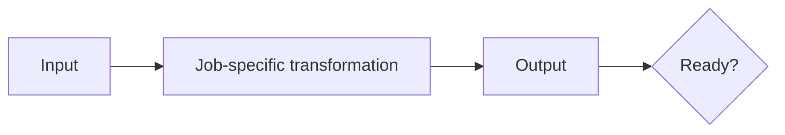

# Workflow Visual System - Plan

## Goal Capsule

- **Objective:** Replace the workflow overview and seven section illustrations with a visual teaching system that explains how the jobs transform work and how repository memory and personal learning improve the next loop.
- **Product authority:** This Product Contract governs the visual meaning and scope. `WORKFLOWS.md` remains authoritative for the workflow's substance.
- **Open blockers:** None.

---

## Product Contract

### Summary

The workflow overview will show a five-stage delivery spine inside two continuous learning currents. Repository memory improves every stage, while personal learning returns a better question to Research. Each section graphic will explain its job as an input, transformation, output, and readiness condition.

### Problem Frame

The current Field Guide Blueprint artwork is distinctive and coherent, but it behaves mainly as a branded illustration series. A reader can see seven numbered stops without learning what moves between them, why Maintain operates throughout the loop, or how Maintain differs from Learn.

This falls short of the page's existing purpose. The workflow playbook is meant to show technical readers and non-technical evaluators how the jobs feed one another, not merely name seven independent stages. The visual layer should shorten that explanation rather than add a metaphor-decoding step before the prose.

### Key Decisions

- **Use the B2 exchange structure.** The delivery spine sits between two learning currents, with one meaningful Huginn-to-Muninn exchange. Governs R1-R5, R10. (session-settled: user-directed — chosen over the two-rail and margin-guide alternatives: it makes both kinds of memory central while keeping the ravens from owning the concepts.)
- **Make the workflow the hero.** Huginn and Muninn establish identity and clarify one transition; they do not label stages or memory currents. Governs R10. (session-settled: user-directed — chosen over heavier character ownership: recurring character lore should not overwhelm the information design.)
- **Explain transformations, not nouns.** Every section uses one shared input-to-readiness grammar while preserving its distinct argument. Governs R6-R8. (session-settled: user-approved — chosen over seven standalone scenes: the current scenes add atmosphere without enough instructional compression.)
- **Compose eight independent production graphics.** The overview and seven section panels share a system but are each designed for their own final frame. Governs R14. (session-settled: user-directed — chosen over cropping section panels from an overview or larger hero: the previous crop-derived approach lost causal endpoints and weakened each section's story.)
- **Let Impeccable own the visual work.** Impeccable drives composition, execution, proofing, accessibility, and final design QA; generated imagery supplies only approved illustration layers. Governs R15. (session-settled: user-directed — chosen over an image-generation-led workflow: deterministic design judgment must control the teaching system.)
- **Keep information deterministic.** Crisp authored labels, arrows, and connectors carry meaning; generated imagery supplies illustration and atmosphere. Governs R9, R11-R12. (session-settled: user-approved — chosen over generated text and diagram logic: the earlier banner work showed that generated lettering degrades at GitHub display sizes.)
- **Preserve the Field Guide Blueprint world.** The redesign retains the cool paper field, engraved navy drawing, restrained orange signal, and professional editorial tone. Governs R9. (session-settled: user-directed — chosen over cartoon-forward raven treatments: the blueprint direction is the approved Rookery identity.)

### Actors

- A1. **The owner.** Uses the page as the canonical answer when someone asks how he develops with AI and judges whether the system reflects the workflow as it runs.
- A2. **The first-time evaluator.** Encounters the page through a shared repository link and needs to grasp the system before deciding whether to read deeply or engage professionally.
- A3. **The experienced agent builder.** Looks for artifacts, gates, handoffs, human judgment, and feedback paths that can be adapted to another workflow.
- A4. **The accessibility-dependent reader.** Needs teaching-equivalent text and meaningful structure when fine visual details or the raster itself are unavailable.

### Requirements

**System model**

- R1. The overview presents all seven jobs by their official names and numbers while making Research, Plan, Design, Build, and Ship the delivery spine.
- R2. The overview shows Design as conditional for interface work and continuous through later delivery rather than as a universally required isolated stop.
- R3. The overview shows Maintain as repository memory that observes recurring signals across the delivery spine and returns the strongest durable prevention to future work.
- R4. The overview shows Learn as personal knowledge that turns experience into linked understanding, exposes a gap, and returns a better question to Research.
- R5. Maintain and Learn remain numbered jobs without being reduced to post-Ship footnotes or assigned to either raven.

The overview's conceptual topology is:

The final artwork may use a different composition, but it must preserve every relationship stated in R1-R5.

**Section teaching grammar**

- R6. Each section graphic communicates what enters the job, the transformation performed, what leaves, and what proves the result is ready.
- R7. The seven section graphics teach the following distinct transformations:

| Job | Input | Transformation | Output and readiness signal |
|---|---|---|---|
| Research | Intent, wide signals, and prior knowledge | Curate current and opposing evidence around the real problem | Context is sufficient to plan without another research pass |
| Plan | Curated context | Define the product outcome before sequencing implementation and independent review | A verified plan names the objective, finish line, constraints, inputs, and artifact |
| Design | Product intent and audience needs | Turn taste into a brief, constraints, tokens, components, and prohibitions | Interface work has an explicit design system agents can follow |
| Build | Bounded plan units | Execute parallel slices through model, mode, scope, and quality gates | The change is verified, bounded, and still holds the design brief |
| Ship | Claimed completion | Simplify, independently review, gather evidence, resolve feedback, and apply human judgment | A defensible human merge decision is the readiness gate; the merged outcome is the output |
| Maintain | A recurring system signal | Encode the lesson at the strongest durable layer that can hold it | Repository memory prevents or teaches the issue in future work |
| Learn | Personal experience, results, and unresolved questions | Distill one idea, link it into the knowledge graph, and name the exposed gap | Durable personal knowledge and the next Research question close the loop |

- R8. A section graphic must reduce the prose's teaching burden; decorative metaphor that requires the heading or alt text to become meaningful does not satisfy the requirement.

**Identity, legibility, and accessibility**

- R9. The overview and section graphics remain one Field Guide Blueprint family with cool paper, engraved navy forms, restrained orange signals, and professional editorial restraint.
- R10. Huginn and Muninn appear together at one meaningful exchange in the overview; elsewhere a raven appears only when its action clarifies a real transition, never as a mascot or conceptual owner.
- R11. Labels, arrows, connectors, and readiness markers remain crisp at GitHub documentation widths, and no relationship depends on orange or any other color alone.
- R12. Alt text states each image's input, transformation, output, and readiness lesson before optional raven or apparatus description, giving A4 teaching-equivalent information; the overview alternative names the five-stage Delivery Spine, distinguishes both learning currents, and states that Learn returns a better question to Research.
- R13. The overview remains a compact orientation device and the section graphics remain compact teaching panels rather than hero banners; final aspect ratios must be validated at wide, standard GitHub, and narrow mobile reading widths before production is approved.
- R14. The overview and seven section panels are eight independently composed graphics built for their final dimensions; no panel may be a crop or derivative crop of the overview, another panel, or a larger hero composition.
- R15. Impeccable owns the design and execution workflow, including composition, proof boards, accessibility review, and final visual QA; Illo or image generation may create raven, mechanism, or texture layers only within the approved deterministic layout.

### Key Flows

- F1. **Overview orientation**
  - **Trigger:** A2 or A3 reaches the top of `WORKFLOWS.md`.
  - **Actors:** A2, A3.
  - **Steps:** The reader follows the delivery spine, recognizes the repository-memory current, follows personal learning back to Research, and distinguishes the two feedback mechanisms.
  - **Outcome:** The reader can explain why this is a durable learning system rather than a seven-step checklist.
  - **Covered by:** R1-R5, R9-R11, R13.
- F2. **Section comprehension**
  - **Trigger:** A reader reaches one workflow section.
  - **Actors:** A2, A3.
  - **Steps:** The panel establishes the input, transformation, output, and readiness condition before the reader enters the detailed prose.
  - **Outcome:** The prose deepens an already visible mental model instead of supplying the panel's missing meaning.
  - **Covered by:** R6-R11, R13.
- F3. **Equivalent non-visual reading**
  - **Trigger:** A4 encounters an image through assistive technology or cannot perceive its fine details.
  - **Actors:** A4.
  - **Steps:** The adjacent heading identifies the job and the alt text explains its transformation and outcome before any visual-world description.
  - **Outcome:** The core lesson remains available without decoding raven lore or color.
  - **Covered by:** R11-R12.

### Acceptance Examples

- AE1. **Covers R1-R5, R13.** Given a first-time evaluator viewing the overview at a standard GitHub reading width, when they scan it for five seconds, then they can identify the five-stage delivery spine and explain that Maintain stores repository learning while Learn creates personal knowledge and the next Research question.
- AE2. **Covers R6-R8.** Given any section panel before its detailed prose, when an experienced agent builder reads it, then they can name the input, transformation, output, and readiness condition that distinguish that job from the other six.
- AE3. **Covers R9-R11, R13-R15.** Given the overview and panels at wide, standard GitHub, and narrow mobile widths, when an Impeccable review checks them without zooming, then the primary labels, direction, and readiness signals remain legible and no meaning disappears with the pale construction details.
- AE4. **Covers R10.** Given the complete visual series, when a reviewer identifies every raven appearance, then the overview contains the single Huginn-to-Muninn exchange and every other appearance clarifies a real transition rather than decorating a stage.
- AE5. **Covers R12.** Given a screen-reader-only pass, when A4 hears each image alternative, then they receive the workflow transformation and outcome before any mention of Huginn, Muninn, or a metaphorical apparatus.
- AE6. **Covers R14-R15.** Given the eight production assets, when their source compositions are inspected, then each has its own final-frame layout and none was produced by cropping another asset or a larger hero.

### Success Criteria

- A first-time reader understands the overview's core model within five seconds and each section panel's transformation within two seconds.
- A reader can distinguish Maintain from Learn without reading both long sections or relying on raven mythology.
- The eight assets increase operational understanding while preserving the approved Rookery identity and compact reading rhythm.
- A production review at wide, standard GitHub, and narrow mobile widths finds no clipped causal endpoints, generated text, ambiguous arrows, or meaning carried by color alone.

### Scope Boundaries

- Replace the workflow overview and seven section graphics, along with their teaching-equivalent alt text and any short adjacent copy needed to introduce the two learning currents accurately.
- Preserve the workflow's substantive prose, job names, and order; this work does not rewrite how the workflow operates.
- Preserve the repository banner and the broader Rookery identity; this work extends that system only for `WORKFLOWS.md`.
- Character development outside this page, social cards, other repositories, and Corbel remain outside scope.

### Dependencies / Assumptions

- `WORKFLOWS.md` remains the source of truth for each job's transformation and readiness conditions.
- The approved Field Guide Blueprint artwork supplies visual authority, but the current compositions are evidence rather than templates that must be preserved.
- Generated illustration may supply ravens, mechanisms, and texture, while labels and diagram relationships remain authored and deterministic.

### Sources / Research

- `WORKFLOWS.md` — canonical job descriptions, transformations, and readiness conditions.
- `README.md` — Rookery positioning and the Huginn-as-thought, Muninn-as-memory identity.
- `CONCEPTS.md` — canonical names for the Delivery Spine, Repository Memory Current, and Personal Learning Current.
- `docs/plans/2026-07-18-001-docs-workflows-playbook-plan.md` — the page's audience, handoff-spine purpose, and showing-rather-than-telling success criteria.
- `docs/assets/workflow-overview.webp` and `docs/assets/workflow-01-research.webp` through `docs/assets/workflow-07-learn.webp` — current visual baseline and anti-reference for the redesign.

---

## Planning Contract

Product Contract unchanged. The implementation replaces the eight existing WebPs in place, updates their teaching-equivalent alt text, and corrects the Unreleased changelog description. Temporary source artboards, builders, renders, and proof boards stay outside the public repository per `AGENTS.md`.

### Key Technical Decisions

- KTD1. **Use eight independent final-frame artboards.** Create one 1600×640 overview artboard and seven separate 1600×560 section artboards in a per-run temporary production directory. The selected panel height preserves 14px-equivalent primary teaching text at the 375px proof while remaining substantially shorter than the prior 1600×900 hero format. Export each asset directly from its own approved final-frame artboard; do not crop, resize, or derive a panel from any other composition. (session-settled: user-directed — chosen over crop-derived panels: the prior approach lost causal endpoints and made individual panels less meaningful.)
- KTD2. **Author information layers deterministically.** Compose labels, numbers, arrows, connectors, readiness markers, and typography as crisp authored layers at final canvas size. Generated imagery may supply ravens, mechanisms, and texture only. Export all eight text-bearing assets as lossless VP8L WebP and verify the encoding rather than relying on extension alone. (session-settled: user-approved — chosen over generated diagram text: prior AI lettering became pixelated at GitHub display sizes.)
- KTD3. **Use one shared teaching grammar with seven distinct arguments.** Every section artboard contains an input region, a visible transformation, an output region, and a readiness gate, but its mechanism and causal claim come from the corresponding row in R7. Repeated layout grammar creates recognition; unique mechanisms prevent the series from becoming seven reskins.
- KTD4. **Keep the B2 topology mobile-aware.** The overview preserves the five-stage Delivery Spine and two learning currents in a compact two-dimensional composition rather than a single long rail. It includes a visible Plan-to-Build bypass for non-interface work and a Design-constraint overlay that continues across later delivery. At 375 CSS pixels, primary text remains at least 14px-equivalent, route direction and current labels remain legible, and no click-to-zoom is required. (session-settled: user-approved — chosen over the two-rail and margin-guide alternatives: B2 keeps both memories visible while limiting raven lore.)
- KTD5. **Reserve raven presence for causal work.** Huginn and Muninn appear together once at the exchange in the overview. A section panel includes a raven only when its action makes the transformation easier to understand; no stage or current is assigned to a character.
- KTD6. **Keep production and proof artifacts private.** The repository receives only the eight flattened WebPs, Markdown alt-text changes, canonical vocabulary, changelog correction, and this plan. The final contact sheet, responsive renders, artboard inventory, builders, and inspection files remain in a per-run temporary directory and are summarized in the PR evidence.
- KTD7. **Use Impeccable as the design authority.** Impeccable governs layout, hierarchy, typography, contrast, proof-board review, accessibility, and final critique. Illo or image generation is subordinate asset production and cannot decide information hierarchy or diagram logic. (session-settled: user-directed — chosen over an image-generation-led workflow: the teaching system needs deterministic design judgment.)
- KTD8. **Lock production microcopy before illustration.** The display-copy matrix below is authoritative for semantic raster text. Labels may wrap to two lines but may not be paraphrased during composition; if a label fails the 375px proof, revise the matrix and all affected alt/proof evidence together rather than shrinking type below the threshold.

### Production Copy Matrix

The overview uses the official stage names and these compact outcome labels:

| System element | Primary label | Secondary label |
|---|---|---|
| Spine | Delivery Spine | Research → Plan → Design when needed → Build → Ship |
| Research | 1 Research | Sufficient context |
| Plan | 2 Plan | Verified plan |
| Design | 3 Design | Constraints when needed |
| Build | 4 Build | Verified change |
| Ship | 5 Ship | Merged outcome |
| Maintain current | Repository Memory Current · 6 Maintain | Durable prevention |
| Learn current | Personal Learning Current · 7 Learn | Linked knowledge → better question |

Each section panel uses these exact four semantic strings in reading order:

| Job | Input | Transform | Output | Ready |
|---|---|---|---|---|
| Research | Intent + wide signals | Curate evidence | Current context | Enough to plan |
| Plan | Curated context | Define → sequence → review | Verified plan | Objective + finish line clear |
| Design | Intent + audience | Turn taste into rules | Design system | Agents can follow it |
| Build | Bounded plan units | Execute through gates | Verified change | Scope + design still hold |
| Ship | Claimed completion | Simplify → review → prove | Merged outcome | Human merge decision |
| Maintain | Recurring signal | Encode at strongest layer | Durable prevention | Future work catches it |
| Learn | Experience + gaps | Distill → link → question | Linked knowledge | Next Research question |

### High-Level Technical Design

The overview uses one central delivery path plus two feedback paths with distinct destinations:

Each section artboard uses the same reading sequence while changing the mechanism:

### Assumptions

- The overview remains 1600×640. U1 locks the seven panels at 1600×560 after the 500px proof could not preserve 14px-equivalent primary teaching text and safe vertical padding at 375px. This is still 38% shorter than the prior 1600×900 hero treatment.
- A temporary artboard inventory and final proof board can demonstrate independent composition without tracking source files in this public repository; the PR body retains the checkable artboard-to-output receipt.
- Lossless VP8L is the default because every asset contains deterministic labels; file-size optimization must preserve type edges and engraved line work.

### Sequencing

U1 establishes the system and proof harness. U2 and U3 produce the overview and section artboards from that system. U4 exports and integrates the assets. U5 performs mechanical, accessibility, responsive, and independent Impeccable review before the PR is opened.

### Risks & Dependencies

- **Mobile collapse:** Seven named jobs and two currents can become illegible in a uniformly scaled horizontal diagram. Mitigation: design the overview from the 375px proof backward, hold primary text to 14px-equivalent or larger, and change layout or aspect ratio rather than accepting zoom dependence.
- **Decorative comprehension:** The blueprint world can remain attractive while failing to teach. Mitigation: require the five-second overview test and the two-second input-to-readiness test for every section.
- **Raster text degradation:** Generated or upscaled lettering can look crisp at source size and pixelated on GitHub. Mitigation: author type at final resolution, use VP8L, and inspect rendered screenshots rather than raw canvases only.
- **Character overreach:** Raven lore can compete with the workflow model. Mitigation: enforce R10 through an appearance inventory and remove any raven whose action is not causal.
- **Proof leakage:** Builders or inspection artifacts can enter the public worktree. Mitigation: keep all production support files in the per-run temporary directory and inspect every untracked path before staging.

### Sources / Research

- `CHANGELOG.md` — establishes the prior crisp-text repair using real typography and lossless WebP and contains the Unreleased workflow-art description that this redesign supersedes.
- `docs/solutions/best-practices/operationalize-abstract-qualifiers-in-instruction-review.md` — supports observable visual acceptance criteria instead of adjectives such as readable or polished.
- `docs/solutions/best-practices/independent-fresh-context-review-for-agent-skills.md` — supports separating mechanical checks from fresh-context qualitative judgment.
- `docs/solutions/workflow-issues/falsifiability-contracts-need-executable-tests.md` — supports explicitly testing crop derivation, pixelation, clipping, and broken references rather than recording existence-only checks.
- `docs/solutions/workflow-issues/verify-disposition-claims-before-landing-a-prune.md` — supports a per-panel inventory that points to the unique transformation and readiness discriminator in each final frame.

---

## Implementation Units

### U1. Production system and proof harness

- **Goal:** Establish the Field Guide Blueprint composition system, eight independent artboards, and responsive proof surface before production rendering.
- **Requirements:** R9-R11, R13-R15; KTD1-KTD7; AE3, AE6.
- **Dependencies:** None.
- **Files:** `docs/assets/workflow-overview.webp`, `docs/assets/workflow-01-research.webp`, `docs/assets/workflow-02-plan.webp`, `docs/assets/workflow-03-design.webp`, `docs/assets/workflow-04-build.webp`, `docs/assets/workflow-05-ship.webp`, `docs/assets/workflow-06-maintain.webp`, `docs/assets/workflow-07-learn.webp`
- **Approach:** Create a per-run temporary production directory outside the repository. Define the paper, navy, orange, semantic stroke, typography, label, arrow, readiness-gate, safe-zone, and raven-use rules. Proof the shared panel frame and lock it at 1600×560 so primary semantic text remains at least 14px-equivalent in the 375px proof without label collisions. Create eight named final-dimension artboards and a proof board that renders each at approximately 1012px, 720px, and 375px CSS widths. Record the approved dimensions and artboard-to-output inventory for PR evidence.
- **Execution note:** Run Impeccable shape and hierarchy review before producing illustration layers. No production WebP is approved from a raw generation output.
- **Patterns to follow:** The crisp deterministic typography and lossless export of `docs/assets/the-rookery-readme-banner.webp`; the repository boundary in `AGENTS.md`.
- **Test scenarios:**
  - Covers AE3. At each proof width, semantic labels, arrows, and readiness markers retain hierarchy, primary text is at least 14px-equivalent at 375px, and no content clips.
  - Covers AE6. The inventory maps eight outputs to eight separate final-frame artboards and identifies no crop or derivative-crop step.
  - A grayscale proof preserves route and readiness meaning without relying on orange alone.
- **Verification:** Impeccable approves the system proof and records the overview plus shared panel dimensions; the temporary directory contains eight separately named source artboards and no support artifact appears in the repo worktree.

### U2. B2 workflow overview

- **Goal:** Replace the checklist-like overview with a five-second explanation of the Delivery Spine, Repository Memory Current, and Personal Learning Current.
- **Requirements:** R1-R5, R9-R11, R13-R15; KTD2, KTD4, KTD5, KTD7, KTD8; F1; AE1, AE3, AE4.
- **Dependencies:** U1.
- **Files:** `docs/assets/workflow-overview.webp`
- **Approach:** Compose all seven numbered jobs in one final 1600×640 frame. The five delivery jobs form the primary path. Plan branches directly to Build when no interface work exists, while Design's constraints visibly continue through Build and Ship when it applies. Maintain visibly touches the full path and returns durable prevention to future work. Learn returns a better question to Research. Place the single Huginn/Muninn exchange where it clarifies transfer without assigning either current to a raven.
- **Test scenarios:**
  - Covers AE1. After five seconds at standard GitHub width, a fresh reviewer can name the five-stage spine and distinguish repository memory from personal learning.
  - At 375px, every official job name and number is legible at 14px-equivalent or larger, both feedback directions remain unambiguous, and no click-to-zoom is required.
  - Plan-to-Build bypass and continuing Design constraints remain visible without making Design look mandatory for non-interface work.
  - Covers AE4. The overview contains exactly one meaningful Huginn/Muninn exchange and neither raven labels a lane or stage.
  - Removing orange still leaves both learning currents distinguishable through shape, labels, and arrow direction.
- **Verification:** The overview passes a fresh-context Impeccable critique at all target widths and preserves every relationship in R1-R5.

### U3. Seven section teaching panels

- **Goal:** Produce seven independently composed panels that teach each job's unique input, transformation, output, and readiness condition within two seconds.
- **Requirements:** R6-R11, R13-R15; KTD1-KTD3, KTD5, KTD7-KTD8; F2; AE2-AE4, AE6.
- **Dependencies:** U1.
- **Files:** `docs/assets/workflow-01-research.webp`, `docs/assets/workflow-02-plan.webp`, `docs/assets/workflow-03-design.webp`, `docs/assets/workflow-04-build.webp`, `docs/assets/workflow-05-ship.webp`, `docs/assets/workflow-06-maintain.webp`, `docs/assets/workflow-07-learn.webp`
- **Approach:** Build each panel in its own artboard at the shared dimensions approved in U1, with the same labeled left-to-right sequence: Input → Transform → Output → Ready. Research narrows intent and wide evidence into sufficient context. Plan turns curated context into a verified product and implementation plan. Design turns audience intent into durable design constraints. Build turns bounded plan units into a verified change through explicit gates. Ship turns claimed completion into a defensible human merge decision and then a merged outcome. Maintain turns a recurring signal into prevention at the strongest durable repository layer. Learn turns personal experience into linked knowledge and the next Research question. Use a raven only when its action clarifies that transformation.
- **Test scenarios:**
  - Covers AE2. For each isolated panel, a fresh reviewer can restate input, transformation, output, and readiness in the authored reading order without reading the heading or section body.
  - Covers AE6. A visual comparison and source inventory show that no panel is a crop, rescale, or rearranged fragment of another asset.
  - At 375px, each panel retains its causal endpoints and readiness gate without clipped labels or texture-obscured type.
  - When panel headings are temporarily hidden on the proof board, reviewers can still match each panel to its job by the mechanism and labels.
  - Covers AE4. Every raven appearance has a recorded causal purpose; decorative appearances are removed.
- **Verification:** All seven panels pass the two-second Impeccable teaching test, responsive proof, grayscale proof, and per-panel uniqueness inventory.

### U4. Production export and page integration

- **Goal:** Replace the existing assets in place, update teaching-equivalent alt text, and make the public record describe the new eight-image system accurately.
- **Requirements:** R9-R15; KTD1, KTD2, KTD6; F3; AE3, AE5, AE6.
- **Dependencies:** U2, U3.
- **Files:** `WORKFLOWS.md`, `CHANGELOG.md`, `CONCEPTS.md`, `docs/assets/workflow-overview.webp`, `docs/assets/workflow-01-research.webp`, `docs/assets/workflow-02-plan.webp`, `docs/assets/workflow-03-design.webp`, `docs/assets/workflow-04-build.webp`, `docs/assets/workflow-05-ship.webp`, `docs/assets/workflow-06-maintain.webp`, `docs/assets/workflow-07-learn.webp`
- **Approach:** Place deterministic vector type, arrows, connectors, and readiness gates after all generated illustration layers. Export each artboard directly at final dimensions as VP8L WebP, replace the stable asset paths, and update the eight Markdown alt strings so input, transformation, output, and readiness precede optional apparatus or raven detail. Keep image placement and substantive workflow prose unchanged. Revise the Unreleased workflow-art changelog entries so they describe an overview plus seven panels, the B2 teaching model, and the crisp deterministic text treatment. Preserve the canonical terms already added to `CONCEPTS.md`.
- **Execution note:** Inspect exports at rendered GitHub size before optimizing file weight; no lossy conversion is allowed if it softens type or semantic line work.
- **Test scenarios:**
  - Covers AE5. A screen-reader-only read hears each transformation and outcome before any raven or apparatus description.
  - All eight Markdown references resolve exactly once to existing files with the expected stable names.
  - `webpinfo` reports 1600×640 for the overview, the U1-approved shared dimensions for all seven panels, and VP8L lossless encoding for every text-bearing asset.
  - A 100% pixel inspection finds no generated lettering, edge halos, resampling blur, or texture crossing semantic text.
  - Total page weight is recorded and any asset materially larger than the current baseline is reviewed for unnecessary texture or metadata.
- **Verification:** The rendered page loads every replacement asset, the alt text is teaching-equivalent, the changelog is accurate, and `git diff --check` passes.

### U5. Independent visual, accessibility, and repository QA

- **Goal:** Produce falsifiable evidence that the finished page teaches the intended system, remains accessible at real reading widths, and leaves the public repo clean.
- **Requirements:** R1-R15; KTD6, KTD7; F1-F3; AE1-AE6.
- **Dependencies:** U4.
- **Files:** `WORKFLOWS.md`, `CHANGELOG.md`, `CONCEPTS.md`, `docs/assets/workflow-overview.webp`, `docs/assets/workflow-01-research.webp`, `docs/assets/workflow-02-plan.webp`, `docs/assets/workflow-03-design.webp`, `docs/assets/workflow-04-build.webp`, `docs/assets/workflow-05-ship.webp`, `docs/assets/workflow-06-maintain.webp`, `docs/assets/workflow-07-learn.webp`
- **Approach:** Render `WORKFLOWS.md` in a GitHub-like preview at approximately 1012px, 720px, and 375px image widths. Run mechanical asset, encoding, path, and privacy sweeps. Then dispatch an Independent Review Context using Impeccable to judge the overview and each isolated panel without the authoring discussion. Apply all material findings and rerun the relevant proofs. Preserve a final contact sheet, alt-text table, raven-appearance inventory, artboard provenance receipt, file dimension/weight listing, and responsive screenshots outside the repository; summarize their results in the PR body so reviewers can evaluate the opaque binary replacements.
- **Test scenarios:**
  - Deliberately check the known failure states: crop-derived panels, gibberish/generated text, upscale blur, label clipping, broken paths, color-only signals, and decorative raven use.
  - Covers AE1-AE2. Fresh reviewers pass the five-second overview and two-second section tests.
  - Covers AE3. The 1012px, 720px, and 375px screenshots show no clipped causal endpoints, collapsed hierarchy, sub-14px primary text, or pixelated type.
  - At rendered size, normal semantic text reaches 4.5:1 contrast, large semantic text reaches 3:1, and meaningful arrows, connectors, and readiness markers reach 3:1 against adjacent colors; decorative construction marks are exempt because they carry no meaning.
  - Covers AE5. Alt-only review communicates the same transformation and outcome as each image.
  - Covers AE6. The source-artboard inventory and final contact sheet establish eight distinct compositions.
- **Verification:** Mechanical checks pass; the independent Impeccable reviewer reports no material design or accessibility findings; every finding has a recorded fix or contextual disposition; the final untracked-path inspection contains no personal or production-support artifacts.

---

## Verification Contract

| Gate | Check | Applies to | Done signal |
|---|---|---|---|
| Asset structure | Eight stable references resolve once; overview and U1-approved shared panel dimensions plus VP8L encoding match KTD1-KTD2 | U4-U5 | Asset inventory passes with no missing or duplicate reference |
| Independent composition | Source-artboard receipt maps one final-frame artboard to each output; similarity review rejects crops and derivative crops | U1, U3, U5 | AE6 is evidenced in PR notes without tracking private source files |
| Overview comprehension | Fresh Impeccable reviewer identifies the five-stage spine and distinguishes both learning currents in five seconds | U2, U5 | AE1 passes at standard GitHub and 375px widths |
| Panel comprehension | Fresh reviewer identifies input, transformation, output, and readiness for every panel in two seconds | U3, U5 | Seven of seven panels pass AE2 |
| Responsive legibility | Rendered screenshots at approximately 1012px, 720px, and 375px retain labels, arrows, gates, and causal endpoints | U1-U5 | No clipping, pixelation, zoom dependency, sub-14px primary text at 375px, or collapsed hierarchy |
| Color independence | Grayscale proof preserves current identity, direction, active state, and readiness | U1-U5 | No relationship depends on orange alone |
| Semantic contrast | Measure rendered semantic text and non-text marks against adjacent colors | U1-U5 | Normal text ≥ 4.5:1; large text and meaningful non-text marks ≥ 3:1; decorative construction marks carry no meaning |
| Accessibility | Alt-only read leads with the lesson and preserves each image's transformation and result | U4-U5 | Eight of eight alt strings pass AE5 |
| Page weight | Record individual and total WebP sizes; inspect outliers for texture or metadata bloat | U4-U5 | Weight is justified without sacrificing crisp type |
| Pixel integrity | Inspect every asset at 100% and rendered GitHub widths after deterministic text is laid over generated layers | U4-U5 | No generated lettering, upscale blur, edge halo, or texture-obscured type |
| Repository hygiene | Diff check, reference sweep, stale-path search, and untracked-path privacy inspection | U4-U5 | No broken or stale reference, whitespace error, private source, builder, or proof file enters the commit |

---

## Definition of Done

- The eight stable workflow asset paths hold one 1600×640 overview and seven independently composed section panels at the shared compact dimensions recorded by U1.
- The overview explains the Delivery Spine, conditional Design bypass and continuing influence, Repository Memory Current, and Personal Learning Current within five seconds at standard GitHub and 375px widths.
- Every section panel communicates its unique input, transformation, output, and readiness gate within two seconds and cannot be mistaken for a crop-derived reskin.
- Huginn and Muninn appear together only at the meaningful overview exchange; every other raven appearance earns its place through a causal action.
- Deterministic typography, arrows, and markers remain crisp, VP8L-encoded, unclipped, and understandable without color.
- `WORKFLOWS.md` contains teaching-equivalent alt text while preserving the substantive workflow prose and image placement.
- `CHANGELOG.md` and `CONCEPTS.md` accurately describe the eight-image B2 system and its canonical terms.
- Mechanical checks and a fresh-context Impeccable review pass, with findings fixed or explicitly dispositioned.
- The final contact sheet, responsive proof renders, alt-text table, raven inventory, artboard receipt, and file listing are available outside the repository for owner feedback after the PR opens, with a concise evidence summary in the PR body.
- The commit contains no abandoned generation, source, builder, render, proof, inspection, or personal files.
