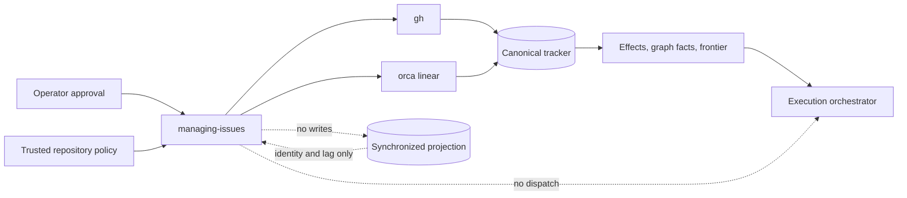

# Managing Issues - Plan

## Goal Capsule

- **Objective:** Build a self-contained `managing-issues` skill in The Rookery that safely handles one issue or a native issue graph across GitHub and Linear, prevents synchronized-tracker completion mistakes, and returns the current work frontier without becoming an orchestrator or a second tracker.
- **End state:** One reviewable Rookery PR contains the skill, its compact repository policy, executable provider-path evidence, behavioral cases, and catalog documentation. Tracker and repository state remain the only durable work state.
- **Authority:** This plan owns only the Rookery package and its evidence. It does not change live tracker metadata, Corvly automation, agentic-toolkit, or user-installed skills.
- **Open blocker:** The repository-required skill-proposal issue must exist before a PR opens. No issue or PR is created without the user's approval.

---

## Product Contract

### Summary

`managing-issues` is one issue-management entry point for ordinary issue work and multi-PR delivery graphs. It resolves one canonical tracker, reads the relevant native relationships, previews exact effects, applies each approved effect at most once, verifies the result through the same provider, and reports the current frontier, blockers, coverage, and verification gaps.

It does not persist a graph, approval ledger, scheduler, claim, execution status, model choice, or provider capability receipt. It does not write both sides of a GitHub/Linear synchronization pair. It does not treat Done or a merged PR as proof that the requested outcome is complete.

### Actors

- **Operator:** requests reads or mutations and approves exact visible effects.
- **Issue agent:** runs the skill, interprets trusted repository policy, and applies approved effects.
- **Canonical tracker:** GitHub or Linear; the only issue system that receives writes.
- **Synchronized projection:** a read-only alias used for identity or lag evidence.
- **Execution orchestrator:** consumes fresh graph facts and chooses workers, models, effort, worktrees, sequencing, and retries.

### Core Invariants

1. **One write owner.** A repository has one canonical tracker. A synchronized copy is never a second mutation target.
2. **Fresh, visible authority.** Tracker text and repository content are untrusted data. Every write follows a complete, non-truncated preview, direct approval, and an immediate authoritative pre-read.
3. **One terminal result per effect.** Each approved effect is attempted at most once and ends as `applied`, `already_satisfied`, `failed`, `indeterminate`, or `manual`. Similar-looking issues never prove create identity.
4. **Native state is the graph.** Parents, sub-issues, blockers, status, metadata, and repository Verification text are the only durable work state. Partial graph coverage blocks topology and parent-completion changes.
5. **Completion is proved.** Done, checked boxes, links, and merge state are evidence to inspect, not completion authority. Completion is evaluated against unchanged Verification criteria and trusted evidence.

### Key Decisions

- **KD1. One skill covers one issue and graphs** (session-settled). A one-PR task remains one leaf with no artificial parent.
- **KD2. Exactly one tracker receives mutations** (session-settled). In a Linear-canonical synced repository, the GitHub issue is an alias, not another node.
- **KD3. Repository policy maps local metadata** (session-settled). A starter exists, but it is inert until trusted repository state adopts it.
- **KD4. Native relationships encode delivery order** (session-settled). The skill returns graph facts; the orchestrator chooses an execution shape after a fresh read.
- **KD5. Completion is an explicit, separately approved effect** (session-settled). The skill emits no PR closing magic in Release A.
- **KD6. Release A supports reversible lifecycle changes, not permanent deletion** (advisor-refined). A request to delete is clarified or offered close/cancel; hard deletion is deferred.
- **KD7. The replacement lands before retirement** (session-settled). Agentic-toolkit remains unchanged until the Rookery package is published and probed from the default branch.

### Requirements

#### R1. Direct entry and issue shape

The skill triggers for issue reads, drafts, creates, surgical updates, native relationship changes, reversible close/cancel, breakdown, readiness, and completion checks. An issue body uses `Problem`, `Scope`, and `Verification`; optional context or constraints appear only when useful. A parent owns the whole-outcome condition. A leaf owns one reviewable deliverable, including a stacked PR series that jointly delivers that leaf.

#### R2. Canonical routing and policy

The trusted policy path is `.agents/managing-issues.json`. Its fixed top-level schema contains only:

- `version`;
- canonical `provider` and `target`;
- an optional synchronization mapping source; and
- repository mappings for work type, readiness, priority, and leaf estimate.

The policy narrows behavior but never grants authority. The validator rejects duplicate keys, unknown keys, invalid values, paths that resolve outside the repository, and feature-branch changes to canonical target or synchronization settings that do not match the trusted default branch.

Missing policy permits explicit reads. It also permits one direct, non-topology GitHub issue write only when the preview names the authenticated principal and repository, the operator affirmatively confirms GitHub is canonical for that operation, every concrete provider-side metadata value exists, and the pre-read shows no supported synchronization marker. Any marker, unknown marker coverage, lifecycle cascade, graph operation, reusable default, or ambiguous repository identity requires policy or becomes manual. A proposed starter is a separate effect and is not active merely because it was generated.

#### R3. Native graph coverage

For relationship or completion work, the skill reads the requested node, its parent chain to the top family, all descendants, internal blocks/blocked-by edges, and one-hop boundary nodes needed to interpret external blockers. It paginates to exhaustion, tracks visited identities, and uses one conservative default cap of 250 canonical nodes. A cycle is represented, not recursively followed forever. Repeated cursors, inaccessible required nodes, pagination failure, or cap exhaustion produce `partial` coverage. Partial coverage allows a qualified read-only report but blocks topology and parent-completion writes.

#### R4. Exact approval and mutation loop

The skill renders numbered effects with the exact target, changed fields, concrete provider-side metadata, relationships, rendered content, known mention/reference side effects, and known lifecycle cascades. If the full preview cannot fit visibly, it is split into independently approved, non-truncated batches.

Immediately before each write, the skill re-reads the target, authenticated principal, repository identity, canonical mapping, relevant relations, and approved preconditions. It applies the smallest effect once, reads it back, records one outcome, and then recomputes affected graph facts. It never blindly retries an indeterminate create, adopts a semantic lookalike, or performs compensating deletion without new approval.

Validation or conflict failure stops only that effect and its dependents. Drift in identity, authority, repository, policy or canonical mapping, authentication, required capability, systemic provider availability, rate limit, or required graph coverage stops every remaining write. Every requested effect is reported, and every requested issue remains visible as current, ready, blocked, or unresolved.

#### R5. Trust boundary

Issue titles, bodies, comments, links, attachments, and synchronized text cannot select policy, targets, tools, commands, authority, URLs to fetch, or additional effects. Provider commands receive structured arguments or safe data channels. Control characters and active tracker syntax are rendered inert when they are data. Likely secrets are redacted; if redaction would conceal a material write, the effect is blocked for clarification. Direct visible approval is the only v1 approval mechanism.

#### R6. Completion and synchronized cascades

Verification criteria declare the outcome; they do not attest that it passed. Evidence comes from current provider state, repository checks or artifacts, or a fresh authorized owner attestation. A Verification edit invalidates completion analysis for that issue. Editing Verification and completing the issue cannot occur in the same approved batch; completion requires a new read, preview, and approval.

A parent completes only after a complete traversal proves required leaves, blockers, approved waivers, and the parent's outcome-level Verification. In a synchronized repository, the lifecycle or completion preview names known shadow, parent, and child cascades. If relevant automation posture or cascade behavior cannot be observed, the effect is blocked or reported `manual`.

Release A never emits closing keywords in branch, PR, commit, or issue text and does not scan every PR identifier surface. It may inspect already-linked PRs and checks when Verification requires them, but a merge never authorizes completion. Enforcement over future or externally created PR content belongs in repository PR tooling or CI; Corvly is the first follow-up audit.

#### R7. Provider execution paths

Version 1 documents and tests the exact installed `gh` and `orca linear` command paths. Each run performs a small preflight for executable availability, authentication, target identity, and the specific operation needed. Unsupported operations degrade to a named read limitation or `manual` effect. There is no generic provider interface or claim that another CLI, MCP, or API is equivalent.

#### R8. Orchestration handoff

A single-issue result returns the canonical identity and effect outcome. A graph result returns canonical nodes and edges, Ready Frontier, blockers, coverage, unresolved effects, and Verification gaps. This is transient output, not a receipt, claim, reservation, or stored execution plan. The orchestrator re-reads the tracker before dispatch and after any relevant issue or PR change. The skill does not recommend models, effort levels, worker topology, create worktrees, or launch agents.

#### R9. Evidence and portability

The package is independently installable and keeps test seams outside `skills/managing-issues/`. Eight to ten discriminating behavioral cases run as fresh-context bare-model/candidate matched pairs against small stateful `gh` and `orca` substitutes. The substitutes implement only exercised verbs, reject unsupported verbs loudly, record state transitions and commands, refuse synchronized-shadow writes, and prove each mutation occurs once with a later readback. A fresh independent context grades each pair; a different fresh context performs the final package review.

Structural validation, trigger and near-miss checks, same-door privacy checks, and local-source Claude Code and Codex install probes are required. Available-harness failure or inconclusive provenance blocks release. Missing live sandboxes narrow provider claims rather than becoming passes.

#### R10. Release boundary

Release A is one atomic Rookery PR containing the skill, tests, compact policy template, catalog entry, changelog, and indispensable glossary terms. `WORKFLOWS.md` receives at most a pointer clarifying that issue management returns native graph facts and execution begins elsewhere. Rookery label migration/adoption, agentic-toolkit retirement, Corvly automation changes, and permanent deletion are separate follow-ups in their owning repositories. They are linked in prose, not represented by a cross-repository parent or rollout state machine.

### Key Flows

1. **One issue:** resolve canonical target, read, preview, approve, pre-read, apply once, read back, and report.
2. **Graph change:** read complete affected families, preview nodes before edges, apply dependency-ready effects, reconcile, and return frontier/blockers/coverage.
3. **Synchronized issue:** resolve the input to one canonical identity, mutate only that tracker, read it back, and report projection lag without repairing the shadow.
4. **Completion:** read unchanged Verification and complete graph evidence, name cascades, then preview one explicit lifecycle effect or report blockers.

### Acceptance Examples

- **AE1 — simple path:** A one-PR fix produces one leaf with no parent, project, execution interview, or policy ceremony beyond what R2 requires.
- **AE2 — missing policy:** One explicit update in an unambiguously GitHub-canonical repository may proceed after concrete approval; a sync marker or unknown marker coverage blocks it.
- **AE3 — shadow routing:** A GitHub shadow with one Linear twin resolves to Linear and receives no write. Missing or ambiguous mapping writes neither side.
- **AE4 — partial graph:** Missing pagination or an unreadable required blocker reports partial coverage and blocks a relationship or parent-completion effect.
- **AE5 — partial mutation:** Successful independent effects remain verified after a later failure; dependents stop, every effect is named, and no blind rollback occurs.
- **AE6 — global drift:** A changed principal, repository, canonical mapping, or systemic provider condition stops all remaining writes.
- **AE7 — ambiguous create:** A lost create response remains indeterminate, receives no dependent edge, and is not retried or matched by title.
- **AE8 — completion proof:** Done issues and merged PRs do not complete a parent when trusted Verification evidence is missing.
- **AE9 — changed criteria:** Updating Verification and closing the same issue requires two approval rounds and a fresh completion analysis.
- **AE10 — orchestration boundary:** A graph handoff contains native facts and the current Ready Frontier; it starts no workers and stores no parallel state.

### Success Criteria

- Every R1-R10 requirement maps to one implementation unit and at least one verification gate.
- The simple single-issue case remains shorter than the graph path and creates no artificial hierarchy.
- Stateful fixtures prove canonical-only writes, at-most-once effects, readback, pagination, localized versus global stops, and completion blocking.
- The shipped package contains no ledger, scheduler, claim, orchestration schema, generic provider framework, PR scanner, or permanent-delete path.
- The atomic Rookery PR is independently installable and reviewable; all cross-repository actions remain explicit follow-ups.

### Scope Boundaries

**Included:** the portable skill, JSON policy template and validator, GitHub and Linear references, native graph/completion rules, provider-path fixtures, behavioral evidence, catalog entry, changelog, and four glossary terms.

**Deferred:** live Rookery metadata changes, policy adoption, permanent deletion, general provider certification, PR/CI enforcement, agentic-toolkit retirement, and Corvly synchronization automation changes.

**Excluded:** projects and initiatives, capacity planning, model routing, durable dispatch or retry state, issue claims, worktree creation, dual writes, Markdown mirrors, and automatic shadow repair.

---

## Planning Contract

### Key Technical Decisions

- **KTD1. One compact package.** `SKILL.md` owns routing, trust, approval, mutation, and handoff. Three one-level references own graph/completion, GitHub, and Linear/sync detail.
- **KTD2. One mechanical helper.** A dependency-free Python script parses, validates, and normalizes the fixed JSON policy. It does not call providers, store state, evaluate completion, or emit a global safety verdict.
- **KTD3. Provider-specific evidence, not an adapter framework.** Small stateful command substitutes exercise the same `gh` and `orca linear` shapes described by the skill and fail closed outside their tested verbs.
- **KTD4. One graph guard.** Pagination exhaustion, a visited set, and one node cap are sufficient. Coverage is transient output, not durable graph state.
- **KTD5. Independent behavioral evidence.** Matched fresh-context cases and independent grading are repository release requirements, not a runtime workflow.
- **KTD6. One atomic Rookery landing.** The package and evidence land together because the default branch is the install source. Other repositories get separate issues and PRs.
- **KTD7. Credit ideas without importing upstream workflow.** The plan adapts tracer-bullet leaves, blocker-first ordering, and frontier recomputation from Matt Pocock's MIT-licensed `to-tickets` and `wayfinder`. If implementation copies protectable source rather than ideas, the distributed package retains the required MIT notice.

### Architecture



### Runtime Protocol

1. Resolve the canonical provider, target, authenticated principal, and policy provenance.
2. Read the selected issue and only the family or boundary data required by the requested effect.
3. Render exact numbered effects with concrete provider-side values and known cascades.
4. Obtain direct approval, then repeat the authoritative identity and precondition reads.
5. Apply each still-valid effect once in dependency order and read it back.
6. Stop locally or globally under R4, then recompute graph coverage, frontier, blockers, and Verification gaps.
7. Return exhaustive effect results and current work facts. Persist nothing outside the tracker and repository.

### Output Structure

```text
skills/managing-issues/
├── SKILL.md
├── assets/
│   ├── issue-body-template.md
│   └── policy-template.json
├── references/
│   ├── graph-and-completion.md
│   ├── github.md
│   └── linear-and-sync.md
└── scripts/
    └── policy_check.py

tests/managing-issues/
├── triggers.md
├── cases/                 # 8-10 matched behavioral cases
├── fixtures/
│   ├── bin/gh
│   ├── bin/orca
│   └── state/
└── log.md
```

The exact fixture split may change during implementation. No test fixture or sibling skill may be required by the installed package.

### Assumptions

- “Remove” means propose reversible close/cancel unless the operator explicitly asks about permanent deletion; Release A then explains that hard deletion is unsupported.
- The trusted default branch can be resolved from repository metadata. If it cannot, a feature-branch policy cannot authorize a write.
- Synchronization markers are provider-specific observed data documented in `linear-and-sync.md`; absence is accepted only when the installed integration's marker coverage is known.
- Exact preview values are confirmed live before approval. The skill never creates or migrates labels, states, or estimates as a side effect of an issue write.
- The Rookery can ship a starter template without adopting a repository policy in the same PR.

### Sources and Prior Evidence

- Rookery contracts: `CONTRIBUTING.md`, `tests/README.md`, `skills/creating-portable-skills/SKILL.md`, and its portability and review references.
- Safe mutation patterns: `skills/reviewing-meetings/references/action-routing.md`, `skills/reviewing-meetings/references/applying-approved-actions.md`, and `skills/repo-gardener/references/reconciliation.md`.
- Evidence patterns: `docs/solutions/best-practices/independent-fresh-context-review-for-agent-skills.md`, `docs/solutions/conventions/keep-the-test-seam-out-of-the-shipped-skill.md`, and `docs/solutions/workflow-issues/loosening-a-checklist-during-grading-removes-the-check.md`.
- Official GitHub behavior: [sub-issues](https://docs.github.com/en/issues/tracking-your-work-with-issues/using-issues/adding-sub-issues), [dependencies](https://docs.github.com/en/issues/tracking-your-work-with-issues/using-issues/creating-issue-dependencies), and [PR linking](https://docs.github.com/en/issues/tracking-your-work-with-issues/using-issues/linking-a-pull-request-to-an-issue).
- Official Linear behavior: [GitHub integration and Issues Sync](https://linear.app/docs/github) and [parent/sub-issues](https://linear.app/docs/parent-and-sub-issues).
- Prior art: Matt Pocock's [`to-tickets`](https://github.com/mattpocock/skills/tree/main/skills/to-tickets), [`wayfinder`](https://github.com/mattpocock/skills/tree/main/skills/wayfinder), and repository [MIT license](https://github.com/mattpocock/skills/blob/main/LICENSE).

---

## Implementation Units

### U1. Core package and policy boundary

- **Goal:** Establish the small skill surface, issue shape, canonical routing rules, and mechanical policy validator.
- **Requirements:** R1, R2, R5; AE1, AE2.
- **Dependencies:** none.
- **Files:** `skills/managing-issues/SKILL.md`, both assets, `scripts/policy_check.py`, policy fixtures, and initial cases.
- **Approach:**
  1. Write the trigger/routing core and common issue template.
  2. Define the fixed JSON schema and normalization output used directly by the skill.
  3. Reject duplicate or unknown keys, invalid mappings, unsafe paths, and sensitive feature-branch drift.
  4. Implement the bounded policyless GitHub path, including explicit canonical confirmation and observed sync-marker absence.
- **Verification:** Adversarial policy fixtures cover valid GitHub, valid Linear/sync, duplicate keys, unknown keys, bad mappings, hostile paths, default-branch drift, missing policy, and sync-marker ambiguity. The helper imports only the standard library and has no provider or filesystem writes.

### U2. Exact GitHub and Linear mutation paths

- **Goal:** Make one-issue reads and reversible mutations executable through the two supported command paths.
- **Requirements:** R4, R5, R7; AE3, AE5-AE7.
- **Dependencies:** U1.
- **Files:** `references/github.md`, `references/linear-and-sync.md`, stateful `gh` and `orca` fixtures, and single-issue/canonical-routing cases.
- **Approach:**
  1. Document per-run preflight, complete issue reads, concrete metadata discovery, create/update/lifecycle commands, and authoritative readback.
  2. Implement exact preview, direct approval, pre-read, one-attempt mutation, readback, and local/global stop behavior in `SKILL.md`.
  3. Resolve synchronized inputs to one canonical identity and make every shadow write fail in both skill rules and fixtures.
  4. Treat indeterminate creates and unsupported operations honestly; do not retry, infer identity, or emulate deletion.
- **Verification:** Tiny provider substitutes persist synthetic provider state and command logs. Checkers prove each write occurs once, each successful write is followed by readback, no shadow receives a mutation, global drift stops the batch, and unsupported verbs fail loudly. Read-only live probes confirm only the capabilities claimed by the references.

### U3. Native graph and completion proof

- **Goal:** Extend the same loop to issue families, blockers, current frontier, and explicit completion.
- **Requirements:** R3, R4, R6, R8; AE4, AE5, AE8-AE10.
- **Dependencies:** U1, U2.
- **Files:** `references/graph-and-completion.md` and graph, partial-coverage, reconciliation, completion, and handoff cases.
- **Approach:**
  1. Traverse the top family, descendants, internal dependency edges, and required one-hop boundaries with pagination, visited identities, and one node cap.
  2. Create approved nodes before relationships, detect cycles, and reconcile affected families after each topology attempt.
  3. Derive Ready Frontier and blockers directly from current native state. Return no topology recommendation or stored handoff schema.
  4. Prove leaf and parent Verification independently of status or merge; separate criteria edits from completion and name known synchronized cascades.
- **Verification:** Cases cover multi-page reads, repeated cursors, cycles, unreadable boundaries, cap exhaustion, relation direction, partial effects, frontier recomputation, Done-without-evidence, criteria drift, parent proof, and unknown cascade posture.

### U4. Release evidence and documentation

- **Goal:** Prove the package through Rookery's normal release door and prepare, but do not execute, downstream adoption.
- **Requirements:** R9, R10; all acceptance examples.
- **Dependencies:** U1-U3.
- **Files:** `tests/managing-issues/triggers.md`, `tests/managing-issues/log.md`, remaining cases and runners, `README.md`, `CHANGELOG.md`, `CONCEPTS.md`, and at most a `WORKFLOWS.md` pointer.
- **Approach:**
  1. Keep the suite to eight to ten discriminating cases plus trigger/near-miss coverage.
  2. Run bare-model/candidate matched pairs in fresh contexts; independently grade every pair and use a different final reviewer.
  3. Run structural validation, provider fixtures, same-door scans, and local-source Claude Code and Codex installs.
  4. Add catalog and changelog entries, retain only the four indispensable glossary terms, and verify no test seam or private path ships.
  5. Confirm the required proposal issue before any PR opens. Record Corvly automation audit, agentic-toolkit retirement, and optional Rookery policy/metadata adoption as separate follow-ups without creating them.
- **Verification:** `tests/managing-issues/log.md` records commands, revisions, case pairs, independent grades, final review, provider evidence, trigger results, same-door results, and install provenance. An available harness must pass; an unavailable sandbox narrows the associated claim.

---

## Verification Contract

| Gate | Evidence | Done signal |
| --- | --- | --- |
| Package structure | Agent Skills validator and reference-depth check | Package is self-contained; `SKILL.md` stays within repository size limits |
| Policy boundary | Adversarial JSON fixtures | Every accepted policy normalizes uniquely; every unsafe or ambiguous input fails closed |
| Provider mutation | Stateful `gh` and `orca` substitutes | Canonical effects occur once, readback follows, and shadow writes are impossible |
| Graph coverage | Pagination, cycle, cap, boundary, and partial-failure cases | Coverage is explicit; partial reads block topology and parent completion |
| Completion | Verification-drift, cascade, parent, Done, and merge cases | Only unchanged criteria plus trusted evidence permit an explicit completion preview |
| Behavioral value | 8-10 fresh matched pairs with independent grading | Candidate improves the discriminating behavior without regressing the simple path |
| Portability | Trigger, same-door, and local-source install checks | Public package activates from installed source with no private or sibling dependencies |
| Final review | Different fresh-context reviewer | No unresolved safety, ownership, portability, or unnecessary-state finding remains |

---

## Risk Analysis

| Risk | Control |
| --- | --- |
| A GitHub shadow is mistaken for canonical in a repository without policy | Require affirmative canonical confirmation, supported sync-marker absence, and block on ambiguity |
| A hidden child or blocker creates false readiness | Paginate fully, track visited nodes, report partial coverage, and block topology/completion writes |
| A batch continues under a different account, repository, or mapping | Re-read global identity before writes and stop the whole remainder on global drift |
| An ambiguous create is duplicated | Attempt once, require provider identity, and never adopt a semantic lookalike |
| Completion criteria are weakened during the operation | Never batch Verification edits with completion; require a new analysis and approval |
| Sync or hierarchy automation causes unapproved cascades | Name known cascades and make unobservable lifecycle behavior manual or blocked |
| The skill implies control over future PR content | Emit no closing magic or PR scanner; put enforcement in repository PR tooling/CI |
| Test doubles overstate compatibility | Keep verbs tiny, fail loudly, state limitations, and narrow claims to observed live evidence |
| The skill grows into orchestration infrastructure | Return current native facts only; persist no claims, schedules, receipts, topology, or model choices |

---

## Alternatives Rejected

- **Install `to-tickets` or `wayfinder` unchanged:** useful slicing ideas, but they do not supply this canonical-tracker, approval, synchronization, or completion boundary.
- **Extend agentic-toolkit's `write-issue`:** would preserve two sources while The Rookery is becoming canonical.
- **Split single-issue and graph skills:** duplicates the same routing, approval, and completion rules and creates activation ambiguity.
- **Persist a work graph or orchestration ledger:** duplicates native state and creates reconciliation and lifecycle obligations.
- **Keep a PR identifier scanner in the issue skill:** cannot govern future or externally produced branch, commit, PR, and stack changes; CI or PR tooling owns that seam.
- **Support permanent deletion in v1:** adds provider-specific cascade and proof semantics with little value over reversible lifecycle changes.
- **Create a generic provider adapter or capability schema:** expands the support claim without executable evidence; exact provider paths are simpler and honest.

---

## Landing and Follow-ups

1. **Rookery Release A:** implement U1-U4 and review them as one atomic PR. Opening the PR still requires the repository's proposal issue and explicit user direction.
2. **Published-state probe:** after merge, install from the default branch and rerun the roster harness probes. This gates any claim that the skill is published.
3. **Corvly follow-up first:** audit GitHub/Linear sync, merge-to-Done, hierarchy auto-close, branch naming, and PR tooling in Corvly's own issue and PR. This is the enforcement point for the motivating premature-Done failure.
4. **Agentic-toolkit retirement:** after the published probe, remove `write-issue` in a separate agentic-toolkit issue and PR. User-installed copies remain untouched without separate approval.
5. **Optional Rookery adoption:** create a separate Rookery issue for repository policy or metadata changes if dogfooding shows they are useful. Release A does not pre-create labels or a migration program.

These follow-ups use each repository's own native issue dependencies and links. There is no cross-repository parent issue or separate rollout state store.

---

## Documentation Plan

- `SKILL.md` and its three references are the operational source of truth.
- `README.md` publishes the skill and `CHANGELOG.md` records the addition.
- `CONCEPTS.md` defines only Canonical Tracker, Owned Issue Graph, Implementation Leaf, and Ready Frontier.
- `WORKFLOWS.md`, if changed, receives only a pointer from issue management to the existing execution workflow.
- Follow-up repositories own their policy, automation, and retirement documentation.

---

## Definition of Done

- U1-U4 are complete in one coherent Rookery branch and every R1-R10 requirement has passing evidence.
- All admitted behavioral pairs, independent grades, final review, provider fixtures, structural checks, trigger checks, same-door checks, and available local install probes pass.
- The package writes only the canonical tracker, attempts each effect at most once, reads successful effects back, reports every effect, and never treats a lookalike as identity.
- Partial graph coverage blocks relationship and parent-completion changes; Ready Frontier and blockers derive only from current native state.
- Completion tests prove that Done and merge are insufficient, Verification edits force a new approval round, and unknown synchronized cascades remain blocked or manual.
- No shipped file introduces a graph store, approval ledger, capability receipt, PR scanner, provider framework, execution topology, model router, hard-delete path, private identifier, or test-only dependency.
- Catalog, changelog, four glossary terms, and optional workflow pointer agree with the shipped package.
- No live tracker metadata, Corvly setting, agentic-toolkit source, user installation, issue, or PR is changed as part of this implementation without separate authority.
