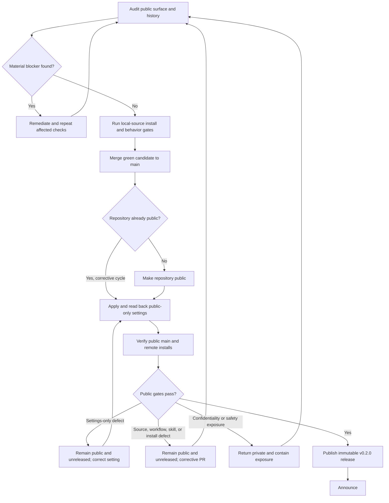
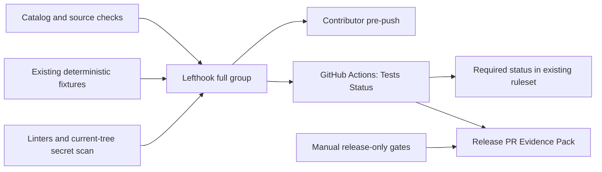
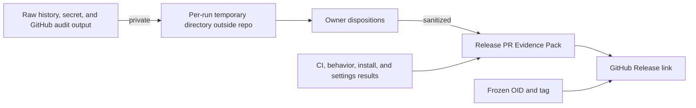

# OSS Readiness and Public v0.2 Release - Plan

## Goal Capsule

- **Objective:** Qualify The Rookery for outside use, publish an immutable `v0.2.0` minor release from the validated public revision, and launch it to the engineering community without claiming a stable `1.0.0` public contract yet.
- **Product authority:** The confirmed owner decisions in this plan govern release scope; repository conventions and the cited OSS guidance constrain readiness and publication behavior.
- **Execution profile:** Prepare one release PR while the repository is private, bind content, behavior, and local-install evidence to the qualified PR-head tree/package identity, merge only after CI and owner review pass, prove that the squash result preserves that identity, then freeze and qualify the resulting public `main` OID before publishing the release.
- **Stop conditions:** Stop for any R3 blocker, an unexplained candidate change, a tree/package mismatch across the squash merge, an unavailable required public security path, an inconclusive install provenance result, or a mismatch among frozen public `main`, the peeled tag target, and the published release identity. Owner approval is required before visibility, history rewrite, credential, ruleset, merge, tag, release-publication, and announcement mutations.
- **Artifact:** A public, installable rolling catalog; an immutable `v0.2.0` Release Snapshot; a green required `Tests Status`; hardened GitHub settings; and sanitized release evidence in the release PR.

---

## Product Contract

### Summary

The implementation keeps the repository's existing skill-test convention and gives it one lightweight consistency check during release preparation rather than a certification-style gate. It keeps the Evidence Pack as a small release-level summary rather than treating it as an eval database or run ledger. It adds one shared Lefthook/CI verification door and separates private qualification from public-path qualification at an exact candidate revision. It covers readiness, installation, GitHub hardening, release, and launch without redesigning the skills, adopting the unfinished Corbel eval system, or automating owner-only release actions.

### Problem Frame

The repository already contains a working skills catalog, documented installation commands, community-health files, a changelog, and a private `v0.1.0` release. Its current barrier to outside use is repository visibility, but making the repository public exposes the full project surface and creates a lasting trust obligation.

The owner has not open-sourced a repository before and needs a standard, repeatable release baseline rather than an informal visibility change. The baseline must be strong enough to catch confidential material, unsafe skill behavior, broken installation, misleading documentation, weak repository protections, and release-integrity mistakes without turning a source-only skills catalog into a certification program.

### Key Decisions

- **Public pre-1.0 minor release and community launch** (session-settled: user-directed — `v0.2.0` is chosen over `v1.0.0` because the repository should become usable and understandable outside without declaring its public contract stable yet; a visibility-only or catalog-only release still falls short). Governs R1, R8, R10-R14.
- **Pragmatic blocker-based readiness baseline** (session-settled: user-approved — chosen over zero-defect polish or formal certification: material public-use risks must close without turning the first public OSS release into a compliance program). Governs R2-R9.
- **Staged manual-first release workflow** (session-settled: user-approved — chosen over simultaneous publication or full release automation: the first public OSS release should produce evidence that can shape later automation). Governs R8-R12, R15.
- **Rolling `main` catalog with semantic release snapshots** (session-settled: user-approved — chosen over version-pinned distribution: it matches the repository's installer contract and established agent-skill catalog practice). Governs R9-R12.
- **Owner verification plus an informal outside usability check** (session-settled: user-approved — chosen over treating one friend's test as the only safeguard or requiring a durable post-launch follow-up: repository-wide evidence gates release while outside use informally validates the handoff). Governs R9, R14.

### Actors

- A1. **Maintainer:** Owns readiness decisions, repository administration, manual install verification, release publication, and launch communication.
- A2. **Outside adopter:** An engineering manager or similar practitioner who evaluates the workflow and installs skills without private context or maintainer intervention.
- A3. **Community practitioner:** Encounters the launch through the maintainer's professional or developer channels and relies on the public repository as the source of truth.
- A4. **External contributor:** Opens an issue or pull request from an untrusted fork and expects CI and community guidance to behave safely.

### Requirements

**Readiness and public trust**

- R1. The release must make the repository safe, understandable, and usable for A2 and A3 rather than merely changing its visibility.
- R2. A pre-public audit must cover the tracked tree; full Git history, commit metadata, and every ref; repository metadata; existing hosted collaboration content; releases and release assets; GitHub Actions history, artifacts, workflow definitions, triggers, token permissions, and fork-approval settings; collaborators; Actions and Dependabot secrets and variables; environments and protection rules; deploy keys; webhooks; installed GitHub Apps or OAuth integrations; and other public-facing or privileged repository settings. Before a clean history-scan result can qualify the release, the pinned scan configuration must detect a known test credential in a disposable mirror that includes the audited refs.
- R3. Publication must stop for exposed secrets or private material, unresolved ownership or licensing uncertainty, unsafe repository or skill behavior, a broken security-reporting path, failed required tests or installs, or materially misleading core documentation. Private material includes credentials, third-party personal information, internal or client identifiers, non-public infrastructure details, private transcripts or session links, and content the repository lacks permission to publish. A discovered public exposure must be contained, affected credentials revoked or rotated, and affected checks repeated before release.
- R4. The readiness baseline must apply GitHub's community-profile expectations and the OpenSSF OSPS Baseline `v2026.02.19` Level 1 controls that are relevant to a source-only skills catalog, recording concise justifications for non-applicable controls. An applicable failure blocks release when it maps to an R3 blocker; another applicable gap may be deferred only with a recorded rationale, owner, and follow-up disposition.
- R5. The audit must confirm that the MIT license covers the repository's authored material and that third-party code, text, and visual assets have compatible rights and attribution.
- R6. The public repository must provide accurate entry points for use, contribution, conduct, vulnerability reporting, issue submission, and its no-support-SLA boundary.
- R7. The public narrative must explain what The Rookery contains, who it is for, the recurring workflow problem and representative benefit, how Orca and Compound Engineering relate to its workflow, how to install skills, and what an adopter should expect after installation. It must make clear that `v0.2.0` is the first public OSS Release Snapshot, the documented rolling-`main` install path is usable now, the public contract may still evolve before `1.0.0`, and the private-era `v0.1.0` is historical rather than an install target.

**Publication and versioning**

- R8. The release workflow must gate the visibility change on a clean readiness result and local-source install evidence, then recheck public settings and the real remote install path before publishing `v0.2.0`. The public settings must benchmark the current Corvly `main` rules and apply the appropriate protections here, including pull-request-only changes, required review-conversation resolution, least-privilege Actions permissions, fork-workflow approval, and additional protections justified for public OSS. CI must execute every check configured in Lefthook through the same underlying commands and may add focused repository-level OSS checks that do not belong in a local hook.
- R9. A1 must manually verify that every skill in the published catalog is discoverable and installable from a clean outside environment through the documented public `npx skills add` path, recording the exact installer package, resolved version, registry repository, package integrity, maintainers or publisher identity, and observed harness. Release preparation includes one lightweight check that the skill suites still use the shared three-artifact convention and do not make materially unsupported release claims; it is not a repository-wide recertification of historical evidence. Behavioral qualification follows the cost hierarchy in `tests/README.md`: exact unchanged package identity may carry prior evidence; a description change reruns the full trigger contract; a behavior change reruns affected behavioral cases; and a packaging or install-path change reruns the relevant harness smoke. An actual failed required test, broken install, unverifiable package identity, self-graded result relied on by the release, or materially unsupported release claim blocks publication. Harmless documentation or formatting drift does not. A one-time review of published skills and referenced scripts must check for secrets, unsafe data handling, unexplained external calls, excessive privileges, and destructive behavior; a material finding is an R3 blocker.
- R10. The `v0.2.0` GitHub Release must enable release immutability and bind its annotated tag to the validated public commit.
- R11. The `v0.2.0` release notes must identify it as the first public OSS Release Snapshot, mirror the canonical changelog entry, state that the project remains in SemVer's `0.y.z` initial-development phase, explain that the documented rolling-`main` install path is usable now while the public contract may still evolve before `1.0.0`, and identify `v0.1.0` as a historical private-era snapshot rather than an install target.
- R12. Published release tags must remain historical checkpoints; corrections use a new semantic version rather than moving or reusing an existing release tag.
- R13. The release must be announced through the maintainer's existing professional or developer channels with links to the repository, workflow explanation, and installation entry point.

**Outside validation and repeatability**

- R14. A2 must be able to find the relevant documentation, understand the workflow's purpose, and install desired skills without maintainer-led setup. The owner's informal post-launch check does not create a tracked follow-up obligation.
- R15. The first public OSS release must leave a durable record of checks, results, blocker dispositions, deferred findings, the validated public revision, and the published release so the workflow can be repeated.

### Release Flow



### Key Flows

- F1. Pre-public qualification
  - **Trigger:** A1 begins the public-release run.
  - **Actors:** A1.
  - **Steps:** Prepare the public documentation and shared CI door; audit every public surface and repository setting; review published skill behavior and licensing; classify findings against the blocker policy; remediate blockers; run deterministic and behavioral evidence; and verify local-source installation from an exact clean revision.
  - **Outcome:** The candidate is approved for merge and visibility change or remains blocked with actionable evidence.
  - **Covers:** R1-R9, R15.
- F2. Public-path release
  - **Trigger:** U5 merges the F1-qualified candidate, proves tree/package equality across the squash merge, reruns merged-commit gates, and freezes green `main` for publication.
  - **Actors:** A1.
  - **Steps:** Make the repository public; read back visibility, revision, protections, Actions settings, security paths, and public surfaces; enable public-only controls; verify the unchanged remote catalog and installs; and publish the validated release snapshot. An installation or setting defect leaves the repository public but unreleased. A confidentiality or public-safety exposure returns it to private and triggers containment, revocation or rotation, remediation, and affected-gate reruns.
  - **Outcome:** `v0.2.0` is an immutable record of a public revision that passed the real distribution path without declaring the catalog's public contract stable.
  - **Covers:** R8-R12, R15.
- F3. Community handoff
  - **Trigger:** F2 publishes `v0.2.0`.
  - **Actors:** A1, A2, A3.
  - **Steps:** Announce the release and direct readers to the workflow and installer. The outside-adopter check remains informal; any corrective implementation is separately authorized rather than created as a durable obligation by this plan.
  - **Outcome:** Outside practitioners can evaluate and adopt the repository without private context.
  - **Covers:** R13-R15.

### Acceptance Examples

- AE1. **Covers R2, R3.** Given the current tree is clean but a credential or private artifact appears in history, a commit trailer, an Actions artifact, or another GitHub surface, when readiness is graded, then publication remains blocked until the exposure is contained, affected credentials are revoked or rotated, and the affected surfaces are rechecked.
- AE2. **Covers R3, R5.** Given a third-party asset has uncertain rights, when the licensing audit runs, then the release remains blocked until compatible permission and attribution are established or the asset is removed.
- AE3. **Covers R3, R4.** Given an audit finds cosmetic polish debt that does not compromise safety, installation, or core understanding, when findings are dispositioned, then the debt may be recorded with a rationale and owner without blocking release.
- AE4. **Covers R8, R9.** Given local-source installation passes but the public remote install fails, when the post-public gate runs, then `v0.2.0` is not published until the defect is fixed and the remote gate passes.
- AE5. **Covers R2, R8.** Given the visibility change alters repository protections, or The Rookery differs from an applicable Corvly or public-OSS protection, when the public-settings recheck runs, then release publication waits until the intended pull-request, conversation-resolution, branch, Actions, fork, and security protections are applied and verified.
- AE6. **Covers R12.** Given a material defect is found after `v0.2.0`, when a correction ships as a Release Snapshot, then it receives a new semantic release tag and the original tag remains unchanged.
- AE7. **Covers R4, R15.** Given an external baseline control does not apply to this skills catalog, when readiness is recorded, then the evidence names the control and why it is not applicable rather than silently omitting it; an applicable failure either maps to an R3 blocker or records its rationale, owner, and follow-up disposition.
- AE8. **Covers R3, R9.** Given every skill installs but an existing behavioral test fails or the one-time skill review finds a material security problem, when readiness is graded, then the release remains blocked until the failure is resolved and the affected evidence passes.
- AE9. **Covers R8.** Given a check is configured in Lefthook, when CI is inspected and run, then CI invokes the same non-empty hook group and a contributor cannot pass locally by relying on a different implementation.
- AE10. **Covers R9, R15.** Given a same-named global skill, changed candidate, or squash-only merge could create a false pass, when an install or behavioral result is recorded, then it is conclusive only if the clean source tree/package identity, installed files, loaded path, harness, installer identity, and recorded pre/post-merge revisions agree.
- AE11. **Covers R10-R12.** Given the public gates pass, when the release is published, then the peeled annotated tag, frozen `main` OID, release target, immutable-release readback, and release verification identify the same candidate; an ambiguous publication response is read back before any retry.
- AE12. **Covers R9, R15.** Given the nine skill suites have accumulated different histories, when the lightweight release check runs, then each suite retains the same small artifact contract and no result relied on for `v0.2.0` is self-graded, bound to the wrong package, or broader than its retained evidence. Unrelated historical or formatting drift does not block release, and Corbel adoption is not required.

### Success Criteria

- No R3 blocker remains open when repository visibility changes or when `v0.2.0` is published, except that public-only settings are necessarily graded immediately after the visibility change and block the release rather than the transition itself.
- Every published skill is listed and installs through both required stages from a clean outside environment, with source and runtime provenance and installer identity recorded.
- Existing deterministic fixtures and every behavioral case required by the `tests/README.md` change-based cost hierarchy pass, and the one-time skill security review leaves no material finding unresolved.
- The public repository applies the intended Corvly and OSS protections; `Tests Status` is required; CI runs the complete Lefthook group; and public-only security/reporting settings pass readback.
- The release tag identifies the same revision that passed the public-path checks, the immutable release verifies, and its notes match the canonical changelog entry and describe the first public OSS snapshot, rolling `main`, and pre-1.0 boundary accurately.
- An outside engineering practitioner can understand the workflow and complete installation without private context or maintainer-led setup.
- The community announcement links to accurate public documentation and installation instructions.
- A later release can follow the repository's concise release checklist and the release PR's sanitized Evidence Pack without reconstructing the first public OSS release from conversation history.

### Scope Boundaries

**In scope**

- Public documentation, community-health surfaces, release documentation, provenance and attribution corrections, deterministic repository checks, CI, Lefthook, and GitHub repository settings needed for this release.
- Full-history and GitHub-surface auditing, conditional remediation, the one-time skill/script security review, existing deterministic fixtures, release-candidate behavioral runs, and two-stage Install Probes.
- One release PR, the private-to-public transition, an immutable `v0.2.0`, launch copy, and owner-controlled publication actions.

**Outside this plan**

- Redesigning existing skills or adding skills solely to enlarge the launch.
- A standalone website, package registry, parallel distribution system, or version-pinned installation promise.
- Formal OpenSSF certification, a Scorecard target, DCO or CLA, SBOM or signing infrastructure, mandatory non-author review, governance or support-SLA documents, and broad release automation.
- A durable record or mandatory corrective workflow for the informal outside-adopter check.

### Deferred to Follow-Up Work

- Automate release-state transitions only after the first manual run exposes stable seams worth automating.
- Consider CodeQL default setup only if the public repository's detected Python surface produces useful signal beyond the required source and fixture checks.
- Revisit higher OSPS maturity levels, signed commits, attestations beyond GitHub's immutable-release attestation, or mandatory approvals only if project scale or contributor volume justifies them.

### Dependencies and Assumptions

- A1 retains GitHub administrative authority to inspect and mutate visibility, Actions, rulesets, security settings, releases, and repository metadata.
- The documented `npx skills add` interface remains the supported public installation path; execution re-resolves the package version, registry repository, integrity, and publisher or maintainer identity instead of trusting planning-time values.
- GitHub, the skills installer, OpenSSF, and community-profile behavior remain external dependencies whose current behavior is rechecked during execution.
- The existing MIT license and community-health documents are foundations to verify and refine, not evidence that the full repository is already public-safe.
- The owner will select announcement channels and explicitly classify the public intent of the Code of Conduct contact address, license identity, commit identities, and historical session links before the visibility gate.

### Sources and Research

- `README.md`, `PRODUCT.md`, `WORKFLOWS.md`, `CONTRIBUTING.md`, `SECURITY.md`, `CODE_OF_CONDUCT.md`, `LICENSE`, `CHANGELOG.md`, and `skills/README.md` define the current public-use, community, licensing, versioning, and catalog contracts.
- `CONCEPTS.md` defines Published Catalog, Install Probe, Same-Door Rule, Release Snapshot, and Evidence Pack.
- `tests/README.md` and the nine `tests/<skill>/` suites define structural, behavioral, and install-smoke evidence.
- `docs/solutions/workflow-issues/declared-contract-governs-artifact-placement.md` requires private inspection artifacts to remain outside this public-bound repository.
- `docs/solutions/integration-issues/skills-cli-ref-not-checked-out.md` requires exact local-source pre-public probes and plain default-branch remote probes after publication.
- `docs/solutions/best-practices/cross-harness-dogfood-testing.md` requires installed-content and runtime-path provenance rather than a listing-only pass.
- `docs/solutions/conventions/shipping-executable-helpers-in-a-markdown-skill-catalog.md` requires copy-mode packaging and executable-bit proof for scripts-bearing skills.
- `docs/solutions/workflow-issues/rebase-silently-drops-changelog-entries.md` requires changelog entries to be unioned and frozen before release.
- [GitHub visibility guidance](https://docs.github.com/en/repositories/managing-your-repositorys-settings-and-features/managing-repository-settings/setting-repository-visibility), [ruleset controls](https://docs.github.com/en/repositories/configuring-branches-and-merges-in-your-repository/managing-rulesets/available-rules-for-rulesets), and [Actions settings](https://docs.github.com/en/repositories/managing-your-repositorys-settings-and-features/enabling-features-for-your-repository/managing-github-actions-settings-for-a-repository) define the public-transition and protection behavior.
- [GitHub secure-use guidance](https://docs.github.com/en/actions/reference/security/secure-use), [private vulnerability reporting](https://docs.github.com/en/code-security/how-tos/report-and-fix-vulnerabilities/configure-vulnerability-reporting), and [security-analysis settings](https://docs.github.com/en/repositories/managing-your-repositorys-settings-and-features/enabling-features-for-your-repository/managing-security-and-analysis-settings-for-your-repository) define the public security posture.
- [GitHub immutable releases](https://docs.github.com/en/code-security/concepts/supply-chain-security/immutable-releases) and [release verification](https://docs.github.com/en/code-security/how-tos/secure-your-supply-chain/secure-your-dependencies/verify-release-integrity) define release integrity and verification.
- [GitHub community profiles](https://docs.github.com/en/communities/setting-up-your-project-for-healthy-contributions/about-community-profiles-for-public-repositories), [OpenSSF OSPS Baseline `v2026.02.19`](https://baseline.openssf.org/versions/2026-02-19), and the [OSI MIT license](https://opensource.org/license/mit) anchor the readiness baseline.
- [Lefthook usage](https://lefthook.dev/usage/) and [`min_version`](https://lefthook.dev/configuration/min_version/) define the shared local/CI hook contract.
- [GitHub sensitive-data removal](https://docs.github.com/en/authentication/keeping-your-account-and-data-secure/removing-sensitive-data-from-a-repository) and [Gitleaks](https://github.com/gitleaks/gitleaks) define the history-audit and containment approach.
- [Compound Engineering](https://github.com/EveryInc/compound-engineering-plugin) and [Impeccable](https://github.com/pbakaus/impeccable) demonstrate active `main` skill distribution paired with semantic release history.
- [Semantic Versioning 2.0.0](https://semver.org/spec/v2.0.0.html) defines `0.y.z` as initial development and specifically recommends incrementing the minor version for subsequent pre-1.0 releases.
- [OpenAI evaluation best practices](https://developers.openai.com/api/docs/guides/evaluation-best-practices) and [Anthropic's evaluation design guidance](https://platform.claude.com/docs/en/test-and-evaluate/develop-tests) support task-specific criteria, real and edge-case coverage, comparison or classification-shaped grading, continuous growth from observed failures, and human calibration of automated judgment.

---

## Planning Contract

Product Contract preservation: R1-R15 and their settled product decisions retain their meaning except for the user-directed change from `v1.0.0` to the pre-1.0 `v0.2.0` minor release. Planning research adds A4 and AE10-AE12, clarifies revision and public-transition failure states, and narrows F3 to the already-settled informal outside check; it does not add a new product obligation.

### Current State

| Surface | The Rookery now | Corvly benchmark | Planned public state |
|---|---|---|---|
| Default-branch changes | PR required; deletion and force-push blocked; conversations resolved; no bypass | Same | Preserve |
| Required approvals | 0 | 0 | Preserve; OSPS Level 1 does not require non-author approval |
| Required checks | None | `Tests Status` | Require a repository-local `Tests Status` after it succeeds once |
| Merge methods | Squash only | Merge, squash, and rebase | Preserve Rookery's squash-only history |
| Delete head branch | Disabled | Enabled | Enable |
| Actions token | Read-only; cannot approve PRs | Same | Preserve and declare `contents: read` in the workflow |
| Actions sources | All actions allowed; full-SHA policy off | Same | Restrict to the required sources and enable full-SHA pinning |
| Fork approval | Unavailable while private | Not transferable | After publication, require approval for all external contributors |
| Vulnerability reporting | Unavailable while private while `SECURITY.md` points to it | Not transferable | Enable and verify immediately after publication |
| Release immutability | Disabled; existing `v0.1.0` remains mutable | Not transferable | Enable before creating `v0.2.0`; disposition `v0.1.0` in the public audit |

### Reusable OSS Release Baseline

This is the portable minimum to reuse for Corbel, `networked-thinking-skills`, `networked-thinking`, and future public repositories. It describes the recurring release shape; each repository adds only the checks justified by its own language, distribution model, data sensitivity, and contributor model.

| Baseline area | Repeatable minimum | Evidence that closes it |
|---|---|---|
| Public contract | Accurate README and usage path; OSI-compatible license; contribution, conduct, defect-reporting, vulnerability-reporting, and support-boundary documents | Reader walkthrough plus rendered-link and community-profile checks |
| Exposure and rights | Inspect the tracked tree, relevant history and refs, hosted collaboration/release/Actions surfaces, privileged integrations, public metadata, secrets, personal material, ownership, and third-party attribution before changing visibility | The pinned scan detects a known test credential in a disposable mirror; the real audit then records sanitized blocker/N/A dispositions while sensitive raw output remains private and outside the repository |
| One verification door | Document one normal local command and run the same non-empty check roster in required CI; keep networked, privileged, destructive, or judgment-heavy release checks manual | Local result, required CI result, exact revision, and a negative control proving the door can fail |
| Repository protection | PR-only default-branch changes where practical, resolved review conversations, no force push or deletion, least-privilege CI, untrusted-fork isolation, and a private vulnerability channel | Authoritative settings readback rather than mutation success alone |
| Candidate qualification | Freeze one candidate; run applicable deterministic, behavioral, packaging, install, and security checks; record tools and environments; invalidate only the evidence touched by later change | Revision-bound qualification summary with explicit `not run`, limitations, and deferrals |
| Release identity | Use a unique semantic version, canonical changelog entry, immutable annotated tag and release, exact target verification, and draft-before-publish flow | Peeled tag, frozen commit, release readback, immutability state, and verification or attestation agree |
| Public-path proof | After publication, verify the actual outsider-facing clone, package, install, documentation, security, and contribution paths against unchanged source | Clean external-environment result and public visitor check |
| Recovery and repetition | Stop on material exposure or qualification failure; contain rather than claim public copies were erased; correct published releases with a new version; retain a concise repository-specific checklist | Recorded containment/disposition, new-version policy, and the completed release record |

Application rule: pin the external baseline version used for a release, mark controls that genuinely do not apply, and keep the first run manual. Automation earns its place only after the same step has repeated cleanly enough to define a stable interface.

### Adversarial Assessment of Test and Evidence Conventions

The current convention is simple enough for `v0.2.0`: every skill suite has three core artifacts (`triggers.md`, self-contained binary cases, and a bounded `log.md`), with fixtures or a scoring protocol only when the case needs them. The Evidence Pack is also small: a sanitized release summary in the pull request, with raw or sensitive material outside the repository. These are separate layers. Suite logs preserve development claims; the release PR records which exact candidate gates passed.

The convention also matches current evaluation guidance where it matters for this catalog: task-specific cases, typical and adversarial boundaries, binary or comparison-shaped judgments, cases mined from observed failures, fresh contexts, human or independent grading, exact package provenance, and explicit limits on what a pass proves. The main adversarial risk is not missing infrastructure; it is a plausible-looking false pass caused by grading the wrong installed copy, letting the author grade their own qualitative output, loosening a checklist after seeing a run, or carrying an old result across changed bytes.

For this release, keep the convention and run one lightweight consistency check across the current suite structure and the evidence actually relied on for `v0.2.0`. This is not historical-evidence recertification. Do not migrate the repository to Corbel's broader `EVAL.md`, contract, labels, trial, and receipt model yet. Corbel is the intended future convergence point once its simpler eval suite is ready and proves that adopting it reduces ambiguity or maintenance here. Until then, call these artifacts skill regression and qualification suites, not a comprehensive or statistically validated eval system.

### Key Technical Decisions

- KTD1. **One non-empty Lefthook group is the normal verification door.** (session-settled: user-directed — chosen over separate local and CI implementations: every Lefthook check must run in CI through the same underlying jobs.) Repository-owned check entry points cover catalog structure, Markdown and data integrity, shell and Python static checks, current-tree secret scanning, and every deterministic fixture runner. CI validates the configuration and runs that exact full group on pull requests and pushes to `main`, under the stable job name `Tests Status`. Governs R8-R9 and AE9.
- KTD2. **Release-only audits stay outside the ordinary hook.** Full-history/GitHub-surface scans, model-driven behavioral cases, local/remote installations, rendered GitHub-form checks, and networked link checks need external state, fresh contexts, or owner judgment. They are manual gates in `RELEASING.md`, not flaky required CI. Governs R2-R5, R8-R9.
- KTD3. **Use the existing Evidence Pack boundary.** (session-settled: user-approved — chosen over a tracked readiness ledger or a new immutable evidence asset: the release PR is already the repository's canonical durable change record.) Raw reports and suspected sensitive material live in an owner-only per-run temporary directory outside the worktree and outside synced or backed-up locations; sensitive values must not appear in filenames or captured command logs. Delete the disposable mirror and raw evidence after sanitized dispositions are approved and the run completes or is abandoned, unless the owner explicitly approves a bounded retention location and period. Sanitized pre-public results land in the release PR body; post-public settings, install, tag, and release readbacks are appended to that same PR body, and the GitHub Release links back to it. Governs R2-R5, R15.
- KTD4. **Evidence is bound to both content and revision.** A tracked source, documentation, test, or workflow change creates a new tree/package identity and invalidates downstream checks from the changed surface. A squash merge may change the commit OID while preserving the qualified tree; content, behavior, and local-install evidence carries forward only after explicit tree/package equality, while merged-commit CI and history-sensitive checks rerun. A GitHub-only settings change invalidates the relevant settings readback but not unchanged source/install evidence. Public `main` is frozen from the first remote probe through release publication. Governs R8-R12 and AE4, AE10-AE11.
- KTD5. **Install proof is two-stage and provenance-bearing.** Pre-public probes use a clean checkout of the qualified PR-head and copy-mode installation; after squash merge, tree/package equality binds that evidence to the frozen merged OID. Post-public probes use plain `owner/repo` only after proving remote `main` equals that merged OID. Listing, installed-content equality, executable bits, harness-native loading, runtime path, triggers, and behavior remain distinct evidence layers. `@branch` and `@sha` installer syntax is not release evidence. Governs R9, R14 and AE4, AE10.
- KTD6. **Harden the existing ruleset rather than layering another one.** First produce a successful `Tests Status`, then update the active default-branch ruleset to require that exact check from the observed GitHub Actions integration while preserving PR-only changes, conversation resolution, deletion/force-push protection, zero approvals, and no bypass. Actions use untrusted-safe `pull_request` execution, read-only permissions, no secrets, full-SHA-pinned actions, and version-and-checksum-pinned downloaded tools. Governs R4, R8 and AE5, AE9.
- KTD7. **Public-only settings form an ordered gate.** After visibility changes, prove public visibility and the default-branch OID before applying and reading back fork approval, private vulnerability reporting, secret/push protection, community-profile recognition, metadata, rendered forms, and branch/Actions settings. No remote install or release drafting begins until that gate closes. Governs R2, R6, R8 and AE5.
- KTD8. **Release publication is an exact-OID state machine.** Confirm the `v0.2.0` namespace is unused, enable release immutability while private, freeze a green public `main` OID, create an annotated tag at that OID, prepare and inspect a draft release from the frozen changelog, publish once, and verify the peeled tag, release identity, immutable state, and attestation. An ambiguous mutation is read back before retry; post-public corrections use a new version. Governs R10-R12 and AE6, AE11.
- KTD9. **Agents prepare; the owner mutates trust boundaries.** Agents may inspect, draft, run deterministic and disposable qualification, and propose exact settings. The owner confirms licensing and privacy dispositions and explicitly authorizes history rewrite, credential actions, visibility, ruleset changes, merge, tag push, release publication, and announcement. Governs R2-R5, R8-R13.
- KTD10. **Keep the current skill-test convention for `v0.2.0`; defer Corbel migration.** (session-settled: user-directed — chosen over adopting the unfinished Corbel eval system during OSS release work: cross-skill consistency is the immediate goal.) Treat the three-artifact suite contract as a small regression/qualification framework, apply AE12 as a lightweight release check, and keep release evidence in the PR-level Evidence Pack rather than adding labels, trials, receipts, or another tracked ledger. Governs R9, R15 and AE12.

### High-Level Technical Design

#### Shared verification topology



The hook group is the single normal check roster. Manual release-only gates remain separate because they require full remote history, GitHub administration, agent harnesses, or owner judgment; they still report into the same Evidence Pack.

#### Candidate and release lifecycle

```mermaid
stateDiagram-v2
  [*] --> CandidatePrepared
  CandidatePrepared --> PrePublicQualified: audit + CI + behavior + local installs pass
  PrePublicQualified --> GreenMain: owner approves merge; main CI passes
  GreenMain --> PublicUnqualified: owner changes visibility
  PublicUnqualified --> PublicConfigured: public settings and surfaces pass
  PublicConfigured --> RemoteQualified: public main and remote installs match candidate
  RemoteQualified --> DraftRelease: tag and draft target frozen OID
  DraftRelease --> ImmutablePublished: owner publishes; readback verifies
  ImmutablePublished --> Announced: owner launches
  CandidatePrepared --> CandidatePrepared: tracked change invalidates affected evidence
  PrePublicQualified --> CandidatePrepared: tracked change
  GreenMain --> CandidatePrepared: source repair
  PublicUnqualified --> PublicUnqualified: settings-only repair + readback
  PublicUnqualified --> CandidatePrepared: confidentiality or safety containment
  PublicUnqualified --> PublicRepairCandidate: tracked defect while public
  PublicConfigured --> PublicUnqualified: settings-only repair
  PublicConfigured --> PublicRepairCandidate: source, workflow, skill, or install defect
  PublicRepairCandidate --> PublicUnqualified: corrective PR merged; main gates pass
  PublicConfigured --> CandidatePrepared: confidentiality or safety containment
  RemoteQualified --> PublicRepairCandidate: tracked change before publication
```



#### Evidence boundary



### System-Wide Impact

| Boundary | Authoritative state | Permitted mutator | Verification | Recovery or containment |
|---|---|---|---|---|
| Tracked repository tree | Protected Git tree on the release PR and `main` | Agent-prepared change through a PR; owner-approved merge | V1-V4 plus tree/package equality after squash | Correct through another protected PR; a public copy may already persist |
| Git history and refs | Remote objects, refs, commit metadata, and tags | Owner-approved rewrite or tag action only | V2 for history; V6 for the release tag | Preserve a private mirror before rewrite; hosted caches, forks, and clones require containment rather than assumed reversal |
| Hosted collaboration surfaces | GitHub issues, PRs, reviews, comments, Actions runs/artifacts, releases, and repository metadata | Owner or GitHub support where deletion is required | V2 inventory and V5 public readback | Remove or redact where supported and record residual disclosure; Git rewriting alone is insufficient |
| Repository administration | GitHub ruleset, Actions, merge, feature, security, and release settings | Owner-approved administration only | V5 read-after-write against the complete intended state | Save the complete prior settings payload; restore that exact state for a protection deadlock, then reapply and verify the intended protection |
| Installer and harness environments | Registry metadata plus disposable installed files and runtime-loaded paths | Qualification runner in disposable directories | V4 | Discard the environment, re-resolve identities, isolate collisions, and rerun the affected batch |
| Sanitized release evidence | Release PR Evidence Pack | Agent may draft; owner approves dispositions and public content | Cross-check V1-V6 subjects and identities | Append corrected readbacks; raw or sensitive evidence never moves into the repository |
| Immutable release | Annotated tag, published GitHub Release, and GitHub attestation | Owner-approved tag and publish actions only | V6 | Resume only an exact matching tag/draft; after publication, correct code or content with a new version rather than mutation |

`PublicUnqualified` is an explicit quarantine state. The repository is already clonable and forkable, but no announcement, tag, release, or ordinary maintainer merge occurs until V5 passes. Only an owner-approved corrective PR may change tracked content, and the no-secret, read-only Actions posture remains in force.

### Output Structure

```text
.
├── lefthook.yml
├── RELEASING.md
├── scripts/
│   └── checks/
│       ├── catalog.sh
│       ├── fixtures.sh
│       └── lint.sh
└── .github/
    └── workflows/
        └── tests.yml
```

The check scripts are small orchestration entry points over existing validators and fixture runners. They do not duplicate the production logic being tested.

### Alternative Approaches Considered

- **Separate local scripts and CI steps:** Rejected because they can drift and would violate the confirmed same-command requirement. CI runs the Lefthook group itself.
- **Add a package manifest solely for quality tools:** Not selected for the first public OSS release. The repository has no application dependency graph, so the plan keeps tools explicit and pinned at their invocation or CI installation boundary. Add a manifest only if implementation proves it materially simplifies reproducibility without implying a publishable Node package.
- **Run every release check in required CI:** Rejected because full-history scans, remote installs, agent behavior, GitHub administration, and networked links either need privileged/external state or produce unreliable PR gates.
- **Track a readiness report in the repository:** Rejected in favor of the existing Evidence Pack in the release PR. This avoids a mutable parallel state file and an impossible self-reference to the commit containing its own final public OID.
- **Require one non-author approval:** Rejected for this solo-maintainer baseline. Both current Rookery and Corvly rules allow zero approvals, and OSPS `v2026.02.19` places non-author approval above Level 1.
- **Automate visibility, tag, release, and announcement:** Deferred until one manual release demonstrates stable transitions and safe recovery behavior.

### Risk Analysis and Mitigation

| Risk | Consequence | Mitigation / stop condition |
|---|---|---|
| Secret or private material survives in a non-tree GitHub surface | Irreversible disclosure through logs, PRs, forks, or clones | Audit all refs, metadata, collaboration surfaces, releases, and Actions while private; revoke or rotate first; use GitHub removal support where Git rewriting cannot repair hosted surfaces; re-run affected checks |
| Owner identity, email, or session links are unintentionally public | Personal information or private context is exposed | Require explicit owner classification before the visibility gate; rewrite while private only when the desired public contract requires it; use a noreply address for future commits if chosen |
| CI trusts unpinned actions or untrusted fork code with privileges | Supply-chain or credential compromise | Full-SHA action policy, selected sources, read-only token, no secrets, `pull_request` trigger, checksummed tool downloads, external-fork approval |
| Required-check setup deadlocks the release PR | Merge becomes impossible or the check never reports | Run the stable job successfully before requiring it; save complete prior ruleset/Actions state; allow only owner-approved exact restoration or narrow temporary removal of the broken context; repair, re-enable, verify, and record the exception |
| A stale global skill or symlink creates a false install pass | Release appears installable while candidate bytes were never loaded | Disposable projects, clean checkout, copy mode, same-name isolation, installed-file comparison, executable-bit check, and runtime loaded-path evidence |
| Candidate changes after qualification | Tag or release points at untested bytes | Apply the invalidation matrix, freeze public `main` from remote qualification through publication, and compare OIDs at every transition |
| A draft or ambiguous release operation is mistaken for immutable publication | Tag moves, notes drift, or a retry creates inconsistent state | Enable immutability first; inspect the draft; publish once; read back before retry; verify the peeled tag and immutable release afterward |
| Network link failures make required CI flaky | Healthy PRs cannot merge | Check repository-relative links in CI; run external-link availability once during release qualification |
| A history rewrite removes public-bound content but leaves hosted references | Closed PR diffs, comments, cached views, or forks retain exposure | Treat rewrite as one containment step, not proof of removal; inventory hosted surfaces, coordinate GitHub cache removal, and treat existing forks/clones as disclosure |

### Execution-Time Decisions

- The owner must classify the current Code of Conduct email address, license name, historical author/committer identities, private project vocabulary, and session-link trailers as intentionally public or requiring remediation.
- The exact supported tool versions, action SHAs, binary checksums, skills installer identity, and GitHub API version are re-resolved and recorded at execution time.
- `THIRD_PARTY_NOTICES.md` is created only if the license/provenance review finds an attribution obligation not already satisfied inline.
- The owner selects the launch channels and approves channel-specific copy after the public repository and release URLs exist.

---

## Implementation Units

### U1. Establish the public contract and repeatable release runbook

**Goal:** Make the repository understandable and administratively complete for an outside adopter and contributor, and document the manual release contract without storing run-specific private evidence.

**Requirements:** R1, R5-R7, R11, R13-R15; F3; AE2.

**Dependencies:** None.

**Files:**

- `README.md`
- `PRODUCT.md`
- `WORKFLOWS.md`
- `CONTRIBUTING.md`
- `SECURITY.md`
- `CODE_OF_CONDUCT.md`
- `CHANGELOG.md`
- `RELEASING.md` (new)
- `.github/ISSUE_TEMPLATE/bug-report.yml`
- `.github/ISSUE_TEMPLATE/skill-proposal.yml`
- `.github/ISSUE_TEMPLATE/config.yml`
- `.github/pull_request_template.md`
- `skills/storm-research/SKILL.md`
- `THIRD_PARTY_NOTICES.md` (conditional)

**Approach:**

1. Rewrite the opening narrative around the engineering practitioner, the recurring workflow problem, the representative benefit, and the relationship among The Rookery, Orca, Compound Engineering, Impeccable, and the installable skills.
2. Keep `main` as the install source and explain Release Snapshots as historical changelog checkpoints rather than install pins.
3. Verify every public entry point, contribution boundary, no-SLA statement, issue form, pull-request checklist, conduct path, and vulnerability-reporting instruction. Do not claim private vulnerability reporting works until U6 proves the public path.
4. Add a concise `RELEASING.md` checklist for this repository: candidate identity, private versus sanitized evidence, owner-only actions, the two install stages, changelog freeze, immutable publication, and correction releases. Keep the cross-repository baseline in this planning document rather than expanding the runbook into a framework.
5. Confirm license and attribution coverage for skills, scripts, adapted text, Contributor Covenant, generated raster assets and provenance, and the existing `v0.1.0`; specifically verify the `storm-research` skill's use of the STORM method and add a concise inline source reference if required. Add a notices file only for obligations that inline attribution does not satisfy.
6. Resolve the public-contact classification without silently publishing or removing the current owner identity.

**Patterns to follow:** `README.md`'s concise catalog, `CONTRIBUTING.md`'s solo-maintainer boundaries, `tests/README.md`'s evidence vocabulary, `CONCEPTS.md`'s Published Catalog and Release Snapshot terms, and the changelog-as-canonical rule.

**Test scenarios:**

- An engineering manager arriving at the README can identify the intended user, the workflow's purpose, the representative benefit, the skills catalog, and the exact install entry point without private context.
- A contributor can distinguish fixes and portability PRs from new-skill proposals, find the no-SLA boundary, and reach the rendered issue and pull-request templates.
- The security policy names only a private reporting path that U6 can enable and verify before launch; if that path is unavailable, release remains blocked.
- Every relative documentation link and catalog entry resolves in a clean checkout; the public README and `skills/README.md` enumerate the same skill set.
- The release checklist distinguishes tracked instructions from raw private evidence and sanitized PR evidence, and it never requires recording the informal friend check.
- Covers AE2. Every third-party asset or adapted text has compatible rights and required attribution, or the item is removed before qualification.

**Verification:** Gate V7 confirms the public documentation is updated for the release; deterministic relative-link and catalog checks pass; the owner signs off the licensing and public-contact dispositions.

### U2. Add the shared Lefthook and `Tests Status` verification door

**Goal:** Turn the repository's existing deterministic evidence and typical source-quality checks into one reproducible local/CI contract.

**Requirements:** R4, R8-R9; AE7-AE9; KTD1-KTD2, KTD6.

**Dependencies:** U1 for the final documentation surface, but implementation may begin in parallel.

**Files:**

- `lefthook.yml` (new)
- `scripts/checks/catalog.sh` (new)
- `scripts/checks/fixtures.sh` (new)
- `scripts/checks/lint.sh` (new)
- `.github/workflows/tests.yml` (new)
- `tests/README.md`
- Source and fixture files changed only to fix findings raised by the new checks

**Approach:**

1. Define one full Lefthook group with a minimum supported Lefthook version and non-empty jobs for catalog validation, repository lint/integrity checks, current-tree secret detection, and the complete existing deterministic fixture roster.
2. Keep each check entry point small and explicit. The fixture entry point enumerates the existing production-facing runners so a new or removed runner requires a reviewed roster change rather than silent discovery.
3. Cover Markdown, repository-relative links, JSON/YAML parsing, ShellCheck, Python compilation/static analysis, whitespace, action workflow validation, skill-package validation, and current-tree secret scanning in non-mutating modes. Tune only repository-relevant rules and remediate findings rather than suppressing broad classes.
4. Add one GitHub Actions workflow for pull requests and pushes to `main`, with no path exclusions, no secrets, explicit read-only permissions, full-SHA-pinned actions, and pinned/checksummed tool installation. Its stable job name is `Tests Status`, and it validates then runs the same complete Lefthook group with hook installation disabled.
5. Update test documentation so contributors know which checks are automatic and which release-only evidence remains manual.

**Execution note:** Establish characterization from the existing fixture commands first; changes made only to satisfy a new linter must preserve fixture behavior.

**Patterns to follow:** Existing fixture runners exercise production helpers against disposable data; `tests/README.md` keeps structural, deterministic, behavioral, and install evidence distinct.

**Test scenarios:**

- Covers AE9. A non-empty job added to the full Lefthook group is executed by `Tests Status` without a duplicate CI implementation.
- An empty or invalid Lefthook configuration fails before CI can report success. A temporary known-bad fixture is also shown to fail both the local group and `Tests Status`, then restored before the candidate is selected.
- Every existing shell and Python fixture runner executes through the shared fixture entry point and a runner failure fails both local pre-push and CI.
- A malformed skill package, broken repository-relative link, invalid JSON/YAML file, shell defect, Python static error, workflow syntax error, or current-tree secret fixture fails its owning check with the affected path visible.
- A pull request that changes only documentation still receives `Tests Status`; no path filter leaves the required context pending.
- The workflow processes untrusted fork code with a read-only token, no repository secret, no `pull_request_target`, and only pinned action/tool inputs.

**Verification:** The full group passes locally on all tracked files; a GitHub-hosted run reports exactly one successful `Tests Status` on the release PR; inspection proves CI invokes the same group and every current deterministic runner is present exactly once; and the sanitized Evidence Pack records the restored negative control proving the shared door rejects the same known defect locally and in CI.

### U3. Complete the pre-public surface, history, licensing, and skill-security audit

**Goal:** Prove the candidate and every GitHub surface are safe to expose, remediate blockers while the repository is private, and record only sanitized dispositions.

**Requirements:** R2-R5, R8-R9, R15; F1; AE1-AE3, AE7-AE8; KTD2-KTD4, KTD9.

**Dependencies:** U1-U2, because the final audit must cover the documentation and workflow that will become public.

**Files:**

- Any tracked source, documentation, metadata, test, or asset file whose audit finding requires remediation
- `RELEASING.md` only if the first run exposes a missing repository-specific checklist step
- No raw audit report or private finding file in the repository

**Approach:**

1. Create the per-run evidence directory with owner-only permissions in an approved non-synced location outside the worktree. Keep sensitive values out of filenames and captured command logs, verify the directory is not under the repository root, and inspect all untracked paths before any staging action.
2. In a disposable mirror containing all refs, blobs, commit messages, trailers, tags, and author/committer identities, prove the pinned redacting scanner flags a seeded known test credential before trusting the clean real scan. Separately inspect repository metadata, collaborators, branches, issues, PR bodies and comments, reviews, existing hosted content, releases/assets, Actions definitions/runs/logs/artifacts, Actions and Dependabot secrets and variables, environments, deploy keys, webhooks, installed GitHub Apps or OAuth integrations, and other dynamic or privileged GitHub surfaces. Require owner approval for every remaining write/admin or secret-bearing principal; remove, downgrade, revoke, or rotate anything unapproved before the visibility gate.
3. Require the owner to classify the existing public name, Code of Conduct address, historical email identities, project/tracker vocabulary, and session-link trailers. If material is not intentionally public, remediate while private and re-run the affected inventory; do not assume deleting branches hides closed-PR or cached content.
4. Map relevant OSPS Level 1 controls to pass, blocker, deferred gap, or not applicable with concise rationale. Preserve zero required approvals; do not add higher-maturity ceremony merely to improve a score.
5. Review every published skill file and each production helper for secret or private context, authorization boundaries, untrusted-input handling, external commands and network calls, credential use, destructive behavior, temporary-file cleanup, and excessive privilege. Use existing fixtures as execution evidence but not as a substitute for judgment.
6. Verify MIT ownership/provenance and attribution. Disposition the mutable `v0.1.0` release and its lightweight tag as historical public surfaces without presenting them as the new integrity standard.
7. For a credential or private-data finding, revoke or rotate before rewriting; coordinate GitHub-hosted cache/surface removal where needed; treat existing forks/clones as disclosure; and repeat the full affected audit. For other blockers, remediate and repeat the smallest affected gate that conclusively re-establishes safety.
8. Put only check names, revision/tool identities, outcomes, blocker dispositions, and justified deferrals into the release PR Evidence Pack. After the sanitized dispositions are approved and the run completes or is abandoned, delete the disposable mirror and raw evidence unless the owner explicitly approves a bounded retention location and period.

**Execution note:** History rewriting, credential actions, hosted-surface deletion, and repository recreation are destructive trust-boundary actions and require an exact owner-approved target and recovery plan.

**Patterns to follow:** `AGENTS.md` public-artifact boundary, `declared-contract-governs-artifact-placement.md`, GitHub's sensitive-data removal sequence, and the R3 blocker taxonomy.

**Test scenarios:**

- Covers AE1. A credential in an abandoned ref, commit trailer, release asset, PR comment, or Actions log blocks publication even when the default-branch tree is clean.
- A raw redacted scan report is created only in the owner-only, non-synced evidence directory, while the PR body receives a sanitized disposition that cannot disclose the finding; the temporary mirror and raw evidence are deleted at closeout unless bounded retention is explicitly approved.
- An owner-approved public email or name is recorded as intentional; a rejected identity is removed from every affected ref and hosted surface and the audit is rerun.
- An applicable OSPS Level 1 failure maps to an R3 blocker or a named deferral; a non-applicable dependency or multi-repository control records why it does not apply.
- Covers AE8. A skill with an unexplained network call, unsafe untrusted-input path, destructive default, or excessive privilege remains blocked even if its package installs.
- Covers AE2. An unproven generated asset or adapted-text license blocks until permission/attribution is proven or the material is removed.
- A contaminated worktree containing an untracked private artifact stops before staging or Evidence Pack composition.

**Verification:** The owner reviews the sanitized surface and privileged-integration inventory and every blocker/defer/N/A disposition; no R3 blocker remains; the external raw-evidence location and permissions are confirmed; the scanner's seeded detection and the clean real scan are recorded; all remediated surfaces and refs pass the repeated audit; and temporary raw material is deleted or has an explicit bounded-retention approval.

### U4. Qualify one exact private candidate through behavior and local installation

**Goal:** Bind deterministic, behavioral, security, and local installation evidence to one clean candidate revision before merge and visibility change.

**Requirements:** R8-R9, R14-R15; F1; AE4, AE8-AE10, AE12; KTD3-KTD5, KTD10.

**Dependencies:** U1-U3.

**Files:**

- `CHANGELOG.md`
- `tests/README.md` (conditional: only when the lightweight check finds a material shared-convention defect)
- `tests/<skill>/triggers.md`, `tests/<skill>/cases/*.md`, and applicable suite-specific protocol or fixture files (conditional: only when the lightweight check finds a material defect in evidence relied on for this release)
- `tests/<skill>/log.md` (read-only suite history unless convention or behavior remediation itself requires a tracked update before candidate freeze)
- The release PR body for sanitized evidence

**Approach:**

1. Promote the complete accumulated `Unreleased` material into one dated `0.2.0` section, union duplicate headings without losing entries, add a fresh `Unreleased` section, and stage release-note content from that canonical section plus the rolling-`main` and pre-1.0 explanations.
2. Run one lightweight convention check before selecting the candidate: confirm each suite retains the three-artifact core and that evidence relied on for `v0.2.0` is binary where claimed, tied to the intended package, independently graded where judgment matters, and no broader than its retained proof. Do not normalize unrelated historical logs, introduce new evaluation infrastructure, or add Corbel artifacts.
3. If the lightweight check corrects a material tracked test defect, rerun the affected V2 privacy, licensing, and skill-security review before selecting the candidate. Select a clean candidate only after U1-U3, that check, the affected V2 rerun, and every tracked changelog or test update settle; record its commit OID, tree/package identity, tree status, and untracked-path inspection.
4. Run the complete Lefthook group and `Tests Status` against that candidate.
5. Apply the `tests/README.md` cost hierarchy against the exact local-source skill: carry prior evidence only through proven unchanged package identity; run the full trigger contract for description changes; run affected behavioral cases in fresh contexts for behavior changes; and run the relevant harness smoke for packaging or install-path changes. Use the required bare/skill comparison when remediation changes behavior, and run the full behavioral corpus only for a skill whose behavior changed or whose prior evidence cannot be carried conclusively.
6. Re-resolve and record the `skills` installer package, version, registry source, package integrity, maintainers or publisher, and help contract before using it.
7. From disposable projects outside the repository, list and install every catalog skill from the exact clean local checkout. Use copy mode for scripts-bearing skills; verify all package files, content equality, executable bits, harness-native loading, and the runtime-loaded path while isolating same-named global/system copies.
8. Record unavailable harnesses as unverified rather than passed. A same-name collision, fallback install, or unknown loaded path is inconclusive and blocks that harness result.
9. Put the exact-candidate results only in the release PR Evidence Pack and external raw evidence. Existing suite logs remain historical inputs; updating them after qualification would create a new candidate and an impossible evidence loop.

**Patterns to follow:** `tests/README.md`, each suite's binary checklist and `log.md`, `cross-harness-dogfood-testing.md`, and `shipping-executable-helpers-in-a-markdown-skill-catalog.md`.

**Test scenarios:**

- Covers AE8. Every deterministic fixture passes but one behavior case fails; the candidate remains blocked until the behavior is corrected or the candidate changes and the affected suite reruns.
- Covers AE10. A preinstalled same-name skill activates instead of the candidate; the run is inconclusive and cannot satisfy the install gate.
- A scripts-bearing skill lists successfully but loses a helper or executable bit in copy mode; installation fails despite successful discovery.
- The installer package name matches but its registry repository, integrity, or maintainers differ from the approved identity; the run stops for owner review.
- A tracked log, changelog, or documentation change after the run changes the tree/package identity and invalidates the appropriate downstream evidence.
- A harness is unavailable; the Evidence Pack says `not run` or `unverified` with the reason and does not contribute a pass.
- Covers AE12. A result relied on for `v0.2.0` is self-graded, tied to changed skill bytes, bound to the wrong installed package, or broader than its retained artifact proves; the release remains blocked until that result is corrected, rerun, or removed from the release claim. Unrelated historical or formatting drift is noted but does not block.
- A checklist was loosened after seeing a failing run without a matching source-criterion change; the observed run cannot be retroactively counted as a pass, and the affected case is rerun after an independently reviewed correction.

**Verification:** The Evidence Pack names the exact candidate and every required behavioral result without a tracked post-freeze write; the lightweight convention check finds no false or inflated release evidence; any affected V2 rerun is recorded; every case required by the cost hierarchy passes; every catalog skill has conclusive local installed-content and runtime provenance; the frozen changelog is complete; and `Tests Status` is green on the same candidate.

### U5. Bootstrap protections, approve the release PR, and freeze green `main`

**Goal:** Land the qualified candidate through the protected path and establish the exact rules and Actions posture that will govern the public repository.

**Requirements:** R4, R8, R10, R15; F1-F2; AE5, AE7, AE9; KTD4, KTD6, KTD8-KTD9.

**Dependencies:** U2 and U4.

**Files:**

- `.github/workflows/tests.yml` and `lefthook.yml` only if a bootstrap run exposes a configuration defect
- The release PR body for owner approval and settings evidence
- GitHub repository settings and the existing default-branch ruleset (external state)

**Approach:**

1. Confirm the stable `Tests Status` job has succeeded in this repository recently enough for GitHub to select it as required, and discover its actual GitHub Actions integration identity.
2. Harden Actions while private: retain read-only default tokens and no PR approvals, restrict allowed action sources to what the workflow needs, enable full-SHA pinning, and verify the workflow itself declares read-only permissions and no secret-bearing untrusted path.
3. Enable immutable releases before `v0.2.0` exists and read back the enabled state; record that it does not retroactively protect `v0.1.0`.
4. Save the complete prior ruleset and Actions settings outside the repository, then update the existing active default-branch ruleset while preserving every current rule and adding the successful `Tests Status` from its observed source. Keep zero approvals, no bypass, PR-only changes, conversation resolution, deletion/force-push protection, and the repository's squash-only merge policy. Enable automatic deletion of merged head branches.
5. Read back the full ruleset, merge settings, Actions permissions, allowed sources, and immutability state rather than trusting mutation responses. If the required door deadlocks, the owner may explicitly authorize restoration of the exact saved state or narrow temporary removal of only the broken required context, land the corrective PR, then re-enable and verify the intended protection; no standing bypass actor is added.
6. After all planned repository changes are complete, pause for the owner's manual review of the full documentation and update diff. Apply the owner's feedback through the affected implementation unit, rerun only the checks invalidated by those edits, and repeat this review until the owner confirms the release candidate is ready.
7. Run the repository's normal pre-PR and merge-readiness workflow. The owner reviews the final sanitized audit and qualification evidence, licensing/privacy dispositions, and exact candidate before authorizing merge.
8. Merge through the protected path only with explicit owner approval. Because squash merging changes the commit OID, prove the merged tree and installable package content equal the qualified PR-head subject, then rerun `Tests Status` and commit/history-sensitive audit checks on the resulting `main` OID. Carry behavior and local-install evidence forward only through that equality proof, and freeze the green merged OID as the public candidate.

**Execution note:** GitHub settings updates replace structured rule collections; capture and compare the complete before/after state so adding a required check cannot silently drop an existing protection.

**Patterns to follow:** The current `Default` ruleset, Corvly's `Tests Status` requirement and automatic branch deletion, `checking-pr-readiness`, and `checking-merge-readiness`.

**Test scenarios:**

- The required status is configured before any successful local run exists; the bootstrap stops instead of creating an unselectable or permanently pending rule.
- Covers AE9. The required context is the stable job produced by the workflow, and a later documentation-only PR still receives it.
- The ruleset update payload omits deletion protection, conversation resolution, or another existing rule; before/after comparison rejects the mutation result and restores or corrects it before merge.
- An action reference is tag-pinned, an unapproved action source is allowed, or the token can write; the Actions posture fails.
- The release PR changes after owner approval; approval and candidate-bound evidence are stale and must be rebuilt.
- The owner's manual review produces documentation or update feedback; the affected unit changes, its invalidated checks rerun, and the candidate returns for owner review before merge.
- The merge result has a new squash OID but an identical tree/package identity; content-bound evidence carries forward, while merged-commit CI and history-sensitive checks rerun.
- The required status stops reporting after a ruleset or Actions mutation; the owner restores the exact saved state or narrowly removes the broken context, records the exception, repairs through a PR, and re-enables the intended rule.
- The merge result's tree/package identity or green check differs from the approved subject; no visibility change occurs.

**Verification:** The complete settings readback matches KTD6; the merged `main` revision has a successful required `Tests Status`; the release PR contains owner approval bound to the final diff/OID; release immutability is enabled before the `v0.2.0` tag or release exists.

### U6. Make the repository public and qualify the real remote path

**Goal:** Apply and verify the public-only security/community posture, then prove the unchanged public `main` catalog installs through the real remote path.

**Requirements:** R1-R4, R6, R8-R10, R14-R15; F2; AE1, AE4-AE5, AE7, AE10; KTD3-KTD5, KTD7, KTD9.

**Dependencies:** U5.

**Files:**

- The merged release PR body for sanitized public-transition and remote-install evidence
- GitHub repository metadata, feature, Actions, security, and ruleset settings (external state)
- Source files only if a public-path defect requires a new corrective PR

**Approach:**

1. Reconfirm the frozen green `main` OID, absence of R3 blockers, external raw-evidence boundary, and owner authorization immediately before the visibility mutation. Then re-inventory as a V2 delta every hosted surface created or changed since U3 closed, including the release PR body, comments and reviews, and all Actions runs, logs, and artifacts from U2-U5; block the visibility change on any unsanitized or sensitive result.
2. Make the repository public through the owner-approved GitHub action and enter `PublicUnqualified`. Read back public visibility and the default-branch OID before any other step; an ambiguous result is read before retry. Permit no announcement, tag, release, or ordinary merge while this quarantine state remains open.
3. Apply then read back public-only controls: fork workflow approval for all external contributors, private vulnerability reporting, secret scanning and push protection, community-profile recognition, repository description/topics, rendered issue/PR forms, and appropriate security-analysis state.
4. Re-read the active default-branch ruleset, required check source, Actions permissions and allowed sources, merge settings, release immutability, branches/tags/releases, privileged integrations, and newly public Actions history.
5. Confirm public `main` still equals the frozen candidate before and after one remote-install batch. From fresh disposable projects, use the plain `jrgilbertson/the-rookery` remote path to list and install every skill, then repeat installed-file, executable-bit, harness-native-load, and runtime-path provenance checks. Any mid-batch `main` change discards the whole batch.
6. Recheck public entry points, security reporting, community profile, rendered templates, external links, and the public repository view as A2/A4 would see them.
7. For a source, documentation, workflow, or skill defect, keep the repository public but unreleased and route the correction through affected U3 checks, U4 qualification, U5 merge/freeze, and this public gate. For a settings-only defect, correct the setting and rerun the affected V5/public checks without inventing a new source candidate. For confidentiality or public-safety exposure, return the repository to private as containment, revoke or rotate affected credentials, remove accessible logs/artifacts where possible, treat forks/clones/caches/downloads as disclosure, remediate, and repeat the full affected audit; do not describe privacy as reversed merely because visibility is private again.
8. Append sanitized public settings, OID, install, and containment dispositions to the merged release PR Evidence Pack.

**Execution note:** The repository is intentionally public before the remote install gate because the supported installer scans the default branch; a branch- or SHA-qualified remote probe is not an equivalent substitute.

**Patterns to follow:** `skills-cli-ref-not-checked-out.md`, GitHub's visibility and fork-workflow guidance, and the explicit R3 containment path.

**Test scenarios:**

- Covers AE5. Visibility is public but the required ruleset or Actions restriction differs from the intended state; release drafting waits for a successful readback.
- Private vulnerability reporting remains unavailable or the Security UI lacks its private reporting path; `v0.2.0` remains blocked because `SECURITY.md` would be misleading.
- A public remote list succeeds but one installed skill's content or runtime-loaded path differs from the frozen candidate; the remote gate fails.
- Covers AE4. A normal remote-install defect is found with no confidentiality risk; the repository remains public and unreleased while a protected corrective PR creates a new candidate.
- Covers AE1. A newly visible log exposes a credential or private transcript; changing visibility contains further ordinary access but does not retract copies, credentials are revoked or rotated, hosted artifacts are removed where possible, and affected audits rerun.
- A release-PR comment or Actions artifact created after U3 contains private material; the final hosted-surface delta inventory catches it and blocks the visibility change.
- The visibility mutation returns an ambiguous response; readback proves the actual state before any retry or dependent mutation.
- The community profile omits an existing file or rendered issue form after publication; the discrepancy is corrected or explicitly dispositioned before release.

**Verification:** `PublicUnqualified` closes after public visibility, frozen OID, ruleset, Actions, security, fork, feature, merge, and community settings pass authoritative V5 readback, entering `PublicConfigured`; U6 reaches `RemoteQualified` only after public `main` remains unchanged across the remote batch and every skill has conclusive plain-remote install and runtime provenance. The merged Evidence Pack records the exact public candidate and no R3 blocker remains.

### U7. Publish and verify immutable `v0.2.0`, then launch

**Goal:** Convert the frozen public candidate into an immutable, verifiable Release Snapshot and announce the supported rolling catalog.

**Requirements:** R10-R15; F2-F3; AE6, AE11; KTD3-KTD4, KTD8-KTD9.

**Dependencies:** U6.

**Files:**

- `CHANGELOG.md` and `RELEASING.md` (read-only release inputs; U7 makes no tracked repository change)
- The merged release PR body for final sanitized release readback
- A release-notes staging file in the approved per-run temporary directory outside the repository
- Git tag, GitHub Release, and announcement channels (external state)

**Approach:**

1. Derive the release notes exactly from U4's frozen changelog section plus the first-public-snapshot, rolling-`main`, and pre-1.0 explanations; do not modify tracked files after public qualification.
2. Immediately before publication, verify the `v0.2.0` tag and release namespace are unused, or match a recorded partial attempt exactly; public `main` still equals the frozen green, remotely qualified OID; the required check remains green; and release immutability is enabled.
3. Create an annotated tag at the exact frozen OID and push only that tag with owner approval. Prepare a draft GitHub Release using release notes staged outside the repository, verify its title, notes, target, assets, and link to the Evidence Pack, then obtain owner approval to publish once. On resume, accept an existing tag or draft only when its OID, notes, assets, and recorded attempt identity match exactly; an unexpected published release or any mismatch is a blocker.
4. After publication, read back non-draft and immutable state, publication time and URL, peeled tag target, release verification/attestation, and any asset digests. If publication is ambiguous, read back before retry.
5. Append the sanitized release identity and verification result to the merged release PR body. Do not edit the release notes after publication except to correct presentation without changing the canonical changelog meaning; a code/content correction uses a new semantic version.
6. Draft channel-specific launch copy from the confirmed public URLs, target-adopter framing, workflow explanation, install command, contribution/security boundaries, and `main` versus snapshot distinction. State that `v0.2.0` is the first public OSS snapshot, the rolling-`main` install path is usable now, the public contract may evolve before `1.0.0`, and `v0.1.0` is historical. The owner chooses channels and publishes.
7. Leave the outside-adopter check informal. It may inform separately authorized future work but creates no tracked follow-up or release-evidence obligation.

**Execution note:** The changelog freeze belongs in the release PR before candidate qualification completes; the tag and GitHub Release occur only after U6 proves that exact merged revision through the public installer.

**Patterns to follow:** Keep a Changelog, Semantic Versioning, `rebase-silently-drops-changelog-entries.md`, GitHub immutable releases, and the `Release Snapshot` definition in `CONCEPTS.md`.

**Test scenarios:**

- The `Unreleased` section contains duplicated category headings from parallel history; the frozen `0.2.0` section preserves the union exactly once and release notes match it.
- The `v0.2.0` namespace contains the exact tag or draft from a recorded partial attempt; execution resumes from the verified matching state without recreating it.
- The namespace contains an unexpected tag, mismatched draft, or published release; publication stops rather than moving, deleting, overwriting, or reusing it.
- Covers AE11. The annotated tag's peeled target differs from public `main`, the qualified OID, or the release target; publication or announcement stops.
- The release remains a draft or immutability readback is false after the publish attempt; announcement stops and state is read before retry.
- Covers AE6. A defect is found after publication; `v0.2.0` remains unchanged and the correction is prepared under a new semantic version when another Release Snapshot is warranted.
- Launch copy suggests installs are pinned to `v0.2.0` or that the public contract is stable; it fails review until it states that supported installs follow rolling `main`, the release is a snapshot, and the project remains pre-1.0.

**Verification:** `v0.2.0` is published once, immutable, and verifiable at the frozen OID; release notes and changelog agree and contain the first-public-snapshot, rolling-`main`, and pre-1.0 explanations; the release links to sanitized readiness evidence; announcement copy links to the public repository, workflow, and install entry point, describes the supported-now and pre-1.0 boundaries accurately, and is owner-approved.

---

## Verification Contract

### Gate V1. Shared deterministic door

- **Subject:** All tracked source, docs, configuration, and existing deterministic fixture runners.
- **Mechanism:** The complete Lefthook group locally and in the GitHub-hosted `Tests Status` job.
- **Pass condition:** Configuration is valid and non-empty; catalog, lint/integrity, current-tree secret, and fixture jobs all pass; CI demonstrably invokes the same group.
- **Evidence:** Local run identity plus GitHub check URL and candidate OID in the release PR Evidence Pack.

### Gate V2. Public-surface, licensing, and OSPS readiness

- **Subject:** Every Git ref and metadata record plus every GitHub collaboration, release, workflow, artifact, security, privileged-integration, and repository-setting surface.
- **Mechanism:** Pinned redacting history/secret scans, manual GitHub inventory, licensing/provenance review, one-time skill security review, and applicable OSPS Level 1 matrix.
- **Pass condition:** No R3 blocker remains; every applicable control passes or has an allowed disposition; non-applicable controls explain why; the scanner detects the seeded test credential before the clean real scan is trusted; privileged access is owner-approved; and raw material follows the approved private lifecycle.
- **Evidence:** Owner-reviewed sanitized dispositions in the release PR; raw reports only in the approved external temporary/private location.

### Gate V3. Exact-revision behavior

- **Subject:** The complete deterministic fixture roster plus the trigger, behavioral, and harness cases required by each skill's change type and evidence history.
- **Mechanism:** The `tests/README.md` cost hierarchy, exact-package identity checks, fresh-context runs where required, binary checklists, and isolated executor/grader inputs for qualitative judgments.
- **Pass condition:** Every required case and fixture passes; carried evidence is bound to unchanged package identity; executor/grader isolation is recorded; unavailable harnesses are explicitly unverified and do not masquerade as passes; and the Evidence Pack names the exact candidate without creating a tracked post-freeze write.
- **Evidence:** Existing `tests/<skill>/log.md` files provide suite history and grading conventions; the exact-candidate Lefthook/CI and behavioral results live in the release PR, with raw run material outside the repository.

### Gate V4. Two-stage Install Probe

- **Subject:** Every skill named by the Published Catalog.
- **Mechanism:** Local clean-checkout copy-mode probes before publication and plain public-remote probes after publication, both in disposable projects with same-name isolation and runtime provenance.
- **Pass condition:** Listing, complete installed content, executable bits where applicable, native loading, and loaded path all identify the expected candidate; installer identity is approved and recorded.
- **Evidence:** Per-skill pass/fail records with source tree/package identity, pre/post-merge candidate OIDs, installer package/version/integrity/publisher, harness, installed path, and loaded path in the release PR.

### Gate V5. GitHub protection and public-state readback

- **Subject:** Visibility, default branch, ruleset, required status source, merge settings, Actions permissions/sources/SHA policy, fork approval, security features, privileged integrations, community profile, issue/forms, and immutable-release setting.
- **Mechanism:** Read-after-write through GitHub's authoritative CLI/API and a public visitor check.
- **Pass condition:** Every planned setting matches KTD6-KTD7, every remaining privileged integration is owner-approved, and public `main` equals the qualified OID. Unknown or inaccessible values require explicit owner attestation rather than assumption.
- **Evidence:** Sanitized before/after values and public URLs in the release PR.

### Gate V6. Release identity and immutability

- **Subject:** Changelog, release notes, frozen public `main`, annotated tag, GitHub Release, and release verification.
- **Mechanism:** Exact OID comparisons, draft inspection, immutable-state readback, peeled tag verification, and GitHub release verification/attestation.
- **Pass condition:** All identities agree; release is published and immutable; notes mirror the canonical changelog, identify the first public OSS snapshot, explain rolling `main`, and state the SemVer `0.y.z` initial-development boundary; ambiguous mutations are resolved by readback.
- **Evidence:** Tag/release URL, verified OID, immutable state, publication time, and attestation result appended to the release PR Evidence Pack.

### Gate V7. Documentation updated

- **Subject:** Public documentation affected by the release.
- **Mechanism:** Review the release diff and run the existing deterministic link and catalog checks.
- **Pass condition:** The documentation matches the released catalog, rolling-`main` installation path, workflow, contribution and security paths, and pre-1.0 release messaging; no material stale claim remains.
- **Evidence:** A concise documentation-updated result in the release PR Evidence Pack.

### Evidence invalidation matrix

| Change after evidence | Evidence to rerun |
|---|---|
| Skill or production helper | V1, affected V2 security review, affected/all V3 cases per suite contract, both stages of V4, and downstream OID gates |
| Test, check script, Lefthook, or workflow | V1, affected V2 privacy/licensing/security review, affected V3 fixture evidence, required-status readback, and downstream OID gates |
| New hosted collaboration or Actions content after the V2 inventory | Delta V2 hosted-surface re-inventory before the visibility gate |
| Public docs, changelog, license, metadata, or asset | V1, affected V2 review, V7, and downstream OID gates |
| Git history/ref rewrite | Full V2 history and GitHub inventory plus every OID-bound gate |
| Squash merge with proven identical tree/package content | Merged-commit V1 and history-sensitive V2 checks plus final OID readback; content-bound V3 and local V4 evidence carries forward through the equality proof |
| GitHub-only settings mutation | Affected V5 readback; source/behavior/install evidence remains valid if the tree/package identity is unchanged |
| Visibility mutation | Full public portion of V5 and the remote stage of V4 |
| Installer version, registry integrity, repository, or publisher change | Both stages of V4 using one newly approved installer identity |
| Harness/agent version or relevant configuration change | Affected V3 native behavior and V4 native-load/runtime-path evidence |
| CI tool, action SHA, or downloaded-tool checksum change | V1 and the required-status source/settings readback |
| GitHub API version or repository-setting mutation | Affected V5 readback |
| Public `main` changes during a remote-install batch | Discard the whole batch, route the source change through U3-U5, and establish a new frozen public candidate |
| Candidate tree/package identity changes for any reason | Every downstream candidate-bound gate from the changed layer onward |

---

## Definition of Done

- The public tree, full history, refs, metadata, collaboration surfaces, release surfaces, Actions history/artifacts, and repository settings have been audited; no R3 blocker remains; owner privacy and licensing dispositions are explicit.
- Public documentation explains the adopter, problem, benefit, workflow, Orca and Compound Engineering relationship, catalog, installation, contribution, security, conduct, support, rolling `main`, and Release Snapshots accurately.
- Gate V7 confirms the public documentation is updated and its deterministic link and catalog checks pass.
- The owner has completed the final manual review of all documentation and repository updates, and all resulting feedback is resolved and reverified before the visibility change.
- `lefthook.yml` contains a non-empty full verification group; every existing deterministic fixture and required source-quality check passes locally and through the same `Tests Status` job.
- The shared three-artifact test convention passes its lightweight release check without historical recertification or premature Corbel adoption; every case required by the change-based cost hierarchy passes against the qualified tree/package identity; any material convention correction and affected V2 rerun are recorded; and every catalog skill has conclusive local and public-remote install/runtime provenance with the approved installer identity.
- The existing default-branch ruleset requires the observed `Tests Status` and preserves PR-only changes, conversation resolution, deletion/force-push protection, zero approvals, no bypass, and squash-only merging; automatic branch deletion and the planned Actions hardening are enabled.
- The repository is public; public-only fork, security, vulnerability-reporting, privileged-integration, community-profile, metadata, and planned feature settings pass authoritative readback.
- The qualified PR-head and merged candidate have proven equal tree/package content; public `main`, the annotated `v0.2.0` tag, and the published GitHub Release identify the same frozen merged OID; the release is immutable and verifies; `v0.1.0` has a recorded public-surface disposition.
- The canonical changelog and release notes agree, identify `v0.2.0` as the first public OSS snapshot, explain rolling `main` and the pre-1.0 boundary, and leave a fresh `Unreleased` section for later work.
- The release PR contains the sanitized, revision-bound Evidence Pack and final public/release readbacks; raw sensitive evidence and release-note staging files never entered the repository; the disposable mirror and raw evidence were deleted at closeout or have explicit bounded-retention approval.
- Owner-only mutations received explicit approval, ambiguous mutations were read back before retry, and any exposure followed the containment/revocation/remediation path.
- Owner-approved launch copy links to the public repository, workflow, and installation entry point. The informal outside-adopter check remains outside the durable completion record.
