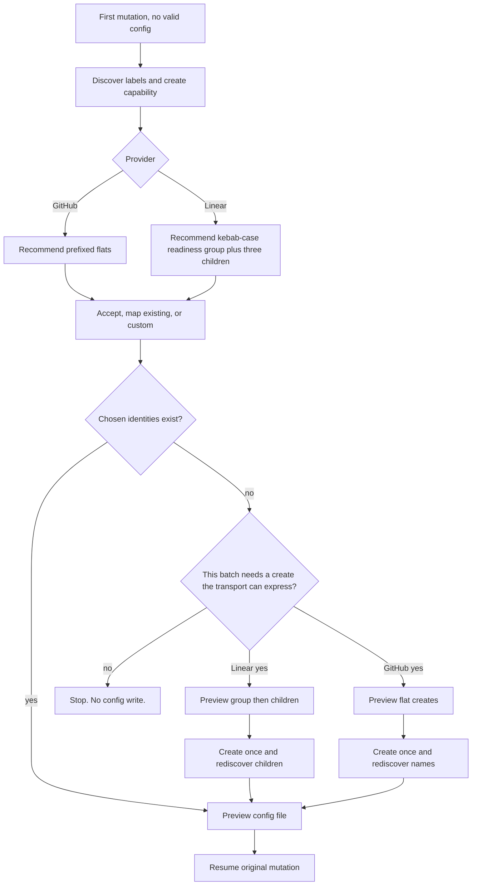

# Linear Readiness Label Group - Plan

## Goal Capsule

- **Objective:** First-use setup recommends Linear exclusive readiness labels and GitHub prefixed flats so an issue can carry exactly one Issue Readiness Posture representation, with Linear enforcing that rule when the operator accepts the recommended group.
- **Means:** Provider-conditional starter plus Linear group-then-children create. Failed creates use the existing first-stop. (KTD1, KTD3)
- **Authority:** GitHub issue [#74](https://github.com/jrgilbertson/the-rookery/issues/74); this plan; shipped `managing-issues` contracts.
- **Stop if:** A change would migrate already-configured repos, add a config field for group structure, or invent a Linear substitute when the selected transport cannot create a workspace-scoped exclusive group.
- **Execution profile:** Instruction and fixture change in `skills/managing-issues` and `tests/managing-issues`.
- **Tail:** `ce-work` owns implementation, tests, review, and shipping, including a PR.

---

## Product Contract

### Summary

First-use setup recommends a workspace-scoped Linear exclusive group `readiness` with children `needs-discovery`, `needs-planning`, and `ready`. GitHub keeps the current prefixed flats. Config still maps each readiness key to one exact label identity. Already-configured repos are not migrated. If a create fails, existing first-stop applies: later effects stay unapplied, config is not written, leftover labels are manual cleanup.

Product Contract changed after a simplicity grill: R3 is kebab-case only; R14–R16 (collision preflight, extra-sibling refusal, mixed-map exclusivity) were dropped.

### Problem Frame

Setup currently offers the same three flat labels (`readiness:needs-discovery`, `readiness:needs-planning`, `readiness:ready`) for every provider. Linear can make those three mutually exclusive with a label group. GitHub cannot. A Linear-first setup that creates the flat shape then has to be deleted by hand.

### Key Decisions

- **Linear exclusive group, GitHub prefixed flats.** Linear can enforce one-of-three; GitHub has no grouping surface. (session-settled: user-approved — chosen over one recommendation for both providers: Linear offers enforcement GitHub cannot.) Governs R1, R2, R8.
- **Readiness only.** Priority and estimate stay as they are today. (session-settled: user-approved — chosen over exclusive-grouping those families too: the observed failure is readiness duplication.) Governs R1.
- **Kebab-case recommended names.** Group `readiness`, children `needs-discovery` / `needs-planning` / `ready`. (session-settled: user-directed — chosen over a workspace-casing heuristic: one default is enough; custom covers the rest.) Governs R3.
- **No migration.** Already-configured repos keep their stored identities. (session-settled: user-approved — chosen over converting existing flat Linear labels: MCP cannot re-parent or delete.) Governs R13.
- **Recommend and create, not recover.** Setup changes the recommended shape and the create sequence. It does not preflight collisions, refuse extra siblings, lecture mixed maps, or resume leftover parents. (session-settled: user-directed — chosen over a first-use recovery engine: the ticket is “don’t create the flat shape.”) Governs R6, R9, R10.

### Requirements

**Recommendation**

- R1. Linear first-use recommends one workspace-scoped exclusive label group `readiness` whose children are `needs-discovery`, `needs-planning`, and `ready`, listed individually beside discovered alternatives.
- R2. GitHub first-use keeps recommending the prefixed flats `readiness:needs-discovery`, `readiness:needs-planning`, and `readiness:ready`.
- R3. Recommended Linear names are kebab-case as in R1. The operator may still map existing values or define custom names.
- R4. The operator still accepts recommendations, maps selected existing values, or defines custom representations. Existing metadata is never preferred.
- R5. Setup states why Linear and GitHub differ: Linear groups are mutually exclusive; GitHub labels are a flat namespace.

**Create, readback, and config**

- R6. A Linear metadata batch that creates the recommended shape creates the parent group if it is absent, then any missing children, then reads each chosen child back by exact identity before any config preview.
- R7. `mappings.readiness` still maps each of `needs-discovery`, `needs-planning`, and `ready` to one exact discovered child identity. Store a unique name; store the label UUID when the name is not unique in provider scope. Do not store the parent group, transport, or group structure.
- R8. Apply a group child to an issue, never the parent group.
- R9. If the selected transport cannot create a workspace-scoped group and children and read the children back, and the approved batch still needs that create, stop with no config write and name the missing capability. Mapping already-present identities does not require group-create capability. Do not fall through from MCP to Orca or reconstruct private API calls.
- R10. MCP cannot update or delete labels. Propose the recommended shape before the first label write. A failed or partial create uses the existing first-stop: later effects stay `unapplied`, config is not written, leftover labels are manual cleanup.

**Compatibility**

- R11. A GitHub first-use run is unchanged from current behavior except the documented rationale in R5.
- R12. `scripts/config_check.py` validates both resulting configs with no schema change.
- R13. An already-valid config skips setup. Existing Linear mappings, including prefixed flats, remain valid opaque identities.

### Actors

- A1. Operator. Chooses provider, mappings, and approvals.
- A2. Managing Issues agent. Discovers, recommends, previews, creates once, reads back, writes config.
- A3. Canonical tracker. GitHub labels or Linear workspace/team labels.

### Key Flows

- F1. Linear first-use, accept recommendations.
  - **Trigger:** First tracker mutation with no valid config; Linear selected.
  - **Actors:** A1, A2, A3
  - **Steps:** Discover labels and create capability. Recommend the kebab-case workspace group and three children. Operator accepts. Preview group-then-children creates. Apply once. Read back each child. Preview `.agents/managing-issues.json`. Write after separate approval. Resume the original mutation with a fresh read.
  - **Outcome:** Config maps the three keys to the three discovered children.
- F2. GitHub first-use, accept recommendations.
  - **Trigger:** Same, GitHub selected.
  - **Steps:** Recommend prefixed flats. Create missing flats. Rediscover exact names. Write config.
  - **Outcome:** Current GitHub behavior, plus R5 rationale.
- F3. Transport cannot express a needed Linear group create.
  - **Trigger:** The approved batch still needs a workspace-scoped group or child create the selected MCP schema or Orca guide cannot express.
  - **Outcome:** Stop. No config write. Named missing capability. No Orca fallthrough. Mapping existing identities is not this flow.

### Acceptance Examples

- AE1. Covers F1 / R1, R6, R7. Given a Linear workspace with no readiness group and MCP `create_issue_label` exposing `isGroup`, `parent`, and omitted `teamId` for workspace labels. When the operator accepts recommendations. Then the metadata batch creates the group if absent then any missing children, each chosen child is rediscovered, and `mappings.readiness` values each resolve to exactly one child.
- AE2. Covers F2 / R2, R11. Given GitHub first-use. When the operator accepts recommendations. Then the three prefixed flats are proposed and created as today.
- AE3. Covers F3 / R9. Given selected Linear MCP whose schema lacks `isGroup` or `parent`. When the operator accepts the recommended group that still needs creates. Then setup stops with no config write and does not switch to Orca. Mapping three existing labels in that same session still proceeds.
- AE4. Covers R4, R13. Given a valid existing config whose Linear readiness values are prefixed flats. When a later create uses only those values. Then setup does not rerun and those identities still validate.

### Success Criteria

- A Linear first-use instruction run proposes group children and a config whose `mappings.readiness` values each resolve to one discovered child.
- A GitHub first-use instruction run still proposes prefixed flats.
- `python3 tests/managing-issues/fixtures/run-config-checks.py` passes with no schema change.
- Phrase locks in `tests/managing-issues/fixtures/run-provider-checks.py` cover the Linear group contract.

### Scope Boundaries

- In: first-use recommendation, Linear group-then-children create/readback, GitHub rationale, starter templates, instruction tests, phrase locks.
- Out: migrating already-configured repos; exclusive groups for priority or estimate; workflow-status mapping; config schema or version bump; Orca guide authorship; live Linear workspace mutation in tests; collision preflight; extra-sibling refusal; mixed-map exclusivity rules; leftover-parent resume.
- **Deferred to Follow-Up Work:** converting already-created flat Linear readiness labels into a group (human Linear Settings only). Exclusive groups for other metadata families.

---

## Planning Contract

### Key Technical Decisions

- KTD1. Keep group structure out of config. The exclusive group is a Linear-side recommendation and create sequence. `mappings.readiness` stays three opaque identities.
- KTD2. Put Linear group mechanics in `references/linear.md`, not `SKILL.md`. `SKILL.md` stays provider-neutral except one sentence that recommendations are provider-conditional because Linear groups are exclusive and GitHub labels are not. Phrase locks require `SKILL.md` under 500 lines.
- KTD3. Recommended names are always kebab-case per R3. Show them in the preview. Custom or map-existing covers any other spelling.
- KTD4. Use the selected transport's runtime schema. For connected Linear MCP that is currently `create_issue_label` with `isGroup`, `parent` as the parent group name, and omitted `teamId` for workspace labels, plus `list_issue_labels` for readback. If those fields are absent, stop only when the approved batch still needs that create per R9.
- KTD5. Split `check_templates()` in `tests/managing-issues/fixtures/run-config-checks.py` by provider before changing the Linear starter. That function currently requires both templates to use the same prefixed readiness strings.
- KTD6. Store a unique child name; store UUID when the name is not unique. This is identity disambiguation, not a transport type.
- KTD7. Split “absent general label” from “absent readiness group” in `linear.md`. General labels stay a flat create. Missing group-create must not block creating `bug`.
- KTD8. A failed or partial create uses the existing first-stop in `SKILL.md`. Do not add a collision matrix, leftover-parent resume, or a second cleanup protocol. (session-settled: user-directed — chosen over preflight refusal: create failure already stops the batch.)

### High-Level Technical Design

First-use stays the existing three-approval sequence. Only the Linear recommended shape and metadata batch change.

Linear MCP create order, directional not a signature spec: create the group with `isGroup` true and no `teamId`; create each child with `parent` set to `readiness` and no `teamId`; rediscover each child; map children only. If any create fails, first-stop. Do not invent a recovery path.

### Implementation Constraints

- `SKILL.md` remains under 500 lines (`published_contract()` in `tests/managing-issues/fixtures/run-provider-checks.py`).
- Validator stays read-only, stdlib-only, no provider discovery (`check_script_surface()`).
- No test-only escape hatch in shipped skill text.
- Do not paraphrase the same rule into two homes: shared lifecycle in `SKILL.md`, Linear mechanics in `linear.md`, GitHub mechanics in `github.md`.
- Official Linear labels: groups are exclusive; apply a child not the group; workspace labels are visible to every team.

### Sequencing

U1 unblocks the Linear starter. U2 owns Linear mechanics. U3 owns the short cross-provider rationale. U4 locks operator-visible behavior. Do not change `config-template-linear.json` before splitting `check_templates()`.

### Sources & Research

- GitHub issue [#74](https://github.com/jrgilbertson/the-rookery/issues/74)
- [Linear issue labels](https://linear.app/docs/labels): exclusive groups, apply children, workspace vs team
- Connected Linear MCP `create_issue_label`: `name`, `isGroup`, `parent`, `teamId` omit for workspace
- `docs/solutions/architecture-patterns/keep-repository-issue-configuration-semantic-at-transport-boundaries.md`

External research was load-bearing for KTD4 and R6.

---

## Implementation Units

### U1. Split the starter readiness lock

**Goal:** Linear starter recommends bare group children without breaking GitHub or the validator.

**Requirements:** R1, R3, R7, R12

**Dependencies:** none

**Files:**

- Modify: `tests/managing-issues/fixtures/run-config-checks.py`
- Modify: `skills/managing-issues/assets/config-template-linear.json`
- Leave unchanged: `skills/managing-issues/assets/config-template-github.json`
- Leave unchanged: `skills/managing-issues/scripts/config_check.py`

**Approach:**

1. Split `check_templates()` so GitHub still requires prefixed readiness strings and Linear requires the three kebab-case child names.
2. Change only the Linear template `mappings.readiness` values to `needs-discovery`, `needs-planning`, and `ready`.
3. Keep shared `RECOMMENDED_KEYS["readiness"]` as the three canonical keys.
4. Leave Linear valid-fixture opaque identities as they are.

**Execution note:** Start with the failing shared-template assertion, then split it, then change the Linear template.

**Patterns to follow:** `check_templates()` already branches GitHub vs Linear for `target`. Mirror that for readiness values only.

**Test scenarios:**

- GitHub template still maps the three keys to `readiness:needs-discovery`, `readiness:needs-planning`, and `readiness:ready`.
- Linear template maps the three keys to `needs-discovery`, `needs-planning`, and `ready`.
- Both templates still fail validation until placeholders are replaced, then pass when `target` is resolved.
- Existing Linear fixture identities that are not prefixed names still validate.
- Validator still rejects extra readiness keys and empty readiness maps.

**Verification:** `python3 tests/managing-issues/fixtures/run-config-checks.py` passes.

### U2. Linear group create and readback

**Goal:** The Linear provider path recommends, creates, and reads back a workspace-scoped exclusive readiness group, or stops with the existing first-stop.

**Requirements:** R1, R3, R6, R7, R8, R9, R10

**Dependencies:** U1

**Files:**

- Modify: `skills/managing-issues/references/linear.md`
- Modify: `tests/managing-issues/fixtures/run-provider-checks.py`

**Approach:**

1. Extend the first-use paragraph in `linear.md` with the recommended kebab-case group, workspace scope, create-only limit, and manual cleanup.
2. Split absent general-label create from absent readiness-group create (KTD7).
3. Document MCP field use per KTD4. Preview parent-then-children names. Orca remains “only if the loaded guide exposes the same capabilities.”
4. Sequence the metadata batch as group (if absent) then missing children then child readback. Map children, not the parent.
5. Say a failed create uses the existing first-stop. Do not add collision, sibling, or leftover-parent protocols.
6. Lock `create_issue_label`, `list_issue_labels`, workspace-scoped group, missing-children create, child-not-parent, and manual cleanup in `published_contract()`.

**Patterns to follow:** Existing first-use create/readback stop in `linear.md`. Phrase locks in `published_contract()`.

**Test scenarios:**

- `published_contract()` fails if `linear.md` omits workspace-scoped readiness group, missing-children create, create-only/manual cleanup, or child-not-parent mapping.
- Compact linear text still contains `first-use setup`, `create_issue_label`, `list_issue_labels`, and no-fallthrough-to-Orca.
- `SKILL.md` line count stays under 500.

**Verification:** `python3 tests/managing-issues/fixtures/run-provider-checks.py` passes.

### U3. Provider-conditional recommendation rationale

**Goal:** Setup names the Linear group and GitHub prefixed labels and states why they differ, without moving Linear mechanics into `SKILL.md`.

**Requirements:** R2, R5, R11

**Dependencies:** U2

**Files:**

- Modify: `skills/managing-issues/SKILL.md`
- Modify: `skills/managing-issues/references/github.md`

**Approach:**

1. In `SKILL.md` step 2, add one provider-conditional sentence: Linear recommends an exclusive group; GitHub recommends prefixed flats; the two differ because Linear groups enforce one child and GitHub has no grouping surface. Keep accept/map/custom and always-map-readiness unchanged.
2. In `github.md` first-use, state that prefixed flats are the recommended readiness shape because repository labels are a flat namespace with no grouping surface.
3. Do not restate Linear create fields in either file.

**Patterns to follow:** `SKILL.md` already points at starter templates and provider references.

**Test scenarios:**

- `published_contract()` still finds every existing setup phrase in `SKILL.md`, including the exclusive-group versus prefixed-flats rationale.
- GitHub reference still contains `gh label create NAME` and the new no-grouping rationale.
- `SKILL.md` stays under 500 lines.

**Verification:** `python3 tests/managing-issues/fixtures/run-provider-checks.py` passes. `npx skills-ref validate skills/managing-issues` passes.

### U4. Linear first-use behavioral coverage

**Goal:** Instruction cases prove Linear group recommendation and leave GitHub first-use unchanged.

**Requirements:** R1, R2, R4, R6, R9, R11, R13

**Dependencies:** U1, U2, U3

**Files:**

- Modify: `tests/managing-issues/cases/first-use-interactive-setup.md`

**Approach:**

1. Keep the existing GitHub scenarios and expected checks.
2. Add synthetic Linear scenarios: accept recommended group children; already-valid prefixed Linear config skips setup; missing `isGroup`/`parent` stops with no config write and no Orca fallthrough.
3. Require the three-approval sequence. Later effects stay unapplied until their own approval.
4. Provenance: issue #74 observed flat Linear labels that had to be deleted by hand.
5. Do not contact a live provider. Do not add collision, extra-sibling, or leftover-parent scenarios.

**Execution note:** Grade a fresh-context candidate against the binary checklist.

**Patterns to follow:** Current first-use case prompt/checklist shape.

**Test scenarios:**

- Covers AE1. Linear accept path proposes the kebab-case workspace group, creates the group if absent then missing children, maps children only. Leftover-cleanup language belongs on the failed-create path, not the empty-workspace happy path.
- Covers AE2. GitHub scenarios still pass with prefixed flats.
- Covers AE3. Missing group-create capability stops when the accepted recommendation still needs creates. No config write and no Orca fallthrough. Mapping three existing labels still proceeds.
- Covers AE4. Valid existing Linear config skips setup.
- Operator can still map existing labels or define custom representations.
- A failed or partial create leaves later effects `unapplied`, writes no config, and names leftover labels as manual cleanup.

**Verification:** Binary checklist on a fresh-context run of the updated case. Fixture runners from U1–U3 still pass.

---

## Verification Contract

| Gate | Command | Proves | Units |
| --- | --- | --- | --- |
| Config fixtures | `python3 tests/managing-issues/fixtures/run-config-checks.py` | Schema unchanged; provider-specific starters | U1 |
| Provider phrase locks | `python3 tests/managing-issues/fixtures/run-provider-checks.py` | Linear group contract, GitHub create path, SKILL.md budget | U2, U3 |
| Graph fixtures | `python3 tests/managing-issues/fixtures/run-graph-checks.py` | Stored readiness remains opaque; no graph regression | all |
| Skill package | `npx skills-ref validate skills/managing-issues` | Packaged skill still validates | U3 |
| Deterministic door | `lefthook run pre-push --force --no-auto-install` | Catalog and fixture roster | all |
| Behavioral case | Fresh-context run of `tests/managing-issues/cases/first-use-interactive-setup.md` | AE1–AE4 | U4 |

---

## Definition of Done

- Every unit's verification above is green, including the fresh-context first-use case.
- GitHub first-use still recommends prefixed flats.
- Linear first-use recommends the kebab-case workspace group and writes `mappings.readiness` as three exact child identities.
- `config_check.py` schema is unchanged.
- No collision, sibling, or leftover-parent protocol in shipped skill text.
- Already-configured Linear repos are untouched.

---

## System-Wide Impact

Agents running Managing Issues are the users. First-use stays the existing three-approval sequence. Human Linear Settings remains the only cleanup path. Graph derivation does not change.

---

## Risks & Dependencies

- Accidental `teamId` on create would violate workspace scope. Mitigate by omitting `teamId`.
- Partial create leaves debris. Mitigate with existing first-stop and R10. Do not add a resume protocol.
- Shared template assertion will fail if U1 is skipped. Sequence U1 first.
- Reading R9 as “group-create required for all Linear setup” would lock out map-existing. Mapping existing identities does not need group-create.

---

## Open Questions

- Deferred: whether a given Orca guide exposes workspace-scoped group create. Follow the loaded guide or stop per R9. Do not encode Orca argv in `linear.md`.
