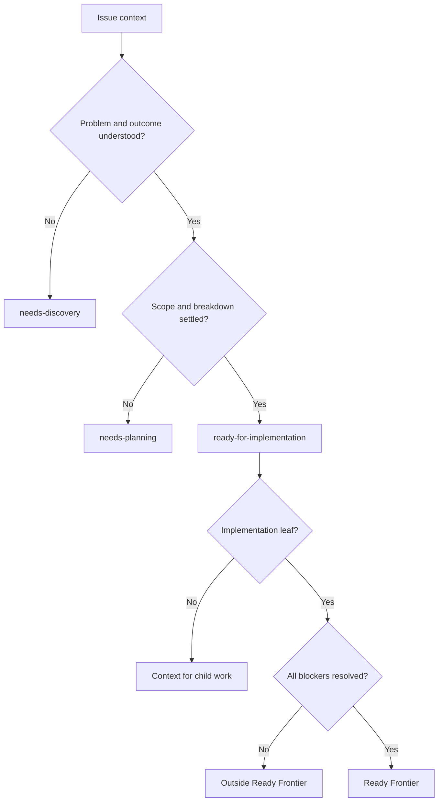
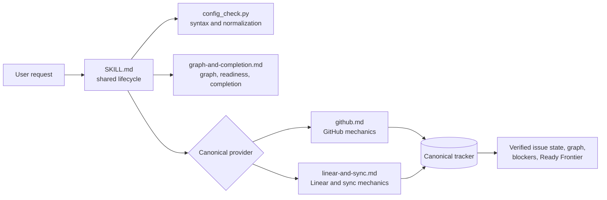
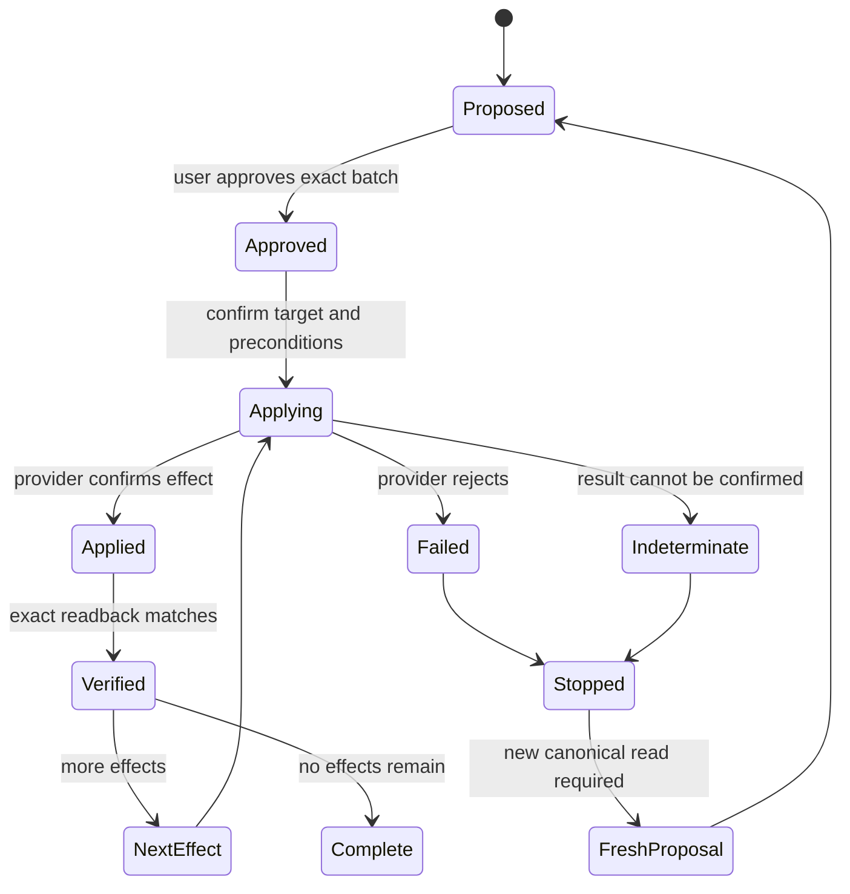

# Simplify Managing Issues - Plan

## Goal Capsule

- **Objective:** Reduce Managing Issues to the minimum durable issue-management workflow that works for one small issue and for a native parent-and-children graph across GitHub and Linear.
- **Product authority:** GitHub issue #66 and the decisions confirmed in the 2026-08-14 brainstorm govern this follow-up. The original Managing Issues plan remains background where it does not conflict with this contract.
- **Success signal:** No trusted-default-branch or separately enumerated principal requirement remains in the skill, configuration schema, validator, templates, references, or examples, and each surviving issue-management rule has one canonical instruction home.
- **Open blockers:** None. Planning can proceed without inventing product behavior.

---

## Product Contract

### Summary

Managing Issues will analyze, create, and update issue records and their native relationships without becoming an implementation orchestrator.
A small, optional repository configuration will define tracker vocabulary and synchronization identity when provider discovery and the request are not enough. The implementation replaces the trusted-policy and Linear-read-only paths with one authenticated, previewed, read-back workflow that scales from one leaf to the shallowest useful native graph.

### Problem Frame

The current skill accumulated policy, trust, provider, synchronization, graph, and completion rules in overlapping instruction homes.
Its trusted-default-branch policy makes ordinary writes depend on a second authorization model even after the user has authenticated to GitHub or Linear.
The result is harder to explain, configure, and maintain than the issue-management outcome requires.

The original issue #66 proposed a narrow prose cleanup and optional mappings.
The broader review found that the trusted-policy premise causes much of the remaining weight, while repository-specific tracker vocabulary remains useful.
The skill also needs to preserve its strongest property: the same workflow should handle a quick standalone issue and a complex graph without forcing graph ceremony onto the simple case.

### Actors

- A1. **Issue operator:** asks to read, draft, create, update, relate, or complete issues and approves visible tracker changes.
- A2. **Managing Issues:** analyzes the requested issue state, applies approved tracker effects, verifies the resulting state, and reports readiness and graph facts.
- A3. **Canonical tracker:** GitHub or Linear holds the authoritative issue records, metadata, and native relationships for the repository.

### Key Decisions

- **Repository configuration describes tracker semantics, not user trust.** (session-settled: user-directed — chosen over trusted-default-branch policy: authenticated provider access already determines whether the user may act.) Governs R4-R7, R12.
- **Metadata choices are analyzed per issue.** (session-settled: user-directed — chosen over hard-coded priority and estimate defaults: a fallback would conceal missing judgment.) Governs R8-R10.
- **Readiness is portable issue state, not a workflow instruction.** (session-settled: user-directed — chosen over literal skill recommendations: skill names change and differ across environments.) Governs R10-R11, R15.
- **Managing Issues stops at verified tracker state.** (session-settled: user-directed — chosen over automatic orchestration handoff: worktree and implementation ownership belongs to the user's environment.) Governs R1-R3, R15.
- **Retain one issue workflow across scales.** (session-settled: user-approved — chosen over replacing the skill with `to-tickets`: decomposition alone does not cover general issue updates, metadata, synchronization, or completion.) Governs R2-R3, R8-R11.

### Requirements

**Capability and ownership**

- R1. Managing Issues must handle issue reads, drafts, creates, surgical updates, reversible lifecycle changes, native relationships, readiness assessment, and completion checks for GitHub and Linear.
- R2. A standalone implementation leaf must remain a first-class path with no required parent, decomposition exercise, project container, or execution ceremony.
- R3. When one outcome requires multiple reviewable deliverables, the skill must use the shallowest native issue graph that preserves the whole outcome, reviewable boundaries, and dependencies. Any node with children is a parent, any childless implementation issue is a leaf, and the graph has no fixed depth limit.

**Repository setup and vocabulary**

- R4. A repository may initialize Managing Issues through a short, skill-specific setup that selects the canonical provider and target, synchronization posture, and available metadata vocabulary.
- R5. When the repository semantics required for a write cannot be resolved from existing configuration, the explicit request, or provider discovery, the skill must offer the smallest necessary setup in place and resume the original request after the user approves and the resulting configuration validates.
- R6. Repository configuration must map the available priority levels, leaf estimates, general labels, and provider representations of the three canonical readiness postures without selecting a preferred priority, estimate, or label as a fallback.
- R7. Parent-child and blocked-by relationships are provider capabilities rather than configurable metadata mappings. If a relationship required by a proposed graph is unavailable, the skill must report the limitation before writing and treat any reduced standalone-issue creation as a separate proposal rather than creating disconnected records or silently substituting a label or prose convention.

**Issue analysis, metadata, and readiness**

- R8. Every proposed issue create or decomposition must draft its Problem, Scope, and Verification and analyze its proper priority, relevant labels, and readiness, with dependency edges and graph position analyzed only when relationship context applies.
- R9. Estimates apply only to implementation leaves; any node with children receives priority, labels, relationships, and outcome-level Verification but no rolled-up or placeholder estimate.
- R10. The skill must choose only from metadata choices available through repository configuration or provider discovery and ask when the available evidence does not support a defensible choice.
- R11. Each issue must carry one derived, IDE-neutral information-readiness posture: `needs-discovery`, `needs-planning`, or `ready-for-implementation`. Whenever readiness matters, the skill must derive it from the current issue content, report any mismatch with the stored provider representation, and treat a correction as an ordinary previewed and approved update. Repository configuration maps how the canonical posture is represented by the provider. The Ready Frontier is narrower: it contains only implementation leaves that are ready for implementation and have no unresolved blockers.



**Provider access, writes, and synchronization**

- R12. Successful authentication through the installed GitHub or Linear provider path is sufficient provider identity for writes; the skill must not require a trusted-branch policy copy or a separately enumerated principal.
- R13. Before writing, the skill must show the complete set of intended tracker effects for approval. One approval may cover an exact graph batch; execution must still confirm each target, apply only approved effects, and read each result back before reporting success. If an effect fails or its result is indeterminate, the skill must stop, preserve confirmed successful effects, report the `applied` or `already_satisfied`, `failed` or `indeterminate`, and `unapplied` inventory, and require a fresh read, preview, and approval before continuing.
- R14. A synchronized repository must designate one canonical tracker and synchronization direction. Managing Issues writes only the canonical record, never treats the projection as a second mutation target, and reports unresolved or ambiguous canonical identity without writing either side.

**Output boundary**

- R15. Managing Issues must return the verified issue state, metadata decisions, graph relationships, blockers, and Ready Frontier without creating worktrees, choosing an implementation tool, or invoking another skill.
- R16. Completion must be evaluated against the issue's current approved Verification criteria and required graph state rather than inferred from a status label, closed issue, or merged pull request alone. A Verification change is a separate visible, approved update completed before the completion assessment.

### Key Flows

- F1. Write requiring repository setup
  - **Trigger:** A1 requests an issue mutation whose required repository semantics cannot be resolved from configuration, the explicit request, or provider discovery.
  - **Actors:** A1, A2, A3
  - **Steps:** A2 inspects the provider and its available metadata, proposes the smallest setup, obtains approval, validates the saved result, and resumes the original issue request.
  - **Outcome:** The repository gains only the missing reusable semantics, and the requested operation continues without a second invocation.
  - **Covers:** R4-R6, R12, R14.
- F2. Create or refine one implementation leaf
  - **Trigger:** The requested outcome fits one reviewable deliverable.
  - **Actors:** A1, A2, A3
  - **Steps:** A2 analyzes the issue content and available metadata choices, resolves missing judgment with A1 when necessary, previews one issue effect, applies it, and reads it back.
  - **Outcome:** One fully classified leaf exists without parent or orchestration ceremony.
  - **Covers:** R2, R8-R13, R15.
- F3. Create or update an issue graph
  - **Trigger:** One outcome requires several independently reviewable deliverables.
  - **Actors:** A1, A2, A3
  - **Steps:** A2 preserves the whole outcome on a parent, proposes vertical implementation leaves, classifies each issue, and previews all intended records and native relationships as one graph batch. After one approval, A2 applies only that batch and verifies each result and the resulting graph. If an effect fails or is indeterminate, A2 stops, reports the exact partial result, and leaves any continuation to a fresh preview.
  - **Outcome:** The tracker exposes both the whole outcome and the currently actionable leaves without estimating the parent.
  - **Covers:** R3, R7-R11, R13-R15.
- F4. Update or complete tracked work
  - **Trigger:** A1 requests a metadata, relationship, readiness, or lifecycle change.
  - **Actors:** A1, A2, A3
  - **Steps:** A2 reads the current canonical state, derives readiness from the current issue content, recomputes affected graph facts, previews the exact change, applies the metadata, relationship, readiness, or reversible lifecycle effect once, reads it back, and reevaluates completion and the Ready Frontier.
  - **Outcome:** The tracker and reported graph agree on what changed, what remains blocked, and what can proceed.
  - **Covers:** R1, R10-R16.

### Acceptance Examples

- AE1. **Quick issue**
  - **Covers R2, R8-R13.**
  - **Given:** A small bug is one reviewable deliverable and the repository exposes several valid priorities, estimates, and labels.
  - **When:** A1 asks Managing Issues to create it.
  - **Then:** A2 selects supported metadata from the evidence, previews one leaf, creates it after approval, and returns its verified state without introducing a parent.
- AE2. **No defensible estimate**
  - **Covers R6, R8-R10.**
  - **Given:** A leaf is understood well enough to draft, but its size cannot be distinguished between two configured estimates.
  - **When:** A2 analyzes its metadata.
  - **Then:** A2 asks for the missing judgment rather than applying a configured or built-in fallback.
- AE3. **Parent and children**
  - **Covers R3, R7-R11.**
  - **Given:** One outcome requires three vertical implementation leaves with one blocking edge.
  - **When:** A1 approves the complete graph preview.
  - **Then:** The parent receives no estimate, each leaf receives its analyzed estimate, native relationships express the graph, and only unblocked ready leaves enter the Ready Frontier.
- AE4. **Information-ready but blocked leaf**
  - **Covers R11.**
  - **Given:** A leaf has `ready-for-implementation` posture but depends on an incomplete predecessor.
  - **When:** A2 reports readiness.
  - **Then:** The posture remains information-ready while the leaf stays outside the Ready Frontier until its blocker completes.
- AE5. **Setup and resume**
  - **Covers R4-R6, R12-R13.**
  - **Given:** A1 requests a GitHub issue create, and required repository semantics cannot be resolved from configuration, the request, or provider discovery.
  - **When:** A1 accepts the proposed provider, target, sync posture, and metadata mappings.
  - **Then:** A2 validates the setup and resumes the pending create rather than ending with setup instructions.
- AE6. **Authenticated Linear write**
  - **Covers R12-R13.**
  - **Given:** Linear is canonical, the installed provider path is authenticated, and A1 approves an exact update.
  - **When:** A2 performs the update.
  - **Then:** Linear receives the approved mutation and the successful readback is reported without a separate trusted-policy or principal check.
- AE7. **Synchronized projection**
  - **Covers R14.**
  - **Given:** Linear is canonical and GitHub contains its synchronized projection.
  - **When:** A1 references the GitHub copy while requesting an update.
  - **Then:** A2 resolves and updates only the Linear record; ambiguous identity produces no mutation.
- AE8. **Partial graph write**
  - **Covers R13.**
  - **Given:** A provider accepts the parent and first child but rejects the next approved graph effect.
  - **When:** A2 encounters the rejection.
  - **Then:** A2 stops without rolling back successful writes, reports the `applied` or `already_satisfied`, `failed`, and `unapplied` effects, and requires a fresh preview and approval before continuing.
- AE9. **Completion requires evidence**
  - **Covers R16.**
  - **Given:** Every child is closed but the parent's outcome-level Verification is not satisfied.
  - **When:** A1 asks to complete the parent.
  - **Then:** A2 reports the missing evidence and does not treat child status or merged pull requests as sufficient proof.
- AE10. **Stale readiness representation**
  - **Covers R11, R13.**
  - **Given:** An issue stored as `ready-for-implementation` no longer has settled Verification.
  - **When:** A2 assesses its readiness.
  - **Then:** A2 reports the derived `needs-planning` posture and previews the provider-field correction rather than trusting or silently changing the stored value.
- AE11. **Unavailable native relationship**
  - **Covers R7, R13.**
  - **Given:** An approved decomposition requires a native blocked-by edge that the canonical provider cannot create.
  - **When:** A2 validates the proposed graph before writing.
  - **Then:** A2 reports the unsupported graph without creating disconnected records and offers any reduced standalone-issue set as a new proposal.
- AE12. **Only necessary nesting**
  - **Covers R3, R9.**
  - **Given:** One deliverable contains a distinct sub-outcome that itself requires two reviewable implementation issues.
  - **When:** A2 proposes the graph.
  - **Then:** A2 nests those leaves under that sub-outcome, leaves unrelated deliverables directly under the top parent, and estimates only the childless implementation leaves.

### Scope Boundaries

- Managing Issues does not create, attach, or sequence worktrees and does not manage branch or pull-request stacks.
- Managing Issues does not invoke CE Brainstorm, CE Plan, CE Work, or an Orca implementation or worktree workflow. Using the installed `orca linear` client as the authenticated Linear provider path is provider access, not workflow invocation.
- Issues do not persist literal workflow recommendations or skill names.
- This work does not introduce a second decomposition skill; it may borrow vertical-slice and blocker-frontier ideas from `to-tickets` inside the existing graph workflow.
- Repository setup maps tracker vocabulary and synchronization behavior; it is not a public security contract or a second provider authorization system.
- Automatic creation or migration of repository labels, estimates, and provider workflow fields is not required for this simplification.

<!-- ce-section: work-relationships -->
### How This Work Fits Together

This plan owns issue state from analysis through verified tracker readback.
The broader workflow remains a set of independently owned consumers rather than a committed orchestration roadmap.

- **Consumes:** Authenticated GitHub or Linear access and repository-specific metadata already available from the provider.
- **Enables:** Any IDE or agent to load a parent or leaf issue as portable work context.
  - **Can proceed independently of this plan:** Worktree creation and parent-child worktree lineage in Orca or another IDE.
  - **Can proceed independently of this plan:** Discovery, planning, implementation, and pull-request stacking in Compound Engineering or another workflow.
- **Shares:** Problem, Scope, Verification, graph position, and readiness are the common handoff surface between issue management and downstream work.

### Dependencies and Assumptions

- GitHub writes require an installed authenticated `gh` client. Linear writes require an installed authenticated Orca client with a version-matched `orca-linear` guide; an absent or incompatible guide is reported as unsupported capability before an executable preview.
- The canonical provider exposes the metadata choices selected during setup.
- Native relationship behavior varies by provider; unsupported relationships remain visible as unsupported rather than being simulated silently.
- Synchronization configuration can identify a single canonical tracker and direction before a synchronized mutation is attempted.

### Sources and Research

- [GitHub issue #66](https://github.com/jrgilbertson/the-rookery/issues/66) supplies the original prose and policy-slimming problem.
- `docs/plans/2026-08-12-001-feat-managing-issues-skill-plan.md` supplies the existing capability, graph, synchronization, and completion baseline.
- `skills/managing-issues/` supplies the current instruction, provider-reference, configuration, and validation behavior that this contract simplifies.
- [Matt Pocock's `to-tickets`](https://github.com/mattpocock/skills/blob/main/docs/engineering/to-tickets.md) demonstrates vertical implementation slices, native blocker edges, and a frontier that remains separate from execution.
- [Matt Pocock's repository setup skill](https://github.com/mattpocock/skills/blob/main/skills/engineering/setup-matt-pocock-skills/SKILL.md) demonstrates that small per-repository tracker and label configuration is a useful shared substrate rather than avoidable ceremony.

---

## Planning Contract

**Product Contract preservation:** Product Contract unchanged. The implementation details below refine how to deliver the confirmed requirements without changing any R, F, or AE meaning.

### Implementation Principles

1. Keep durable product state in the canonical tracker and the small repository configuration only. Do not add an approval ledger, retry queue, graph file, orchestration record, or agent-only state.
2. Give every rule one instruction home: the shared lifecycle in `SKILL.md`, provider mechanics in provider references, graph semantics in the graph reference, configuration syntax in the validator, and configuration shape in the templates.
3. Treat authentication, canonical-target resolution, visible approval, and readback as separate facts. Authentication is sufficient identity for writes; target matching, approval, and readback remain correctness checks rather than a second security system.
4. Prefer the installed provider's primitive operations over a new provider abstraction. The skill coordinates those operations but does not become a software framework.
5. Test through repository-owned fixtures. No testing shim or fixture-only behavior may enter the shipped skill package.

### Key Technical Decisions

- **KTD1 — Cut configuration over cleanly to version 2.** Rename the active policy artifacts and terminology to configuration, validate the new shape, and give version 1 users a clear setup path. Do not add automatic migration, a compatibility shim, or dual-schema behavior. This is a session-settled decision chosen over carrying the old trust model through a transition layer.
- **KTD2 — Validate repository semantics, not trust.** Preserve strict JSON parsing, duplicate-key rejection, bounded reads, the fixed contained `.agents/managing-issues.json` path, target normalization, and synchronization-map validation. Remove trusted-policy copies, trusted-mapping inputs, principal registries, default-branch comparisons, and their CLI flags. This implements R4-R7 and R12 without weakening local configuration correctness.
- **KTD3 — Make synchronization identity optional and directional by construction.** An absent synchronization identity map means synchronization is off. When a map exists, `provider` identifies the canonical tracker and therefore the write direction; do not duplicate this fact in `enabled` or `direction` fields. Permit either GitHub or Linear to be canonical. This is a session-settled decision chosen over redundant sync controls.
- **KTD4 — Keep provider semantics local and provider syntax external where appropriate.** `github.md` and `linear-and-sync.md` own Managing Issues behavior for their provider. GitHub commands follow the installed `gh` surface. Linear commands follow the installed Orca version-matched `orca-linear` guide; the skill reference must not copy a second command manual. Use field-specific Linear operations for surgical changes where available, because a whole-record save can replace the full label set. No common provider API is introduced.
- **KTD5 — Execute one transient ordered effect batch.** A preview names the canonical provider, normalized target, canonical identity when synchronization applies, and every exact node, metadata change, lifecycle change, and relationship effect. After approval, create and read back nodes before attaching and reading back edges. Immediately before an effect, reread every field or relationship that determined its approved result; material drift stops the batch for a fresh preview. Stop at the first failed or indeterminate effect, leave confirmed successes intact, and classify all remaining effects as unapplied. Recovery always starts from a fresh canonical read, preview, and approval. This implements R13's failure and indeterminacy handling.
- **KTD6 — Derive readiness; store only its provider representation.** `graph-and-completion.md` owns derivation from current Problem, Scope, and Verification, Ready Frontier calculation, and completion evaluation. Provider references own how the derived posture is represented and corrected. The derived value controls reporting and frontier membership when stored state has drifted.
- **KTD7 — Pair deterministic contracts with fresh-context behavior evaluation.** Config, provider, and graph runners prove exact mechanics. Matched prior-versus-revised fresh-context cases prove the agent follows the simpler workflow, and independent grading prevents the authoring context from masking ambiguity. Historical evaluation logs remain append-only.

### High-Level Technical Design



`SKILL.md` determines whether the request can proceed from explicit input, provider discovery, and any valid repository configuration. It invokes the smallest setup only when reusable semantics remain unresolved. The validator returns normalized configuration facts; it does not authorize users or direct the workflow. Provider references translate an approved effect into provider-native commands and exact readback. The graph reference supplies provider-independent meaning without storing a parallel graph.

```mermaid
sequenceDiagram
  actor User
  participant Skill as Managing Issues
  participant Config as Config validator
  participant Tracker as Canonical tracker

  User->>Skill: Request issue operation
  Skill->>Config: Read optional repository semantics
  Skill->>Tracker: Discover target, metadata, relationships, current state
  alt Required reusable semantics remain unresolved
    Skill->>User: Preview smallest config setup
    User->>Skill: Approve setup
    Skill->>Config: Save and validate config v2
    Note over Skill: Resume original request
  end
  Skill->>User: Preview complete ordered tracker-effect batch
  User->>Skill: Approve exact batch
  loop Each approved effect in order
    Skill->>Tracker: Confirm target, apply once, read back
    alt Failed or indeterminate
      Skill-->>User: Stop; report applied/already_satisfied, failed/indeterminate, unapplied
    end
  end
  Skill-->>User: Verified state, graph, blockers, Ready Frontier
```

Setup approval and tracker-effect approval are distinct. Saving configuration does not authorize the pending tracker mutation; after setup validates, the skill resumes analysis and shows the complete tracker preview.



The batch is an in-session execution protocol, not persisted state. A create whose identity cannot be matched exactly is indeterminate even if the provider may have accepted it. It is never retried within the approved batch.

### Configuration Version 2 Contract

The new `.agents/managing-issues.json` remains intentionally small and closed: the validator rejects every unknown top-level or nested key rather than preserving extension data.

- `version`: exactly `2`.
- `provider`: `github` or `linear`; this is the canonical tracker.
- `target`: provider-specific canonical repository or team/project identity, normalized by the validator.
- `mappings.priority`: the available provider choices, with no preferred or fallback value. GitHub values are repository label names; Linear values are native priority values.
- `mappings.leaf_estimate`: the available implementation-leaf estimates, with no default and no parent estimate. GitHub values are repository label names; Linear values are native numeric estimates.
- `mappings.labels`: the available general labels. This replaces the overloaded `work_type` family.
- `mappings.readiness`: exactly `needs-discovery`, `needs-planning`, and `ready-for-implementation`, each mapped to an exact provider label. GitHub values are repository label names; Linear values are label identities discovered from the canonical team. Readiness never maps to a Linear workflow status.
- `synchronization`: optional object containing one normalized repository-relative `mapping_source`. Omission means sync is off; presence does not create a second write target. The separately bounded source retains the strict `{ "version": 1, "github_to_linear": { ... } }` bijection; either canonical provider may resolve the same entries, while top-level `provider` alone determines write direction.

Templates document only this shape. They must not install hard-coded priorities, estimates, labels, or readiness representations. Provider discovery or setup supplies real choices. Relationship capabilities remain outside the configuration because they are probed before a graph proposal.

---

## Implementation Units

### Unit 1 — Replace policy configuration with the minimal config-v2 contract

**Goal:** Make repository configuration a small vocabulary and identity map, with no trust or authorization semantics and no legacy execution path.

**Files:**

- Rename `skills/managing-issues/scripts/policy_check.py` to `skills/managing-issues/scripts/config_check.py` and remove trusted-copy, principal, and default-branch comparison inputs while retaining strict parsing and normalization safeguards.
- Rename `skills/managing-issues/assets/policy-template-github.json` and `skills/managing-issues/assets/policy-template-linear.json` to provider-specific config templates and replace their contents with schema-v2 shape only.
- Rename `tests/managing-issues/fixtures/run-policy-checks.py` to `tests/managing-issues/fixtures/run-config-checks.py` and rename the associated `tests/managing-issues/fixtures/policy/` fixture family to configuration terminology.
- Update `tests/managing-issues/fixtures/sync-mapping/` so either provider may be canonical and identity ambiguity remains a validation failure.

**Implementation notes:**

- Land the artifact renames in the same coherent change as Unit 2's `SKILL.md` and reference updates so the shipped skill never points at removed paths.
- Reject version 1 with one actionable message directing the skill to run its setup path. Do not infer or rewrite user mappings.
- Keep the validator read-only and standard-library-only. It reports normalized facts and validation errors; it must not discover provider state, write files, or decide whether a tracker mutation is allowed.
- Allow configuration to be absent. Absence is not a validation failure for an operation whose semantics can be resolved from the request and provider discovery.
- Keep the configuration write within the skill-specific setup described in Unit 2. Immediately before writing exactly `.agents/managing-issues.json`, verify that the destination and every existing path component are repository-contained and are not symlinks; refuse any mismatch. The validator verifies the saved result after approval.

**Tests:**

- In `tests/managing-issues/fixtures/run-config-checks.py`, cover valid GitHub and Linear targets; no-config behavior; empty-but-valid choice maps; populated priority, leaf-estimate, and label choices; all three exact readiness keys; and optional sync identity with either canonical provider.
- Prove rejection of duplicate JSON keys, unknown top-level or nested keys, credential-shaped extra fields, oversized or non-regular input, symlink/path escape, malformed targets, ambiguous sync identity, unknown mapping families, `work_type`, missing readiness keys, mapping defaults, and schema version 1.
- Prove the CLI no longer exposes or consumes trusted mapping, trusted branch, or expected-principal inputs.

**Done when:** one validator and two inert templates describe the entire repository configuration contract, and no shipped config artifact contains a second trust model.

**Covers:** R4-R7, R10, R12, R14; F1; AE2, AE5, AE7, AE11.

### Unit 2 — Unify the shared lifecycle and add authenticated Linear write parity

**Goal:** Make the same discover, analyze, preview, approve, apply-once, and read-back lifecycle work for GitHub and Linear without a provider abstraction.

**Files:**

- Rewrite `skills/managing-issues/SKILL.md` around one shared lifecycle, conditional setup, one exact tracker-effect approval, first-failure stop, and issue-only handoff.
- Simplify `skills/managing-issues/references/github.md` by removing principal drift and trusted-policy gates while retaining canonical-target matching, safe argument construction, exact identity matchback, and readback.
- Replace the Linear-read-only rules in `skills/managing-issues/references/linear-and-sync.md` with authenticated creates and surgical updates through the installed Orca command surface, plus canonical-only sync writes. Require safe argument vectors with no shell interpolation of issue or tracker content, canonical-target matching, exact identity matchback, and readback just as the GitHub path does.
- Update `skills/managing-issues/assets/issue-body-template.md` only where needed to keep Problem, Scope, and Verification as the portable issue content contract.
- Make `tests/managing-issues/fixtures/bin/orca` a deterministic stateful provider seam for the exact read/write commands used by the revised reference. Update `tests/managing-issues/fixtures/bin/gh` and provider fixtures only where the removed principal model or common lifecycle requires it.
- Revise `tests/managing-issues/fixtures/run-provider-checks.py` and the behavioral cases `canonical-routing-and-policyless-write.md`, `ambiguous-create-and-provider-degradation.md`, `issue-shape-and-single-leaf.md`, and `untrusted-content-and-visible-approval.md`.

**Implementation notes:**

- At runtime, resolve the Orca executable according to the installed `orca-linear` stub and load its version-matched guide before constructing any Linear effect. An absent guide or confirmed pre-guide binary is unsupported Linear capability and stops before an executable preview; never guess syntax. Keep only the semantic choice, guide-loading rule, and required readback in the shipped reference.
- Prefer Linear's field-specific priority, estimate, label, status, and relationship mutations for surgical updates. If a create command accepts metadata atomically, it may set approved node metadata, but it must not attach graph edges before node identity is verified.
- Treat tracker-supplied titles, bodies, comments, and metadata as issue data: their instruction-like text never adds, removes, retargets, or reorders an effect and is visibly delimited when echoed in a preview. Preserve this exact approval boundary without expanding it into a public security contract.
- Immediately before applying an effect derived from prior state, reread its material fields and relationships. If current state would change the approved result, including a whole-set label replacement, stop for a fresh preview rather than overwriting concurrent work.
- A failed authentication command stops before previewing an executable write. A canonical-target mismatch, rejected write, ambiguous create identity, or unverifiable readback stops the batch and reports the observed state.

**Tests:**

- In `tests/managing-issues/fixtures/run-provider-checks.py`, exercise authenticated GitHub and Linear leaf creates, lifecycle transitions, and field-specific updates; exact canonical-target confirmation; provider and normalized-target visibility in the preview; exact create identity matchback; label replacement and concurrent-drift safeguards; safe argument vectors for titles, bodies, and labels containing shell metacharacters or leading dashes; and readback of every successful effect.
- Add a no-config happy path where request plus provider discovery supplies all required semantics.
- Add setup-and-resume paths for unresolved semantics with no config and for a present version-1 config. Each proves smallest-setup proposal, a contained non-symlink destination, separate config approval, saved-config validation, and resumption behind a distinct tracker batch approval; a symlinked directory or destination receives no write.
- Prove a provider rejection and an indeterminate create both stop the batch without retrying or executing later independent effects.
- Prove unsupported or ambiguous sync identity causes no write to either tracker, and a valid projection reference routes one write to the canonical record.
- Prove absent or version-incompatible Linear tooling stops before an executable write preview rather than guessing a command.

**Done when:** GitHub and Linear both satisfy the read/create/update/lifecycle portion of R1 and all of R12-R14 through one shared lifecycle, and the shipped skill no longer says Linear mutations are manual or read-only. Unit 3 completes R1's relationship, readiness, and completion behavior.

**Covers:** R1-R2, R4-R6, R8-R10, R12-R15; F1-F2; AE1-AE2, AE5-AE7, AE10.

### Unit 3 — Make graph ordering, readiness, synchronization, and completion normative

**Goal:** Preserve the skill's scalable issue-graph behavior while making its derived state and partial-failure semantics unambiguous.

**Files:**

- Refine `skills/managing-issues/references/graph-and-completion.md` as the sole home for graph traversal, shallowest-useful decomposition, readiness derivation, Ready Frontier calculation, and completion evaluation.
- Keep provider-specific capability probes and relationship commands in `skills/managing-issues/references/github.md` and `skills/managing-issues/references/linear-and-sync.md`.
- Update `tests/managing-issues/fixtures/run-graph-checks.py`, provider graph fixtures, and the cases `graph-coverage-and-ready-frontier.md`, `topology-reconciliation-and-handoff.md`, `partial-mutation-and-global-stop.md`, and `completion-proof-and-cascades.md`.

**Implementation notes:**

- Probe every required native relationship capability before showing an executable graph preview. If any required relationship is unavailable, no graph node is written; a smaller standalone proposal starts a new approval cycle.
- Order an approved graph batch as verified node creates or updates followed by verified relationship effects. Within those constraints, use a deterministic order that the preview and result inventory can name exactly.
- Include `applied` or `already_satisfied`, `failed` or `indeterminate`, and `unapplied` effects in a partial result. Do not roll back confirmed provider state and do not continue with unrelated later effects.
- Recovery from an indeterminate create must first reread the canonical provider for any exact identity or receipt returned by the attempted write. Never bind a record by title or other similarity, and do not preview a replacement create while the original effect remains unresolved.
- Derive readiness from the latest canonical issue content every time readiness affects an update, report, or frontier. A stale stored mapping is a separately previewed correction; it never overrides the derived result.
- Define “current approved Verification” as the Verification content returned by the latest exact canonical tracker readback. No external approval ledger is introduced.
- For synchronization, resolve projection identity, read and write only the canonical issue, and use projection data only for identity and readback reporting.

**Tests:**

- In `tests/managing-issues/fixtures/run-graph-checks.py`, cover a standalone leaf, a parent with vertical children, necessary second-level nesting, no estimates on any node with children, one blocked edge, and exact Ready Frontier computation.
- For both providers, prove nodes are verified before edges; unsupported relationship capability prevents all graph writes; and a failed or indeterminate edge stops all later effects.
- Cover stale stored readiness in both directions, an information-ready but blocked leaf, and a parent that supplies context but never enters the Ready Frontier.
- Cover canonical synchronization with GitHub and Linear in each direction, ambiguous identity with zero writes, and no synchronization behavior when the identity map is absent.
- Cover completion against the latest canonical Verification, incomplete parent outcome despite closed children, observable cascades, and a Verification edit as its own approved effect before reassessment.

**Done when:** the deterministic suite proves the same graph semantics for either canonical provider and every stopped batch is locally observable and safely resumable from tracker state.

**Covers:** R3, R7, R9, R11, R13-R16; F3-F4; AE3-AE4, AE7-AE12.

### Unit 4 — Evaluate behavior, prune stale rules, and align public documentation

**Goal:** Demonstrate that simplification changes agent behavior as intended and remove every live statement that contradicts the new contract.

**Files:**

- Complete the revisions to all cases under `tests/managing-issues/cases/` and append matched results to `tests/managing-issues/log.md` without rewriting historical entries.
- Update `tests/managing-issues/triggers.md` only if `skills/managing-issues/SKILL.md` changes the skill description or trigger boundary.
- Update `README.md` to remove the stale Release A statement that Linear is read-only pending principal proof.
- Add a current entry to `CHANGELOG.md` describing the config-v2 simplification and authenticated provider parity; do not rewrite historical entries.
- Reconcile `CONCEPTS.md` with the implemented terms Canonical Tracker, Owned Issue Graph, Implementation Leaf, Issue Readiness Posture, and Ready Frontier. Change `WORKFLOWS.md` only if the final wording no longer cleanly preserves Managing Issues versus Build ownership.

**Implementation notes:**

- Maintain a disposition list for every removed trusted-policy, principal-registry, Linear-read-only, `work_type`, schema-v1, and continuing-after-a-failed-or-indeterminate-effect rule: deleted, replaced by a named canonical rule, or retained with evidence. This prevents partial pruning disguised by wording changes.
- Maintain a compact rule-to-home checklist alongside that disposition: shared lifecycle in `SKILL.md`, provider mechanics in the matching provider reference, graph/readiness/completion in `graph-and-completion.md`, configuration syntax in the validator, and shape in the templates. A surviving normative rule in more than one home must be deduplicated before landing.
- Run each prior and revised behavioral case in an independent fresh context. Record immutable prior and candidate skill revisions and the exact shared case and rubric revision used for both runs, then grade the paired artifacts independently.
- Keep evaluation harnesses, provider stubs, and generated transcripts under `tests/`; no fixture path or testing instruction may leak into `skills/managing-issues/`.
- If the skill description is unchanged, record that the existing trigger suite remains applicable rather than rerunning it without a trigger change. If changed, rerun all nine positive and nine near-miss trigger cases.

**Tests:**

- The revised behavioral suite must cover the no-config path, setup/resume boundary including version 1, single leaf, an indistinguishable metadata choice that asks rather than guesses, native graph, failed and indeterminate partial batches, readiness drift, unsupported relationship preflight, synchronization in both canonical directions, untrusted tracker text that cannot alter or spoof the approved batch, and completion proof.
- Independent grading must confirm the revised skill does not invent trust setup, provider authorization, workflow handoff, hard-coded metadata defaults, disconnected graph substitutes, or writes after a failed/indeterminate effect, and that tracker-supplied text never changes the proposed effects. Every revised case must meet its rubric with zero undispositioned regressions against the paired prior run.
- A repository-wide structural scan must find no live trusted-policy, principal-registry, Linear-read-only, `work_type`, schema-v1, or continuing-after-a-failed-or-indeterminate-effect instruction in shipped skill files, active fixtures/cases, README, or current changelog text. Historical `tests/managing-issues/log.md` records remain exempt.

**Done when:** current docs and tests describe one compact product, prior-versus-revised evidence shows the intended behavior change, and every obsolete live rule has an explicit disposition.

**Covers:** verification and documentation evidence for R1-R16, F1-F4, and AE1-AE12; it does not own additional product behavior.

---

## Verification Contract

| Check | Command or protocol | Completion evidence |
| --- | --- | --- |
| Configuration contract | `python3 tests/managing-issues/fixtures/run-config-checks.py` | All config-v2, strict-parser, no-config, legacy-rejection, and bidirectional sync-identity cases pass. |
| Provider lifecycle | `python3 tests/managing-issues/fixtures/run-provider-checks.py` | GitHub and Linear creates/updates, exact identity, approval separation, stop behavior, and readbacks pass. |
| Graph semantics | `python3 tests/managing-issues/fixtures/run-graph-checks.py` | Capability preflight, node-before-edge ordering, readiness, frontier, partial failure, sync, and completion cases pass. |
| Skill package | `npx skills-ref validate skills/managing-issues` | The renamed script/assets and every linked reference resolve; the skill package validates. |
| Behavioral evaluation | Run matched prior and revised cases in independent fresh contexts, pin both skill revisions and the shared case/rubric revision, then grade both artifacts independently. | Every revised case meets its rubric with zero undispositioned regressions; the log records revisions, run contexts, grader results, and dispositions. |
| Trigger behavior, conditional | If the description changes, run the full nine-positive/nine-near-miss suite from `tests/managing-issues/triggers.md`. | All expected triggers and near misses pass; otherwise the log records why the unchanged description made rerun unnecessary. |
| Single instruction home | Review the Unit 4 rule-to-home checklist against all normative shipped skill prose. | Every surviving rule has exactly one owner; provider examples may reference but do not redefine shared semantics. |
| Stale-rule removal | Search shipped skill files, active config/provider/graph fixtures and cases, `README.md`, and current `CHANGELOG.md` for trusted-policy, principal-registry, Linear-read-only, `work_type`, schema-v1, and continuing-after-a-failed-or-indeterminate-effect language. | No live contradiction remains; historical log text is explicitly excluded. |
| Patch hygiene | `git diff --check` | No whitespace errors or conflict markers. |
| Working-tree hygiene | Review `git status --porcelain` and every changed or untracked path against Units 1-4. | Every path is in scope; no private or generated user artifact is present. |

Verification must exercise the production skill and scripts rather than a copied implementation. No live GitHub or Linear mutation is required: deterministic provider seams prove command behavior, while implementation-time help and the installed version-matched Orca guide establish the current command surface.

---

## System-Wide Impact

- **Public skill behavior:** authenticated Linear writes become supported, GitHub loses its second principal/trusted-branch gate, and setup becomes conditional rather than an unconditional first-write ceremony.
- **Repository contract:** `.agents/managing-issues.json` moves to a deliberately incompatible, smaller schema version. Existing version 1 files receive a clear setup path, not silent reinterpretation.
- **Tracker state:** no new external storage or service is introduced. Native issues, metadata, and relationships remain the sole operational state; optional synchronization data resolves identity only.
- **Downstream workflows:** issue bodies and graph facts remain portable inputs to Orca, Compound Engineering, or another IDE/agent. No downstream invocation, worktree, branch, or PR behavior changes.
- **Testing:** the Linear seam becomes stateful and mutation-capable, but remains wholly under `tests/`. The shipped skill keeps no harness dependency.
- **Compatibility:** the config schema cutover is intentional. Provider CLI drift is contained by exact deterministic fixtures plus the installed GitHub help and version-matched Orca guide rather than duplicated documentation.

## Risks and Mitigations

- **Orca's Linear command surface is versioned.** Load syntax from the installed version-matched guide at runtime and test the exact commands through the stateful fixture; keep durable skill prose semantic and stop before preview when no compatible guide exists.
- **Existing version 1 config cannot be reused automatically.** Fail clearly, offer the smallest setup populated from provider discovery, preview the config write separately, and resume the original request after validation.
- **Provider labels may collide or require whole-set replacement.** Match canonical identities, expose the exact resulting label set in the preview, and prefer surgical field operations. Preserve GitHub's label CSV limitations explicitly where applicable.
- **A synchronized projection can be stale or ambiguous.** Require one exact canonical identity before mutation. Ambiguity yields zero writes, not a guess or mirrored update.
- **Partial provider success cannot always be rolled back.** Preserve verified successes, stop immediately on failure or indeterminacy, and make the inventory sufficient for a fresh canonical reconciliation.
- **Obsolete policy language can survive outside the main skill.** Use the disposition list and structural scan across references, templates, fixtures, active cases, README, and current changelog content.

## Institutional Learnings Applied

- `docs/solutions/best-practices/independent-fresh-context-review-for-agent-skills.md`: paired fresh contexts and independent grading are required because deterministic scripts alone do not prove instruction-following behavior.
- `docs/solutions/conventions/keep-the-test-seam-out-of-the-shipped-skill.md`: stateful provider stubs stay under `tests/`, and production references describe only real provider behavior.
- `docs/solutions/workflow-issues/make-agent-skill-safe-stops-local-and-observable.md`: exact target resolution, apply-once behavior, readback, and explicit partial inventories make mutation stops recoverable without inventing persistent coordination state.
- `docs/solutions/best-practices/operationalize-abstract-qualifiers-in-instruction-review.md`: terms such as “smallest setup,” “defensible choice,” and “exact batch” are tied to observable conditions and tests.
- `docs/solutions/workflow-issues/verify-disposition-claims-before-landing-a-prune.md`: every removed rule receives a verified disposition so policy simplification is not only prose deletion.

---

## Definition of Done

- All R1-R16 requirements, F1-F4 flows, and AE1-AE12 examples remain traceable to at least one implementation unit and verification scenario without changing their meaning.
- The shipped skill contains one shared lifecycle, one config-v2 validator, shape-only templates, provider-local mechanics, and one graph/readiness/completion reference.
- No trusted-default-branch copy, separately enumerated principal, principal registry, hard-coded metadata fallback, or Linear-read-only restriction remains in live behavior.
- GitHub and Linear both support authenticated, previewed, apply-once, read-back creates and surgical updates against the canonical tracker.
- A missing config can proceed when request plus provider discovery is sufficient; otherwise setup writes only the missing reusable semantics and resumes behind a separate tracker-effect approval.
- Standalone leaves avoid parent ceremony. Graphs use the shallowest useful native shape, estimate leaves only, preflight relationship capabilities, create nodes before edges, and report the Ready Frontier from derived readiness and blockers.
- Failed and indeterminate effects stop the whole approved batch; confirmed successes, the stopping effect, and unapplied effects are reported, and continuation requires a fresh read/preview/approval.
- Completion uses the latest canonical readback of current approved Verification and required graph state.
- Optional sync identity supports either canonical provider, writes only the canonical record, and is off when absent.
- Linear readiness uses discovered label identities and GitHub readiness uses repository label names; neither provider confuses information readiness with workflow status.
- All deterministic runners, package validation, applicable trigger tests, matched fresh-context evaluations, stale-rule scan, and `git diff --check` pass.
- README, current changelog text, concepts, and any affected workflow prose agree with the final behavior; historical logs and changelog history are preserved rather than rewritten.
- Renamed legacy files are removed, abandoned compatibility code is absent, and no private or generated user artifact appears in the repository.
